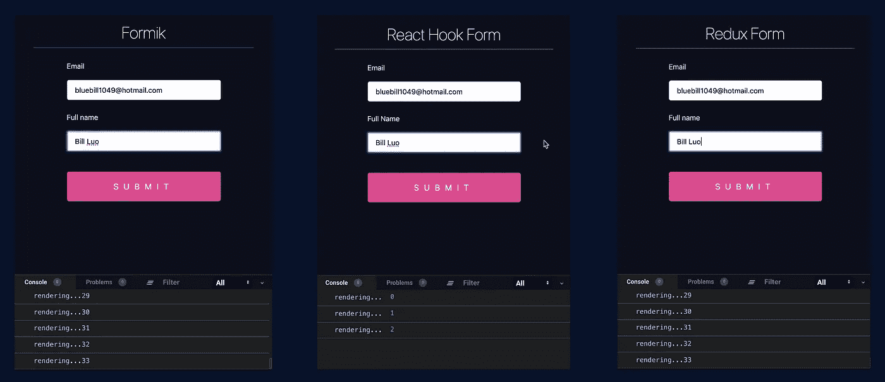

# React Hook 是来自未来吗？

> 原文：<https://itnext.io/is-react-hook-form-the-future-57c6f94a2665?source=collection_archive---------7----------------------->

## Redux-form 和 Formik 已经成为过去


由 [Franck V.](https://unsplash.com/@franckinjapan?utm_source=unsplash&utm_medium=referral&utm_content=creditCopyText) 在 [Unsplash](https://unsplash.com/s/photos/future?utm_source=unsplash&utm_medium=referral&utm_content=creditCopyText) 上拍摄的照片

作为一名软件开发人员，我想使用现代技术开发应用程序，并尽快更快地实现目标。我一直在处理 Redux-form 和 Formik，所以我可以说它们与 React-Hook-Form 相比已经过时了。如果你说为什么，让我们简短地讨论一下。

首先，你应该安装它。这很简单，只需要一个命令:

```
npm install react-hook-form
```

并创建`LoginForm.js`组件:

从上面的例子可以看出，React 钩子表单使用[非受控表单输入](https://reactjs.org/docs/uncontrolled-components.html)而不是[受控输入/选择](https://reactjs.org/docs/forms.html)组件，并将它们的引用注册到 React 钩子表单中。这使得钩子可以完全控制你的表单元素，并且比另一个表单库更有优势。我想给你三个理由*为什么 React Hook 来自未来*:

# 1.使用方便

如上图所示，`React Hook Form`真的很好用。此外，它需要少量的代码。由官方文件记载的`React Hook Form`的主要目标:

> 减少必须编写的代码量是 React Hook Form 的主要目标之一。

# 2.超轻

React Hook Form 绝对是一个微型库。因此，封装尺寸对于 React Hook 形式至关重要。React Hook Form 使用[不受控制的 form input](https://reactjs.org/docs/uncontrolled-components.html) 组件，没有任何依赖关系，这使得库小了很多 **(5kb gzip)。**

# 3.性能

表单有很好的性能，因为它使用了不受控制的组件，所以不需要 onChange 和 set value。因此，你可以很容易地访问它的引用，并避免重新渲染(重要)。如果你看一看它，你会想知道有多少组件重新渲染已经被用户触发。



性能

当我输入完`Email`和`Full Name`后，Formik 和 Redux-Form 有超过`33+`重渲染，React Hook Form 有`3` 重渲染。它很棒，能给你的页面或应用带来高性能的影响。

如果我不回应你的问题，请查看 [React Hook Form](https://react-hook-form.com) 网站。另外，你可以在 [Github](https://github.com/react-hook-form/react-hook-form/tree/master/examples) 上找到很多例子。

我希望这篇文章对你有用。

# 资源

*   [反应钩形](https://react-hook-form.com)
*   [React 表单验证库建在 5kB 以下](https://medium.com/@bruce1049/form-validation-with-hook-in-3kb-c5414edf7d64)
*   [反应弯钩形式与成型](https://blog.logrocket.com/react-hook-form-vs-formik-a-technical-and-performance-comparison/)