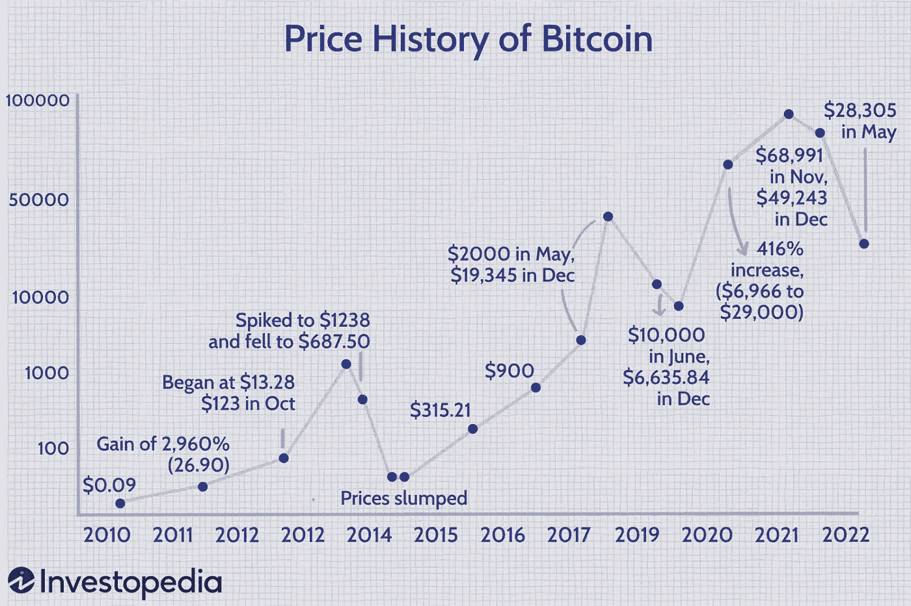
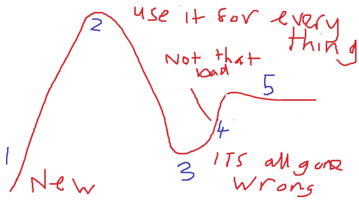

# 低代码开发炒作周期正在走向崩溃吗？

> 原文：<https://itnext.io/is-the-low-code-development-hype-cycle-heading-for-cryptocurrency-crash-2173f7f27011?source=collection_archive---------4----------------------->

## 当其他人都对某项技术感兴趣时，大多数人都会对它感兴趣

[Pexels 的菠萝供应公司](https://www.pexels.com/photo/pink-white-and-blue-pineapples-1501299/)

> “男人，说得好，在群体中思考；人们会看到他们成群地发疯，而他们只是慢慢地恢复理智，一个接一个。”—查尔斯·麦凯，

技术没有泡沫和崩溃，相反，it 技术被过度炒作。它会被过度使用，并被用在不是好的解决方案的地方。

一开始，我们创新性地使用新技术。它运行良好，节省时间，提高生产率。它进入了[炒作周期](https://en.wikipedia.org/wiki/Gartner_hype_cycle)，答案是低代码开发，不管需求/项目或问题是什么。

做低代码项目变得很流行，因为其他人都在做低代码项目。公司要求项目使用低代码软件开发，而不是询问应该使用什么技术。

# 比特币

最近比特币价格的暴跌让我想起了泡沫的破灭。当一大群人做同样的事情，停止思考时，就会产生疯狂的高潮，随之而来的是崩溃的低谷。

看一下价格图表，你会发现有时人们赚了很多钱，但几个月后随着价格的暴跌而损失殆尽。如果他们坚持下去，他们会赚更多的钱。

[比尔盖茨呼吁加密债券& NFTs，称资产类别“100%基于更大的傻瓜理论”](https://www.cnbctv18.com/cryptocurrency/bill-gates-calls-out-cryptos--nfts-says-asset-class-is-100-based-on-the-greater-fool-theory-13839102.htm)例如，只要你能找到比你更大的傻瓜来出售它们，它们就更有价值。

可以肯定的是，炒作和轻松获利的承诺吸引了许多人购买加密货币。一个比特币值多少钱？我想我们必须等待投机者停止抽取和抛售比特币，然后才能做出判断。

从[到](https://www.investopedia.com/articles/forex/121815/bitcoins-price-history.asp)的价格历史

# **炒作周期**

[炒作周期](https://en.wikipedia.org/wiki/Gartner_hype_cycle)有五个步骤

1.  技术触发因素—新技术
2.  过高期望的顶峰——这项技术应该用于一切
3.  幻灭的低谷——它不如我们想象的那么好
4.  启蒙的斜坡——用在正确的情况下并不坏
5.  生产力的高原——让我们继续吧

它看起来像下面的图片

从**新、**到**把它用于一切**，你会听到、看到、读到并被告知低技术将改变世界。

在炒作周期的顶端，你会听到这样的陈述

*   如果你给低代码软件涂黄油，它每次都会把黄油面朝上
*   一个公民开发者可以在早上制造一个软件火箭，下午飞到月球，然后回来吃晚饭。
*   低代码软件可以用一只手在背后打败查克·诺里斯。
*   低代码软件破坏了互联网，并在你意识到之前修复了它。

另一个被大肆宣传的技术是区块链。

# **敏捷**

最近记忆中炒作周期的一个例子是敏捷项目。在过去的 10 年里，每个项目都是敏捷的。

客户没有要求敏捷项目，他们要求敏捷项目，拒绝任何不同意的人。

敏捷项目是否更好、更快，或者是否有按时交付软件项目的良好记录？

为什么每个项目都应该是敏捷的？除了每个项目都是敏捷的之外，没有别的原因吗？那是害怕做一个与其他项目不同的项目。

如果一个项目没有可以成为产品所有者和决策者的人，这有什么关系吗？没有。

你不能在两周内将项目的一部分投入生产，因为它需要很多其他的东西，这有什么关系吗？没有。

是否有任何实际的想法被用来决定项目是否应该是敏捷的？是的，每个人都想要一个敏捷项目，这个也不例外。

# 高峰炒作

加密货币在过去几天崩盘，抹去了它们去年的收益。不要担心加密的人，我相信它会反弹回来，因为同样的原因，它刚刚下降，流行的意见。

这篇文章有一些有趣的迹象表明加密泡沫即将破裂

1.  体育场的命名
2.  大规模生产猴子卡通价值数十亿美元
3.  怀疑论者放弃了抱怨

当 twitters 上的每个人都在吹嘘购买 crypto 有多容易赚钱时，你应该感到怀疑。就像在次级抵押贷款泡沫中，当银行停止检查人们是否能够支付抵押贷款费用时，这并不重要，因为房价只会上涨。

2000 年的 dot.com 泡沫，当时每只互联网股票都是赢家，不管它卖的是什么，也不管它从未盈利(或可能盈利)。

这是一个不断强化的问题，这种增长会稀释使用低代码开发工具的开发人员的素质，并产生更多的技术债务。

# 大肆宣传

目前，我们正在攀登炒作曲线。低代码开发工具还没到巅峰。

有很多公司还没有使用低代码开发工具，也有很多公司会更多地使用它们。低代码工具非常适合快速创建简单的应用程序，因此这将创造大量的初始成功，并为宣传造势。

你会读到许多低代码开发的成功故事，你会听到公民开发者的故事。

它将像一个不可阻挡的庞然大物一样继续增长。

# 达到峰值，然后下降

低代码开发的痛苦不在于创建或创建简单的应用程序。当公司不得不支持由公民(初级)开发者构建的低代码应用时，痛苦就来了。

就像糟糕的开发人员开始一个项目一样，在他们创造的技术债务减缓开发之前，需要几个月的时间。

[公民开发者和低代码开发的盲点将在工业规模上产生技术债务](https://blog.devgenius.io/the-blind-spots-of-citizen-developer-and-low-code-development-that-will-create-technical-debt-on-an-45bb6120e7d6)

疼痛会在什么时候被感觉到

*   支持数百个小型应用程序
*   应用程序的创建者离开了公司(没有留下任何文档)
*   环境爆炸的数量
*   技术债的问题(硬编码，一个大 app(怪物法)。
*   低代码用于创建更大的软件和更多的开发人员在同一个项目上工作

高峰将在未来几年，有足够的空间来炒作低代码开发工具。

# 启蒙的斜坡

在某个时候，公司会雇佣有经验的开发人员来解决技术债务并改进低代码开发。这是一个从业余发展到专业发展的阶段。

从短期方法转向长期方法。

优秀的资深开发者让开发变得简单。他们创建了流程、标准和 DevOps，突然间每个人都知道他们在做什么，问题也减少了。

低代码开发工具不会用于每个项目，但它们非常适合的项目。

# 高原

低代码软件开发工具是强大的，它们将被用来完成超过一半的软件开发。

低代码开发将会产生大量的初级开发人员，他们将会创造大量的应用程序，他们将会产生大量的技术债务。

公民开发者不会取代传统开发者，反而会让他们更有价值。你需要资深开发者来领导初级/市民开发者。

你需要资深开发人员用低代码工具或者传统的开发工具来建立成功开发的基础。

开发者所做的不仅仅是创造软件，软件的增加将表明减少技术债务和维护成本的最好方法是创造质量。

开发是一项技能，需要多年才能获得知识、经验和技能才能做好。