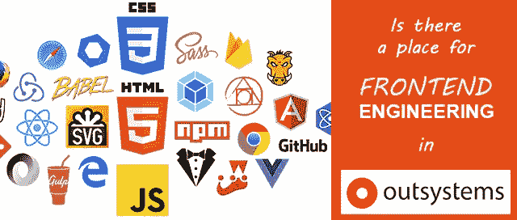

# 在外部系统中有前端工程的位置吗

> 原文：<https://itnext.io/is-there-a-place-for-frontend-engineering-in-outsystems-7e1ebbdef900?source=collection_archive---------1----------------------->

自从我第一次安装 Service Studio 和我的 OutSystems 之旅开始以来，已经过去两年了。

首先，我是一名前端工程师，这使得我的旅程在开始时有点颠簸。但是经过一些调整后，取得了真正的进步，我相信在用外部系统开发低代码的同时，前端工程也有一席之地。

## 你好，OutSystems，很高兴见到你

我接受了一个朋友的邀请去拥抱低代码，从一开始我就能清楚地看到与传统的高代码软件开发相比的优势。

OutSystems 可能是这一领域的孵化器，但其他公司将紧随其后，低代码是未来。所以，在 2019 年，我决定:这是一条路🤖

我很幸运地加入了一个项目，这个项目将成为一名优秀的教师:大约 30 名工程师，数百个医疗保健行业产品的应用程序和模块，已经投入生产。这让我对架构画布、层之间的引用和依赖以及主题、web 块和布局如何相互作用有了清晰的理解。

我被邀请加入这个项目，因为他们有持续的前端问题，这阻碍了团队实现新的功能。虽然我不熟悉外部系统，但我在前端开发方面的经验可能会有用。

哦，我的…他们一点也不知道。

## 是冰山吗？还是一头大象？

随着几个星期的过去，我开始熟悉 CSS 和 JavaScript 代码库，我有连续的“ ***这个*** 到底是什么？

CSS 到处都是，复制粘贴在多个主题中。如果我们需要改变一个模式，许多位置将被破坏。没有 CSS 架构的概念，只有数千条杂乱无章的 CSS 线被随机覆盖。

JavaScript 都在全局名称空间中，相同的变量和函数定义被偶然覆盖，如果我们改变 web 块的顺序，有时会工作，有时不会。封装、继承……这些概念无处可寻。
当然，手风琴、弹出窗口、日期选择器、iframes、下拉菜单……应有尽有。

有时有效，有时无效。没有人明白为什么。

我不断听到高级职员和管理层说:“这是一个大项目”，“我们有多年的遗留代码”，“你还没有看到全貌，这是一座冰山”…

而事实上事实已经很清楚了。
房间里有一头大象: ***缺乏技术知识。*🐘其中一些 s****y 代码是由认证的 OutSystems 技术主管在前几个月编写的。**

几个月后，我说服总经理，我们需要更多的前端工程师，让 ***真正了解 http 请求*** 的响应，以及全能浏览器内部发生了什么。管理层的批准对将要发生的事情至关重要。

你有没有尝试过招募愿意投身于低代码开发的前端工程师？这不容易，有很多面试，但我们又找到了两个。

我们花了几周时间来了解这个项目以及这个平台是如何工作的。那时我有 6 个月的外部系统经验，而他们没有，最初的几个星期很有趣…笑声和绝望交织在一起。我们三个人在角度、反应和 Vue 方面都有经验。使用 Nodejs、Webpack、SASS…和一些更时髦的词，我们能够重构整个应用程序，并且 ***减少一半的代码*** 。
UI 缺陷大幅减少，响应时间也很快。我们可以实时改变应用程序的行为、字体和颜色(这是管理层多年来一直想做的事情，但从未能够做到)。

一名前端工程师能够专注于一个衍生项目，我们现在可以专注于具有附加商业价值的新功能。在他们入职 3 个月后，我休育儿假离开了，没有人真正注意到。谈论让自己变得多余😂

这怎么可能呢？发生了什么事？
不，前端工程师不是天才。
不，认证外部系统技术主管并非不称职。

## 什么是开发者

我想最常见的非技术对话是关于前端工程师的角色。

在今天的项目中，我们可能有…数据科学家、DevOps 专家、UI 设计师、UX 研究员、产品设计师、数据/业务分析师、产品负责人、项目经理、工程经理…我想我还遗漏了一些。他们都专注于自己的角色和技能。

然后…你有 ***开发者*** ，也就是 OutSystems 开发者，也就是 Fullstack 开发者。懂定时器、SQL、JavaScript 和 CSS 的男生/女生…真的吗？😒

如果你不理解 DOM 和 CSSOM…
如果你不理解什么是 JavaScript 事件循环…
如果你不理解模型视图概念…
如果你不理解 ecmascript、封装、继承、命名空间…

拜托，你不能称自己为 OutSystems Fullstack 开发者。

但是你应该吗？

## 这要看情况而定

我想这篇文章的全部意义不在于争论或回答这个问题。这更像是我的一次爆发，夹杂着一些反思。

你建过房子吗？想象一下你雇佣了一个 ***多面手*** 承包商🤑，这将处理砖石，电气，管道，抹灰等……当一切都完成后，你连接你的电器和电路板爆裂。你打电话给一个电工……他观察了一下……然后说:“整个电路都需要更换，没有按照规范做。如果你想同时连接洗衣机和热水器，我们需要打破一些墙壁，重新布线。而且干衣机开着的时候，其他什么都接不上。”

我觉得自己就像过去两年的电工:
***某人:*** “请问，您能加入一个电话会议，给我解决我的项目的几个前端问题吗？”
***我:*** “以上帝的名义，你当初为什么不雇一个前端的男生/女生？”🤷
(别管什么宗教参考，这是地中海文化)

从 OutSystems 网站上的指导视频中创建的项目与面向公众的定制 B2C 解决方案之间有着明显的区别。

你瞄准的是哪一个？

## OuSystems 方式。你的忠诚在哪里？

我做了很多年的包工头。与普遍的看法不同，承包商不是忠于高薪的雇佣兵。

我忠于很多东西(排名不分先后):

*   球队，在我的羽翼下还是在我身边
*   支付我薪水并依赖我的绩效的企业和公司
*   工作质量

第三项是这里的问题。👌

每当我听说我想要的前端开发的方式不是 OutSystems 的方式时，我都会感到沮丧。

***如果 OutSystems 的方式没有交付质量，那么我会寻找另一个。***

当 Flash 消亡和第一个 JavaScript 框架诞生时，web 开发世界发生了变化，浏览器发生了很大的变化。并且浏览器不关心代码是否被写入。Net 核心，Java 或者低代码。浏览器懂 HTML + CSS + JavaScript。

像 GitHub、npm、Node.js、SASS、Webpack 或 TypeScript 这样的技术是前端多年来的支柱……如果您发现自己在没有后处理器和适当合并功能的情况下管理 1000 多行 CSS 代码，并且 JavaScript 分散在各处，您必须思考:一定有其他方法。

## 最后

低代码是未来。任何使用传统技术进行开发的人都知道减少样板代码、数据库处理和连接、用户处理以及分布式架构和容器化的优势。

但是我们不能忘记浏览器对所有这些都是不可知的。http 请求的 ***返回端的一切*** 都是客户端的，由浏览器呈现:图像、字体、HTML、JavaScript 文件、CSS 文件…

每个团队都应该拥有正确理解我们所依赖的技术和工具的知识和技能。

有前端工程的空间。🤘

这是正确的外部系统方式。