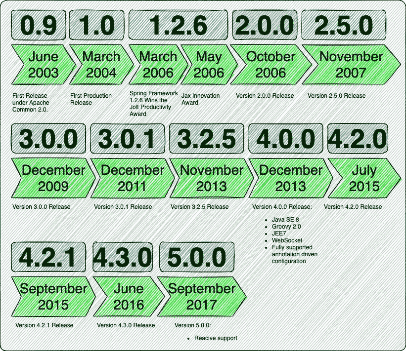
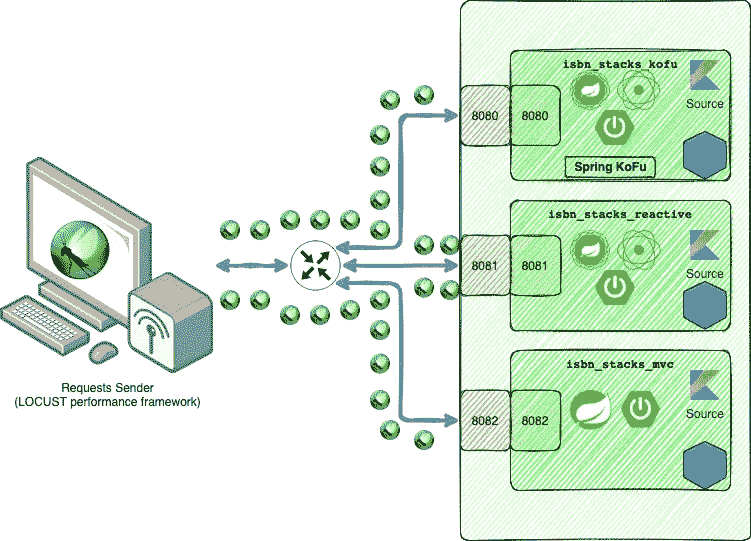
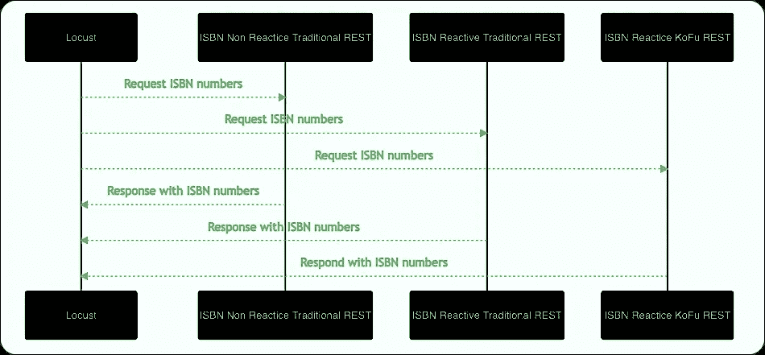
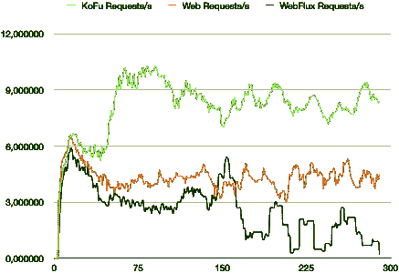
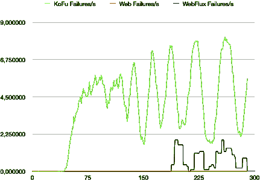
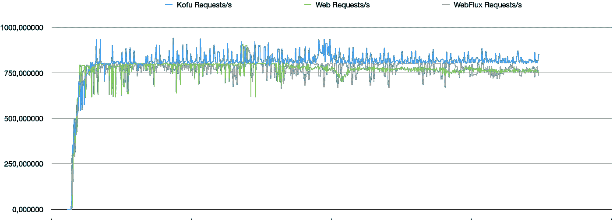
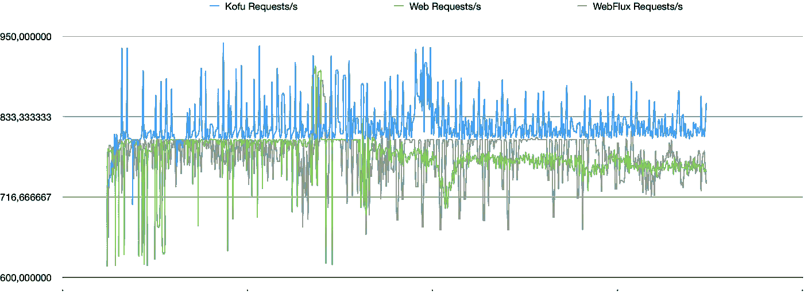

# ISBN 栈——看看一个可能的不带注释的 Spring 应用程序实现

> 原文：<https://itnext.io/isbn-stacks-a-look-at-a-possible-spring-application-implementation-without-annotations-ca1528591fe?source=collection_archive---------3----------------------->


如果你是一个 Spring 框架的超级粉丝，我是说像我一样是 Spring 框架的超级粉丝，并且从来没有读过本文标题所描述的内容，那么你很可能仅仅是因为读了它就退缩了。没有注释？这听起来可能有点疯狂。当我取得春季认证时，它给了我成就感。我在那里通过了春季认证。但是认证路径的很大一部分恰恰是关于注释的使用。我必须学习各种注释。退一步说，还有不少。现在整个 Spring 框架是作为注释驱动的框架给我们的。我们可以用它做任何事情，从以编程方式改变 bean 启动的方式，如何创建 bean，我们可以创建组件，服务，存储库，应用装饰器，IoC，适配器，MVC 模式，我们可以为特定的异常创建触发器，事件处理程序，健康端点，我们可以以无缝的方式实现观察者模式，使用面向对象的 AOP，实现批处理作业，使用 WebSockets 的 STOMP 模式，条件 bean，使用反应式编程，我可以永远继续下去。我想说的是，多年来，我们一直受到教育和压力，要离开 XML 驱动的框架，直到 Spring 2.5。从 [Spring 4](https://www.dineshonjava.com/whats-new-in-spring-framework-4x/) 开始，向一个完整的注释驱动的框架转移。最后，在 [Spring 5](https://howtodoinjava.com/spring-5-tutorial/) 中，我们通过[项目 reactor](https://projectreactor.io/) 获得了对反应式实现的支持。



闪电般的速度潜入 Spring 框架历史

现在我们已经了解了所有这些，同时我们有了 Spring 5 和 Spring Boot 2.5.6。接下来， [Spring 实验项目](https://github.com/spring-projects-experimental)的一个团队正在开发一个全新版本的 Spring，叫做 Spring-Fu。福，就是功能性的意思。他们已经开发了两个分版本:甲府和甲府。Spring KoFu 是基于 Kotlin 的 DSL，Spring JaFu 是基于 Java 的 DSL。该项目已于 2018 年 5 月 31 日在 GitHub 上启动。鉴于 Spring-Fu 团队显然已经实现了更好的服务启动和更快的处理，目前有一些关于它的讨论。这篇文章是我对此事的研究，以寻找这些说法的迹象。所有结果和实现都可以在 [GitHub](https://github.com/jesperancinha/isbn-stacks) 上获得。

# 1.我们试图寻找的是

我们将探索三个简单服务的响应。两个是反应性的，一个是非反应性的。一个是用春赋来实现的，也叫做春赋。另外两个以传统的 MVC 方式实现。一个是反应性的，另一个不是。

反应式编程的最终目标是让服务更具弹性，并以最有效的方式使用资源，以便处理尽可能多的请求。它这样做的方式是将处理我们请求的责任交付给发布者。在 Spring 中，它们被称为 Mono <t>和 Flux <t>。对于快速处理，这导致服务高度可用，这意味着非反应式服务比反应式服务更快不可用。这是因为前一种情况下的响应是直接返回的，所以客户端必须等到请求被处理后，才能执行新的请求。然而，对于长时间处理请求，情况可能会有所不同。因为无论之前的请求是否被处理，响应式服务都会继续接受请求，这也意味着它需要比传统的非响应式服务更有弹性。因此，如果一个请求的处理时间太长，反应式服务的响应速度会更快。</t></t>

最后，我们想要证明的是，一方面，所描述的理论是成立的。另一方面，通过比较这两个反应式服务，我们希望了解在处理多个快速处理请求时，一个服务是否比另一个服务更快。我们也想证明春福的服务起步更快。我们可能也不想证明什么，而只想看到春福团队有所发现的迹象。

请记住，非反应性、反应性和 KoFu 等术语在本文中与 Spring Web、Spring WebFlux 和 Spring KoFu 等术语互换使用。

# 2.偏见

在本地机器上证明和测试这样的东西是非常困难和不确定的。MacBook Pro 或 Chrome 机器或任何 Linux 机器，甚至在 Windows 上，都可以有自己的处理、解释和执行方式。当我们看待新技术时，我们也可能会把自己的一些个人感觉投射到它上面。这就是为什么我在整篇文章中展示的所有测试结果都已经做了多次，我只展示那些给出一致结果的结果。所有其他的测试，也包括这些，都可以在 [GitHub](https://github.com/jesperancinha/isbn-stacks) 的 repo 的[报告](https://github.com/jesperancinha/isbn-stacks/tree/main/docs/reports)文件夹中获得。

# 3.情况

本文的案例本质上只是一个随机生成的 ISBN 13 号列表。ISBN 13 代码有两个静态来源。一个是 50 万个 ISBN 的大列表，另一个是 50 个 ISBN 的源。第一种情况将模拟持久和大量数据请求的情况。后者将模拟快速处理请求。我们可以说实际上不涉及任何加工过程。想法是不要阻塞正在运行的应用程序的任何部分，并模拟快速请求。这个处理确实会在 de 服务器上花费一些时间，这就是我们想要探索的。如下图所示，我们将实现前面讨论过的三个服务。



本地绩效请求设置

对于这类事情，我认为从序列图的角度理解这一点也很重要。



简化序列图

基本上对于每个服务，我们从指定的端点请求 ISBNS，然后等待回复。我们感兴趣的是从实际的角度来看，服务如何表现，需要多长时间来获得请求，它们可以接受多少请求，以及它们的响应能力和弹性如何。

既然我们已经了解了设计，现在让我们来看看下一步，也就是实现。

# 4.履行

假设您已经知道如何在 Spring/Spring boot 中实现服务，我只想在任何情况下快速浏览一下所有不同的实现，以及我为最小化功能级别上的差异所做的努力。此外，在这种情况下，仍然有很小的机会出现偏差或读数不准确。我们实现最简单的 REST 响应的方式可以决定我们的测试有多可靠。在这些实现中，服务层和数据层不存在。数据直接从启动时初始化的两个列表的内存中取出。

# **4.1。传统的 Spring Web MVC 阻塞 REST 服务**

现在人们普遍认为，旧的 Spring Web MVC 正在慢慢被更好的软件设计模式或其扩展所取代。然而，在这个实现中，我们只想确定两个重要的方面。第一，我们有一个非常基本的实现。第二，回答是相同或相似的。在我们需要的所有依赖项中，我们实际研究的是这个:

```
<dependency>
    <groupId>org.springframework.boot</groupId>
    <artifactId>spring-boot-starter-web</artifactId>
    <version>${spring-boot.version}</version>
</dependency>
```

关于实施，让我们看看它是如何实现的:

```
@RestController
@RequestMapping("/api/traditional/non")
class ISBNController {
    var mapper = ObjectMapper()

    @GetMapping("hello")
    fun getMessage(): String {
        return MESSAGE
    }

    @GetMapping
    fun getJsonMessage(): ObjectNode? {
        val createObjectNode = mapper.createObjectNode()
        createObjectNode.put("message", MESSAGE)
        return createObjectNode
    }

    @GetMapping("isbns")
    fun getIsbns(): List<IsbnDto> {
        return *ISBNS* }

    @GetMapping("small/isbns")
    fun getSmallIsbns(): List<IsbnDto> {
        return *SMALL_ISBNS* }

    companion object {
        const val MESSAGE = "I will now give you 1.000.000 ISBN numbers in a Spring MVC Non-Reactive way"
    }
}
```

对于这个实现和下面的实现，我们需要记住,**ISBN**是我们的 50 万个 **ISBN 13** 记录的列表，而**SMALL _ ISBN**是我们的 50 个记录的列表。由于 KoFu 代码是声明性的，我也希望所有其他代码在合理的情况下尽可能声明性。对于这些测试，不需要在 **application.properties** 中配置**应用程序上下文**(**web service**的根路径)。不仅没有必要，而且可能对有效结果不利。这就是我不使用它的原因。对于实现的其余部分，我们只需要记住两个端点:[http://localhost:8080/API/traditional/non/isbns](http://localhost:8080/api/traditional/non/isbns)和[http://localhost:8080/API/traditional/non/small/isbns。](http://localhost:8080/api/traditional/non/small/isbns.)

# 4.2.传统 Spring WebFlux MVC 反应式 REST 服务

反应式编程和 Spring 提供的可能性实际上可以很快减少到使用**通量**和**单声道**。如前所述，这些是负责处理数据的发布者。他们可能有额外的订户与之相关联。我们在这种情况下研究的依赖关系是:

```
<dependency>
    <groupId>org.springframework.boot</groupId>
    <artifactId>spring-boot-starter-web</artifactId>
    <version>${spring-boot.version}</version>
</dependency>
<dependency>
    <groupId>org.springframework.boot</groupId>
    <artifactId>spring-boot-starter-webflux</artifactId>
    <version>${spring-boot.version}</version>
</dependency>
```

REST 控制器的实现可以用非常相似的方式完成:

```
@RestController
@RequestMapping("/api/traditional")
class ISBNController {
    var mapper = ObjectMapper()

    @GetMapping("hello")
    fun getMessage(): Mono<String> {
        return Mono.just(MESSAGE)
    }

    @GetMapping
    fun getJsonMessage(): Mono<JsonNode> {
        return Mono.fromCallable **{** val createObjectNode = mapper.createObjectNode()
            createObjectNode.put("message", MESSAGE)
            createObjectNode
        **}** }

    @GetMapping("isbns")
    fun getIsbns(): Flux<IsbnDto> {
        return Flux.fromIterable(ISBNS)
    }

    @GetMapping("small/isbns")
    fun getSmallIsbns(): Flux<IsbnDto> {
        return Flux.fromIterable(SMALL_ISBNS)
    }

    companion object {
        const val MESSAGE = "I will now give you 1.000.000 ISBN numbers in a Spring MVC Reactive way"
    }
}
```

正如我们在这里看到的，我们将只使用**焊剂**。简单来说，这就是我们如何以一种被动的方式发布元素列表。因此，这是实现中的唯一差异，它允许我们检查第一个和第二个实现之间的行为差异，知道这些差异应该仅来自于第二个是反应性的而第一个不是。正如我们从实现中看到的，该服务将在[http://localhost:8081/API/traditional/isbns](http://localhost:8081/api/traditional/isbns)和[http://localhost:8081/API/traditional/small/isbns](http://localhost:8081/api/traditional/small/isbns)上提供。

# 4.3.Spring KoFu 实现

这个实现是我们案例的中心。这里我们使用一种完全不同的方法。正如我们之前所说的，我们将以声明的方式实现所有东西，而不是注释。在我看来，它看起来相当不错。为此，我们需要一些非常重要的依赖项。在将它们添加到我们的 repo 之前，我们需要确保我们能够到达 spring 实验图书馆 repo。我们需要将它添加到我们的 pom 文件中:

```
<repositories>
    <repository>
        <id>spring-milestone</id>
        <name>Spring Milestone Repository</name>
        <url>https://repo.spring.io/milestone</url>
    </repository>
</repositories>
```

然后，我们可以添加必要的依赖项:

```
<dependency>
    <groupId>org.springframework.fu</groupId>
    <artifactId>spring-fu-kofu</artifactId>
    <version>${spring-fu-kofu.version}</version>
</dependency>
<dependency>
    <groupId>org.springframework.boot</groupId>
    <artifactId>spring-boot-starter-webflux</artifactId>
    <version>${spring-boot.version}</version>
</dependency>
```

我们可以非常清楚地看到，我们也在 Spring KoFu 后面使用 web-flux。

有了这个，我们就可以实现其余的了:

```
val *app* = *reactiveWebApplication* **{** beans **{** bean<ISBNSampleService>()
        bean<ISBNSampleHandler>()
    **}** *webFlux* **{** port = if (profiles.*contains*("test")) 8181 else 8080
        router **{** val handler = *ref*<ISBNSampleHandler>()
            GET("/api/kofu/hello", handler::hello)
            GET("/api/kofu", handler::json)
            GET("/api/kofu/isbns", handler::isbns)
            GET("/api/kofu/small/isbns", handler::smallIsbns)
        **}** codecs **{** string()
            jackson()
        **}
    }
}** data class ISBNMessage(val message: String)

class ISBNSampleService {
    fun generateMessage() = "I will now give you 1.000.000 ISBN numbers in a Spring KoFu Reactive way"
}

class ISBNSampleHandler(private val isbnSampleService: ISBNSampleService) {
    fun hello(request: ServerRequest) = ServerResponse.ok().bodyValue(isbnSampleService.generateMessage())
    fun json(request: ServerRequest) = ServerResponse.ok().bodyValue(ISBNMessage(isbnSampleService.generateMessage()))
    fun isbns(request: ServerRequest) = ServerResponse.ok().bodyValue(*ISBNS*)
    fun smallIsbns(request: ServerRequest) = ServerResponse.ok().bodyValue(*SMALL_ISBNS*)
}

class ISBNStacksKoFuReactiveLauncher{
    companion object{
        @JvmStatic
        fun main(args: Array<String>) {
            *app*.run()
        }
    }
}
```

如果您熟悉 NodeJS，我敢肯定，您会对这与在 NodeJS 中创建类似的服务之间的相似性感到非常惊讶。在他们的 [GitHub](https://github.com/spring-projects-experimental/spring-fu) 回购上可以找到与此非常相似的例子。我们已经可以看到无注释的优势之一。像这样简单的 web 服务只需要几行代码。我们也可以看到所有的 add make 插件，像 **string()** 和 **jackson()** 代码都是以完全声明的方式。实现是不言自明的，我们可以清楚地看到，这个服务和不同的数据列表将在[http://localhost:8080/API/kofu/isbns](http://localhost:8080/api/kofu/isbns)和[http://localhost:8080/API/kofu/small/isbns](http://localhost:8080/api/kofu/small/isbns)上提供。

# 5.启动服务

为了便于执行我们的测试，我创建了一个 **docker-compose.yml** 文件，它允许我们一次构建并启动所有三个服务。我还创建了一个 **Makefile** ，其中有几个帮助我们执行性能测试的命令。在我们开始测试或对我们的环境做任何事情之前，我们需要运行这个命令:

```
make docker-clean-build-start
```

一旦命令运行完毕，我们应该会看到三个正在运行的容器。然而，我们将单独进行测试。如果我们在三个容器同时运行时执行测试，它们可能会相互影响，它们可能会消耗太多的 CPU 或内存，导致不可靠或误导的结果。

我以前在当地做过这样的测试，但没有得出任何结论性的结果。如前所述，我们将进行测试，我知道这些测试会指出一些重要的结论。我所有测试的所有报告都放在项目根文件夹的文件夹 **docs/reports** 中。

我们将使用蝗虫性能工具进行测试。所有 locust python 脚本都位于项目的根 **locust** 文件夹中。

为了避免我们测试中的偏差，我们还将运行**蝗虫**的**无头**版本。这意味着我们将从生成的 CSV 文件中看到生成图形的结果。

# **5.1。蝗虫序列启动测试**

在这个测试中，我们将使用位于项目的 **Makefile** 中的这个脚本，一个接一个地对服务执行加载请求:

```
locust-sequence-start:
   docker stop jofisaes_isbn_stacks_reactive
   docker stop jofisaes_isbn_stacks_mvc
   docker restart jofisaes_isbn_stacks_kofu
   sleep 5
   cd locust/kofu && locust --host=localhost --headless -u 2000 -r 1 --run-time 5m --csv kofu --exit-code-on-error 0
   docker stop jofisaes_isbn_stacks_reactive
   docker restart jofisaes_isbn_stacks_mvc
   docker stop jofisaes_isbn_stacks_kofu
   sleep 5
   cd locust/web && locust --host=localhost --headless -u 2000 -r 1 --run-time 5m --csv web --exit-code-on-error 0
   docker restart jofisaes_isbn_stacks_reactive
   docker stop jofisaes_isbn_stacks_mvc
   docker stop jofisaes_isbn_stacks_kofu
   sleep 5
   cd locust/webflux && locust --host=localhost --headless -u 2000 -r 1 --run-time 5m --csv webflux --exit-code-on-error 0
```

locust 根文件夹包含几个子文件夹。kofu、web 和 webflux 子文件夹包含负责连接大型内容端点的脚本，它们分别代表 Spring Kofu、Spring Web(非反应式)和 Spring WebFlux。从脚本中我们看到，我们为每个测试停止了**不需要的**容器，并且我们**重启了**目标容器。我们给它 5 秒钟的延迟，以确保我们的服务已经开始。平均而言，在当前的机器上，所有这些实现都需要不到 5 秒的时间来启动。Locust 从 1 个用户开始，以每秒 1 个用户的速度增加到每秒 2000 个用户发出请求。这确保我们将达到所有服务的阈值。然而，我们不会达到 2000 个用户，纯粹是因为我们每次测试也只限于 5 分钟。整个测试总共需要大约 15 分钟才能完成，结果如下图所示。



左-每秒请求数|右-每秒失败数

我们必须首先正确解释这些图表。在这两张图上，我们看到一个从 0 到 300 的轴。这些是衍生用户的数量。我们最初希望从 0 增加到 2000。然而，由于机器的限制，我发现对于我的情况，300 是最好的数字。这不是一个很大的数字，但足以衡量对于**长时间处理请求**，哪个服务首先被中断。如图所示，第一个开始失败的服务是 **KoFu** ，大约在 **60 产生用户**。接下来是 WebFlux 服务，它在大约 170 个衍生用户时开始失败。对于这种加速，Web 服务根本不会失败。在这一点上，这可能意味着坏消息或好消息。对于 KoFu 和 WebFlux 来说，坏的可能意味着这些架构并不好。但我们已经知道，因此已经有点偏见，WebFlux 只是在弹性方面比非反应式服务更好。从好的方面来看，这可能意味着他们接受了太多的请求，因为他们需要更长的时间来处理，他们陷入了被动的状态。如果是这样的话，那么我们实际上得到了一个积极的结果。反应式编程并不是为长期请求而设计的。它实际上坚决反对处理持久的请求。如果我们有持久的请求，并且想要遵从反应式编程，那么首先我们在处理请求的方式上有问题，其次，我们需要解决这个问题。

就目前而言，从这个测试以及我所做的其他一致性测试中得出的结论是，当处理长期请求时， **Spring KoFu** 首先快速失败，然后是使用 **Spring WebFlux** 的响应式服务，最后我们看到非响应式 **Spring Web** 服务在我们的测试中从未失败。我们也知道这些可能意味着坏的或好的结果。这就是为什么我们现在要进行快速处理请求测试。

# 5.2.蝗虫-小负荷-顺序-启动

在使用我自己的计算机进行的本地测试中，我意识到测试这三个服务行为方式的最好方法就是让它们长时间运行。如果我们要重复这样的测试，那么大约需要 30 分钟才能完成:

```
locust-small-load-sequence-start:
   docker stop jofisaes_isbn_stacks_reactive
   docker stop jofisaes_isbn_stacks_mvc
   docker restart jofisaes_isbn_stacks_kofu
   sleep 5
   cd locust/small/kofu && locust --host=localhost --headless -u 2000 -r 2000 --run-time 10m --csv kofu --exit-code-on-error 0
   docker stop jofisaes_isbn_stacks_reactive
   docker restart jofisaes_isbn_stacks_mvc
   docker stop jofisaes_isbn_stacks_kofu
   sleep 5
   cd locust/small/web && locust --host=localhost --headless -u 2000 -r 2000 --run-time 10m --csv web --exit-code-on-error 0
   docker restart jofisaes_isbn_stacks_reactive
   docker stop jofisaes_isbn_stacks_mvc
   docker stop jofisaes_isbn_stacks_kofu
   sleep 5
   cd locust/small/webflux && locust --host=localhost --headless -u 2000 -r 2000 --run-time 10m --csv webflux --exit-code-on-error 0
```

这意味着我们将立即以每秒 2000 个用户的速度开始测试。这将持续 10 分钟，每次服务在不同的场合。使用生成的 CSV 文件，我能够构建以下图表:



在同样的 30 分钟时间跨度内，所有服务上每秒完成的请求数

在上图中，很难区分不同服务的性能。这与服务的启动以及重启后请求第一次到达服务时的处理方式有关。这与记录在 CSV 文件中的放置方式相结合，产生了第一个类似斜坡上升的曲线，这对我们的测试没有用。如果我们去掉启动部分，然后只看到稳定的数据，我们会看到更有说服力的东西。



在大约 30 分钟的同一时间段内，放大所有服务每秒完成的请求数

如果我们查看不同的数据，我们会发现，总的来说，我们的 Spring KoFu 服务比其他两个服务能够处理更多的请求。我们也看到我们的 Spring Web 和 Spring WebFlux 服务似乎在互相决斗。如果我们更仔细地观察，我们还会发现，平均而言，WebFlux 确实比普通 Web 处理了更多的请求。我们观察到的另一件事也令我非常惊讶，那就是 Spring KoFu 请求/秒曲线与其他服务有点类似。Spring Kofu 似乎没有出现低性能峰值，而是出现了高性能峰值。

所以现在看起来 Spring KoFu 可以比其他 Spring 服务一次处理更多的请求。

蝗虫性能测试还为我们提供了一个平均响应时间表。在这里，我们可以看到使用不同实现处理请求的速度:

从表中读取数据，我们可以再次看到，Spring KoFu 似乎比其他 Spring 服务提供了更好的性能。就请求数量而言，Spring 非响应服务处理了 **459502** 个请求。接下来是 Spring Reactive WebFlux，它处理了 **462978** 个请求。这已经是 **3476** 要求的显著差异了。Spring KoFu 使这一点变得更好，它能够处理 **488189** 请求。这是对 **25211** 请求的进一步增加！这也反映在平均响应时间上。我们可以看到我们在任何测试中都没有错误，这意味着我们的服务在测试期间总是可用的。我们感兴趣的另一个有趣的度量是所有请求中最长的请求。显然，最长的时间来自非反应式服务，潜在用户必须等待 **76** 秒。这通过等待时间为 **46** 秒的普通反应服务以及等待时间为 **28** 秒的 Kofu 服务得到了改善。如果你觉得这些数字很长，那是因为它们确实很长。但这也是因为这些测试是在本地机器上运行的，在本地机器上，时间、故障和延迟的规模与真实的服务器非常不同。最后，我们还看到这与每秒请求数完全匹配，我们还看到从非反应式到 KoFu 的改进。

从这个测试和之前的测试中得出的结论是，现在看起来 Spring KoFu 对快速处理请求的反应要快得多，它将能够同时处理更多的请求，并将自己推向性能峰值。

# 5.3.服务启动

这是我们对 Spring KoFu 框架的最后一次测试。在这种情况下，我们将测试服务启动需要多长时间。在本例中，我还在 **Makefile** 中创建了一个命令来帮助我们进行测试:

```
local: no-test
   mkdir -p bin
   cp isbn-stacks-rest-kofu-mvc-reactive/target/isbn-stacks-rest-kofu-mvc-reactive-*.jar bin/isbn-stacks-rest-kofu-mvc-reactive.jar
   cp isbn-stacks-rest-traditional-mvc-non-reactive/target/isbn-stacks-rest-traditional-mvc-non-reactive-*.jar bin/isbn-stacks-rest-traditional-mvc-non-reactive.jar
   cp isbn-stacks-rest-traditional-mvc-reactive/target/isbn-stacks-rest-traditional-mvc-reactive-*.jar bin/isbn-stacks-rest-traditional-mvc-reactive.jar
   cp isbn-stacks-rest-kofu-plain/target/isbn-stacks-rest-kofu-plain-*.jar bin/isbn-stacks-rest-kofu-plain.jar
```

这个命令的作用是将所有 jar 文件复制到根目录下的 bin 文件夹中。

这样我们可以简单地运行 **java -jar <服务>** 来启动它们，注册它们的启动时间，然后用 **Ctrl-C** 来停止它们。

10 次启动时间和计算的平均启动时间

我们还可以在这里看到一个迹象，春季 KoFu 似乎开始得更快。如果我们将这些结果与 WebFlux 或 Web 进行比较，我们会看到显著的改进。

# 6.结论

我们通过制作 3 种服务开始了这一旅程，并使它们尽可能简单，只有两个端点。一个快速端点仅支持 50 个 ISBN 号，一个慢速端点支持 50 万个 ISBN 号。我们对他们进行了测试，虽然我们不能做出明确的结论，但是我们可以观察到一些行为，作为证实 Spring-Fu 团队在 GitHub 上的声明的迹象:

```
*Spring Fu is an incubator for* [*JaFu*](https://github.com/spring-projects-experimental/spring-fu/tree/main/jafu) *(Java DSL) and* [*KoFu*](https://github.com/spring-projects-experimental/spring-fu/tree/main/kofu) *(Kotlin DSL) designed to configure Spring Boot explicitly with code in a declarative way with great discoverability thanks to auto-complete. It provides fast startup (40% faster than regular auto-configuration on a minimal Spring MVC app), low memory consumption and is a good fit with* [*GraalVM native*](https://www.graalvm.org/docs/reference-manual/native-image/) *thanks to its (almost) reflection-less approach.*
```

我们确实看到，在编码时，IntelliJ 似乎提供了很好的自动完成支持。虽然这都是真的，但这可能不是春赋最有趣的一面。我们还观察到服务启动似乎更快了，尽管我们无法确切地看到启动时间减少了 40%。尽管表现在春赋的任何一个来源中都不是显而易见的，但由于其无反射的性质，它在某种程度上是隐含的。他们还提到，JVM 中的 [***函数式方法要高效得多。这至少是理论上的，我们在测试中确实观察到了与 **Spring-KoFu** 的显著改进差异。我们已经在响应时间和负载能力方面看到了这一点。***](https://spring.io/blog/2020/05/28/spring-fu-0-3-0-and-beyond)

进行这些测试是相当费力的，但是看到非常令人信服的迹象表明，采用完全声明式的工作方式而不使用注释是非常值得的，这是非常值得的。

正如我在介绍中提到的，我参加了 Spring 认证，其中很多都是关于注释的。我仍然觉得，我也一直认为，参加认证是值得的。尽管如此，技术确实在快速发展，向前发展，我们似乎实现的是在我们丰富技术知识的道路上不断改进。我们今天所知道的高效和神奇的东西，明天可能会在技术世界中改变，这没关系。老实说，我对此很失望。如果你觉得过去学习注释的那些年不知何故受到了这些新发展的威胁，我给你的最好建议是，让它过去，继续前进。我在过去学到的东西很棒，我可以把它拿来修改，以适应这种新的工作方式。如果我们在未来看到一个 Spring 功能性的生产就绪版本，可能是 Spring-Fu，那么一切都会变得更好，努力工作以跟上变化会给我们所有人带来更多的魔力，无论我们做什么，这都是我们需要继续做的。

我已经把这个应用程序的所有源代码放在了 GitHub 上

我希望你能像我喜欢写这篇文章一样喜欢它。我尽量让它简洁明了，并省略了许多小细节。

我很想听听你的想法，所以请在下面留下你的评论。

提前感谢阅读！

# 7.参考

[](https://spring.io/blog/2020/05/28/spring-fu-0-3-0-and-beyond) [## Spring Fu 0.3.0 及更高版本

### 我很高兴地宣布，春天福 0.3.0 已经上市。提醒一下，春福是 Spring Boot 的孵化器…

spring.io](https://spring.io/blog/2020/05/28/spring-fu-0-3-0-and-beyond) [](https://blog.jetbrains.com/kotlin/2020/08/the-state-of-kotlin-support-in-spring/) [## Kotlin 支持的春天| kot Lin 博客

### 这是一份来自科特林科夫的塞巴斯蒂安·德勒兹的“科特林支持春天的状态”谈话的抄本:你发现…

blog.jetbrains.com](https://blog.jetbrains.com/kotlin/2020/08/the-state-of-kotlin-support-in-spring/) [](https://spring.io/blog/2018/10/02/the-evolution-of-spring-fu) [## 春赋的演变

### 我利用在 SpringOne 讲台上做第一次关于 Spring Fu 的演讲的机会做了一个短暂的停留…

spring.io](https://spring.io/blog/2018/10/02/the-evolution-of-spring-fu) [](https://nfrankel.medium.com/annotation-free-spring-dcdbefd57fe8) [## 无注释弹簧

### 我们对技术堆栈的一些(如果不是大部分)判断要么来自第三方意见，要么来自以前的…

nfrankel.medium.com](https://nfrankel.medium.com/annotation-free-spring-dcdbefd57fe8) [](https://www.dineshonjava.com/whats-new-in-spring-framework-4x/) [## Java 上的 Spring Framework 4.x - Dinesh 有什么新特性

### 经过近四年的时间，流行的 Spring 框架正在从版本 3 升级到版本 4。春天 3.0 是…

www.dineshonjava.com](https://www.dineshonjava.com/whats-new-in-spring-framework-4x/) [](https://dzone.com/articles/a-guide-to-spring-framework-annotations) [## Spring 框架注释指南- DZone Java

### 从 Java 5.0 开始，Java 编程语言提供了对注释的支持。领先的 Java 框架速度很快…

dzone.com](https://dzone.com/articles/a-guide-to-spring-framework-annotations)