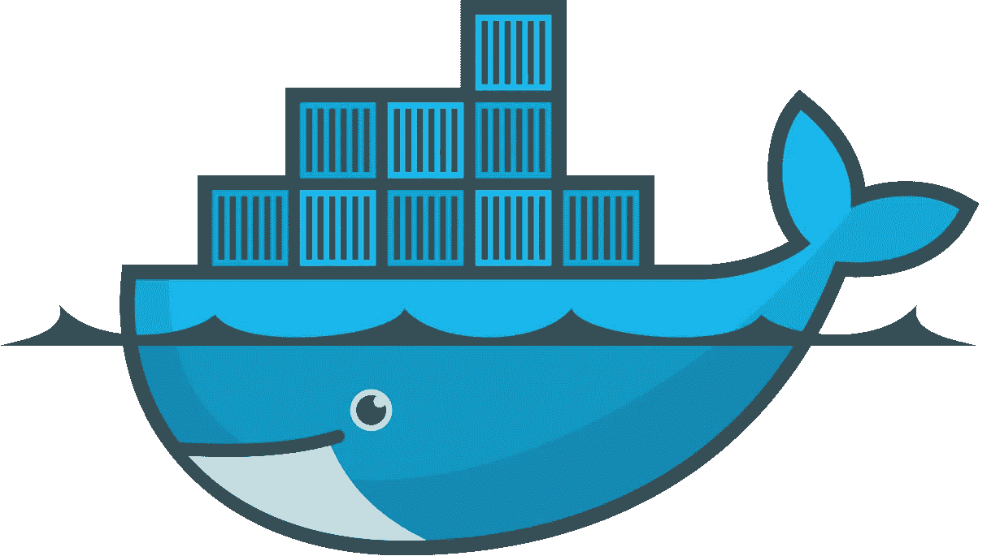
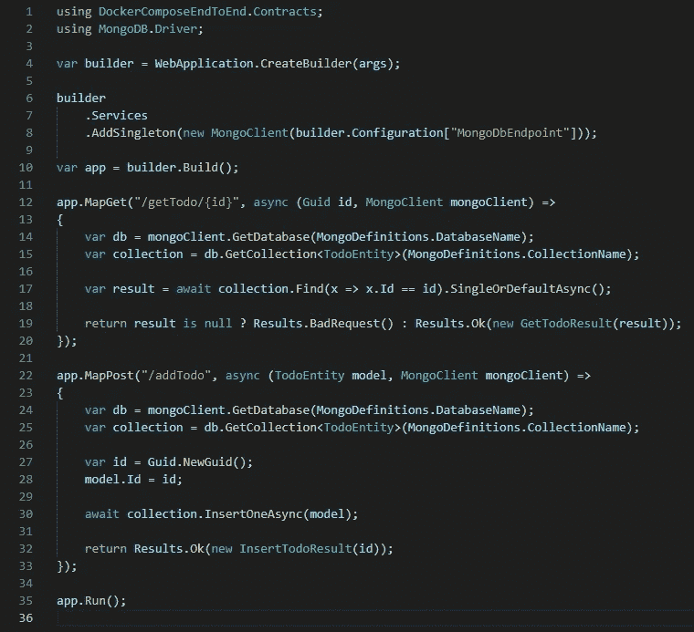
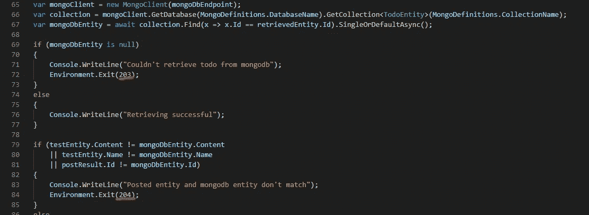
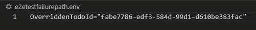
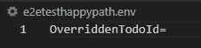

# 使用 docker-compose 进行隔离的端到端测试

> 原文：<https://itnext.io/isolated-end-to-end-tests-with-docker-compose-b3327877e8b8?source=collection_archive---------0----------------------->



你可能知道我是 docker 和 containers 的忠实粉丝，通常会尽可能地从中获益。从开发、测试到部署，拥有可再现的隔离环境是无价的。

今天我想更详细地谈谈第二点。最近我做了一个项目，我通过 docker-compose 安装调试了这个项目，它包含了应用程序以及所有需要的依赖项，所以它是完全隔离的。

鉴于我在开发过程中已经有了一个完全隔离的环境，我真的想利用它进行测试。如果你熟悉测试金字塔，我想使用它的层是 E2E 层，因为单元测试和集成测试已经包含在代码中编写的常规测试中。

目标如下:在容器化的环境中运行我们的应用程序和依赖项，并以某种方式向它发送数据以像用户一样触发处理，包括后续的验证。

# 应用程序

出于演示的目的，我编写了一个非常简单的 API 应用程序，它允许添加和检索 TODO 项。应用程序使用 MongoDb 来存储数据。非常简单的东西，用。网



我在 https://github.com/Sossenbinder/DockerComposeE2ETest 发布了这段代码，如果你想仔细看看的话。

该堆栈还包括一个小的 dotnet 程序，它通过

1.  生成新实体
2.  将其发布到 api
3.  用 2 返回的 ID 再次检索它
4.  使用 3 返回的 ID 手动查询 MongoDb 数据库，并将该实体与步骤 2 中生成的实体进行比较。

通过这种方式，我们可以在所有持久层之间进行一次往返，并验证所有东西都完全相同。请记住，这不是一个完美或超级可靠的测试，但它足以用于演示目的。

# 潜在方法

所以，这个问题本身并不新鲜，在研究过程中，我找到了一些现成的解决方案。

解决方案一利用基础设施作为代码工具，在 Azure / AWS 中运行我们的应用程序，以及一个 MongoDb 实例。部署完所有资源后，it 部门很可能会使用一个脚本来验证端点，然后将其拆除。虽然这样做可行，但我真的不想为云部署买单，而且这也不能满足拥有 docker 专用解决方案的要求，开发人员甚至可以在本地机器上运行该解决方案，以便在推送之前验证代码。

解决方案二越来越近了，似乎很多人都在这么做。使用这种方法，我们将创建一个 docker-compose.yml，其中包含应用程序以及依赖项。这是合成可能的样子:

```
version: "3.4"networks:
  dockerendtoendtestnetwork: {}services:
  dockerendtoendtest.app:
    build:
      context: .
      dockerfile: DockerComposeEndToEnd.App/Dockerfile
    networks:
      - dockerendtoendtestnetwork
    environment:
      MongoDbEndpoint: "mongodb://dockerendtoendtest.mongodb:27017"
      ASPNETCORE_URLS: "[http://+](http://+)"
    ports:
      - 80:80    
    depends_on:
      - dockerendtoendtest.mongodbdockerendtoendtest.mongodb:
    image: mongo
    networks:
      - dockerendtoendtestnetwork
```

compose 现在代表应用程序本身，一旦用 *docker-compose up* 启动，它就开始营业了。同样，我们将使用单独的脚本向 API 发送 http 请求，并以这种方式测试我们的端点。

虽然这已经是一个很好的方法，但是它仍然不能完全满足我的需求。我对这种方法有两个问题:

1.  应用程序 ***有*** 来暴露一个端口，使它可以被运行在 docker-compose 环境之外的脚本访问。这可能导致端口冲突，因为除非您有一个可预测的环境来运行它，否则人们很可能已经将端口 80 用于其他容器，任何任意端口都可能不是直观的。
2.  验证脚本仍然在 docker 引擎的主机上运行，这可能会对它产生潜在影响。假设一个开发人员想在本地尝试这个脚本。如果他的机器有一个非常奇特的配置，可以任意地使验证脚本 HTTP 请求失败，该怎么办？这将是不幸的，因为我们的测试应该是可靠的，只有当测试本身相应地行动时才成功或失败，而不是因为环境因素影响过程。

为了真正满意这个解决方案，唯一的方法是让验证脚本在 docker-compose 集群中运行。然而，我一直在纠结该如何协调。这会要求执行主机解析运行脚本的容器的 docker 日志吗？这个脚本的消费者如何知道这个脚本是否成功呢？

只有当我发现 docker compose 的*-exit-code-from<service name>*标志时，我才明白这一点。这个标志将输出一个特定容器的退出代码，作为 docker compose 本身的退出代码。有了这些信息，现在就有可能向外传递某种信息，运行合成测试的脚本可以利用这些信息工作。

请注意，从技术上讲，docker wait*也有可能实现类似的功能，但是会涉及到一种更复杂的设置方式，而 docker-compose 很好地捆绑了所有东西，并且在给定服务完成后关闭环境。*

有了这些信息，我现在可以在我的脚本中加入不同的退出代码，这样我就可以很容易地将其转换成 CI/CD 管道中的成功或失败，或者类似的情况:



所以我继续将我的验证添加到我的 docker-compose 设置中:

```
version: "3.4"networks:
  dockerendtoendtestnetwork: {}services:
  dockerendtoendtest.app:
    build:
      context: .
      dockerfile: DockerComposeEndToEnd.App/Dockerfile
    networks:
      - dockerendtoendtestnetwork
    environment:
      MongoDbEndpoint: "mongodb://dockerendtoendtest.mongodb:27017"
      ASPNETCORE_URLS: "[http://+](http://+)"
    depends_on:
      - dockerendtoendtest.mongodbdockerendtoendtest.verifier:
    build:
      context: .
      dockerfile: DockerComposeEndToEnd.Verifier/Dockerfile
    networks:
      - dockerendtoendtestnetwork
    environment:
      ApiEndpoint: "[http://dockerendtoendtest.app](http://dockerendtoendtest.app)"
      MongoDbEndpoint: "mongodb://dockerendtoendtest.mongodb:27017"
      OverriddenTodoId: ${OverriddenTodoId}
    depends_on:
      - dockerendtoendtest.appdockerendtoendtest.mongodb:
    image: mongo
    networks:
      - dockerendtoendtestnetwork
```

如您所见，我们现在添加了验证脚本，但反过来也去掉了应用本身的端口部分。

请注意*OverriddenTodoId:$ { OverriddenTodoId }*部分。为了解释这是怎么回事，我应该解释两件事:

1.  我不希望我的测试只检查快乐路径。在我看来，不仅重要的是在输入数据或参数时验证测试成功，而且重要的是在输入无效参数时验证测试正确地失败而不是成功。我的验证脚本将处理这个环境变量，这将导致无效的数据查询，并最终导致测试失败。
2.  为了能够方便地更改这个参数的值，我添加了两个*。包含具体值为*的 env 文件覆盖了 denTodoId* 。这些可以通过- *env-file* 标志传递给 docker compose，以便动态替换占位符。



失败案例的 id 无效



快乐路径将忽略的 Id(导致我的验证脚本完全忽略这个注入)

一切就绪后，我们现在需要做的就是编写一个脚本来运行我们的 docker compose 测试管道。因为我使用 windows，所以我选择了 Powershell 脚本，但是在这里一切都正常。看起来是这样的:

```
docker compose --env-file .\e2etestfailurepath.env up --attach dockerendtoendtest.verifier --abort-on-container-exit --exit-code-from dockerendtoendtest.verifierWrite-Host $LASTEXITCODE;
if ($LASTEXITCODE -eq 0)
{
 throw "Failing test unexpectedly passed";
}docker compose --env-file .\e2etesthappypath.env up --attach dockerendtoendtest.verifier --abort-on-container-exit --exit-code-from dockerendtoendtest.verifierWrite-Host $LASTEXITCODE;
if ($LASTEXITCODE -ne 0)
{
 throw "Successful test did not pass";
}Write-Host "Script finished with success"
```

如你所见，非常简单:

1.  我们运行 docker compose 设置，仅出于可读性目的附加我们的验证脚本的日志，等待我们的验证脚本的退出代码，然后检查它是否表示 0。在这种情况下，错误代码 0 表示错误测试，因为我们测试错误输入是否导致退出，所以成功的测试是不寻常的。请注意，错误代码代表我们的验证脚本的退出代码。
2.  现在我们测试快乐之路。在这种情况下，返回值**必须**为 0。

仅此而已。现在，每个开发人员都可以简单地在本地运行这个脚本，在部署之前验证他们自己的代码更改，或者我们可以将这个脚本转移到 jenkins / gitops 管道中。

现在，我们已经构建了一个完全隔离的端到端测试，完全通过短暂的 docker 容器运行，我们只在需要时启动/关闭这些容器。我们不再受环境的影响。完美！