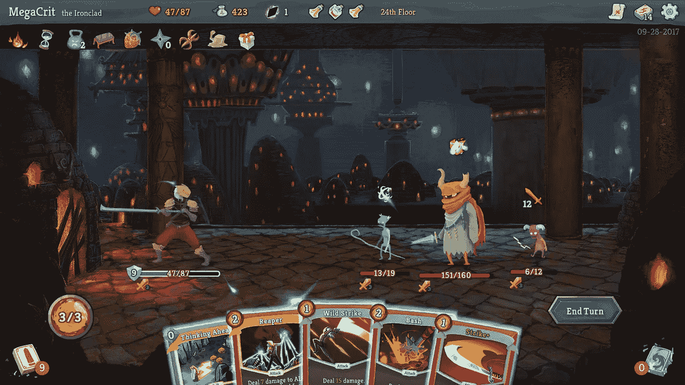

# 在纸牌游戏中分离随机性的杂质

> 原文：<https://itnext.io/isolating-the-impurity-of-randomness-in-card-games-b216b926df06?source=collection_archive---------7----------------------->

[斩杀尖塔很牛逼](https://www.rockpapershotgun.com/2018/02/19/why-revealing-all-is-the-secret-of-slay-the-spires-success/)

*我试着添加了查找我不确定每个人都知道的话题所需的所有参考资料。如果您觉得有任何部分缺少参考，请告诉我:)*

> 这篇文章是关于使用模式在 Javascript 中处理一副牌，以便容易地分离牌处理和随机数生成器(RNG)之间的关系。它有利于跟踪所发生的事情，因此您可以始终拥有一个可预测的关于您的甲板状态管理的历史。

提示:使用[拉姆达的 REPL](http://ramdajs.com/repl/?v=0.25.0) 来测试例子。不需要在那里导入[Ramda](http://ramdajs.com/)；)

# 关于不洁的一句话

RNG 天生就是不纯的。它们也是所有纸牌游戏的核心，因此学习如何将纸牌处理逻辑与你的随机来源分开将为你的程序带来更好的熵管理([软件熵](https://en.wikipedia.org/wiki/Software_entropy)而不是[随机熵](https://en.wikipedia.org/wiki/Entropy_(computing)))。我们将看到如何使用面向功能的风格来操作卡片组，记住不变性、功能纯度和适当的副作用处理。

# 为什么我们想要不变性？

本文的重点不是状态管理，但是要回答上面的问题，我需要了解一下它的表面。

纸牌游戏的节奏是不同步的。不像游戏的大部分，你实际上不需要每 1/60 秒就有成千上万的函数到处触发。像大多数棋盘游戏一样，纸牌游戏几乎总是可以被描述为一个反应系统。我不知道这个术语是否真的存在，但它看起来很合适，因为基本上你需要做的是等待用户做一些事情，只有在那之后你才对他做的事情做出反应。

谈到反应性的东西，在过去的几年里，有大量关于[反应](https://reactjs.org/)的模糊信息。这真的是一件令人惊讶的事情，因为它给大众带来了`view = render(state)`的概念，即“视图总是知道状态的渲染器函数的返回”，所以每当你想改变视图中的某些内容时，你只需告诉 React to `setState`，它就会智能地更新你的视图。

上面的概念真的很酷，因为它就像手套一样适合大多数纸牌和棋盘游戏，但我们都知道技术有它的权衡。当你使用类似 React 的东西时，你必须非常小心，不要违反一些基本法则，其中之一就是不变性。不允许改变状态，只能调度希望视图拥有的新状态，这需要更复杂的状态管理(当状态变得难以管理时，使用 Redux 之类的东西)。

*请注意，这条定律之所以存在，是因为 Javascript 有可以改变内容的方法。在以这种想法设计的语言中，这不是问题，比如* [*ELM*](http://elm-lang.org/) *或*[*reason ml*](https://reasonml.github.io/)

当使用像 [Redux](https://redux.js.org/) 这样的可预测状态管理器时，你会发现你总是想要跟踪状态变化时使用了哪些变量，这样你就可以从事件中重建状态，并且有一个可靠的 bug 跟踪源。因此，让我们看看如何操作一副支持函数式编程风格的卡片，帮助我们更好地处理这种不可变的对象更改。

我们的目标是在您的应用程序中方便使用[事件源](https://martinfowler.com/eaaDev/EventSourcing.html)，这样您就可以随时重放事件以获得当前状态，这也带来了良好的免费可调试性。你将总是能够重现你的用户玩的任何游戏，因为你可以跟踪每一个状态变化，这也为收集关于平衡的信息打开了很多空间，因为你已经默认了你需要的所有数据。

# 什么是一副牌？什么是卡？

任何数组都可以是一副牌。我们将从本质上学习一系列有用的数组方法，你可以用它们来设计基于卡片的游戏，比如魔术:聚会、[杀死塔尖](http://store.steampowered.com/app/646570/Slay_the_Spire/)、纸牌、扑克或其他游戏。

既然一副牌是任意数组，那么一张牌就是该副牌数组根层中的任意元素。我们将在后面讨论为什么卡片应该是一个对象。

# 从这副牌中抽出一张牌

抽牌时，我们想要两样东西:

1.  我们想知道我们抽到了哪张牌
2.  我们想要一副没有抽牌的新牌

我们的 draw 函数必须遵守这两个规则，所以让我们看看如何构建它。首先让我们从甲板开始。我建议你创建自己的甲板；)

现在我们来拿这张牌和剩下的一副牌:

如果你不喜欢 Ramda 或者框架，你总是可以[写你自己的实现](https://en.wikipedia.org/wiki/Reinventing_the_wheel)。出于理智的原因，我将尽可能少地使用 Ramda 来做所有的例子，但是在现实生活中，我强烈建议您尽可能多地使用它，因为它极大地减少了您必须编写(以及测试和维护)的代码量。

如果你注意到了，这有点破坏了数组中有非唯一元素的可能性。例如，运行`without([1], [1, 2, 1])`会破坏你的游戏，因为它从数组中删除了两个`1`。

关于这一点，我能说的是，在一个游戏中，你不太可能用除了一个物体之外的任何东西来代表卡片。所有其他的数据结构似乎都不适合这个目的，我建议你总是使用对象来表示卡片。

我们知道如何从牌的顶部抽一张牌，但是如果我们想从底部抽呢？或者更糟，如果我们想要一张随机的牌呢？让我们从分离关注点开始。我们将创建一个通用的抽牌函数，它不知道如何选牌，它只知道如何遵守我们为抽牌设置的 2 条规则:

[***查看抽卡互动示例***](https://goo.gl/7j4Khk)

> 拉姆达的 REPL 提示:点击“整齐”在输出标签漂亮的结果

所以现在我们抽第一张牌的例子变成了这样:

如果我们想从底部开始画:

在这个实现中需要注意的一件重要事情是:我们将决定抽哪张牌的麻烦委托给了一个名为‘card picker’的函数。现在，我们的 draw 函数不能负责处理随机性带来的意外行为，这意味着我们现在可以像这样从一副牌中随机抽取一张牌:

`*"randomElement”*` *仍不纯洁。我们将在后面看到如何清理这个问题。*

`randomElement`产生一个随机数的麻烦工作，所以我们成功地从抽签中去掉了这个负担！现在，您可以为您的 draw 函数编写一些测试；)

在我们继续之前，我们还可以做最后一件事来使我们的绘图功能变得更好。`cardPicker`参数出现在`deck`之前是有原因的，这是因为我使用了一种数据最后的方法，这样我们就可以从所谓的[“部分应用”](https://mostly-adequate.gitbooks.io/mostly-adequate-guide/ch04.html)中受益。要操作的数据是最后提供的，所以我们可以像这样做一些漂亮的东西:

首先我们导入 [ramda 的](http://ramdajs.com/docs/#curry) `[curry](http://ramdajs.com/docs/#curry)` [方法](http://ramdajs.com/docs/#curry)来使我们的 draw 函数接受部分应用

现在，我们可以使用我们的新能力给我们的代码带来语义上的乐趣:

[***使用分部分项应用交互示例***](https://goo.gl/BNNaox)

体验抽奖的乐趣，我敢肯定，有很多有趣的事情要探索，只是这个功能:D

# 将卡片添加到卡片组

在所有的绘图工程之后，给数组添加东西有点无聊。我们可以使用普通的数组方法:

[***查看添加卡片互动示例***](https://goo.gl/e9LLNf)

# 洗牌和植入值

这可能是最难去除杂质的部分。洗牌在很大程度上是基于 RNG 的，所以我将采取不同的方法，使用一个种子随机。同样的技术可以用来改进我们的`draw`函数，所以在这一节之后，我建议你试着让你的 draw 函数也是一个种子随机数。

什么是种子随机？我称之为随机，但这是个谎言，一点也不随机，我们只是要用一个复杂的运算，使得很难预测这个函数的输出。这样做，我们就尊重了函数纯洁性规则，即相同的输入应该给出相同的输出。

让我们创建一个真正基本的种子随机值函数:

*我还没有验证这个种子值算法，它只是一个简单的算法，你可能应该研究一个更好的用于生产环境的算法*

酷毙了。这个函数将总是返回一个从 0 到 1 的数字，给定一个种子数(这是您在实现中实际上随机产生的)。然后，让我们创建一个使用种子来混洗数组的混洗函数:

纸牌魔术通常使用术语“套路”来确定一系列的技巧或操作:)

我们现在可以洗牌或洗牌:

[***结账洗牌互动示例***](https://goo.gl/jjuh14)

每次你用相同的种子和卡片组调用`shuffle`时，你都会得到相同的输出。

但是仍然有一个难题:我们如何使我们的种子随机？

这完全取决于你。现在洗牌函数是纯粹的，它不再负责了解随机性，这个负担就由你来承担了。

我推荐你浏览[random.org](https://www.random.org/)获得更多关于随机性的信息和一个好的随机 API。你也可以看看我和我的一个朋友为电报的 MMORPG 做的 dice 实现:

*   [骰子模块](https://github.com/telemmo/telemmo/blob/master/src/game/core/dice.js)
*   [此外，检查骰子模块使用的测试](https://github.com/telemmo/telemmo/blob/master/src/game/core/dice.test.js)

我想这篇文章的观点现在已经实现了，我想知道这个内容是否与你相关。请留下评论分享你的想法，感谢阅读！

*我最近做了一个 Twitter，所以如果你想聊天，就打我这里*[*@ marcowworms*](https://twitter.com/MarcoWorms)