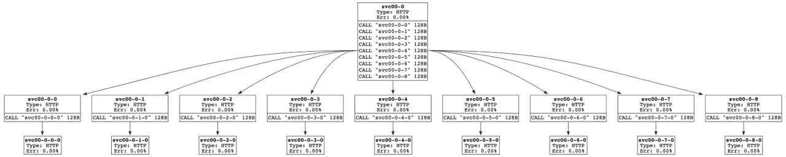
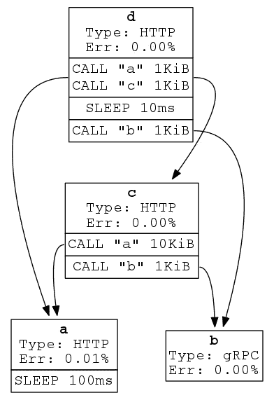

# Istio 同位素

> 原文：<https://itnext.io/isotope-for-istio-41dd3c218996?source=collection_archive---------2----------------------->

## 使用基于可定制服务图的拓扑测试 Istio

Isotope 是 Istio Topology Performance 的缩写，是一种工具，它利用定制服务二进制文件以可定制的服务图方式部署 Istio，并使用 Fortio 作为负载生成器来测量其性能。

具有 8 个服务和至少 2 个副本的同位素部署([来源](https://github.com/istio/tools/tree/release-1.9/perf/load)

要了解 Istio 在接近生产类型部署的环境中的性能，需要使用一组特定的调用序列创建多个服务，同时使用副本确保这些服务的高可用性。Istio community 发布了这个工具，以便通过服务之间的可定制调用序列来自动部署多个服务，每个服务返回定制的有效负载大小(1 MB 或 10 MB 等)。)利用虚拟服务二进制。

# 亮点或功能:

*   容器可以部署在主节点和工作节点上
*   Isotope 使用 mock_service 容器，该容器又包含 isotope_service 二进制文件(可在/usr/local/bin 中找到)
*   同位素服务是一个简单的 http 服务器，它遵循来自 YAML 文件的指令并公开普罗米修斯度量
*   的用法。/isotopic _ service:max-idle-connections-per-host int，这是每台主机保持打开的最大 TCP 连接数
*   提供的“测试运行程序”可以帮助在 GKE 集群上部署服务图
*   提供了一组具有多达 1000 个服务/5000 个端点的示例拓扑，以链接多个服务，从而以树调用顺序部署服务

带有特定调用图的示例服务图([来源](https://github.com/istio/tools/tree/master/isotope)

Isotope 通过将各种指标暴露给一个可以被 Prometheus 收集的端点来帮助提供各种服务指标。Prometheus 端点可以获取的指标很少:

*   ` service _ incoming _ requests _ total`—此服务接收的请求的计数器
*   ` service _ outgoing _ requests _ total`—发送到其他服务的请求的计数器
*   ` service _ outgoing _ request _ size`—发送到其他服务的请求大小的直方图
*   ` service _ request _ duration _ seconds`—从“收到请求”到“发送响应”的持续时间直方图
*   ` service_response_size` —此服务发送的响应大小的直方图

以下是 Isotope 提供的调谐或定制选项列表:

*   HTTP 1.1 或 HTTP 2
*   服务计数和名称
*   普罗米修斯——对还是错
*   mTLS —对还是错
*   多集群配置-对或错
*   入口 URL
*   探测器:活跃度、复杂性和预定义性
*   Fortio 客户端选项:连接，输入 QPS，大小，运行持续时间
*   副本数量

当同位素部署在 Kubernetes 集群之上时，部署以下容器:

*   不良健康容器
*   Istio 应用程序容器:检查 kube-api 准备情况
*   配置更改容器:部署时没有 sidecar 代理，包含设置 Kubernetes 集群的 hyperKube 容器映像
*   Fortio 客户端:没有 sidecar 代理的设置，称为客户端容器，并寻找一个 URL 来发送流量
*   部署 scaler 容器:拥有 kubectl 映像，pod 部署并运行到完成，最终状态为“completed”
*   服务图容器:自动调用 Istio 和 Envoy 代理，sidecar 被注入每个容器，除了部署容器

# 调试帮助

如果您正在使用同位素，最有可能的是您正在寻找规模测试您的 Istio 部署。这里列出了一些有助于我更好地理解部署的命令。

## 你怎样才能看到容器使用的资源

此命令提供被安排为尽力而为的 pod 的内存使用情况:

*   cat/sys/fs/c group/memory/kube pods . slice/kube pods-best effort . slice/kube pods-best effort-pod 5 FB 73 ff 3 _ 4fd 6 _ 46ca _ be95 _ 0 AFC 78 DC 17 a 8 . slice/memory . kmem . usage _ in _ bytes

此命令提供被安排为可突发的 pod 的内存使用情况:

*   cat/sys/fs/c group/memory/kube pods . slice/kube pods-burst able . slice/kube pods-burst able-pod 181 ac4b 2 _ 3d b5 _ 48f 7 _ 8b 58 _ 14 CDA 6 c 4204 f . slice/memory . usage _ in _ bytes

## 如何获取服务中的 pod 列表:

*   $ ku bectl get pods-n service-graph 00-selector = " app = SVC 00–0–8 "-output = wide
*   选择器可以通过 kubectl describe svc servicename 找到

## 如何登录到模拟服务容器:

*   ku bectl exec-I-t-n service-graph 00 SVC 00–0–7-BCB 549 fdb-QQ DCD-容器模拟服务-sh

请注意，在一个 16G 内存和 10 个 vCPUs 的虚拟机中使用默认设置运行 isotope，由于缺乏资源，isotope 无法安装。所以确保你提供更多的资源。