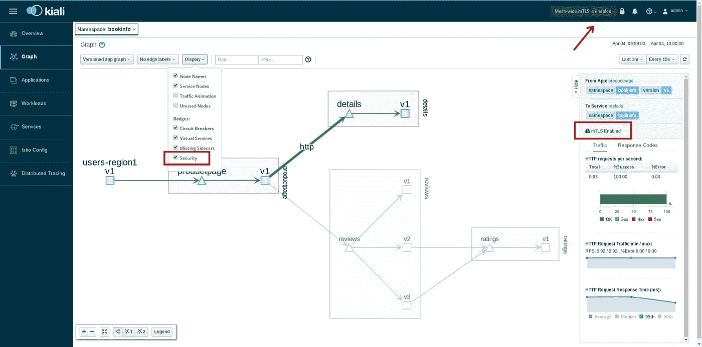
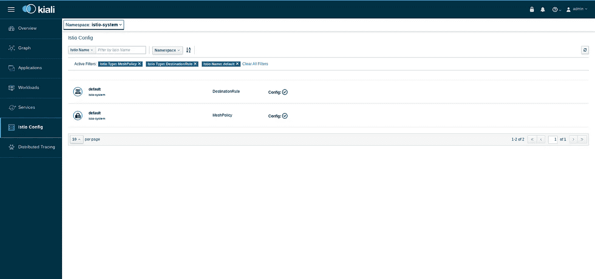
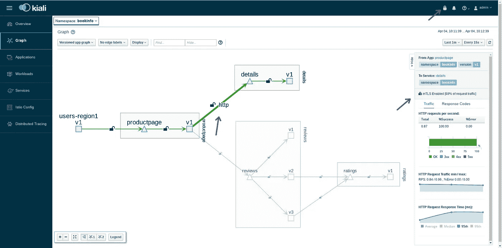
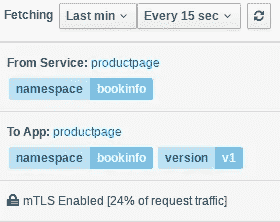
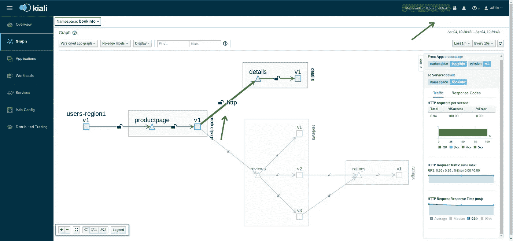
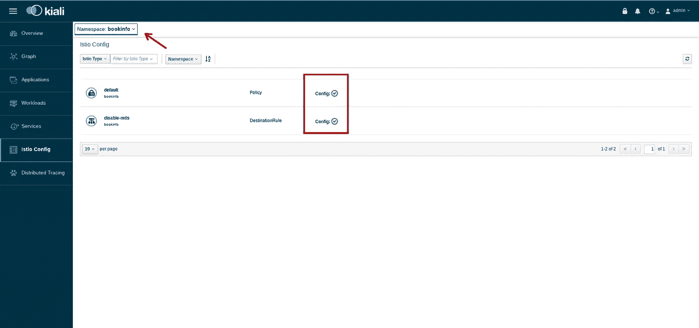
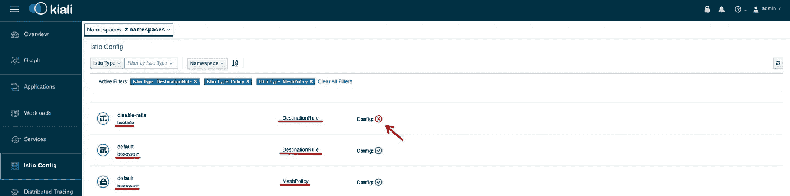
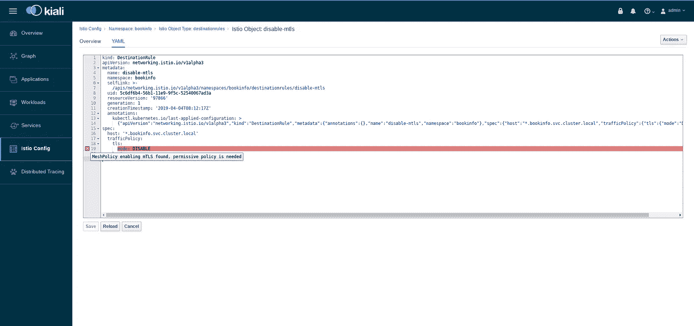

# Istio adventures —禁用一个命名空间的 mTLS

> 原文：<https://itnext.io/istio-adventures-disabling-mtls-for-one-namespace-62f37b99855c?source=collection_archive---------3----------------------->

假设您有一个 Istio 安装，其中为整个集群启用了 mTLS。你应该有这样的东西:



Kiali 展示了一些 mTLS 提示——图边和报头中的锁。

在配置方面，你应该有以下几件:

1.  一个 MeshPolicy 使服务能够以 *mTLS* 模式接收连接。

```
apiVersion: “authentication.istio.io/v1alpha1”
kind: “MeshPolicy”
metadata:
 name: “default”
spec:
 peers:
 — mtls: {}
```

2.一个 DestinationRule 使您的服务网格的所有客户端*能够在 *mTLS* 中开始通信。

```
apiVersion: "networking.istio.io/v1alpha3"
kind: "DestinationRule"
metadata:
  name: "default"
  namespace: "default"
spec:
  host: "*.local"
  trafficPolicy:
    tls:
      mode: ISTIO_MUTUAL
```

*我们通常称[工作负载为](https://istio.io/help/glossary/#workload)客户端。工作负载是服务网格上能够与其他服务或 [ServiceEntries](https://istio.io/docs/reference/config/istio.networking.v1alpha3/#ServiceEntry) (服务网格外的端点)开始通信的所有实体。

关于这两个规则的完整性的更多信息，Kiali 有 Istio 配置部分。在那里，您可以列出集群中的所有 Istio 对象。多亏了过滤，您可以很容易地找到上面描述的两个配置。



# 我想禁用一个命名空间的 mTLS，我该怎么做？

需要做两件不同的事情。我们将不得不再次改变客户端和服务的行为。

1.  为了使服务能够接收非 mTLS 连接，我们需要创建如下策略:

```
apiVersion: "authentication.istio.io/v1alpha1"
kind: "Policy"
metadata:
  name: "default"
  namespace: "bookinfo"
spec:
  peers:
    - mtls:
        mode: PERMISSIVE
```

许可模式允许服务接收所有类型的连接:明文或 TLS。除了模式之外，这里要注意的一件有趣的事情是，策略**必须**被命名为“default ”,因为它没有[目标](https://istio.io/docs/reference/config/istio.authentication.v1alpha1/#Policy)字段。

为了允许所有服务接收普通连接和 mTLS 连接，首先应用策略是很重要的。如果您首先应用 DestinationRule，您将让所有工作负载以普通方式启动连接，但是任何服务都可以响应。

2.关于客户端，我们需要定义一个新的 DestinationRule，覆盖网状网络中声明的流量策略。

```
apiVersion: "networking.istio.io/v1alpha3"
kind: "DestinationRule"
metadata:
  name: "disable-mtls"
  namespace: "bookinfo"
spec:
  host: "*.bookinfo.svc.cluster.local"
    trafficPolicy:
      tls:
        mode: DISABLE
```

Istio 的覆盖机制与配置名的名称无关。在上面的代码片段中，我将 DestinationRule 的名称更改为一个更加自解释的名称( *disable-mtls)* ，并且它工作了。

一旦两个配置都在服务网格中发布，您应该会看到:



IstioMesh 开始从 MTL 过渡到普通连接

服务网格边缘的 Open lock 显示部分或全部流量未加密(不使用 mTLS)。在应用之前的配置后，大多数流量仍然使用 mTLS。然而，边缘的锁警告有未加密的流量通过。mTLS 流量的确切数量显示在右侧面板中。



24%的最后一分钟请求流量使用了 MTL

对命名空间禁用 mTLS 一段时间后，图形应该完全变绿，全部流量未加密。但是，您的网状范围 mTLS 仍处于启用状态。



100%的流量不使用 mTLS

作为最后的检查，我强烈建议你去 Istio 配置部分，看看是否有任何来自 Kiali 的验证系统的警告。



按 bookinfo 命名空间筛选的对象列表。未找到验证。

# 一个常见的错误

当您有一个在**严格**模式下定义 mTLS 的网格策略时，您是说您的服务网格内的所有流量都必须使用 mTLS 协议。因此，当您想要禁用命名空间或服务的流量时，您不希望流量使用 mTLS。所以这违背了网格策略的定义。

看看当您只指定禁用 mTLS 的目标规则时会发生什么(并且没有定义任何名称空间范围的策略):



Istio 配置—启用全网状 mTLS，禁用 mTLS 流量的目标规则

如我们所见，我们的服务网络具有:

*   `disable-mtls` DestinationRule 禁用`bookinfo`命名空间的 mTLS。
*   `default` DestinationRule 为服务网格中的整个连接启用 mTLS。
*   `default` MeshPolicy 严格允许所有服务上的 MTL。

这里重要的一点是 DestinationRule 有问题。同样重要的是:Kiali 警告你。见下文:



Kiali 验证建议添加允许非 mTLS 流量的许可策略

基阿利说`MeshPolicy enabling mTLS found, permissive policy is needed`这意味着网络策略正在强制 mTLS 流量，所以在这里禁用 mTLS 将导致错误的配置。此外，Kiali 建议您添加一个许可策略。

为了解决这个问题，您有两个选择:要么将 MeshPolicy 设置为`permissive`模式(这不是一个好的实践),要么在`permissive`模式下将一个策略添加到`bookinfo`名称空间(正如我们在本文第一部分中看到的)。