# istio:Kubernetes 中的概述和运行服务网格

> 原文：<https://itnext.io/istio-an-overview-and-running-service-mesh-in-kubernetes-d1077fe5dcb7?source=collection_archive---------4----------------------->

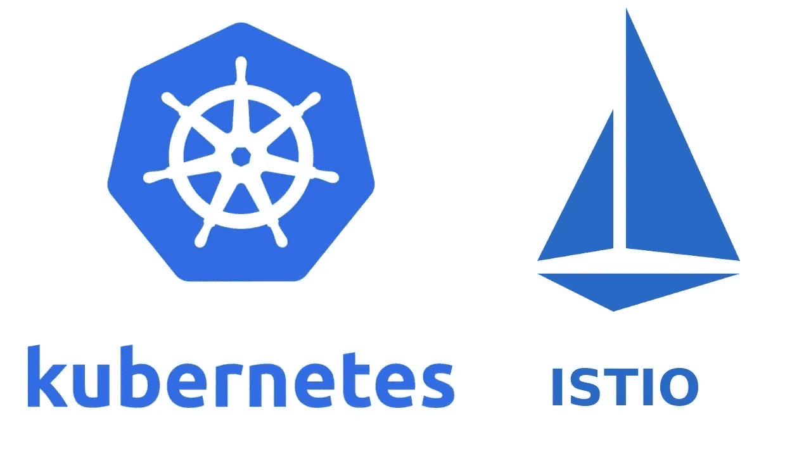

Istio 是一个服务网格解决方案，允许执行服务发现、负载平衡、流量控制、金丝雀部署和蓝绿部署，以及微服务之间的流量监控。

我们将在 AWS Elastic Kubernetes 服务中使用 Istio 进行流量监控，作为 API 网关服务，用于流量策略和各种[部署策略](https://www.infoworld.com/article/3565750/4-deployment-strategies-for-resilient-microservices.html)。

在这篇文章中，我将从总体上讲述服务网格的概念，然后概述 Istio 架构和组件、它的安装过程以及如何运行一个测试应用程序。

# 内容

*   [什么是服务网格](https://rtfm.co.ua/en/istio-an-overview-and-running-service-mesh-in-kubernetes/#Service_Mesh)？
*   [Istio 建筑公司](https://rtfm.co.ua/en/istio-an-overview-and-running-service-mesh-in-kubernetes/#Istio_architecture)
*   [控制平面](https://rtfm.co.ua/en/istio-an-overview-and-running-service-mesh-in-kubernetes/#Control_Plane)
*   [数据平面](https://rtfm.co.ua/en/istio-an-overview-and-running-service-mesh-in-kubernetes/#Data_Plane)
*   [Istio 网络模型](https://rtfm.co.ua/en/istio-an-overview-and-running-service-mesh-in-kubernetes/#Istio_network_model)
*   [在 Kubernetes 中运行 Istio](https://rtfm.co.ua/en/istio-an-overview-and-running-service-mesh-in-kubernetes/#Running_Istio_in_Kubernetes)
*   [运行测试应用](https://rtfm.co.ua/en/istio-an-overview-and-running-service-mesh-in-kubernetes/#Running_test_application)
*   [Istio 入口网关](https://rtfm.co.ua/en/istio-an-overview-and-running-service-mesh-in-kubernetes/#Istio_Ingress_Gateway)
*   [网关](https://rtfm.co.ua/en/istio-an-overview-and-running-service-mesh-in-kubernetes/#Gateway)
*   虚拟服务
*   [吉利—交通观察](https://rtfm.co.ua/en/istio-an-overview-and-running-service-mesh-in-kubernetes/#Kiali_-_traffic_observation)
*   [边车—特使代理](https://rtfm.co.ua/en/istio-an-overview-and-running-service-mesh-in-kubernetes/#Sidecar_-_Envoy_proxy)
*   [Istio 和 iptables](https://rtfm.co.ua/en/istio-an-overview-and-running-service-mesh-in-kubernetes/#Istio_and_iptables)
*   [跑边车](https://rtfm.co.ua/en/istio-an-overview-and-running-service-mesh-in-kubernetes/#Running_Sidecar)
*   [有用的链接](https://rtfm.co.ua/en/istio-an-overview-and-running-service-mesh-in-kubernetes/#Useful_links)

# 服务网格

本质上，它是一个代理服务管理器。作为代理服务，可以有类似 NGINX、HAProxy 或 Envoy 的系统，工作在[网络 OSI](https://rtfm.co.ua/what-is-model-osi/) 第 7 层，允许动态流量控制和应用程序通信配置。

服务网格执行新的应用/服务发现、负载平衡、认证和流量加密。

对于每个应用程序的服务网格中的流量控制，或者对于每个 pod 的 Kubernetes，在应用程序旁边启动一个名为 *sidecar* 的代理服务。

这些边车集装箱一起被称为*数据平面*。

对于它们的配置和管理，还有另一个称为*控制平面*的进程组。它们用于新应用程序发现、加密密钥管理、指标收集和聚合等。

服务网格可以显示为这样的方案:

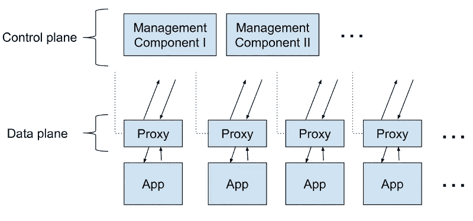

在众多服务网格解决方案中，我想提到以下几个:

*   [AWS 应用网格](https://aws.amazon.com/ru/app-mesh/)
*   [Hashicop 领事](https://learn.hashicorp.com/tutorials/consul/service-mesh)
*   林克尔德
*   [阿帕奇服务梳](https://servicecomb.apache.org/docs/introduction/)
*   [Traefik 网格](https://traefik.io/traefik-mesh/)
*   [Istio](https://istio.io/)

阅读更多(Rus 中的所有链接):

*   [чтотакое服务网？](https://habr.com/ru/company/otus/blog/506916/)
*   [服务网格:что нужно знать каждому软件工程师осамойхакповойтехнологии](https://habr.com/ru/company/flant/blog/478306/)
*   [что·почему·нужен？](https://habr.com/ru/company/flant/blog/327536/)
*   [服务网格— это всё ещё сложно](https://habr.com/ru/company/flant/blog/533686/)

# Istio 建筑

因此，Istio as a service mesh 由两个主要部分组成，即*数据平面*和*控制平面*:

*   **数据层**(“数据层”):包含一组代理服务，在每个 Kubernetes Pod 中表示为 sidecar 容器，使用扩展的 [Envoy](https://www.envoyproxy.io/) 代理服务器。这些边车链接和控制应用程序之间的流量，收集和发送指标
*   **控制平面**(“控制层”):管理和配置侧柜、聚合监控指标、TLS 证书管理

Isitio 架构可表示为下图:

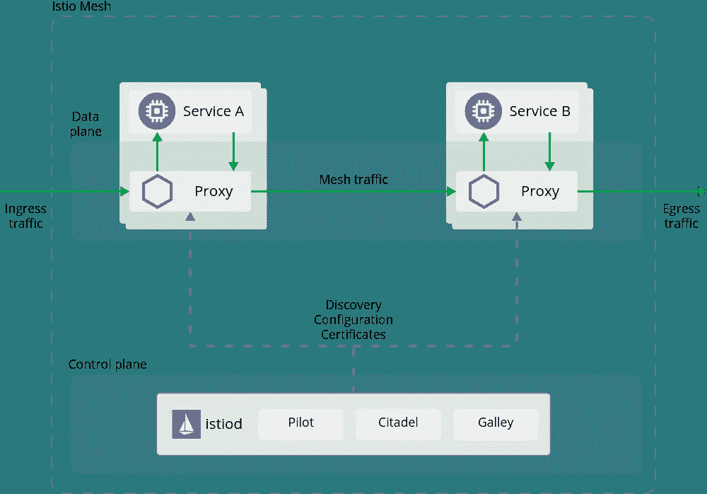

或者另一个:

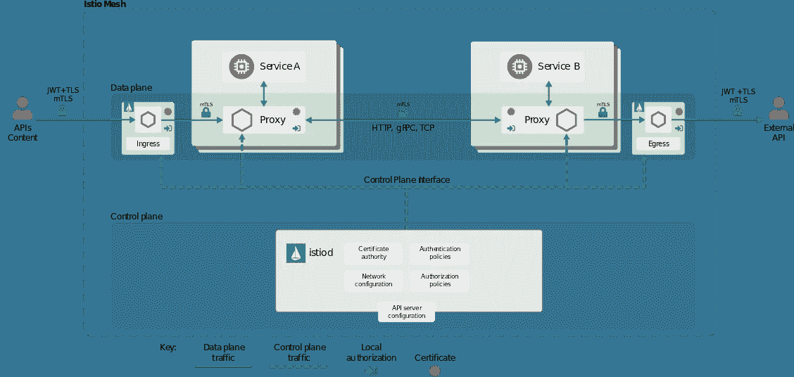

## 制导机

Istio 控制平面包括主要组件:

*   *Pilot* :中央控制器，负责使用 [Envoy API](https://www.envoyproxy.io/docs/envoy/latest/api/api) 与边车通信。它读取 istio 清单中描述的规则，并将它们发送给 Envoy 代理进行配置。此外，它还用于[服务发现](https://www.nginx.com/blog/service-discovery-in-a-microservices-architecture/)、流量控制、路由、网络抗超时能力和[电路中断](https://en.wikipedia.org/wiki/Circuit_breaker_design_pattern)。
*   Citadel :身份和访问管理——流量加密、用户和服务认证、TLS 密钥管理。参见 [Istio Security](https://istio.io/v1.4/docs/concepts/security/) 。
*   *Galley* :配置管理——验证新配置并通过网格发送它们
*   *混合器*:监控、度量、日志、流量控制

从 Istio 版本 1.9.1 开始，除了在专用 Docker 容器中运行的 Pilot 之外，它们都被构建为一个名为`istiod`的二进制文件，外加额外的入口和出口控制器。

## 数据平面

由作为附加进程运行的边车容器组成，这些进程通过`kube-inject`在 Kubernetes 中运行，参见[安装边车](https://istio.io/latest/docs/setup/additional-setup/sidecar-injection/)。

这些容器和特使代理实例允许:

*   动态[服务发现](https://www.nginx.com/blog/service-discovery-in-a-microservices-architecture/)
*   负载平衡
*   TLS 终止
*   HTTP/2 和 gRPC 代理
*   [断路器](https://en.wikipedia.org/wiki/Circuit_breaker)
*   健康检查
*   [部署分阶段展开](https://www.infoworld.com/article/3565750/4-deployment-strategies-for-resilient-microservices.html)
*   丰富的指标

阅读更多信息:

*   [架构](https://istio.io/latest/docs/ops/deployment/architecture/)
*   [Istio 建筑](https://www.istioworkshop.io/03-servicemesh-overview/istio-architecture/)

# Istio 网络模型

在运行我们的 Istio 之前，让我们先简单了解一下用于管理流量的资源。

在安装过程中，Istio 创建一个入口网关服务(和出口网关，如果在安装过程中设置了的话)——在 Istio 安装过程中，一个新的 Kubernetes 对象被描述为 [Kubernetes CRD](https://kubernetes.io/docs/concepts/extend-kubernetes/api-extension/custom-resources/) 。

在具有默认设置的 AWS 中，入口网关将创建一个 AWS 经典负载平衡器，因为入口网关表示为具有负载平衡器类型的 Kubernetes 入口对象。

在入口网关的“背后”创建了另一种资源——[网关](https://istio.io/latest/docs/reference/config/networking/gateway/)，在安装过程中也被称为 Kubernetes CRD，用于描述通过该网关发送流量的主机和端口。

然后，另一个资源将到达现场 VirtualService，它描述了通过网关发送的流量路由，并将其发送到 Kubernetes 服务，如[目的地规则](https://istio.io/latest/docs/concepts/traffic-management/#destination-rules)中所述。

入口网关由两部分组成:一个 Kubernetes Pod 和一个 Kubernetes Ingress，前者具有控制流量的 Envoy 实例，后者接受新的连接。

反过来，网关和虚拟服务配置用作入口网关控制器的特使代理实例。

所以，一般来说，交通流量如下:

1.  一个数据包将到达一个外部负载平衡器，然后被发送到一个 Kubernetes WorkerNode TCP 端口
2.  在那里，数据包被发送到 Istio IngressGateway 服务
3.  并被重定向到 Istio IngressGateway 窗格
4.  此 Pod 上的特使实例配置有网关和虚拟服务
5.  网关描述端口、协议、SSL 证书
6.  VirtualService 描述了到我们应用程序的 Kubernetes 服务的流量路由
7.  Istio IngressGateway Pod 将此数据包发送给应用程序的服务
8.  服务将数据包路由到应用程序的 Pod

阅读更多信息:

*   [了解 Kubernetes 中的 Istio 入口网关](https://blog.jayway.com/2018/10/22/understanding-istio-ingress-gateway-in-kubernetes/)
*   [交通管理](https://istio.io/latest/docs/concepts/traffic-management) и [交通管理](https://istio.io/latest/docs/reference/config/networking/)

# 在 Kubernetes 经营 Istio

Istio 支持不同的[部署模型](https://istio.io/latest/docs/ops/deployment/deployment-models/)。在目前的情况下，我们使用一个 AWS 弹性 Kubernetes 服务集群，所有的 pods 都运行在同一个 VPC 网络中。

此外，还有不同的[配置文件](https://istio.io/latest/docs/setup/additional-setup/config-profiles/),其中包含要安装的预配置组件。在这里，我们可以感兴趣的是*默认*——安装`istiod`和`istio-ingressgateway`，*演示*——类似，但也将安装`istio-egressgateway`服务，以及*预览*——调查尚未包含在主 Istion 版本中的新能力。

您可以通过多种方式安装 Istio:使用`istioctl`实用程序、使用清单文件、使用 Helm 或 Ansible。

值得注意的是相互 TLS(mTLS)——参见[许可模式](https://istio.io/latest/docs/concepts/security/#mutual-tls-authentication)。简而言之:默认情况下，Istion 安装在许可的 mTLS 模式下，这允许现有的应用程序使用明文流量进行通信。但是所有通过特使代理的新连接都将使用 TLS 加密。

现在，让我们用`istioctl`手动安装 Istio，稍后开发和生产集群将安装 Ansible 及其`[helm](https://docs.ansible.com/ansible/latest/collections/community/kubernetes/helm_module.html)`模块。

阅读更多信息:

*   [用 Istioctl](https://istio.io/latest/docs/setup/install/istioctl/) 安装
*   [安装导轨](https://istio.io/latest/docs/setup/install/)。

下载 Istio:

```
$ curl -L [https://istio.io/downloadIstio](https://istio.io/downloadIstio) | sh -
$ cd istio-1.9.1/
```

`[istioctl](https://istio.io/latest/docs/reference/commands/istioctl/)`使用`~/.kube/config`文件，或者您可以使用`--kubeconfig`选项指定您自己的文件，或者使用`--context`设置另一个上下文。

位于`bin`中的`[istioctl](https://istio.io/latest/docs/reference/commands/istioctl/)`文件——将其添加到`$PATH`变量中(Linux/macOS:

```
$ export PATH=$PWD/bin:$PATH
```

检查它是否工作:

```
$ istioctl version
no running Istio pods in “istio-system”
1.9.1
```

如果需要，为测试集群生成 kubeconfig(如果使用 Minicube，将自动生成):

```
$ aws eks update-kubeconfig — name bttrm-eks-test-1–18 — alias iam-bttrm-eks-root-role-kubectl@bttrm-eks-test-1–18
Added new context iam-bttrm-eks-root-role-kubectl@bttrm-eks-test-1–18 to /home/setevoy/.kube/config
```

并使用*默认*配置文件安装 Istio:

```
$ istioctl install — set profile=default -y
✔ Istio core installed
✔ Istiod installed
✔ Ingress gateways installed
✔ Installation complete
```

再次检查版本:

```
$ istioctl version
client version: 1.9.1
control plane version: 1.9.1
data plane version: 1.9.1 (1 proxies)
```

和 Istio 吊舱:

```
$ kubectl -n istio-system get pod
NAME READY STATUS RESTARTS AGE
istio-ingressgateway-d45fb4b48-jsz9z 1/1 Running 0 64s
istiod-7475457497–6xskm 1/1 Running 0 77s
```

现在，让我们部署一个测试应用程序，并通过 Istio 入口网关配置路由。

## 运行测试应用程序

我们将不使用来自 [Istio Gettings Started](https://istio.io/latest/docs/setup/getting-started/#bookinfo) 指南的默认 Bookinfo，而是让我们定义我们自己的名称空间，一个带有 NGINX 的 pod 的部署，以及一个服务——我想模拟需要在 Istio 控制下迁移的现有应用程序。

此外，目前我们不会配置自动边车进样，稍后我们会回到这一点。

清单如下所示:

```
---
apiVersion: v1
kind: Namespace
metadata:
  name: test-namespace
---
apiVersion: apps/v1
kind: Deployment
metadata:
  name: test-deployment
  namespace: test-namespace
  labels:
    app: test
    version: v1
spec:
  replicas: 1
  selector:
    matchLabels:
      app: test
  template:
    metadata:
      labels:
        app: test
        version: v1
    spec:
      containers:
      - name: web
        image: nginx
        ports:
        - containerPort: 80
        resources:
          requests:
            cpu: 100m
            memory: 100Mi
        readinessProbe:
          httpGet:
            path: /
            port: 80
      nodeSelector:
        role: common-workers
---
apiVersion: v1
kind: Service
metadata:
  name: test-svc
  namespace: test-namespace
spec:
  selector:
    app: test
  ports:
    - name: http
      protocol: TCP
      port: 80
      targetPort: 80
```

建议在应用中使用`version`标签，因为稍后这将允许实现金丝雀和蓝绿色部署，请参见[如何使用 Istio 和 Kubernetes 进行金丝雀部署](https://www.digitalocean.com/community/tutorials/how-to-do-canary-deployments-with-istio-and-kubernetes) и [流量管理](https://istio.io/latest/docs/concepts/traffic-management/)。

部署它:

```
$ kubectl apply -f test-istio.yaml
namespace/test-namespace created
deployment.apps/test-deployment created
service/test-svc created
```

检查我们创建的 pod 中的容器:

```
$ kubectl -n tkk -n test-namespace get pod -o jsonpath={.items[*].spec.containers[*].name}
web
```

好的，一个如上面部署中描述的分离舱。

使用`kubectl port-forward`连接到服务:

```
$ kubectl -n test-namespace port-forward services/test-svc 8080:80
Forwarding from 127.0.0.1:8080 -> 80
Forwarding from [::1]:8080 -> 80
```

并检查我们的应用程序是否正常工作:

```
$ curl localhost:8080
<!DOCTYPE html>
<html>
<head>
<title>Welcome to nginx!</title>
…
```

很好——一切正常。

## Istio 入口网关

因此，目前我们有一个在 Istio 安装期间创建的 Istio 入口网关，它由一个 AWS Classic 负载平衡器表示:

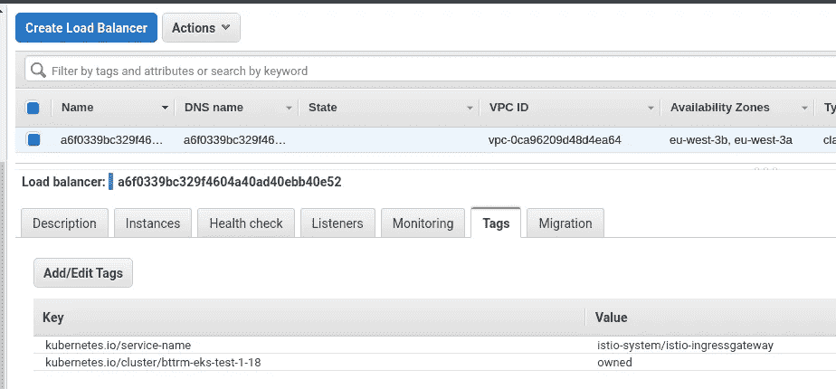

但是如果现在尝试访问它，我们将得到一个错误，因为它不知道将流量路由到哪里:

```
$ curl a6f***037.eu-west-3.elb.amazonaws.com
curl: (52) Empty reply from server
```

要配置它，需要添加一个 Istio 网关。

## 门

[网关](https://istio.io/latest/docs/reference/config/networking/gateway/)描述 [Istio 入口网关](https://istio.io/latest/docs/tasks/traffic-management/ingress/ingress-control/)配置——使用哪些端口和接受哪些流量。此外，在这里您可以执行 SSL 终止(但是在本例中，这是由 AWS 负载平衡器完成的)。

向我们的`test-istio.yaml`添加新资源——网关:

```
---
apiVersion: networking.istio.io/v1alpha3
kind: Gateway
metadata:
  name: test-gateway
  namespace: test-namespace
spec:
  selector:
    istio: ingressgateway
  servers:
  - port:
      number: 80
      name: http
      protocol: HTTP
    hosts:
    - "*"
```

在`spec.selector.istio`中，我们指定了 Istio 入口网关，该清单将应用于该网关。

请注意，我们的应用程序位于一个专用的名称空间中，因此 Gateway 和 VirtualService(见下文)需要创建在同一个名称空间中。

创建网关:

```
$ kubectl apply -f test-istio.yaml
namespace/test-namespace unchanged
deployment.apps/test-deployment unchanged
service/test-svc unchanged
gateway.networking.istio.io/test-gateway created
```

检查一下:

```
$ kubectl -n test-namespace get gateways
NAME AGE
test-gateway 17s
```

## 虚拟服务

接下来，我们将添加一个 [VirtualService](https://istio.io/latest/docs/reference/config/networking/virtual-service/) ，在这里我们将描述我们的“后端”,流量将被发送到这里。

作为“后端”,这里只是我们应用程序的一个普通 Kubernetes 服务——*test-SVC*:

```
$ kubectl -n test-namespace get svc
NAME TYPE CLUSTER-IP EXTERNAL-IP PORT(S) AGE
test-svc NodePort 172.20.195.107 <none> 80:31581/TCP 15h
```

描述与我们的应用程序和我们在上面创建的网关在同一个名称空间中的虚拟服务:

```
---
apiVersion: networking.istio.io/v1alpha3
kind: VirtualService
metadata:
  name: test-virtualservice
  namespace: test-namespace
spec:
  hosts:
  - "*"
  gateways:
  - test-gateway
  http:
  - match:
    - uri:
        prefix: /
    route:
    - destination:
        host: test-svc
        port:
          number: 80
```

创建它:

```
$ kubectl apply -f test-istio.yaml
namespace/test-namespace unchanged
deployment.apps/test-deployment unchanged
service/test-svc unchanged
gateway.networking.istio.io/test-gateway unchanged
virtualservice.networking.istio.io/test-virtualservice created
```

检查:

```
$ kubectl -n test-namespace get virtualservice
NAME GATEWAYS HOSTS AGE
test-virtualservice [test-gateway] [*] 42s
```

并再次检查 Istio 入口网关的负载平衡器的 URL:

```
$ curl a6f***037.eu-west-3.elb.amazonaws.com
<!DOCTYPE html>
<html>
<head>
<title>Welcome to nginx!</title>
…
```

然而，我们在应用程序的 Pod 中没有特使代理(又名 sidecar)的情况下工作:

```
$ kubectl -n tkk -n test-namespace get pod -o jsonpath={.items[*].spec.containers[*].name}
web
```

稍后我会检查为什么这是可行的。

# Kiali —交通观察

Istio 有很多插件: [Prometheus](https://prometheus.io/) 用于指标收集和警报， [Grafana](https://grafana.com/) 用于指标可视化， [Jaeger](https://www.jaegertracing.io/) 用于请求跟踪，以及 [Kiali](https://kiali.io/) 用于构建网络和服务地图。在[集成](https://istio.io/latest/docs/ops/integrations/)阅读更多信息。

安装所有插件:

```
$ kubectl apply -f samples/addons
```

并执行`istioctl dashboard kiali`——Kiali 将在默认浏览器中打开:

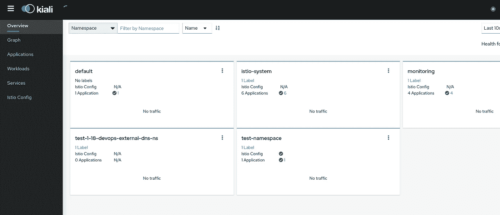

但是，如果导航到*应用程序*，我们会看到我们的应用程序标记为“*缺失边车*”:

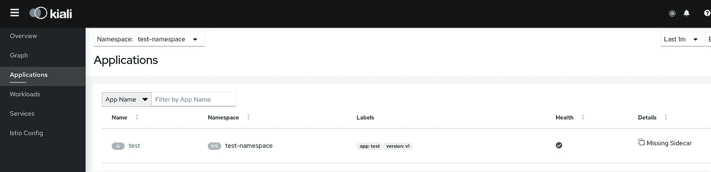

并且没有服务映射*图*:

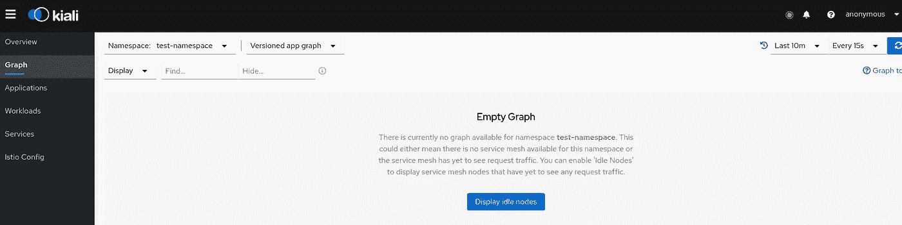

# 边车—特使代理

正如我们所记得的，尽管网络在工作，但是我们的 pod 没有包含 Envoy 实例的容器，因为此时 Istio 通过 iptables 规则将流量直接发送到包含 NGINX 的容器。在[从应用程序容器到边车代理](https://istio.io/latest/blog/2019/data-plane-setup/#traffic-flow-from-application-container-to-sidecar-proxy)的流量上阅读更多信息。

Iptalbes 规则在 pod 启动时配置了一个额外的 init container—`istio-init`——但此时它们是默认的，在我们的应用程序部署期间配置了`kube-proxy`。查看 [Kubernetes: Service、load balancing、kube-proxy 和 iptables](https://rtfm.co.ua/en/kubernetes-service-load-balancing-kube-proxy-and-iptables/) 的帖子，了解更多详细信息。

在接下来的文章中，我们将更深入地研究 Istio 网络，现在，让我们将 sidecars injection 添加到我们的名称空间的 pod 中，并比较之前和之后的 Iptables 规则。

## Istio 和 iptables

在我们添加边车和`istio-init`之前，请查看 Iptables 规则。

通过 SSH 连接到您的 Pod 所在的 Kubernetes WorkerNode 节点，并找到 NGINX Docker 容器:

```
[root@ip-10–22–35–66 ec2-user]# docker ps | grep nginx
22d64b132490 nginx “/docker-entrypoint.…” 3 minutes ago Up 3 minutes k8s_web_test-deployment-6864c5bf84-mk98r_test-namespace_8b88caf0–237a-4c94-ac71–186f8e701a7c_0
```

在此容器中查找进程的 PID:

```
[root@ip-10–22–35–66 ec2-user]# docker top k8s_web_test-deployment-6864c5bf84-mk98r_test-namespace_8b88caf0–237a-4c94-ac71–186f8e701a7c_0
UID PID PPID C STIME TTY TIME CMD
root 31548 31517 0 10:36 ? 00:00:00 nginx: master process nginx -g daemon off;
101 31591 31548 0 10:36 ? 00:00:00 nginx: worker process
```

使用`[nsenter](https://man7.org/linux/man-pages/man1/nsenter.1.html)`实用程序检查 PID 为 31548 的进程的 network-namespace 上的 Ipables 规则——目前没有什么异常——所有流量都直接发送到我们的容器:

```
[root@ip-10–22–35–66 ec2-user]# nsenter -t 31548 -n iptables -t nat -L
Chain PREROUTING (policy ACCEPT)
target prot opt source destination
Chain INPUT (policy ACCEPT)
target prot opt source destination
Chain OUTPUT (policy ACCEPT)
target prot opt source destination
Chain POSTROUTING (policy ACCEPT)
target prot opt source destination
```

## 运行边车

文档— [安装边车](https://istio.io/latest/docs/setup/additional-setup/sidecar-injection/)。

要将 Envoy 代理实例自动注入到*测试名称空间*名称空间中的 pod，请运行以下命令:

```
$ kubectl label namespace test-namespace istio-injection=enabled
namespace/test-namespace labeled
```

检查标签:

```
$ kubectl get namespace test-namespace — show-labels
NAME STATUS AGE LABELS
test-namespace Active 11m istio-injection=enabled
```

但是 sidecars 将只为这个名称空间中的新 pod 添加。

我们可以通过使用`[kube-inject](https://istio.io/latest/docs/reference/commands/istioctl/#istioctl-kube-inject)`手动添加它们，或者只是通过重新创建 pod:

```
$ kubectl -n test-namespace scale deployment test-deployment — replicas=0
deployment.apps/test-deployment scaled
kubectl -n test-namespace scale deployment test-deployment — replicas=1
deployment.apps/test-deployment scaled
```

再次检查容器中的容器:

```
$ kubectl -n test-namespace get pod -o jsonpath={.items[*].spec.containers[*].name}
web istio-proxy
```

现在我们可以看到`istio-proxy`集装箱——这是用特使倒边车的集装箱。

此外，检查 Pod 的`initContainers`:

```
$ kubectl -n test-namespace get pod -o jsonpath={.items[*].spec.initContainers[*].name}
istio-init
```

再次检查 Iptables 规则——找到容器及其 PID，并检查规则:

```
[root@ip-10–22–35–66 ec2-user]# nsenter -t 4194 -n iptables -t nat -LChain PREROUTING (policy ACCEPT)
target prot opt source destination
ISTIO_INBOUND tcp — anywhere anywhereChain INPUT (policy ACCEPT)
target prot opt source destinationChain OUTPUT (policy ACCEPT)
target prot opt source destination
ISTIO_OUTPUT tcp — anywhere anywhereChain POSTROUTING (policy ACCEPT)
target prot opt source destinationChain ISTIO_INBOUND (1 references)
target prot opt source destination
RETURN tcp — anywhere anywhere tcp dpt:15008
RETURN tcp — anywhere anywhere tcp dpt:ssh
RETURN tcp — anywhere anywhere tcp dpt:15090
RETURN tcp — anywhere anywhere tcp dpt:15021
RETURN tcp — anywhere anywhere tcp dpt:15020
ISTIO_IN_REDIRECT tcp — anywhere anywhereChain ISTIO_IN_REDIRECT (3 references)
target prot opt source destination
REDIRECT tcp — anywhere anywhere redir ports 15006Chain ISTIO_OUTPUT (1 references)
target prot opt source destination
RETURN all — ip-127–0–0–6.eu-west-3.compute.internal anywhere
ISTIO_IN_REDIRECT all — anywhere !localhost owner UID match 1337
RETURN all — anywhere anywhere ! owner UID match 1337
RETURN all — anywhere anywhere owner UID match 1337
ISTIO_IN_REDIRECT all — anywhere !localhost owner GID match 1337
RETURN all — anywhere anywhere ! owner GID match 1337
RETURN all — anywhere anywhere owner GID match 1337
RETURN all — anywhere localhost
ISTIO_REDIRECT all — anywhere anywhereChain ISTIO_REDIRECT (1 references)
target prot opt source destination
REDIRECT tcp — anywhere anywhere redir ports 15001
```

现在我们可以看到 Isio 创建的附加 Iptables 链和规则，它将流量发送到 Envoy sidecar 容器，然后发送到应用程序的容器，再返回。

回到 Kiali 仪表盘，查看地图:

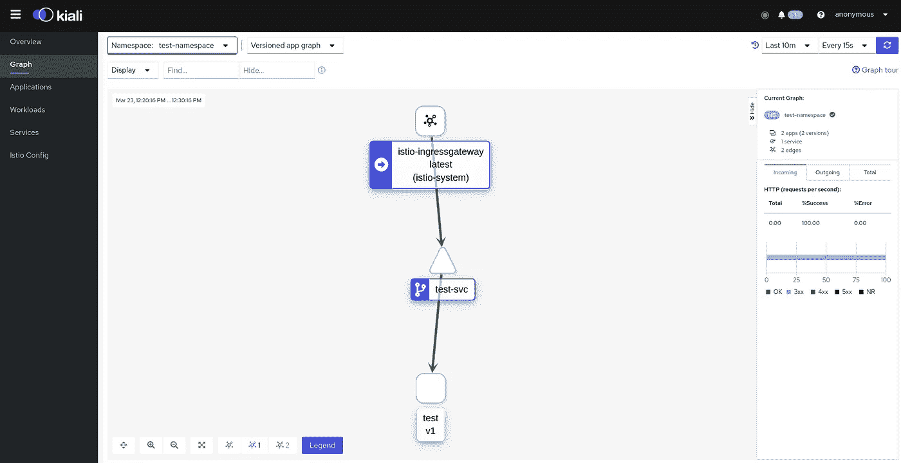

并请求跟踪:

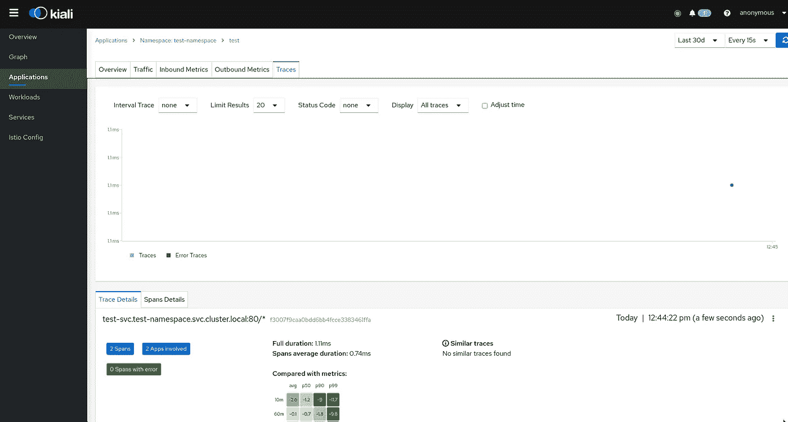

还可以通过 Jaeger 仪表盘查看轨迹，可通过`istioctl dashboard jaeger`进入:

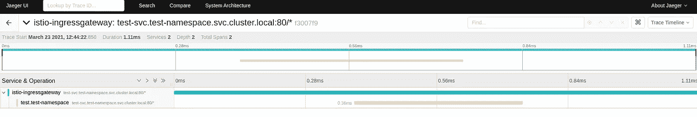

此外，使用`istioctl dashboard prometheus`您可以打开普罗米修斯并检查可用的指标，更多信息请参见[从普罗米修斯](https://istio.io/latest/docs/tasks/observability/metrics/querying-metrics/)查询指标:

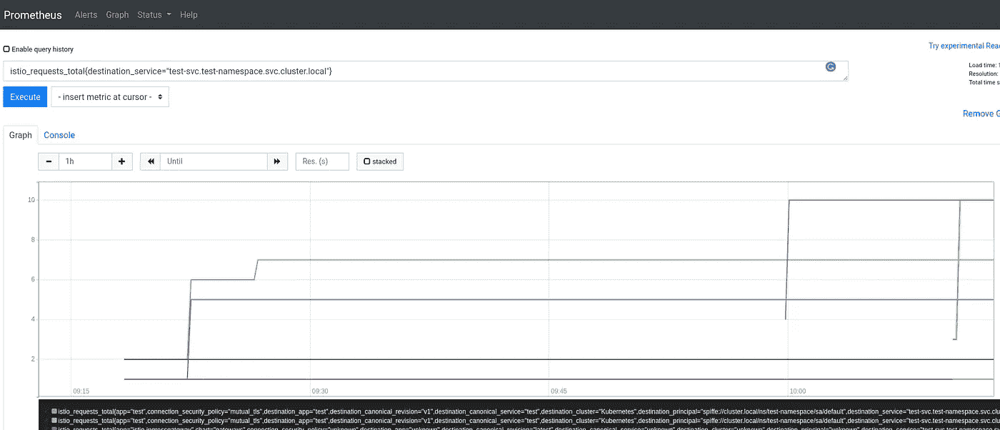

其实暂时就这些了。

稍后，我们将把 Istio 与 AWS Application LoadBalncer 集成，将 Isitio 实例部署和配置到 AWS Elastic Kubernetes 服务，并进行 Ansible 和 Helm、Gateway 和 VirtualServices 配置和调试。

# 有用的链接

*   [使用基于交互式浏览器的场景学习 Istio](https://www.katacoda.com/courses/istio)——关于 Katacoda 的基础课程
*   [Istio 服务网车间](https://www.istioworkshop.io/) — Istio 概述
*   [与 Istio](https://www.eksworkshop.com/advanced/310_servicemesh_with_istio/) 的服务网络—AWS EKS 公司的另一个车间
*   [Istio 如何在 Kubernetes 上幕后工作](https://betterprogramming.pub/how-istio-works-behind-the-scenes-on-kubernetes-aeb8003f2cb5) —架构、组件
*   [调试特使和 Istio](https://istio.io/latest/docs/ops/diagnostic-tools/proxy-cmd/)—用`istioctl`调试 Istio
*   [从 Istio](https://medium.com/ww-engineering/starting-with-istio-610421f5a815) 开始，另见 [Istio，Part II](https://medium.com/ww-engineering/istio-part-ii-e219a2e771bb) и [Istio，Part III，为什么要用？](https://medium.com/ww-engineering/istio-iii-why-use-it-2ba2500cceda)—Istio 中的概述、架构和网络
*   [Istio 网关南北流量管理(服务网格专家解答)](https://www.alibabacloud.com/blog/north-south-traffic-management-of-istio-gateways-with-answers-from-service-mesh-experts_596658)—Istio 网络
*   运行 Istio 的速成班——Istio，Envoy，iptables，Istio 中的组件，非常好的帖子
*   [如何让 Istio 与您的应用程序协同工作](https://www.stackrox.com/post/2019/11/how-to-make-istio-work-with-your-apps/) —故障排除和代理状态示例
*   [通过出站流量限制减少 Istio 代理资源消耗](https://banzaicloud.com/blog/istio-sidecar/)—Istio 和 sidecars 中的资源调整
*   [通过 Istio](https://www.infoq.com/presentations/life-packet-istio/) 的一个包的生活——在 Istio 看来是一个不错的网络概述，但我没有看视频
*   [详细讲解 Istio 中的 Sidecar 注入和透明流量劫持流程](https://jimmysong.io/en/blog/sidecar-injection-iptables-and-traffic-routing/) — sidecars、iptables 和 routing
*   [深入介绍 Istio Ingress](https://banzaicloud.com/blog/backyards-ingress/) — Ingress、网关和虚拟服务示例
*   [了解 Kubernetes 中的 Istio 入口网关](https://blog.jayway.com/2018/10/22/understanding-istio-ingress-gateway-in-kubernetes/) —同上
*   [Istio 网关](https://freecontent.manning.com/istio-gateway/) —同上
*   [开始使用 Istio](https://rinormaloku.com/getting-started-istio/) 和后续部分— [Istio 实践—入口网关](https://rinormaloku.com/istio-practice-gateways/)、 [Istio 实践—使用虚拟服务进行路由](https://rinormaloku.com/istio-practice-routing-virtualservices/)
*   [4 Istio Gateway:让流量进入您的集群](https://livebook.manning.com/book/istio-in-action/chapter-4/v-5/50) —同样是关于 Gateway 和 VirtualService

*最初发表于* [*RTFM: Linux，devo PSисистемноеадмииитиованиииованиде*T25*。*](https://rtfm.co.ua/en/istio-an-overview-and-running-service-mesh-in-kubernetes/)