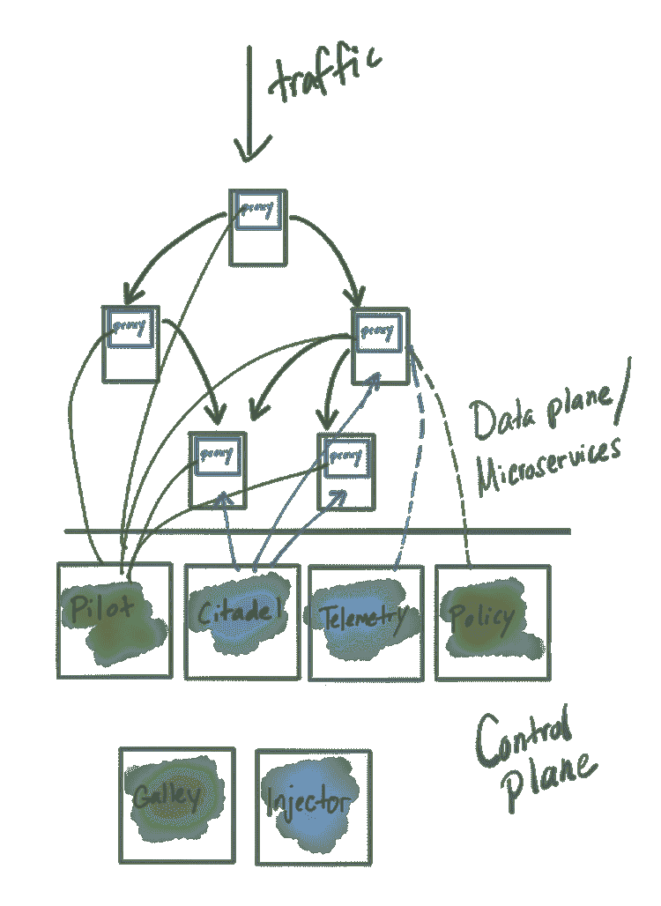
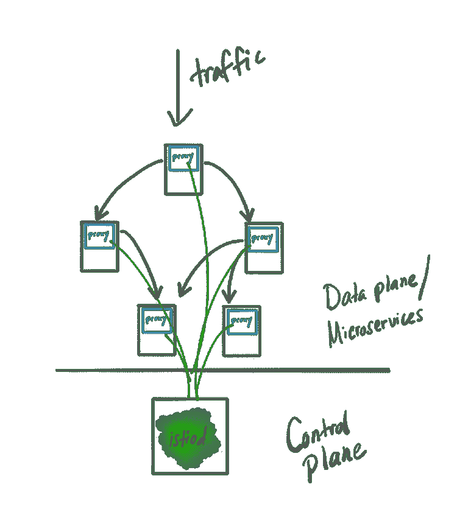

# Istio 作为何时不做微服务的例子

> 原文：<https://itnext.io/istio-as-an-example-of-when-not-to-do-microservices-50f2619a9e55?source=collection_archive---------2----------------------->

过去五年来，我一直致力于帮助组织实现云原生之旅。现代化和提高一个团队(以及最终一个组织)交付基于软件的技术的速度受到 it 人员、过程和最终技术决策的严重影响。当应用架构的顶点已经成为进行变更和“更快发展”的瓶颈(由于各种人员/流程/技术因素)时，微服务方法可能是合适的，[但它不是唯一的方法](https://blog.christianposta.com/microservices/when-not-to-do-microservices/)。

> 微服务不是“乌托邦式的应用架构”。

我过去曾写道，我如何不认为许多团队[能够完成](https://blog.christianposta.com/microservices/youre-not-going-to-do-microservices/)，[如何有让它工作的“困难部分”](https://blog.christianposta.com/microservices/the-hardest-part-about-microservices-data/)，甚至提到一些可能[对你的长期努力有益的技术](https://blog.christianposta.com/microservices/the-hardest-part-of-microservices-calling-your-services/)。FWIW 我甚至[写了一本关于这个话题的书](https://www.oreilly.com/library/view/microservices-for-java/9781492042228/)。

[远离微服务](https://blog.christianposta.com/microservices/when-not-to-do-microservices/)可能是最好的起点，尽管现在许多组织都已经过了这个阶段。

# 你已经走上了微服务的道路

如果你真的走上了微服务的道路，当它不起作用时，对你自己和组织要诚实。纠正路线可能是你产品成功的正确步骤。

# 当它不起作用时要诚实

尽管初衷是好的，但一旦你开始使用微服务，回到整体可能是正确的选择，即使是出于正确的原因。如果你的假设或你决策的背景发生了变化，回到一块巨石上去“没关系”。

在为微服务通信构建[服务网格](https://istio.io/docs/concepts/what-is-istio/#what-is-a-service-mesh)的 [Istio 社区](https://istio.io/)中，控制平面的实现将[逐渐从微服务方法转变为更加单一的方法](https://docs.google.com/document/d/1v8BxI07u-mby5f5rCruwF7odSXgb9G8-C9W5hQtSIAg/edit#)。[谷歌 API 基础设施的首席工程师和架构师 Louis Ryan](https://twitter.com/louiscryan?lang=en) 在 KubeConNA 2019 的 Istio meetup 上做了一次演讲，详细介绍了动机以及[在设计文档中概述了案例](https://docs.google.com/document/d/1v8BxI07u-mby5f5rCruwF7odSXgb9G8-C9W5hQtSIAg/edit#)。从 Istio 1.5 开始(预计在 2020 年 2 月中旬)，我们应该开始看到`istiod`方法的效果，以前分配给各种微服务部署的功能将合并到一个守护进程中。

Istio 用于帮助解决微服务/云架构带来的困难的应用联网挑战，那么为什么 Istio 本身要脱离微服务架构呢？最直接的回答是:

> 事实证明，微服务方法的复杂性无法实现其预期的价值或目标。相反，它与这些目标背道而驰。

对于 Istio 项目来说，看起来单一的方法更有助于实现这些目标。让我们仔细看看。

# Istio 实现为微服务

Istio 是一个开源的[服务网格](https://istio.io/docs/concepts/what-is-istio/#what-is-a-service-mesh)，其架构类似于其他服务网格实现，具有控制平面和数据平面。数据平面由与每个应用程序实例共存的代理组成，位于请求路径中。控制平面位于请求路径之外，用于管理和控制数据平面的行为。

从历史上看，Istio 的控制面板是作为可单独部署的服务来实现的，它具有以下功能:

*   `Pilot` -核心数据平面配置(xDS)服务器
*   `Galley` -配置查看、验证、转发
*   `Injector` -负责自动注入数据平面并设置引导
*   `Citadel` -证书签名、秘密生成、与 CAs 集成等
*   `Telemetry` -一个“混合器”组件，负责将遥测数据聚合和联合到各个后端
*   `Policy` -负责执行策略的请求路径“混合器”组件

这些服务将由一组运营商定义的配置驱动，并协调最终服务和指导数据平面。

# 微服务优势

微服务可以通过减少摩擦来使组织更快地改变系统。有了微服务架构，每个服务都可能独立运行(每个服务都有自己的团队),并有自己独立于其他服务的发布节奏/生命周期。这将为开发人员和操作人员提供平行的轨道，使他们能够更快地进行工作，而无需锁定/同步/协调所做的更改，这会导致部署和功能更改变慢。

服务可能被进一步分解的另一个原因是它的使用模式和伸缩属性。举个简单的例子，具有大量读取和写入的服务可能会受益于将读取和写入分开，因为读取可能更占用内存(可能需要更多缓存空间来使读取超快)，而写入可能更占用存储或网络。您可以在允许独立扩展(更多内存)的机器/配额上优化服务的读取部分，然后在具有 SSD 或优化的 EBS/SAN 等的其他机器上优化服务的写入部分。

您可能会将应用拆分为服务的其他一些原因:

*   安全问题
*   领域分组
*   不同的语言优化
*   服务的关键程度

采用微服务架构的首要权衡是复杂性。当你从一个东西(整体)变成一堆相互通信的小东西(为了优化某个特定的关注点)时，你会显著增加架构的复杂性以及运行这些东西所必需的基础设施的复杂性。

在你意识到好处的范围内，这可能是一个必要的权衡。如果没有，你最好评估一下你的假设，然后修正方向。这就是 Istio 现在的情况。

# 校正过程

首先要了解的是谁在开发和操作您的服务架构。在 Istio 社区中，从[不同的社区工作组](https://github.com/istio/community/blob/master/WORKING-GROUPS.md)可以看出，项目中有不同的组成部分。另一方面，下载和操作 Istio 装置的角色没有被解构。事实上，到目前为止的观察是，单个组(甚至单个人)操作 Istio 控制平面。在某些方面，如果作为一个更大的 SaaS 运行，作为一组微服务的 Istio 控制平面会工作得很好，但在目前的采用中，情况似乎并非如此。

第二件要理解的事情是发布是如何完成的？服务可以独立发布吗？Istio 的答案是“理论上是”,但实际情况似乎并非如此。当发布新版本的 Istio 时，您需要升级/部署所有控制面板组件。

最后，在 Istio 案例中，您可能会问“对于不同的组件，难道没有其他不同的扩展变量和安全问题吗？”诚实的回答会意识到其实没有。直接取自`istiod`的 Istio 设计文档:

> 然而，对于今天的 Istio 来说，大多数组件都不是这样——控制面板的成本由一个单一的特性决定(服务于 XDS)。相比之下，每隔一个控制平面特征都有边际成本，因此分离没有什么价值。

出于安全考虑，所有控制平面服务都具有相同级别的权限:

> 今天的情况不同了，变异的网络钩子、特使引导和飞行员所行使的权力在许多方面与城堡的权力相似，因此对它们的利用具有几乎相等的伤害

正如 Istiod 设计文档中的潜台词所述*“复杂性是万恶之源，或者说:我如何学会停止担忧并热爱巨石”*。

`istiod`是一个整体的化身，它支持以前版本的所有功能，同时显著降低了复杂性。请注意，组成先前控制平面的服务仍然作为项目中的子模块来实现(包括边界和契约等)，但是操作体验得到了改善。运营商现在需要担心的是运行和升级单个二进制文件，而不是它们的集合。

对于 Istio 来说，采用单片控制平面可以显著降低复杂性，但这从未完全奏效:

*   只需一个可部署的服务，安装/升级变得更加容易
*   降低了配置的复杂性，因为不再需要配置来编排服务
*   更容易调试问题(在一个地方而不是所有地方查看)
*   提高效率/减少传输开销、共享缓存等

详见 [Istiod 设计文件](https://docs.google.com/document/d/1v8BxI07u-mby5f5rCruwF7odSXgb9G8-C9W5hQtSIAg/edit#)。

另外，顺便提一下:[你可以看看我做的这个](https://www.youtube.com/watch?v=QD115XiBXwY) `istiod`方法的演示，它应该会出现在 Istio 1.5 中。请注意，它是在 Istio 的超级 alpha 版本上演示的，所以不会像它一样完美:)

# 结论

我很高兴看到 Istio 社区继续改善其可用性和可操作性特征。对这个项目来说，采用 Istio 控制平面的整体部署是非常有意义的。这对你的项目有意义吗？如果是这样的话，你会考虑吗？您是否在衡量微服务架构(及相关基础设施)的价值与复杂性比率，以便能够确定改变方法的时间？

如果你有什么想分享的想法，请联系我。一个好的跟进帖子应该是决策表或关键指标，一旦你决定走微服务等道路，你应该在什么时候改变路线。艾尔。如果你想对此有所贡献，请打电话给我。