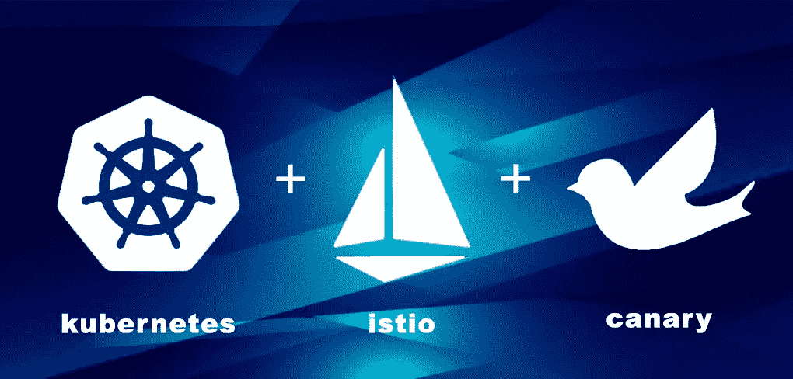
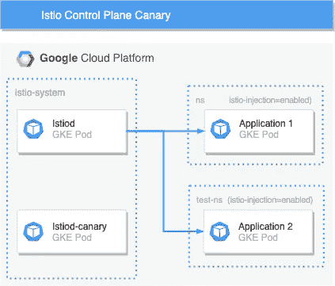
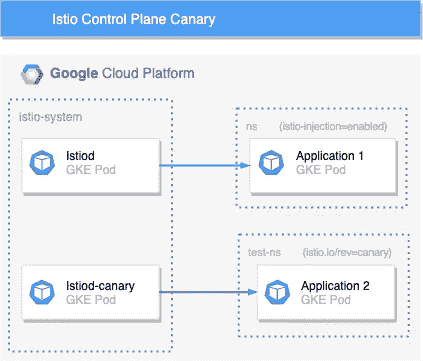
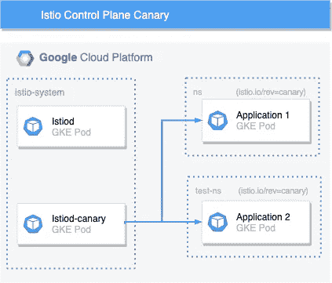

# 使用金丝雀部署升级 Istio 控制平面

> 原文：<https://itnext.io/istio-control-plane-upgrades-using-canary-deployments-1dca34df38b6?source=collection_archive---------4----------------------->

*合著:*[](https://www.linkedin.com/in/omar-steitieh/)

**

# *概观*

*Istio 版本 1.5.x 中包含了支持控制平面 canary 部署的新功能。本博客旨在演示此功能，以下步骤假设您已在集群中安装并运行版本 1.6 以上。*

*部署策略介绍；蓝绿色、淡黄色和更多颜色可以在这里找到*

*Istio 服务网格有两个主要组件:控制平面和数据平面*

## *制导机*

*控制平面负责服务发现、路由配置、提供服务对服务以及终端用户身份验证。通过维护 CA 和生成证书，它还允许数据平面中的安全 mTLS 通信。从 1.5.x 开始，控制平面组件被整合到一个名为 istiod 的服务中。*

## *数据平面*

*数据平面由 Envoy 代理组成，这些代理作为侧柜部署到集群中每个支持 Istio 的 pod。它们拦截来自 pod 中主容器的任何传入或传出请求有两个目的；首先，它们提供加密，控制 pod 之间的通信，其次，它们提供所有网络流量的遥测。*

*我们将部署第二个 Istio 控制平面，用于管理名称空间中的金丝雀流量。*

# *入门指南*

## *制导机*

*您当前正在运行一个现有的 Istio 控制平面。要部署金丝雀控制平面，您必须设置`revision`字段。这可以使用 istioctl CLI 工具安装方法或通过使用 istio-operator 来完成。*

**组织示例:**

```
*istioctl install --set revision=canary*
```

*当使用 istioctl 安装 Istio 时，除非另外指定，否则将自动应用默认概要文件，要使用自定义概要文件，我们的首选方法是使用 IstioOperator 资源进行部署。可在此处[查看预先配置的配置文件。](https://istio.io/latest/docs/setup/additional-setup/config-profiles/)*

**istio 运算符示例:**

```
*apiVersion: install.istio.io/v1alpha1
kind: [IstioOperator](https://istio.io/latest/docs/reference/config/istio.operator.v1alpha1/)
metadata:
  name: istio-canary
  namespace: istio-system
spec:
  ...  
  revision: canary
  ...*
```

**注意:IstioOperator 可用的选项可以在* [*这里*](https://istio.io/latest/docs/reference/config/istio.operator.v1alpha1/) 查看*

*一旦应用，将创建第二个控制平面。现有版本和 canary 版本都将在集群中运行。*

```
*NAME                           READY   STATUS    RESTARTS  AGE
istiod-7f7d5496cf-ltff2         1/1    Running   0        5m45s
istiod-canary-7f7d5496cf-ltff2  1/1    Running   0          15s*
```

*当 canary istiod pod 运行时，值得一提的是,`ingress`和`egress`网关 pod 都将升级到新版本，旧的 pod 将被终止——这令人惊讶，因为现在群集中的所有数据平面代理都不具备版本奇偶校验。因此，**强烈建议**检查版本之间的变更日志！*

## *数据平面*

*创建金丝雀控制平面对数据平面没有影响。要将你的边车`istio-proxy`升级到新版控制面板，请采取以下步骤。*

**

*移除现有的名称空间标签`istio-injection`并添加新标签`istio.io/rev=canary`。*

*这可以通过以下命令完成:*

```
*kubectl label namespace <namespace> istio-injection- istio.io/rev=canary*
```

**注意:必须删除* `*istio-injection*` *标签，因为为了向后兼容，它优先于* `*istio.io/rev*` *标签。**

*更新名称空间标签后，您需要重启 pod 以触发重新进样:*

```
*kubectl rollout restart deployment -n <namespace>*
```

*一旦吊舱被重新创建，它们将被配置为指向新的 canary Istio 控制平面。*

**

*通过对其中一个重新启动的 pod 运行以下命令，确认 pod 现在正在使用 Istio 控制面板的 canary 版本:*

```
*$ istioctl proxy-config endpoints <pod>.<namespace> --cluster xds-grpc -ojson | grep hostname*
```

*预期产出:*

*`*“hostname”: “istiod-canary.istio-system.svc”*`*

**

*在成功测试新的控制面板版本后，继续使用相同的方法将升级推广到其余的集群工作负载。*

# *摘要*

*选择使用 Istio canary 发行版时需要考虑的要点:*

*   ***推广 canary 版本** —我们建议使用该版本作为修订版。这使得每个命名空间都具有所使用的控制平面版本的显式标签。*
*   ***潜在停机时间** —必须考虑`ingress`和`egress`网关。`istio-proxy` sidecars 之间可能的版本差异可能会引入影响代理流量的重大变化，并需要重新部署之前的控制平面。*
*   ***采用前验证修订版** —如果出现问题，重新启动名称空间中的所有 pod 可能会造成很大的影响。考虑扩展部署，以测试与新控制面板版本通信的新 pod。*

**注意:本文中的所有内容都是使用 Istio 1.6.5 在我们的 Raspberry Pi Kubernetes 集群上测试的，该集群是使用*[*raspberretes*](https://github.com/raspbernetes)*项目构建的。**

*你觉得这有用吗？发表评论或给我们点赞！*