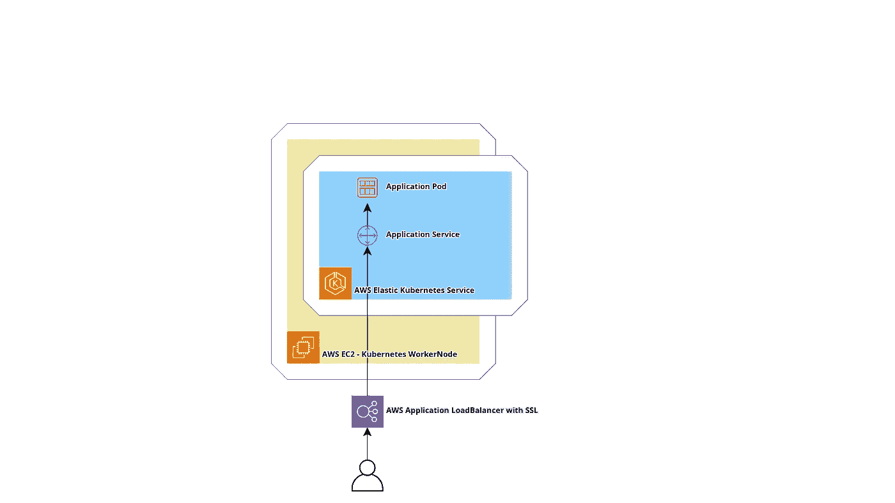
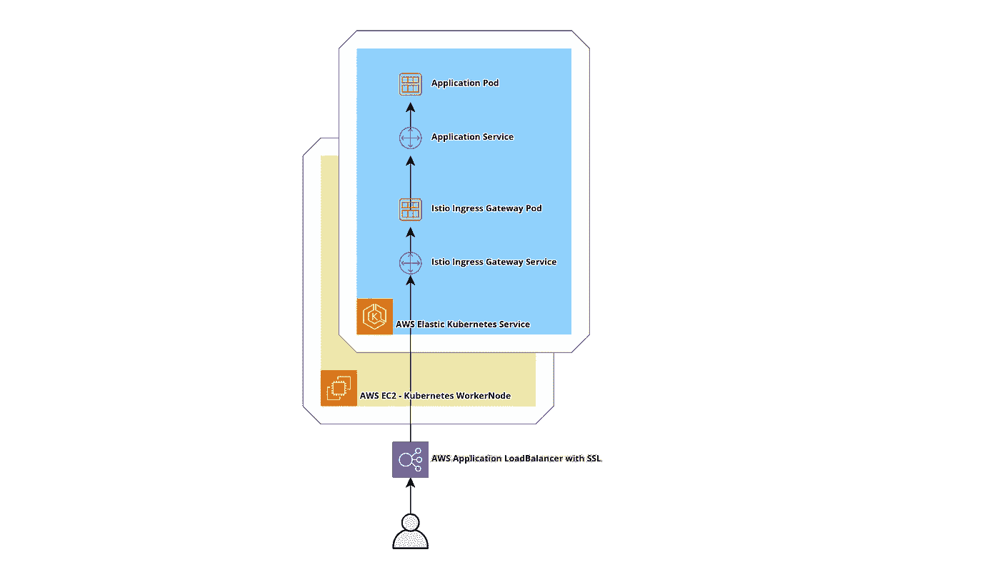
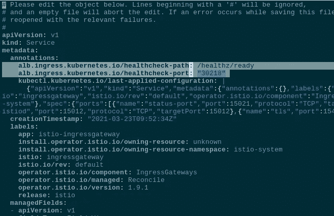
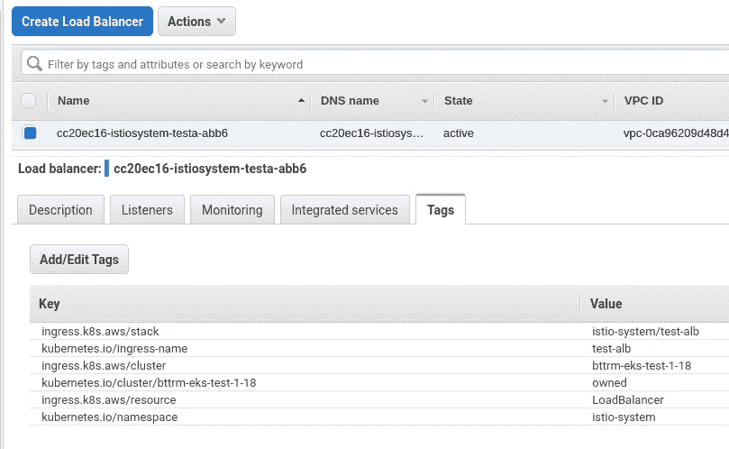
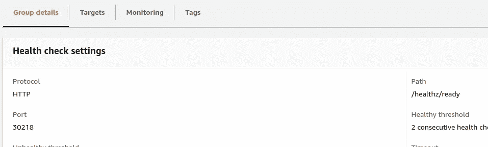
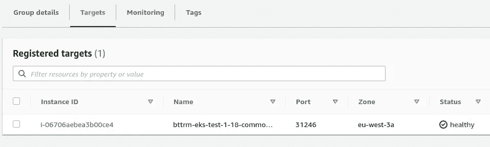
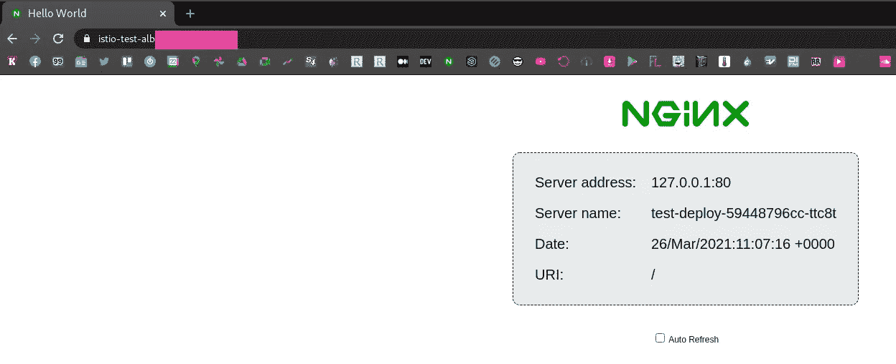

# Istio:外部 AWS 应用负载平衡器和 Istio 入口网关

> 原文：<https://itnext.io/istio-external-aws-application-loadbalancer-and-istio-ingress-gateway-fce3bfd3202f?source=collection_archive---------0----------------------->


在之前的帖子[Istio:Kubernetes 中的概述和运行服务网格](https://rtfm.co.ua/en/istio-an-overview-and-running-service-mesh-in-kubernetes/)中，我们启动了 Istio AWS Elastic Kubernetes 服务，并对其主要组件进行了概述。

下一个任务是在 Istio 入口网关之前添加一个 AWS **应用**负载平衡器(ALB ),因为 Istio 网关服务及其默认类型负载平衡器创建了 nad AWS **Classic** 负载平衡器，其中我们只能附加一个来自[亚马逊证书管理器](https://aws.amazon.com/ru/certificate-manager/)的 SSL 证书。

# 内容

*   [更新 Istio 入口网关](https://rtfm.co.ua/en/istio-external-aws-application-loadbalancer-and-istio-ingress-gateway/#Updating_Istio_Ingress_Gateway)
*   [Istio 入口网关和 AWS 应用负载平衡器运行状况检查](https://rtfm.co.ua/en/istio-external-aws-application-loadbalancer-and-istio-ingress-gateway/#Istio_Ingress_Gateway_and_AWS_Application_LoadBalancer_health_checks)
*   [创建入口及其 AWS 应用负载平衡器](https://rtfm.co.ua/en/istio-external-aws-application-loadbalancer-and-istio-ingress-gateway/#Create_an_Ingress_and_its_AWS_Application_LoadBalancer)
*   [测试应用](https://rtfm.co.ua/en/istio-external-aws-application-loadbalancer-and-istio-ingress-gateway/#A_testing_application)
*   [Istio 网关配置](https://rtfm.co.ua/en/istio-external-aws-application-loadbalancer-and-istio-ingress-gateway/#Istio_Gateway_configuration)
*   [Istio VirtualService 配置](https://rtfm.co.ua/en/istio-external-aws-application-loadbalancer-and-istio-ingress-gateway/#Istio_VirtualService_configuration)

# 任务

目前，我们的应用程序中的流量采用以下流程:

*   在应用程序的舵图中，我们定义了入口和服务，该入口创建了带有 SSL 的 AWS 应用程序负载平衡器
*   来自 ALB 的一个包被发送到应用程序的服务
*   通过此服务，它将与应用程序一起发送到 Pod



现在，让我们在这里添加 Istio。

接下来的想法是:

*   安装 Istion，它将创建 Istio 入口网关—它的服务和 Pod
*   在应用程序的导航图中，将有入口、服务和带有 Istio 入口网关虚拟服务的网关
*   应用程序的进入将创建一个 ALB，在此完成 SSL 终止，集群内部的流量将通过 HTTP 发送
*   来自 ALB 的数据包将被发送到 Istio 入口网关的 Pod
*   从 Istio 入口网关，遵循应用程序的网关和虚拟服务中定义的规则，它将被发送到应用程序的服务
*   从这个服务到应用程序的 Pod



为此，我们需要:

1.  添加入口以使用 [ALB 入口控制器](https://rtfm.co.ua/en/aws-elastic-kubernetes-service-running-alb-ingress-controller/)创建 ALB
2.  更新 Istio 入口网关的服务，而不是负载平衡器类型将设置节点端口，因此 AWS ALB 入口控制器可以创建与 ALB 一起使用的目标组
3.  使用通用 Kubernetes 服务部署测试应用程序
4.  对于测试应用程序，需要创建一个网关和虚拟服务来配置 Istio 入口网关的特使，以将流量路由到应用程序的服务

我们走吧。

# 更新 Istio 入口网关

我们在上一章中已经安装了 Istio，因此现在我们有了一个 Istio 入口网关，它具有负载平衡器类型的服务:

```
$ kubectl -n istio-system get svc istio-ingressgateway
NAME TYPE CLUSTER-IP EXTERNAL-IP PORT(S) AGE
istio-ingressgateway LoadBalancer 172.20.112.213 a6f***599.eu-west-3.elb.amazonaws.com 15021:30218/TCP,80:31246/TCP,443:30486/TCP,15012:32445/TCP,15443:30154/TCP 25h
```

需要更改它并将服务类型设置为节点端口，这可以通过`istioctl`和`--set`来完成:

```
$ istioctl install --set profile=default --set values.gateways.istio-ingressgateway.type=NodePort -y
✔ Istio core installed
✔ Istiod installed
✔ Ingress gateways installed
✔ Installation complete
```

检查服务:

```
$ kubectl -n istio-system get svc istio-ingressgateway
NAME TYPE CLUSTER-IP EXTERNAL-IP PORT(S) AGE
istio-ingressgateway NodePort 172.20.112.213 <none> 15021:30218/TCP,80:31246/TCP,443:30486/TCP,15012:32445/TCP,15443:30154/TCP 25h
```

NodePort，很好——都完成了。

## Istio 入口网关和 AWS 应用负载平衡器运行状况检查

但这里有一个问题:我们如何在 AWS 应用程序负载平衡器上执行健康检查，因为 Istio Ingress Gateway 使用一组 TCP 端口——80 用于传入流量，12021 用于其状态检查？

如果我们将在入口中设置`alb.ingress.kubernetes.io/healthcheck-port`注释，那么 ALB 入口控制器将会忽略它，而不会在日志中显示任何消息。将创建入口，但不会创建相应的 AWS 负载平衡器。

在 Github 上搜索了一个解决方案— [如果在路线上使用多个 pod，健康检查不起作用](https://github.com/kubernetes-sigs/aws-load-balancer-controller/issues/93):将健康检查相关的注释移动到 Istio 网关的服务。

所以，编辑`istio-ingressgateway`服务:

```
$ kubectl -n istio-system edit svc istio-ingressgateway
```

在它的`spec.ports`中找到`status-port`和它的`nodePort`:

```
...
spec:
  clusterIP: 172.20.112.213
  externalTrafficPolicy: Cluster
  ports:
  - name: status-port
    nodePort: 30218
    port: 15021
    protocol: TCP
    targetPort: 15021
...
```

要配置`alb.ingress.kubernetes.io/alb.ingress.kubernetes.io/healthcheck-path`，从部署中获取一个`readinessProbe`，这将创建带有`istio-ingressgateway`的 pod:

```
$ kubectl -n istio-system get deploy istio-ingressgateway -o yaml
…
readinessProbe:
failureThreshold: 30
httpGet:
path: /healthz/ready
…
```

为`istio-ingressgateway`服务设置注释:在`healthchek-port`中设置来自`status-port`的`nodePort`，在`healthcheck-path`中设置来自`readinessProbe`的路径:

```
...
    alb.ingress.kubernetes.io/healthcheck-path: /healthz/ready
    alb.ingress.kubernetes.io/healthcheck-port: "30218"
...
```



现在，在创建入口的过程中，我们的 ALB 入口控制器将找到入口清单的`backend.serviceName`中指定的服务，读取其注释，并将应用到附加到 ALB 的 TargetGroup。

当使用 Helm 部署时，可以通过`values.gateways.istio-ingressgateway.serviceAnnotations`设置这些注释。

# 创建入口及其 AWS 应用程序负载平衡器

接下来，添加一个入口——这将是我们使用 SSL 终端的应用程序的主要负载平衡器。

在这里，从 AWS 证书管理器设置 SSL 证书的 ARN。必须在`istio-system`名称空间中创建入口，因为它需要访问`istio-ingressgateway`服务:

```
---
apiVersion: extensions/v1beta1
kind: Ingress
metadata:
  name: test-alb
  namespace: istio-system
  annotations:
    # create AWS Application LoadBalancer
    kubernetes.io/ingress.class: alb
    # external type
    alb.ingress.kubernetes.io/scheme: internet-facing
    # AWS Certificate Manager certificate's ARN
    alb.ingress.kubernetes.io/certificate-arn: "arn:aws:acm:eu-west-3:***:certificate/fcaa9fd2-1b55-48d7-92f2-e829f7bafafd"
    # open ports 80 and 443 
    alb.ingress.kubernetes.io/listen-ports: '[{"HTTP": 80}, {"HTTPS":443}]'
    # redirect all HTTP to HTTPS
    alb.ingress.kubernetes.io/actions.ssl-redirect: '{"Type": "redirect", "RedirectConfig": { "Protocol": "HTTPS", "Port": "443", "StatusCode": "HTTP_301"}}'
    # ExternalDNS settings: [https://rtfm.co.ua/en/kubernetes-update-aws-route53-dns-from-an-ingress/](https://rtfm.co.ua/en/kubernetes-update-aws-route53-dns-from-an-ingress/)
    external-dns.alpha.kubernetes.io/hostname: "istio-test-alb.example.com"
spec:
  rules:
  - http:
      paths:
        - path: /*
          backend:
            serviceName: ssl-redirect
            servicePort: use-annotation
        - path: /*
          backend:
            serviceName: istio-ingressgateway
            servicePort: 80
```

部署它:

```
$ kubectl apply -f test-ingress.yaml
ingress.extensions/test-alb created
```

检查`istio-system`名称空间中的入口:

```
$ kubectl -n istio-system get ingress
NAME CLASS HOSTS ADDRESS PORTS AGE
test-alb <none> * cc2***514.eu-west-3.elb.amazonaws.com 80 2m49s
```

我们的 AWS ALB 已创建:



在目标组的*健康检查*中，我们可以看到我们的 TCP 端口和 URI:



目标是健康的:



检查从入口的`external-dns.alpha.kubernetes.io/hostname`注释创建的域，参见[Kubernetes:update AWS route 53 DNS from a Ingress](https://rtfm.co.ua/en/kubernetes-update-aws-route53-dns-from-an-ingress/)帖子了解更多详细信息:

```
$ curl -I [https://istio-test-alb.example.com](https://istio-test-alb.example.com)
HTTP/2 502
server: awselb/2.0
```

炉排！它正在工作，我们只是没有在网关后面运行应用程序，所以它甚至没有 TCP 端口 80 监听器:

```
$ istioctl proxy-config listeners -n istio-system istio-ingressgateway-d45fb4b48-jsz9z
ADDRESS PORT MATCH DESTINATION
0.0.0.0 15021 ALL Inline Route: /healthz/ready*
0.0.0.0 15090 ALL Inline Route: /stats/prometheus*
```

但是 15021 已经开通，健康检查正在进行。

# 测试应用程序

描述一个常见的应用程序——一个名称空间、两个带有`[nginxdemos/hello](https://hub.docker.com/r/nginxdemos/hello/)`图像的窗格和一个服务:

```
---         
apiVersion: v1
kind: Namespace
metadata:
  name: test-ns
  labels:
    istio-injection:
      enabled
---
apiVersion: apps/v1
kind: Deployment
metadata:
  name: test-deploy
  namespace: test-ns
  labels:
    app: test-app
    version: v1
spec: 
  replicas: 2
  selector:
    matchLabels:
      app: test-app
  template:
    metadata:
      labels:
        app: test-app
        version: v1
    spec: 
      containers:
      - name: web
        image: nginxdemos/hello
        ports:
        - containerPort: 80
        resources:
          requests:
            cpu: 100m
            memory: 100Mi
        readinessProbe:
          httpGet:
            path: /
            port: 80
---
apiVersion: v1
kind: Service
metadata:
  name: test-svc
  namespace: test-ns
spec:   
  selector:
    app: test-app
  ports:
    - name: http
      protocol: TCP
      port: 80
      targetPort: 80
```

部署它:

```
$ kubectl apply -f test-ingress.yaml
ingress.extensions/test-alb configured
namespace/test-ns created
deployment.apps/test-deploy created
service/test-svc created
```

但是我们的 ALB 仍然给出了 502 错误，因为我们还没有配置 Istio 入口网关。

## Istio 网关配置

描述网关和虚拟服务。

在网关中设置一个监听端口 80，并配置一个 Istio 入口——即`ingressgateway`。在`spec.servers.hosts`字段中设置我们的测试域:

```
---
apiVersion: networking.istio.io/v1alpha3
kind: Gateway
metadata:
  name: test-gateway
  namespace: test-ns
spec: 
  selector:
    istio: ingressgateway
  servers:
  - port:
      number: 80
      name: http
      protocol: HTTP
    hosts:
    - "istio-test-alb.example.com"
```

部署:

```
$ kubectl apply -f test-ingress.yaml
ingress.extensions/test-alb configured
namespace/test-ns unchanged
deployment.apps/test-deploy configured
service/test-svc unchanged
gateway.networking.istio.io/test-gateway created
```

再次检查 Istio 入口网关的`listeners`:

```
$ istioctl proxy-config listeners -n istio-system istio-ingressgateway-d45fb4b48-jsz9z
ADDRESS PORT MATCH DESTINATION
0.0.0.0 8080 ALL Route: http.80
0.0.0.0 15021 ALL Inline Route: /healthz/ready*
0.0.0.0 15090 ALL Inline Route: /stats/prometheus*
```

TCP 端口 80 现在在这里，但是这里的流量没有被路由到任何地方:

```
$ istioctl proxy-config routes -n istio-system istio-ingressgateway-d45fb4b48-jsz9z
NOTE: This output only contains routes loaded via RDS.
NAME DOMAINS MATCH VIRTUAL SERVICE
http.80 * /* 404
* /healthz/ready*
* /stats/prometheus*
```

如果现在访问我们的域，将获得 404，但这次不是从`awselb/2.0`而是从`istio-envoy`获得，因为请求正在到达入口网关 Pod:

```
$ curl -I [https://istio-test-alb.example.com](https://istio-test-alb.example.com)
HTTP/2 404
date: Fri, 26 Mar 2021 11:02:57 GMT
server: istio-envoy
```

## Istio 虚拟服务配置

在 VirtualService 中，指定要应用路由的网关，以及路由本身——将所有流量发送到我们应用程序的服务:

```
---
apiVersion: networking.istio.io/v1alpha3
kind: VirtualService
metadata:
  name: test-virtualservice
  namespace: test-ns
spec: 
  hosts:
  - "istio-test-alb.example.com"
  gateways:
  - test-gateway
  http:
  - match: 
    - uri:   
        prefix: /
    route:
    - destination:
        host: test-svc
        port:
          number: 80
```

部署并再次检查 Istio 入口网关路由:

```
$ istioctl proxy-config routes -n istio-system istio-ingressgateway-d45fb4b48-jsz9z
NOTE: This output only contains routes loaded via RDS.
NAME DOMAINS MATCH VIRTUAL SERVICE
http.80 istio-test-alb.example.com /* test-virtualservice.test-ns
```

现在我们可以看到，有一条通向我们的测试应用程序的路径，然后通向测试舱:

```
$ curl -I [https://istio-test-alb.example.com](https://istio-test-alb.example.com)
HTTP/2 200
date: Fri, 26 Mar 2021 11:06:52 GMT
content-type: text/html
server: istio-envoy
```



完成了。

*最初发布于* [*RTFM: Linux、DevOps、系统管理*](https://rtfm.co.ua/en/istio-external-aws-application-loadbalancer-and-istio-ingress-gateway/) *。*