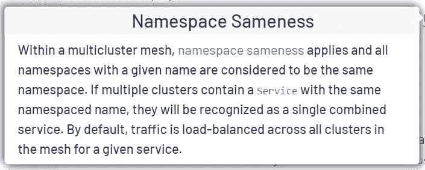
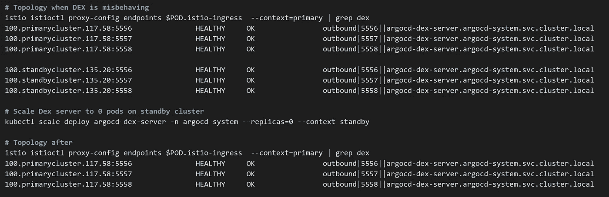

# Istio —多集群环境中命名空间一致性对流量管理的影响

> 原文：<https://itnext.io/istio-impacts-of-namespace-sameness-with-traffic-management-in-a-multi-cluster-environment-6556171d8cdd?source=collection_archive---------3----------------------->

在最近的一篇博客中，我介绍了如何在 Anthos 服务网格中配置全局 *MeshConfig* 设置。现在是时候说说那个把我引向那里的故事了！

我们目前运行一个多集群环境，最近通过向集群添加 Istio remote secrets 实现了服务发现。一旦完成，我们就开始在 ArgoCD 和 Vault 等服务中出现奇怪的行为。我们在热/温设置中运行 ArgoCD，并使用相同的名称空间名称(提示提示)。Vault 在每个区域群集中具有性能副本，并且使用相同的命名空间名称(提示提示 x2)。

对 ArgoCD 来说，行为怪异与 Dex 有关。我们使用 Dex 进行单点登录。在服务发现之后，Dex 页面将加载，接受您的凭证，并在重定向时不识别登录。我们最终陷入了一个登录循环。作为 Argo 上的主要 SME，并且已经完成了服务发现变更，我控制了一些“变更参数”。于是我在网上搜了一下，看看别人有没有类似的问题，挖了又挖，除了这个[片段](https://istio.io/latest/docs/ops/configuration/traffic-management/multicluster/)没找到多少:



名称空间相同

这让我恍然大悟，并开始探究名称空间的一致性是否是我的问题的根源。首先，我将备用集群上用于 Dex 部署的副本缩减到零。士气也提高了！当我有所进展时，这是个好消息。用户能够再次登录并监控他们的应用程序部署。

随着我继续研究云日志(我们在 GKE)，我还注意到 ArgoCD 使用的 Redis 部署中的错误增加了(我们在 HA 配置中运行 Redis)。错误表明一个成员拍打，这也触发了我。我在备用集群上对 Redis 和所有其他组件重复了缩减到零的过程…..士气进一步提高。

重读名称空间相同性片段，很明显行为变化是相关的。戴上我的网络帽子，我回想起 Istio 用注入的特使代理有效地劫持了你的网络。拓扑不再是关注 Kubernetes 服务端点的问题；统治世界的是 Istio 拓扑，它看到了本地集群之外的东西！看着 Istio 的观点，我看到了以下内容

```
istioctl proxy-config endpoints deploy/istio-ingressgateway.istio-ingress |grep dex
```



指数的 Istio 拓扑

好吧，这是有道理的，所以现在我必须想出一个办法，使这成为永久性的。我想到了几件事:

*   (第二个最佳选择)打破名称空间的一致性—让主实例和备用实例具有不同的名称空间名称
*   保持名称空间的一致性，但是通过重命名服务和其他资源使其在集群中具有不同的名称来使服务“独立”(更多的配置！)
*   将备用群集上的所有副本降至零
*   (选择)从 Istio 的网格角度解决问题

最后，我们选择通过将一些名称空间标记为集群本地来解决 Istio 级别的问题。这意味着有效地禁用名称空间的服务发现，这样它们就可以被认为是集群的本地服务。受益于此的组件包括 ArgoCD、Vault、Dynatrace、External Secrets，我相信更多组件会随之而来。

关于如何配置这种网格范围设置的细节，我建议查看我的另一篇博客文章 *Anthos 服务网格——配置全局设置。*

既然这个危机已经解决了，那么名称空间的相同性在哪里有意义呢？如果您有一个无状态的应用程序或外部化的状态，并且跨多个集群/区域运行；这个功能还是蛮不错的。对于平台组件来说，就没那么简单了。特别是对于成员/法定人数起作用的服务(Redis HA 成员、Vault Raft 后端等)。)

这是痛苦的几天，假设，验证，寻找如何修复，并与谷歌支持工作。最终，解决方案是一个易于部署到集群的单一配置图。