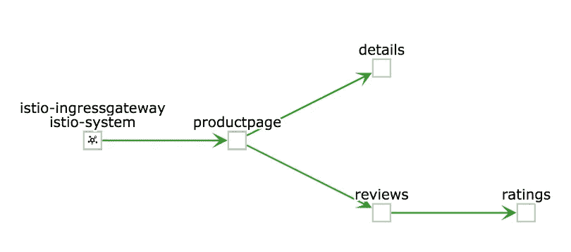

# Istio 入口和全主机网关

> 原文：<https://itnext.io/istio-ingress-and-the-all-host-gateway-b5c35781a7ba?source=collection_archive---------2----------------------->

为了让 Istio 正确路由您的流量并应用管理员设置的所有规则，有必要让流量通过入口网关。然后，虚拟服务进行 URL 匹配，并将其分发到目标服务。



从入口网关到 Bookinfo 演示工作负载的数据流

以 bookinfo 为例。有一个 bookinfo 网关和一个虚拟服务 bookinfo。首先是网关:

```
**apiVersion:** networking.istio.io/v1alpha3
**kind:** Gateway
**metadata:
  name:** bookinfo-gateway
**spec:
  servers:** - **hosts:** - "*"
  - **port:
      number:** 80
      **name:** http
      **protocol:** HTTP
```

您可以看到，为了使用 internal / pseudeo-DNS，它与*匹配，以允许所有主机使用。虚拟 bookinfo 服务看起来像这样:

```
**apiVersion:** networking.istio.io/v1alpha3
**kind:** VirtualService
**metadata:
  name:** bookinfo-vs
**spec:
  hosts:** - "*"
  **gateways:** - bookinfo-gateway
  **http:** - **match:** - **uri:
        exact:** /productpage
```

可以看到它引用了 bookinfo-gateway，然后通过 http.match.uri 分派到/productpage。

# 现在我的另一个应用

现在，我在一个不同的名称空间中部署了第二个应用程序，它在自己的配置中对 Ingress 做了同样的事情。这里我只展示虚拟服务:

```
**apiVersion:** networking.istio.io/v1alpha3
**kind:** VirtualService
**metadata:
  name:** mp-servicemesh-sample
**spec:
  hosts:** - "*"
  **gateways:** - mp-servicemesh-sample-gateway
  **http:** - **match:** - **uri:
        prefix:** /mp-servicemesh-sample
```

当我点击 http://istio-Ingres gateway-istio-system . 172 . 31 . 7 . 9 . nip . io/MP-service mesh-sample/service a 时，浏览器中出现了一个空白页面。这看起来不太好。

调查和打探显示，来自上面的 bookinfo 的第一个网关正在吞噬所有流量。删除 bookinfo 网关会立即使对…/serviceA 的调用成功。

# 一个可能的解决方案

当然，正确设置 DNS 而不使用 Host *是正确的解决方案，但在有些情况下(例如开发、内部主机)，这并不容易做到。

对我来说，实际上只设置了一个网关(我保留了一个 bookinfo ),并且在网关后面也只有一个虚拟服务，它相应地分派请求:

```
**apiVersion:** networking.istio.io/v1alpha3
**kind:** VirtualService
**spec:
  gateways:** - bookinfo-gateway
  **hosts:** - '*'
  **http:** - **match:** - **uri:
        exact:** /productpage
    **route:** - **destination:
        host:** productpage
        **port:
          number:** 9080
  - **match:** - **uri:
        prefix:** /mp-servicemesh-sample/serviceA
    **route:** - **destination:
        host:** servicea-service.myproject.svc.cluster.local
```

您可以看到/productpage 转到了 productpage 目标。

和/MP-service mesh-sample/serviceA 转到 servicea-service。实际上与上面不同的是，我用名称空间(“myproject”)和 svc.cluster.local 完全限定了 servicea-service。在这种情况下，Istio 没有附加名称空间，虚拟服务在其中，而是直接路由到目的主机。


[Kiali](https://www.kiali.io/) 显示从入口到产品页面和服务 a 的流量

前面的屏幕截图现在显示了最终结果，其中流量从 Istio Ingress 网关流向 Bookinfo 的 productpage 和 myproject 中的 serviceA。

当然，只有当不同的应用程序没有相同的路由前缀时，这种“技巧”才会起作用。如果两者都有*/登录*，那么我们仍然会失败。

# 有没有更好的办法？

以上可能不是实现目标的最佳方法——这是一种对我有效的方法(所以我把它写下来，以备下次需要时使用:)
请告诉我这里还可以做些什么。