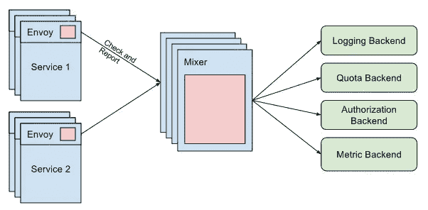
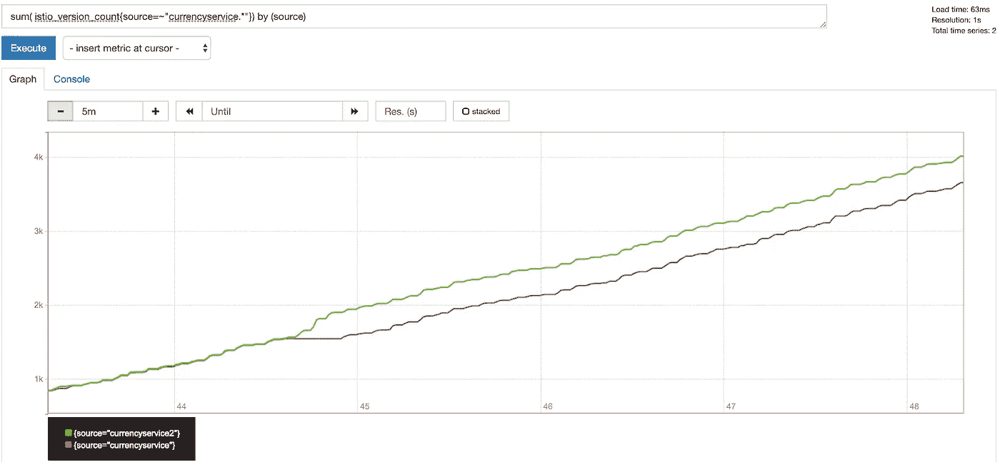

# Istio 监测解释

> 原文：<https://itnext.io/istio-monitoring-explained-cd85d6215902?source=collection_archive---------5----------------------->


如果我说“服务网格”是最近技术社区的热门话题，没有人会感到惊讶。该领域最活跃的项目之一是 Istio T1。它是由 IBM、Google 和 Lyft 联合创建的，作为对微服务架构已知问题的回应。容器和 Kubernetes 对采用微服务架构有很大帮助。然而，与此同时，它们也带来了一系列我们以前没有的新问题。

现在，我们所有的服务都使用 HTTP/gRPC API 来相互通信。在过去的单一时代，这些只是流经单个应用程序的函数调用。这意味着，在微服务系统中，服务之间有大量的交互，这使得可观察性、安全性和监控更加困难。

已经有很多资源解释了 [Istio 的样子](https://istio.io/docs/concepts/what-is-istio/)以及它是如何工作的。我不想在这里重复这些，所以我将集中讨论一个领域——监控。官方文件包括这一点，但理解它花了我一些时间。所以在本教程中，我将指导您完成它。所以你可以对使用 Istio 进行监控任务有更深入的了解。

# 技术发展水平

为什么选择服务网格的主要特征之一是提高可观察性。到目前为止，开发人员必须对他们的应用程序进行测试，以暴露一系列指标，通常使用公共库或供应商代理，如 [New Relic](https://newrelic.com/) 或 [Datadog](https://www.datadoghq.com/blog/monitor-istio-with-datadog/) 。之后，运营商能够使用监控解决方案来获取应用的指标端点，从而了解系统的运行情况。但是不得不修改代码是一件痛苦的事情，尤其是当有很多改变或添加的时候。将这种方法扩展到多个团队会使其难以维护。

Istio 方法是在不接触一行代码的情况下公开和跟踪应用程序的行为。这要归功于“sidecar”概念，它是一个容器，与我们的应用程序一起运行，并向中央遥测组件提供数据。由于能够识别正在使用的协议(redis、mongo、http、grpc 等), sidecars 可以嗅探到许多关于请求的信息。).

# 搅拌机，瑞士军刀

让我们从解释混音器组件开始。它是做什么的，给监控带来什么好处。在我看来，定义“混音器”的最佳方式是将其可视化为一个属性处理器。网格中的每个代理发送一组不同的属性，如请求数据或环境信息，然后“混合器”处理所有这些数据并将其路由到正确的适配器。

“适配器”是附加到“混合器”的处理器，负责为后端修改属性数据。后端可以是对这些数据感兴趣的任何外部服务。例如，监控工具(如 Prometheus 或 Stackdriver)、授权后端或日志堆栈。



# 概念

进入 Istio 世界最困难的事情之一是熟悉新的术语。就在你认为你已经理解了整个 Kubernetes 术语表的时候，你意识到 Istio 向竞技场添加了 50 多个新术语！

聚焦于监听，让我们描述一下有助于我们从混频器设计中获益的最有趣的概念:

*   *属性*:混合器处理的一条数据。大多数情况下，这是由边车产生的，但也可以由适配器产生。实例中使用属性将所需数据映射到后端。
*   *适配器*:嵌入在混合器组件中的逻辑，它管理数据向特定后端的转发。
*   *处理程序*:适配器的配置。因为一个适配器可以服务于多个用例，所以配置是解耦的，使得用多个设置运行同一个适配器成为可能。
*   *实例*:是将来自 Istio 的数据绑定到适配器模型的实体。Istio 有一组由边车容器收集的统一属性。这些数据必须被翻译成后端语言。
*   *模板*:定义实例模板的通用接口。[https://istio . io/docs/reference/config/policy-and-telemetry/templates/](https://istio.io/docs/reference/config/policy-and-telemetry/templates/)


**点击> >** 保存您参加 [**网上研讨会的座位**](https://get.alcide.io/using-istio-to-securely-monitor-your-services-webinar)

# 创建新的监控案例

在定义了 Istio 可观察性的所有概念后，将它植入我们头脑的最好方法是用一个现实世界的场景。

对于这个练习，我认为从 Kubernetes labels 元数据中获得好处是很棒的，并且由于它，跟踪我们服务的版本。当您迁移到微服务架构，最终拥有多个版本的服务(A/B 测试、API 版本控制等)时，这是一种常见的情况。Istio sidecar 将所有类型的元数据从集群发送到混音器。因此，在我们的示例中，我们将利用部署标签来识别服务版本，并观察每个版本的使用统计信息。

为了简单起见，让我们拿一个现有的项目，[谷歌微服务演示项目](https://github.com/GoogleCloudPlatform/microservices-demo)，并做一些修改，以符合我们的计划。这个项目模拟了一个由多个组件组成的微服务架构来构建一个电子商务网站。

首先，让我们用 Istio 确保项目在我们的集群中正确运行。让我们使用自动注入特性来部署一个名称空间中的所有组件，并让 Istio 自动注入 sidecar。

```
$ kubectl label namespace mesh istio-injection=enabled
```

**警告**:确保预先创建了`mesh`名称空间，并且您的`kubectl`上下文指向它。

如果您启用了 pod 安全策略，您将需要为 init 容器配置一些权限，以便让它正确地配置 iptables magic。出于测试目的，您可以使用:

```
$ kubectl create clusterrolebinding mesh --clusterrole cluster-admin --serviceaccount=mesh:default
```

这将默认服务帐户绑定到群集管理角色。现在，我们可以使用全包资源 YAML 文档部署所有组件。

```
$ kubectl apply -f release/kubernetes-manifests.yaml
```

现在，您应该能够看到从`mesh`名称空间开始的窗格。其中一些会失败，因为尚未添加 Istio 资源。例如，出口流量将不被允许，货币组件将失败。应用这些资源来修复问题，并通过 Istio 入口公开前端组件。

```
$ kubectl apply -f release/istio-manifests.yaml
```

现在，我们可以浏览使用您的云提供商提供的 IP 或域的前端(通过云提供商负载均衡器公开`frontend-external`服务)。

现在我们已经运行了微服务应用程序，让我们更进一步，将其中一个组件配置为多个版本。正如您在微服务 YAML 中看到的，部署只有一个带有应用程序名称的标签。如果我们想要管理 canary 部署或运行应用程序的多个版本，我们可以添加另一个版本标签。

```
apiVersion: extensions/v1beta1 kind: Deployment metadata: name: currencyservice spec: template: metadata: labels: app: currencyservice version: v1
```

将更改应用到集群之后，我们可以使用不同的名称复制部署并更改版本。

```
apiVersion: extensions/v1beta1 kind: Deployment metadata: name: currencyservice2 spec: template: metadata: labels: app: currencyservice version: v2 ...
```

现在再次提交给 API。

```
$ kubectl apply -f release/kubernetes-manifests.yaml
```

**注意**:虽然我们再次应用了所有的清单，但是 API 只会更新那些已经改变的清单。

一位热心的读者注意到我们做了一个小把戏，因为服务选择器只指向`app`标签。这样，流量将在版本之间公平分配。

# 从地面到天空

现在让我们加入魔法。我们将需要创建三个资源来将版本公开为 prometheus 中的新指标。

首先，我们将创建实例。这里我们使用`metric`实例模板将 sidecars 提供的值映射到适配器输入。我们只对工作负载名称(源)和版本感兴趣。

```
apiVersion: "config.istio.io/v1alpha2" kind: metric metadata: name: versioncount namespace: mesh spec: value: "1" dimensions: source: source.workload.name | "unknown" version: destination.labels["version"] | "unknown" monitored_resource_type: '"UNSPECIFIED"'
```

现在让我们配置适配器。在我们的例子中，我们希望将 metric 连接到 Prometheus 后端。因此，我们将定义指标名称和值的类型，这些指标将在处理程序配置中提供给后端(Prometheus DSL)。还有它将用于维度的标签名称。

```
apiVersion: "config.istio.io/v1alpha2" kind: prometheus metadata: name: versionhandler namespace: mesh spec: metrics: - name: version_count # Prometheus metric name instance_name: versioncount.metric.mesh # Mixer instance name (fully-qualified) kind: COUNTER label_names: - source - version
```

最后，我们需要将这个特定的处理程序与一个特定的实例(指标)联系起来。

```
apiVersion: "config.istio.io/v1alpha2" kind: rule metadata: name: versionprom namespace: mesh spec: match: destination.service == "currencyservice .mesh.svc.cluster.local" actions: - handler: versionhandler.prometheus instances: - versioncount.metric.mesh
```

一旦应用了这些定义，Istio 将指示 prometheus 适配器开始收集和提供新的度量。如果我们看一下正在搜索新指标的 prometheus UI，我们应该能够看到类似这样的内容:



# 结论

在微服务架构中实现良好的可观察性并不容易。Istio 可以帮助开发人员消除复杂性，将工作留给运营商。

开始时，可能很难处理服务网格增加的所有复杂性。但是一旦你驯服了它，你将能够标准化和自动化你的监控配置，并在创纪录的时间内建立一个伟大的可观测性系统。

由[Fernando Ripoll](https://twitter.com/pipo02mix)——解决方案工程师@ [巨型群](https://giantswarm.io/)撰写

[](https://twitter.com/pipo02mix) [## 费尔南多·里波尔(@pipo02mix) |推特

### 费尔南多·里波尔的最新推文(@pipo02mix)。生命开发者。特鲁埃尔

twitter.com](https://twitter.com/pipo02mix)