# 基于 Go、gRPC 和协议缓冲区的微服务的 Istio 可观测性

> 原文：<https://itnext.io/istio-observability-with-go-grpc-and-protocol-buffers-based-microservices-d09e34c1255a?source=collection_archive---------2----------------------->

## 使用 Jaeger、Zipkin、Prometheus、Grafana 和 Kiali 在谷歌云的 GKE 和 Istio 服务网格上观察分布式系统

在最近的两篇文章中，[基于 Kubernetes 的微服务与 Istio 服务网格的可观察性](/kubernetes-based-microservice-observability-with-istio-service-mesh-part-1-bed3dd0fac0b)和 [Azure Kubernetes 服务(AKS)与 Istio 服务网格的可观察性](/azure-kubernetes-service-aks-observability-with-istio-service-mesh-4eb28da0f764)，我们探讨了 Istio 服务网格中包含的可观察性工具。这些工具目前包括用于指标收集、监控和警报的 [Prometheus](https://prometheus.io/) 和 [Grafana](https://grafana.com/) ，用于分布式跟踪的 [Jaeger](https://www.jaegertracing.io/) ，以及用于基于 Istio 服务网格的微服务可视化和监控的 [Kiali](https://www.kiali.io/) 。结合云平台原生的监控和日志服务，比如 GCP 上的 [Stackdriver](https://cloud.google.com/monitoring/) ，AWS 上的 [CloudWatch](https://aws.amazon.com/cloudwatch/) ，Azure 上的 [Azure Monitor](https://docs.microsoft.com/en-us/azure/azure-monitor/overview) logs，我们就有了一套完整的现代、分布式、基于云的应用的可观测性解决方案。

在本文中，我们将研究如何使用 Istio 的可观察性工具来监控基于 Go 的微服务，这些微服务通过 [gRPC](https://grpc.io) (gRPC 远程过程调用)和 [HTTP/2](https://en.wikipedia.org/wiki/HTTP/2) 使用[协议缓冲区](https://developers.google.com/protocol-buffers/)(又名 *Protobuf* )进行客户端-服务器通信，而不是通过 HTTP(超文本传输协议)使用更传统的基于 REST 的 JSON (JavaScript 对象表示法)。我们将看到 Kubernetes、Istio、Envoy 和 observability 工具如何与 gRPC 无缝协作，就像它们在[Google Kubernetes Engine](https://cloud.google.com/kubernetes-engine/)(GKE)上通过 HTTP 与 JSON 无缝协作一样。

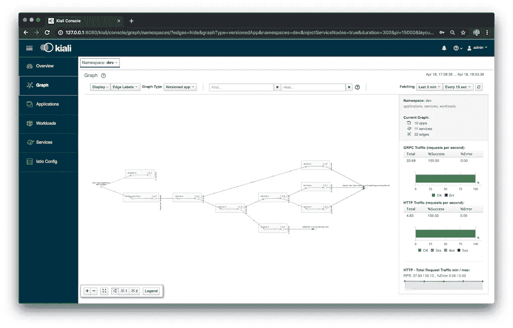

# 技术

## gRPC

据 [gRPC 项目](https://grpc.io)介绍， [CNCF](https://www.cncf.io/) 在孵项目 gRPC 是一个现代的、高性能的、开源的、通用的[远程过程调用](https://en.wikipedia.org/wiki/Remote_procedure_call) (RPC)框架，可以在任何地方运行。它使客户机和服务器应用程序能够透明地通信，并使构建连接的系统变得更加容易。gRPC 的原始开发者 Google 已经使用 gRPC 中的底层技术和概念很多年了。当前的实现用于几个 Google 云产品和 Google 面向外部的 API。它也被 Square、网飞、CoreOS、Docker、CockroachDB、Cisco、Juniper Networks 和许多其他组织使用。

## 协议缓冲区

默认情况下，gRPC 使用协议缓冲区。根据 Google 的说法，[协议缓冲区](https://developers.google.com/protocol-buffers/) ( *又名 Protobuf* )是一种语言和平台中立的、高效的、可扩展的自动化机制，用于序列化结构化数据，以用于通信协议、数据存储等。协议缓冲区比 XML 小 3 到 10 倍，快 20 到 100 倍。一旦定义了消息，就可以在`.proto`文件上运行应用程序语言的协议缓冲编译器来生成数据访问类。

> 协议缓冲区比 XML 小 3 到 10 倍，快 20 到 100 倍。

协议缓冲区目前支持 Java、Python、Objective-C 和 C++、Dart、Go、Ruby 和 C#中的生成代码。对于本帖，我们为 Go 编译了。你可以在 Google 的[开发者门户](https://developers.google.com/protocol-buffers/docs/encoding)上阅读更多关于 Protobuf 的二进制 wire 格式。

## 特使代理

根据 [Istio 项目](https://istio.io/docs/concepts/what-is-istio/#envoy)，Istio 使用了[特使](https://www.envoyproxy.io/)代理的扩展版本。特使作为侧车部署到同一 Kubernetes pod 中的相关服务。由 Lyft 创建的 Envoy 是一个用 C++开发的高性能代理，用于协调服务网格中所有服务的所有入站和出站流量。Istio 利用 Envoy 的许多内置功能，包括动态服务发现、负载平衡、TLS 终止、HTTP/2 和 gRPC 代理、断路器、健康检查、分阶段部署、故障注入和丰富的指标。

根据 Google 的 Harvey Tuch 的文章[Evolving a Protocol Buffer canonical API](https://blog.envoyproxy.io/evolving-a-protocol-buffer-canonical-api-e1b2c2ca0dec)，Envoy proxy 采用了协议缓冲区，特别是 [proto3](https://developers.google.com/protocol-buffers/docs/proto3) ，作为 Lyft 的 gRPC-first API 版本 2 的规范规范。

# 参考微服务平台

在前两篇文章中，我们探索了 Istio 的可观察性工具，使用了用 Go 编写的基于 RESTful 微服务的 API 平台，并使用 JSON over HTTP 进行服务到服务的通信。API 平台由八个基于 [Go 的](https://golang.org/)微服务和一个基于 Angular 7 [类型脚本的](https://en.wikipedia.org/wiki/TypeScript)前端 web 客户端组成。各种服务依赖于 MongoDB 和 RabbitMQ 进行基于事件队列的通信。下面，是基于 HTTP 的 JSON 平台架构。

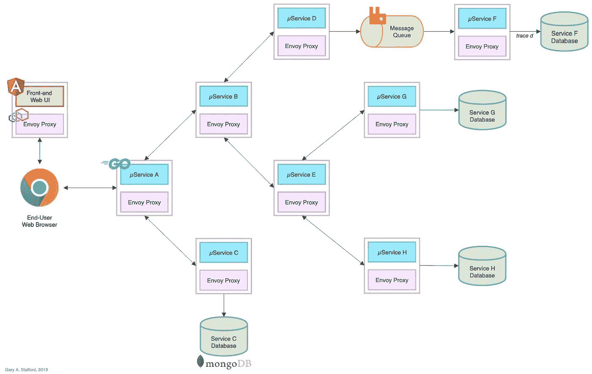

下面，当前基于 Angular 7 的 web 客户端界面。

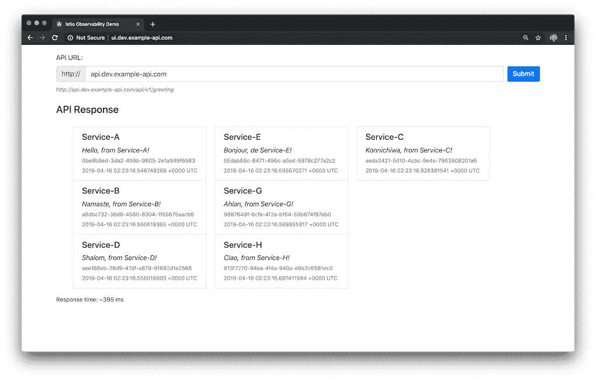

# 转换为 gRPC 和协议缓冲区

在这篇文章中，我修改了八个 Go 微服务，以使用谷歌的数据交换格式 [gRPC](https://grpc.io) 和[协议缓冲区](https://developers.google.com/protocol-buffers/)。具体来说，服务使用版本 3 [版本](https://github.com/protocolbuffers/protobuf/releases)(又名 *proto3* )的协议缓冲区。使用 gRPC，gRPC 客户端调用 gRPC 服务器。该平台的一些服务是 gRPC 服务器，另一些是 gRPC 客户端，还有一些同时充当客户端和服务器，如服务 A、B 和 e。修改后的架构如下所示。

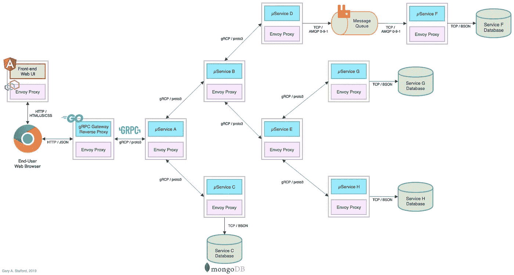

# gRPC 网关

为了演示起见，假设大多数 API 消费者仍然希望使用 RESTful JSON over HTTP API 进行通信，我已经为平台添加了一个 [gRPC Gateway](https://github.com/grpc-ecosystem/grpc-gateway) 反向代理。gRPC 网关是一个 gRPC 到 JSON 的反向代理，这是一个常见的架构模式，它代理基于 HTTP 的客户端上的 JSON 和基于 gRPC 的微服务之间的通信。来自 [grpc-gateway](https://github.com/grpc-ecosystem/grpc-gateway) GitHub 项目站点的图表有效地展示了反向代理是如何工作的。

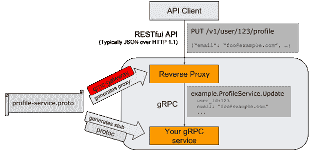

*图片礼貌:*[*【https://github.com/grpc-ecosystem/grpc-gateway】*](https://github.com/grpc-ecosystem/grpc-gateway)

在上面修改后的平台架构图中，请注意反向代理的添加，它取代了 API 边缘的服务 A。代理位于基于 Angular 的 Web UI 和服务 a 之间。另外，请注意，服务之间的通信方法现在是通过 gRPC 的 Protobuf，而不是通过 HTTP 的 JSON。Envoy 代理的使用(通过 Istio)没有变化，基于 MongoDB Atlas 的数据库和基于 CloudAMQP RabbitMQ 的队列也是如此，它们仍然在 Kubernetes 集群之外。

## gRPC 网关的替代方案

作为 gRPC 网关反向代理的替代方案，我们可以将基于 TypeScript 的 Angular UI 客户端转换为 gRPC 和协议缓冲区，并继续作为边缘服务与服务 A 直接通信。然而，这将限制 API 的其他消费者依赖 gRPC，而不是 HTTP 上的 JSON，除非我们也选择公开两个不同的端点 gRPC 和 HTTP 上的 JSON，这是另一种常见的模式。

# 示范

在本文的演示中，我们将重复上一篇文章[基于 Kubernetes 的微服务可观察性与 Istio 服务网格](/kubernetes-based-microservice-observability-with-istio-service-mesh-part-1-bed3dd0fac0b)中概述的相同安装过程。我们将在 GCP 的 GKE 部署修改后的基于 gRPC 的平台。您可以轻松地使用 Istio 服务网格遵循 [Azure Kubernetes 服务(AKS)的可观察性，并将平台部署到 AKS。](/azure-kubernetes-service-aks-observability-with-istio-service-mesh-4eb28da0f764)

## 源代码

这篇文章的所有源代码都可以在 GitHub 上找到，包含在三个项目中。基于 Go 的微服务源代码、所有 Kubernetes 资源和所有部署脚本都位于新的`grpc`分支中的[k8s-istio-observe-back end](https://github.com/garystafford/k8s-istio-observe-backend)项目存储库中。

```
git clone \ 
  **--branch grpc** --single-branch \
  --depth 1 --no-tags \ 
  [https://github.com/garystafford/k8s-istio-observe-backend.git](https://github.com/garystafford/k8s-istio-observe-backend.git)
```

基于角度的 web 客户端源代码位于新的`grpc`分支上的[k8s-istio-observe-frontend](https://github.com/garystafford/k8s-istio-observe-frontend)存储库中。源协议缓冲区`.proto`文件和使用协议缓冲区编译器生成的代码位于新的 [pb-greeting](https://github.com/garystafford/pb-greeting) 项目存储库中。对于本文的演示，您不需要克隆这两个项目。

服务、UI 和反向代理的所有 Docker 映像都位于 [Docker Hub](https://hub.docker.com/search?q=%22garystafford&type=image&sort=updated_at&order=desc) 上。

# 代码更改

这篇文章不是专门为 gRPC 和 Protobuf 写 Go 的。然而，与 HTTP 上的 JSON 相比，为了更好地理解这些技术的可观察性需求和功能，回顾一些源代码是有帮助的。

## 微服务

首先，将下面显示的[服务 A](https://github.com/garystafford/k8s-istio-observe-backend/blob/grpc/services/service-a/main.go) 的源代码与前一篇文章中的[原始代码](https://github.com/garystafford/k8s-istio-observe-backend/blob/master/services/service-a/main.go)进行比较。该服务的代码几乎完全重写。我依赖于几个参考资料来编写代码，包括:[Aspen Mesh](https://aspenmesh.io/2018/04/tracing-grpc-with-istio/)[的 Neeraj Poddar 编写的使用 Istio](https://aspenmesh.io/) 跟踪 gRPC，以及 Masroor Hasan 编写的[使用 Jaeger on Kubernetes](https://medium.com/@masroor.hasan/tracing-infrastructure-with-jaeger-on-kubernetes-6800132a677) 的分布式跟踪基础设施。

具体来说，请注意服务 A 的以下代码更改:

1.  导入 [pb-greeting](https://github.com/garystafford/pb-greeting) protobuf 包；
2.  本地问候语结构被替换为`pb.Greeting`结构；
3.  所有服务现在都托管在端口`50051`上；
4.  HTTP 服务器和所有 API 资源处理函数都被删除；
5.  用于 Jaeger 分布式跟踪的头已经从 HTTP 请求对象转移到 gRPC 上下文对象中传递的元数据；
6.  服务 A 编码为 gRPC 服务器，由 gRPC 网关反向代理(gRPC 客户端)通过`Greeting`函数调用；
7.  返回服务问候的主要`PingHandler`函数被 [pb-greeting](https://github.com/garystafford/pb-greeting) protobuf 包的`Greeting`函数所取代；
8.  服务 A 编码为 gRPC 客户端，使用`CallGrpcService`函数同时调用服务 B 和服务 C；
9.  CORS 的处理工作交给了 Istio
10.  记录方法不变；

修改后的基于 gRPC 的[服务 A](https://github.com/garystafford/k8s-istio-observe-backend/blob/grpc/services/service-a/main.go) 的源代码:

## 问候协议缓冲区

下面显示的是问候源协议缓冲区`.proto`文件。最初在服务中定义的问候响应结构基本上保持不变。UI 客户端响应看起来是一样的。

当使用基于 Go 的协议编译器插件`protoc`进行编译时，最初的 27 行源代码膨胀为将近 270 行生成的数据访问类，更易于编程使用。

下面是编译后代码的一小段，供参考。编译后的代码包含在 GitHub 上的 [pb-greeting](https://github.com/garystafford/pb-greeting) 项目中，导入到每个微服务和反向代理中。我们还为反向代理编译了一个单独的版本来实现。

使用 Swagger，我们可以查看 greeting protocol buffers 的单一 RESTful API 资源，该资源通过 HTTP GET 方法公开。我使用基于 Docker 版本的 [Swagger UI](https://hub.docker.com/r/swaggerapi/swagger-ui/) 来查看`protoc`生成的 Swagger 定义。

```
docker run -p 8080:8080 -d --name swagger-ui \
  -e SWAGGER_JSON=/tmp/greeting.swagger.json \
  -v ${GOAPTH}/src/pb-greeting:/tmp swaggerapi/swagger-ui
```

Angular UI 向`/api/v1/greeting`资源发出一个 HTTP GET 请求，该请求被转换为 gRPC 并代理给服务 A，由`Greeting`函数处理。

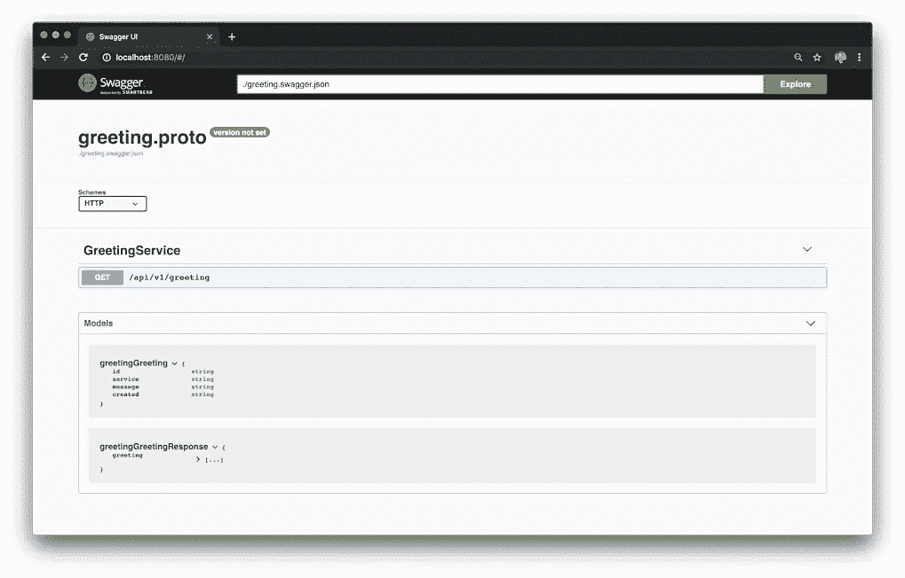

## gRPC 网关反向代理

如前所述， [gRPC 网关](https://github.com/grpc-ecosystem/grpc-gateway)反向代理服务是全新的。具体来说，请注意以下要点中的代码特征:

1.  导入 [pb-greeting](https://github.com/garystafford/pb-greeting) protobuf 包；
2.  代理托管在端口`80`上；
3.  用于 Jaeger 分布式跟踪的请求头从传入的 HTTP 请求中收集，并传递给 gRPC 上下文中的服务 A；
4.  代理被编码为 gRPC 客户端，它调用服务 A；
5.  日志记录基本没有变化；

[反向代理](https://github.com/garystafford/k8s-istio-observe-backend/blob/grpc/services/service-rev-proxy/main.go)的源代码:

## 标题传播

下面，在 Stackdriver 日志中，我们看到了 JSON 有效负载中一组 HTTP 请求头的示例，这些请求头从 gRPC 网关的反向代理向上游传播到基于 gRPC 的 Go 服务。标头传播确保请求在整个服务调用链中产生完整的分布式跟踪。

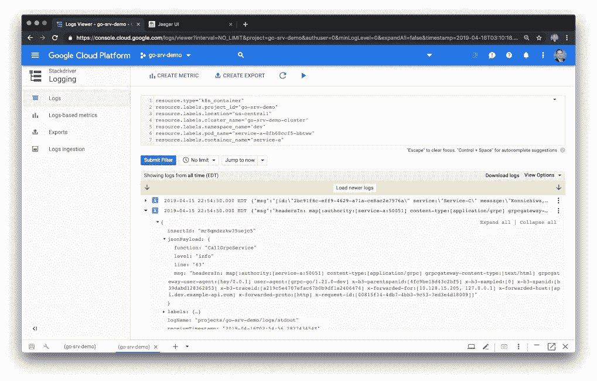

# Istio VirtualService 和 CORS

根据该项目的 [GitHub 问题](https://github.com/grpc/grpc-web/issues/435#issuecomment-454113721)中的反馈，gRPC 网关不直接支持跨源资源共享(CORS)策略。以我自己的经验，gRPC 网关无法处理 OPTIONS HTTP 方法请求，必须由 Angular 7 web UI 发出。因此，我使用 VirtualService 资源的 [CorsPolicy](https://istio.io/docs/reference/config/networking/v1alpha3/virtual-service/#CorsPolicy) 配置，将 CORS 的职责交给了 Istio。这使得 CORS 比将 CORS 配置编码到服务代码中更容易管理。

# 设置和安装

要将微服务平台部署到 GKE，请遵循本文第一部分中的详细说明，[基于 Kubernetes 的微服务可观察性与 Istio 服务网格:第一部分](/kubernetes-based-microservice-observability-with-istio-service-mesh-part-1-bed3dd0fac0b)或 [Azure Kubernetes 服务(AKS)可观察性与 Istio 服务网格](/azure-kubernetes-service-aks-observability-with-istio-service-mesh-4eb28da0f764) for AKS。您还应该在 GitHub 上查看这个项目的 README 文档。

1.  创建外部 MongoDB Atlas 数据库和 CloudAMQP RabbitMQ 集群；
2.  为您自己的环境修改 Kubernetes 资源文件和 bash 脚本；
3.  在 GCP 或 Azure 上创建托管的 GKE 或 AKS 群集；
4.  使用 Helm 将 Istio 配置和部署到受管理的 Kubernetes 集群；
5.  为平台的公开资源创建 DNS 记录；
6.  将基于 Go 的微服务、gRPC 网关反向代理、Angular UI 以及相关资源部署到 Kubernetes 集群；
7.  测试平台部署并排除故障；
8.  观察结果；

# 三大支柱

正如在第一篇文章中介绍的，日志、度量和跟踪通常被认为是可观察性的三大支柱。这些是我们可以观察到的系统的外部输出。随着现代分布式系统变得越来越复杂，观察这些系统的能力需要同样现代的工具，这些工具是在考虑到这种复杂程度的情况下设计的。传统的日志记录和监控系统往往难以应对当今的混合和多云、基于多语言、事件驱动、基于容器和无服务器、可无限扩展的短暂计算平台。

像 [Istio Service Mesh](https://istio.io/) 这样的工具试图通过提供与几个同类最佳的开源遥测工具的本机集成来解决可观测性挑战。Istio 的集成包括用于分布式跟踪的 [Jaeger](https://www.jaegertracing.io/) ，用于 Istio 服务基于网格的微服务可视化和监控的 [Kiali](https://www.kiali.io/) ，以及用于指标收集、监控和警报的 [Prometheus](https://prometheus.io/) 和 [Grafana](https://grafana.com/) 。结合云平台原生的监控和日志记录服务，例如针对 GKE 的 [Stackdriver](https://cloud.google.com/monitoring/) ，针对亚马逊 EKS 的 [CloudWatch](https://aws.amazon.com/cloudwatch/) ，或针对 AKS 的 [Azure Monitor](https://docs.microsoft.com/en-us/azure/azure-monitor/overview) logs，我们拥有针对现代、分布式、基于云的应用的完整可观测性解决方案。

# 支柱 1:伐木

从 JSON over HTTP 迁移到 gRPC 不需要对基于 Go 的服务代码或 Kubernetes 资源的日志配置进行任何更改。

## Logrus 的 Stackdriver

正如上一篇文章的第二部分所详述的，[基于 Kubernetes 和 Istio 服务网格的微服务可观察性](/kubernetes-based-microservice-observability-with-istio-service-mesh-part-1-bed3dd0fac0b)，我们对八个基于 Go 的微服务和反向代理的日志策略仍然是使用 [Logrus](https://github.com/sirupsen/logrus) ，这是一个流行的 Go 结构化日志记录器，以及 Banzai Cloud 的[Logrus-runtime-formatter](https://github.com/sirupsen/logrus)。

如果您还记得，Banzai 格式化程序自动用运行时/堆栈信息标记日志消息，包括函数名和行号；排除故障时非常有用。我们也在使用 Logrus 的 JSON 格式化程序。下面，在 Stackdriver 控制台中，注意下面的每个日志条目如何包含消息中的 JSON 有效负载，以及日志级别、函数名、日志条目所在的行和消息。

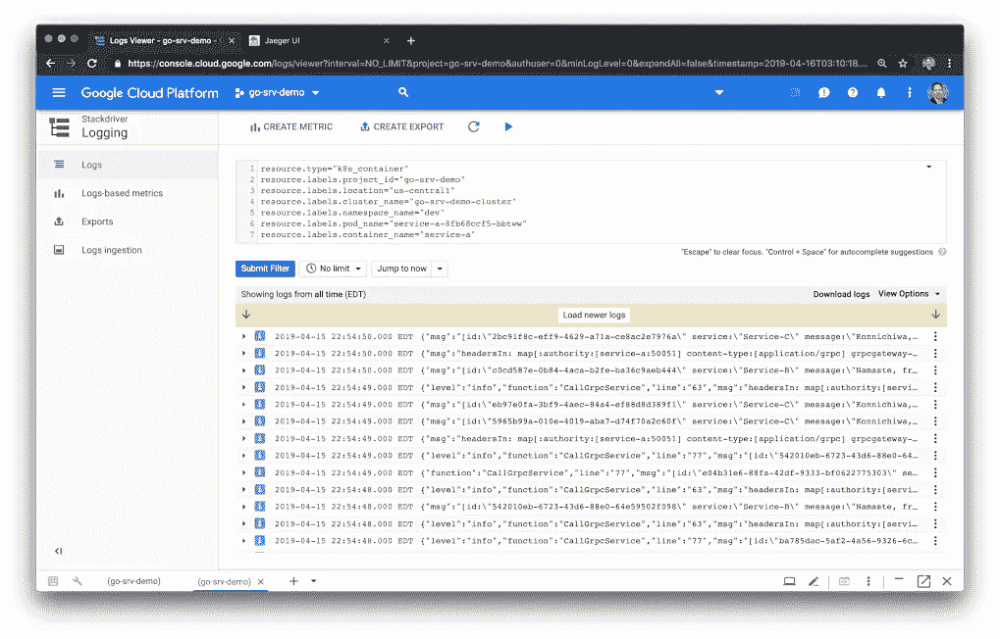

下面，我们看到了特定日志条目的 JSON 有效负载的细节。在这种情况下，我们可以看到从下游服务传播的请求头。


# 支柱 2:衡量标准

从 JSON over HTTP 迁移到 gRPC 不需要对基于 Go 的服务代码或 Kubernetes 资源的度量配置进行任何更改。

## 普罗米修斯

Prometheus 是一个完全开源的社区驱动的系统监控和警报工具包，最初于 2012 年左右在 SoundCloud 创建。有趣的是，普罗米修斯在 2016 年加入了[云原生计算基金会](https://cncf.io/) (CNCF)，作为继 [Kubernetes](http://kubernetes.io/) 之后托管的第二个项目。

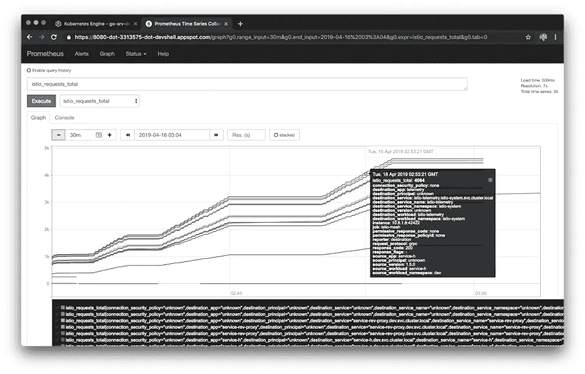

## 格拉夫纳

Grafana 称自己是领先的时间序列分析开源软件。根据 [Grafana Labs 的说法，](https://grafana.com/grafana) Grafana 允许您查询、可视化、提醒和了解您的指标，无论它们存储在哪里。您可以轻松创建、浏览和共享视觉效果丰富的数据驱动仪表板。Grafana 允许用户为他们最重要的指标可视化地定义警报规则。Grafana 将不断评估规则，并可以发送通知。

根据 [Istio](https://istio.io/docs/tasks/telemetry/using-istio-dashboard/#about-the-grafana-add-on) 的说法，Grafana 附加组件是 Grafana 的预配置实例。Grafana Docker 基本映像已经过修改，可以在安装了 Prometheus 数据源和 Istio 仪表板的情况下启动。下面，我们看到两个预配置的仪表板，Istio Mesh 仪表板和 Istio Performance 仪表板。

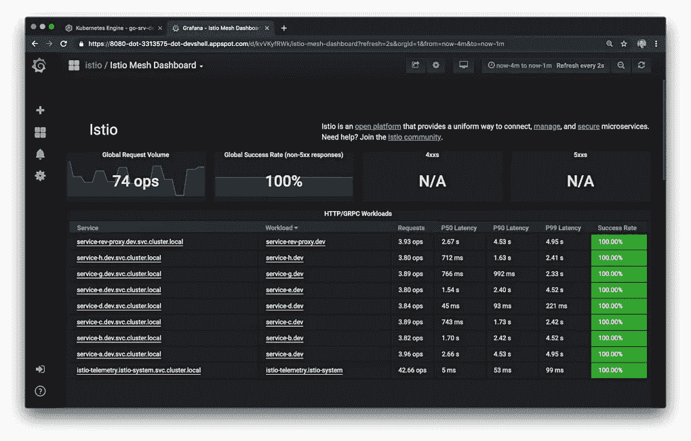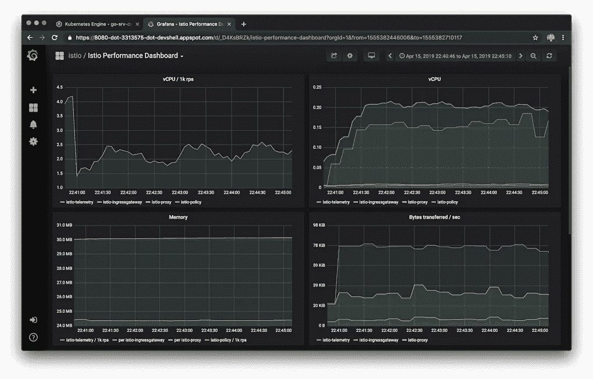

# 支柱 3:痕迹

从 JSON over HTTP 迁移到 gRPC 确实需要完全重写服务代码中的跟踪逻辑。事实上，我花了大部分时间来确保正确的报头从 Istio 入口网关传播到 gRPC 网关反向代理，传播到 gRPC 上下文中的服务 A，并向上游传播到所有依赖的基于 gRPC 的服务。我确信在我当前的代码中有许多优化，关于跟踪的正确处理和这个信息如何在服务调用栈中传播。

## 贼鸥

根据他们的网站介绍， [Jaeger](https://www.jaegertracing.io/docs/1.10/) 受 [Dapper](https://research.google.com/pubs/pub36356.html) 和 [OpenZipkin](http://zipkin.io/) 的启发，是一个由[优步科技](http://uber.github.io/)开源发布的分布式追踪系统。它用于对基于微服务的分布式系统进行监控和故障排除，包括分布式上下文传播、分布式事务监控、根本原因分析、服务依赖性分析以及性能和延迟优化。Jaeger [网站](https://www.jaegertracing.io/docs/1.10/architecture/)包含了 Jaeger 架构和一般追踪相关术语的出色概述。

下面我们看到了积家界面的痕迹视图。在其中，我们看到了由 [hey](https://github.com/rakyll/hey) 生成的一系列跟踪，这是一个现代的负载生成器和基准测试工具，也是 Apache Bench ( `ab`)的一个有价值的替代品。与`ab`不同，`hey`支持 HTTP/2。`hey`的用法在之前的帖子里有详细介绍。


您可能还记得，跟踪是系统中的一条执行路径，可以被认为是[有向无环图](https://en.wikipedia.org/wiki/Directed_acyclic_graph) (DAG)的[跨度](https://www.jaegertracing.io/docs/1.10/architecture#span)。如果您曾经使用过像 Apache Spark 这样的系统，那么您可能已经熟悉 Dag 了。

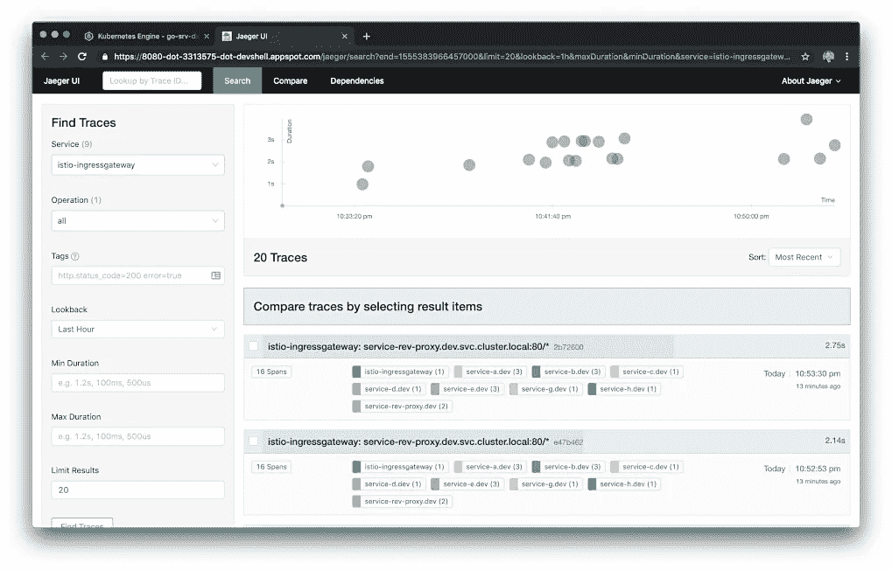

下面我们看到的是 Jaeger UI 跟踪细节视图。示例跟踪包含 16 个跨度，包含九个组件—八个基于 Go 的服务中的七个、反向代理和 Istio 入口网关。轨迹和跨度都有计时。跟踪中的根跨度是 Istio 入口网关。在这个演示中，跟踪没有跨越 RabbitMQ 消息队列。这意味着您将看不到包含服务 D 到服务 F 之间通过 RabbitMQ 的解耦的、基于消息的通信的跟踪。

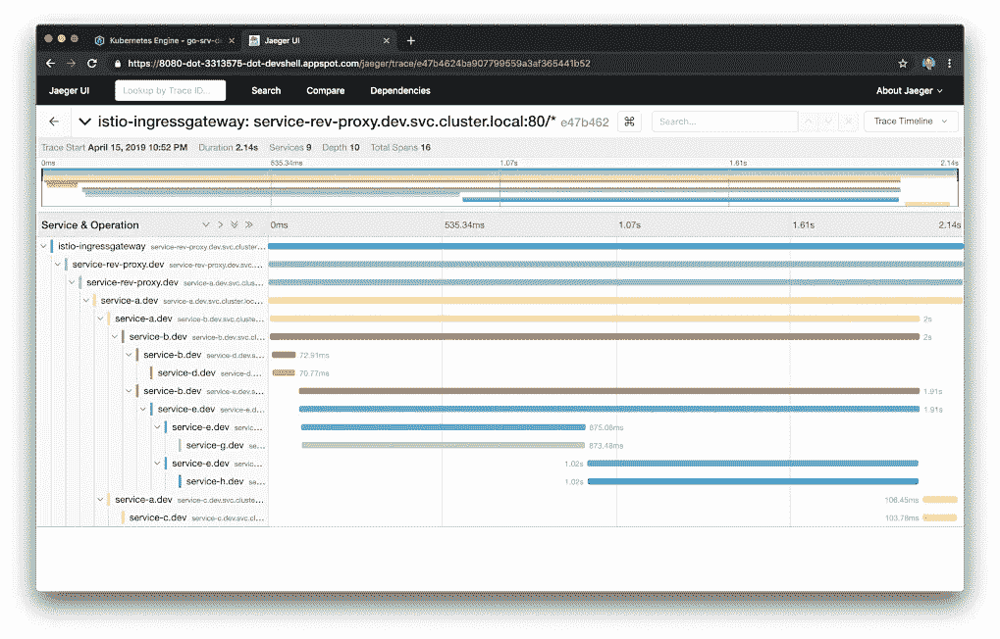

在 Jaeger UI Trace Detail 视图中，您还可以钻取包含附加元数据的单个范围。元数据包括被调用的 URL、HTTP 方法、响应状态和其他一些头。

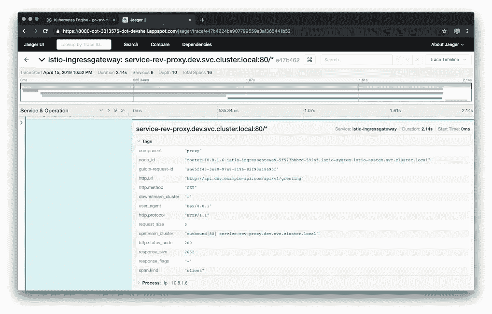

# 微服务可观察性

从 JSON over HTTP 迁移到 gRPC 不需要对基于 Go 的服务代码或 Kubernetes 资源的 Kiali 配置进行任何更改。

## 基亚利

根据他们的[网站](https://www.kiali.io/documentation/overview/)，Kiali 提供了以下问题的答案:我的 Istio 服务网中有哪些微服务，它们是如何连接的？Kiali 在 OpenShift 或 Kubernetes 中与 Istio 合作，以可视化服务网状拓扑，提供对断路器、请求率等功能的可见性。它提供了从抽象应用程序到服务和工作负载的不同级别的网格组件的见解。

Kiali UI 中的图形视图是在 Istio 服务网格中运行的组件的可视化表示。下面，过滤集群的`dev`名称空间，我们应该观察到 Kiali 已经映射了平台中的所有组件，以及丰富的元数据，比如它们的版本和通信协议。


使用 Kiali，我们可以确认我们的服务对服务 IPC 协议现在是 gRPC，而不是以前的 HTTP。

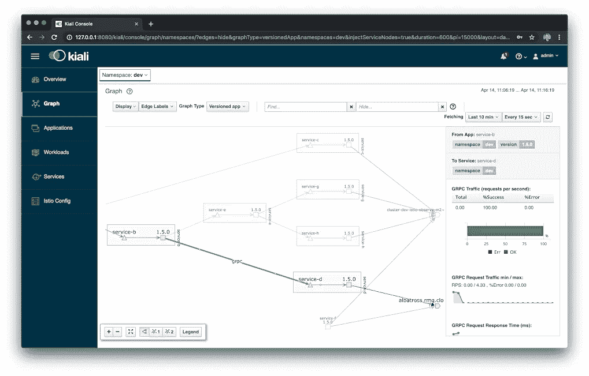

虽然使用 gRPC 将 HTTP 上的 JSON 转换为协议缓冲区需要对服务进行重大的代码更改，但这并不影响我们使用 Istio 提供的工具(包括 Prometheus、Grafana、Jaeger 和 Kiali)对这些服务进行高级别的观察。

*本文表达的所有观点都是我个人的观点，不一定代表我现在或过去的雇主或他们的客户的观点。*