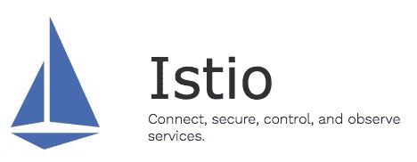
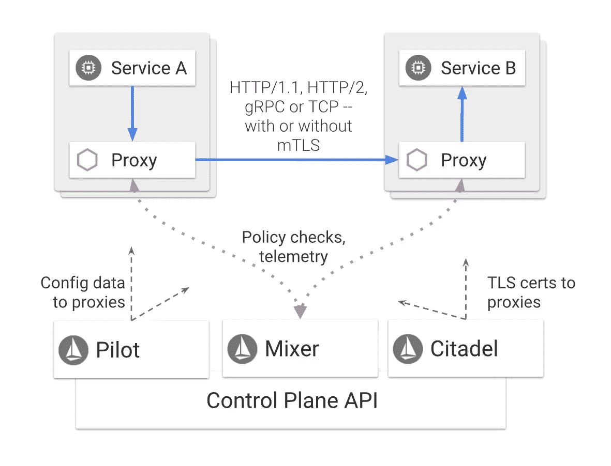
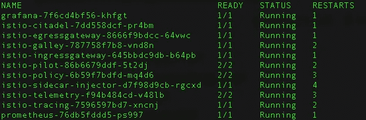
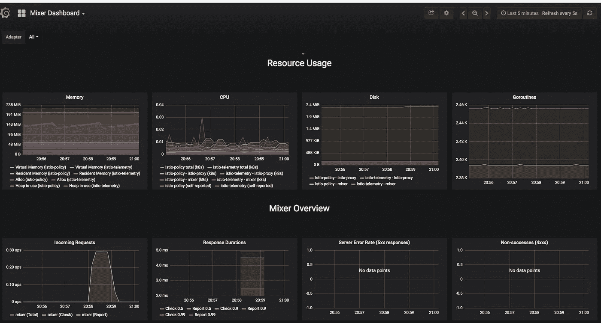
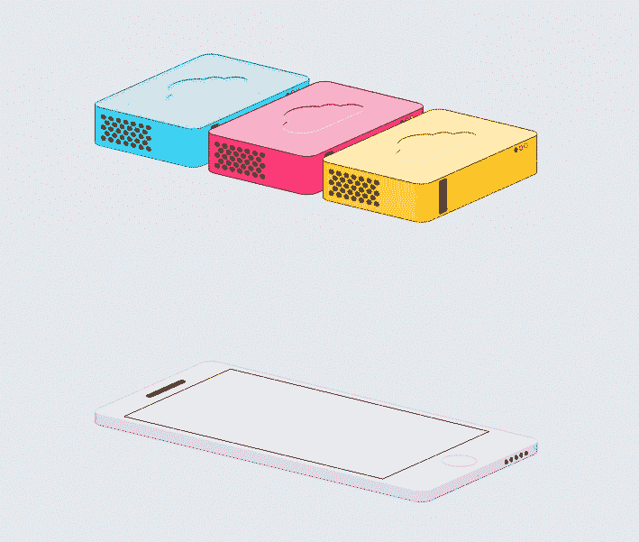
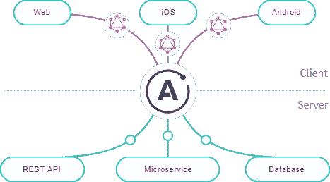
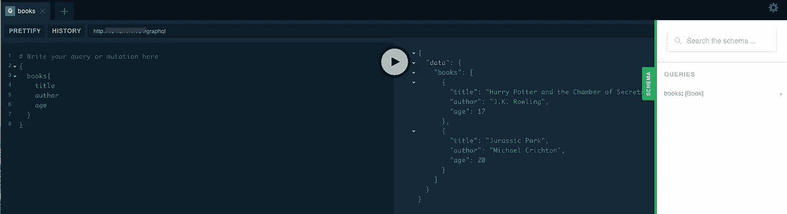
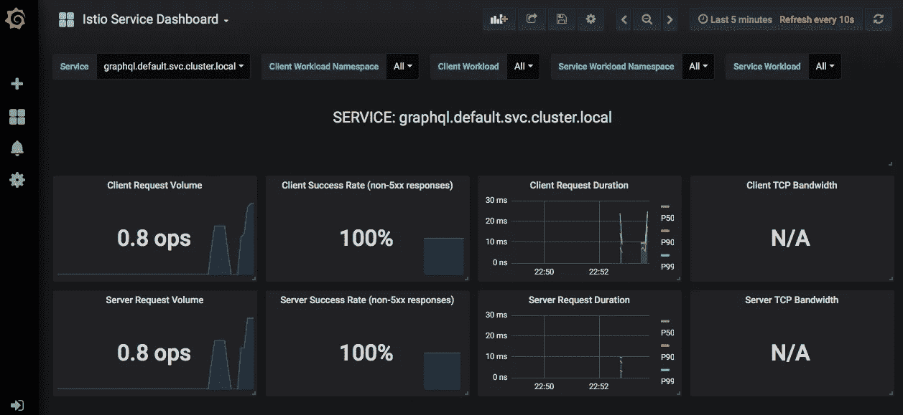

# Istio 服务网格+用于 GraphQL 的 Apollo 服务器

> 原文：<https://itnext.io/istio-service-mesh-apollo-server-for-graphql-7e7421fce5d0?source=collection_archive---------0----------------------->

天作之合。


新的建筑模式需要思考和解决的新问题。这在您使用系统架构时是肯定的，在采用微服务架构时也是如此。我肯定不想让你放弃:)总体来说优点比问题多。

基本上，你需要在流量监控、访问控制、发现、安全性、弹性方面考虑 **D+0** 。

有很多好东西吧？

> **我假设你对 Kubernetes (k8s)** 有一些基本的概念

[](https://kubernetes.io/) [## 生产级容器编排

### Kubernetes (k8s)是一个开源系统，用于自动化部署、扩展和管理容器化的…

kubernetes.io](https://kubernetes.io/) 

# 服务网格



【https://istio.io/ 

那么，什么是服务网格呢？它是微服务应用的可配置基础设施层。它使服务实例之间的通信变得灵活、可靠和快速…它提供:服务发现、负载平衡、加密、认证和授权、对断路器的支持以及其他功能。

Istio 完成了所有这些工作，但是它不需要对这些服务的代码做任何修改。

# Istio 是如何工作的？



[https://istio.io/docs/concepts/what-is-istio/](https://istio.io/docs/concepts/what-is-istio/)

神奇的事情发生了，Istio 在每个服务旁边部署了一个代理(sidecar)。Istio service mesh 是创建和管理微服务时所需特性和功能的 sidecar 容器实现。

通过使用 sidecar 模型，Istio 在 Kubernetes pods 中的 Linux 容器中运行。

# 设置

下载并提取最新版本。

```
curl -L [https://git.io/getLatestIstio](https://git.io/getLatestIstio) | sh -cd istio-1.0.5kubectl apply -f install/kubernetes/helm/istio/templates/crds.yaml
```

使用默认的[相互 TLS 认证](https://istio.io/docs/concepts/security/#mutual-tls-authentication)安装 Istio 后，当您使用此选项时，部署的工作负载保证安装了 Istio sidecars。

```
kubectl apply -f install/kubernetes/istio-demo-auth.yaml
```

如果您想要安装检查以下链接的其他选项，请[https://istio.io/docs/setup/kubernetes/quick-start/](https://istio.io/docs/setup/kubernetes/quick-start/)

不要忘记启用 Istio 注入配置。它会自动将 [Envoy](https://www.envoyproxy.io/) 容器注入到您应用程序容器中。

```
kubectl label namespace <namespace> istio-injection=enabled
```

或者，如果您愿意，您可以手动注射

```
istioctl kube-inject -f <your-app-spec>.yaml | kubectl apply -f -
```

## 验证安装

```
kubectl -n istio-system get pods
```



```
kubectl -n istio-system port-forward $(kubectl -n istio-system get pod -l app=**grafana** -o jsonpath=’{.items[0].metadata.name}’) 3000:3000
```

h [ttp://localhost:3000](http://localhost:3000)



来自我的 Grafana 的例子

# GraphQL 的 Apollo 服务器



GraphQL 是脸书自 2012 年以来开发并使用的 API 查询语言。GraphQL 只向客户端传递请求的内容。

我喜欢的另一个好处是在不影响现有查询的情况下向 GraphQL API 添加新的字段和类型，基本上你有一个单一的演进版本。

那么，我为什么要将 GraphQL 与我的微服务一起使用呢？

前几天我在读[杰夫·汉德利的博客](https://jeffhandley.com/)，他在博客中描述了他开始使用 GraphQL 时的经历

> …我们发现的另一个重要且非常成功的细节是:我们的 GraphQL 层**不是由构建 RESTful 服务的团队实现或操作的**。UI 团队构建这一层，Howard 的团队提供平台并运行服务。
> 
> 这让服务团队专注于 REST 和领域模型。GraphQL 是 UI 层的实现细节——是由 UI 而不是服务选择的技术。这就避免了数十个构建 API 的服务团队中的每一个都参与 REST vs. GraphQL 的争论。他们可以按自己的方式做事。尽管他们关心，用户界面直接消费他们的服务。我们只是碰巧在中间放了一个 GraphQL 服务器。我们可以将 GraphQL 实现集中到一个更小的开发人员社区中，在那里我们可以更容易地促进重用和共性。

**爽**。就是这样，我喜欢这样，因为大多数时候都是这样。

Sam Newman 在他的文章中说[Phil calado](http://philcalcado.com/)称之为**后端对前端(BFF)。**

强烈推荐你看这篇文章！

[](https://samnewman.io/patterns/architectural/bff/) [## 山姆·纽曼-前端的后端

### 前端的后端解决了使用微服务时移动开发的一个紧迫问题。此外，他们…

samnewman.io](https://samnewman.io/patterns/architectural/bff/) 

前端的后端是什么？

> 从概念上讲，您应该将面向用户的应用程序看作是两个组件——一个位于您外围的客户端应用程序和一个位于您外围的服务器端组件(BFF)。萨姆·纽曼

那么，如何用 Istio Service Mesh 实现 GraphQL 呢？
我选择使用 apollo 服务器平台作为 GraphQL 的实现。阿波罗服务器真的很好启动。



[https://www.apollographql.com/docs/apollo-server/](https://www.apollographql.com/docs/apollo-server/)

现在您可以创建 Dockerfile 了

…要安装所使用的依赖项:

```
npm install --save apollo-server graphqlnpm i graphql
```

最后，我们可以为 Kubernetes 部署。

```
kubectl apply -f graphql-app.yaml
```

服务和吊舱现在应该工作了！

但是要向集群的外部世界公开您的 Graphql 服务，您需要首先配置控制入口流量。

 [## 控制入口流量

### 在 Kubernetes 环境中，Kubernetes 入口资源用于指定应该在外部公开的服务…

istio.io](https://istio.io/docs/tasks/traffic-management/ingress/) 

基本上，Istio 网关是告诉 Istio-Ingres Gateway pod 打开哪些端口以及为哪些主机打开的。

```
kubectl apply -f gateway-graphql.yaml
```

打开您的浏览器:

```
[http://${GATEWAY_URL}/g](http://${GATEWAY_URL}/productpage)raphql
```



操场

您可以使用 Grafana 监控 Apollo 服务器的流量



来自我的 Grafana 的例子

# 结论

Istio 提高了您的应用程序的可见性。Istio 有很多不同的特性我在本文中没有谈到，但是我鼓励您继续探索。


通过 GraphQL，当您需要为每个通信渠道创建体验 API 时，我们有了前端使用的后端的完美匹配。使用 GraphQL 消除了特别的端点和往返对象检索，使之变得简单。

简单带来稳定。

我希望这是有帮助的，我期待着听到你的意见。

https://github.com/juniortads/demo-app

# 参考

[https://blog . jayway . com/2018/10/22/understanding-istio-ingress-gateway-in-kubernetes/](https://blog.jayway.com/2018/10/22/understanding-istio-ingress-gateway-in-kubernetes/)

[https://jeffhandley.com/2018-09-13/graphql-is-not-odata](https://jeffhandley.com/2018-09-13/graphql-is-not-odata)

[https://samnewman.io/patterns/architectural/bff/](https://samnewman.io/patterns/architectural/bff/)

[https://www . LinkedIn . com/pulse/using-graph QL-BFF-pattern-implementation-Rafael-Rocha/](https://www.linkedin.com/pulse/using-graphql-bff-pattern-implementation-rafael-rocha/)