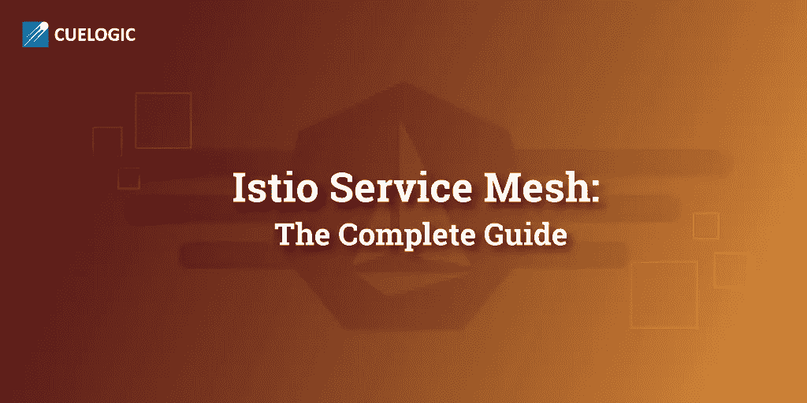
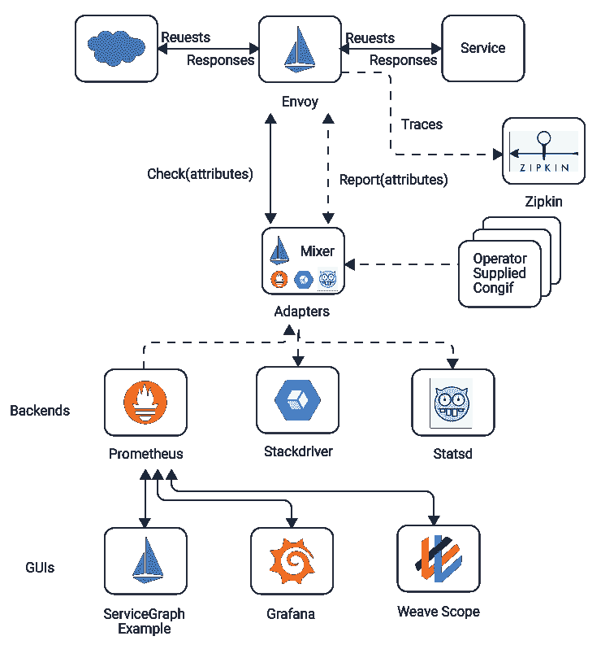
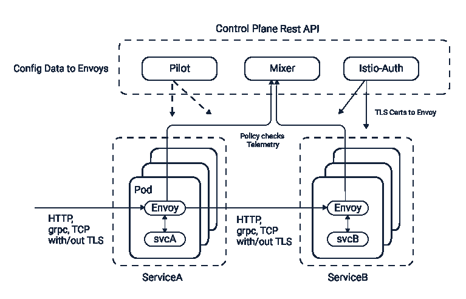
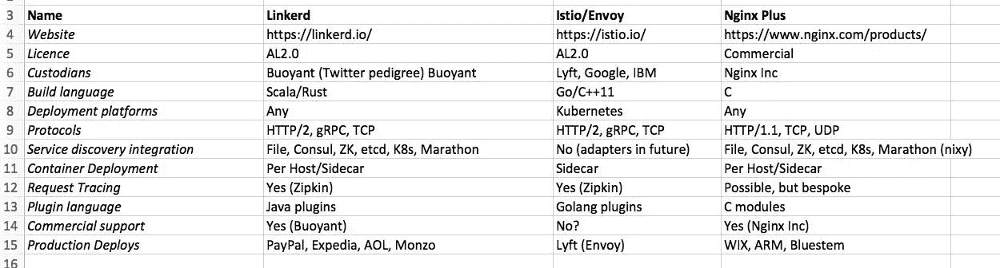
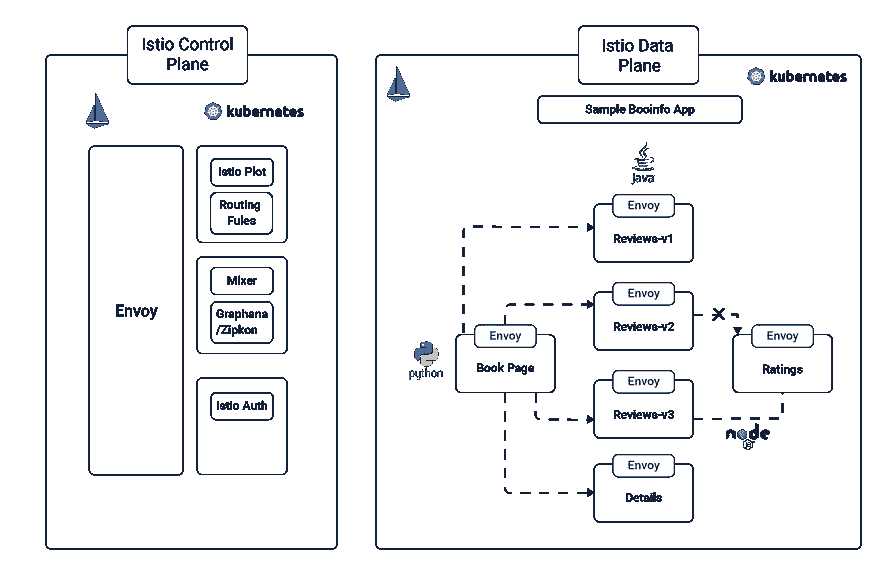
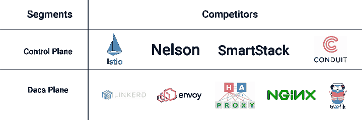
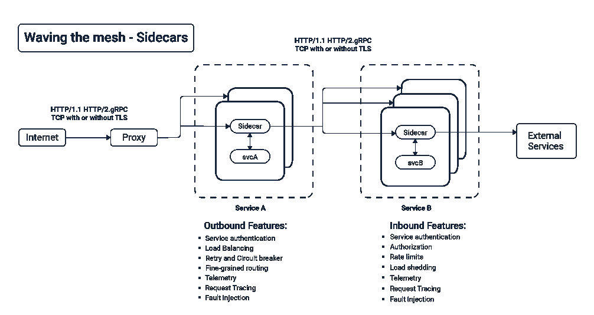

# Istio 服务网格:逐步指南

> 原文：<https://itnext.io/istio-service-mesh-the-step-by-step-guide-adf6da18bb9a?source=collection_archive---------0----------------------->



# 什么是 Istio 服务网格？

Istio 服务网格为一组服务提供了流量监控、访问控制、发现、安全性、弹性和其他有用的功能。它提供了所有这些功能，并且不需要对任何这些服务的代码进行任何更改。

为了实现这一点，Istio 在每个服务旁边部署了一个 Istio 代理(称为 Istio sidecar)。所有需要帮助的流量都被定向到代理，代理使用策略来决定如何、何时或是否将流量部署到服务。它还支持复杂的技术，如金丝雀部署、故障注入和断路器。



# Istio 如何使用容器和 Kubernetes

正如所建议的，Istio 服务网格使用 sidecar [容器实现](https://www.cuelogic.com/blog/scaling-up-with-micro-services-and-containers)主要用于微服务所需的特性和功能。它于 2017 年开发并宣布，建立在 Istio envoy 框架基础上，自那时起，它开始涉足监控、跟踪、断路器、路由、故障注入、负载平衡、重试、超时、镜像、访问控制和速率限制程序等领域。

*   Istio 的独特之处在于，所有这些功能都不需要修改代码。
*   Istio 在 Istio Kubernetes pods 的 Linux 容器中运行，使用 Istio sidecar 实现，并在需要时根据所需的配置注入和提取功能和信息。
*   它还将运营方面从代码[开发](https://www.cuelogic.com/custom-software-development)转移到运营的核心和中心。

# 服务网格化基础

服务网格背后的理论是，所有常见的网络相关任务都应该从[应用](https://www.cuelogic.com/outsource-software-development)和底层系统中推断出来。

*   因此，网格应该只是软件实体的网络，这些软件实体在需要时为不同的服务执行这样的任务。
*   如果没有这样的设置，传统的结构要求用户要么将这些任务作为网络基础设施的一部分嵌入，要么对应用层进行大量的代码更改。

在微服务环境中，这两种选择似乎都不合适。应用覆盖方法是应用认知的，并且可以创建复杂的基于内容的路由。

然而，由于大量冗余代码降低了性能，这种做法适得其反。相反，使用 L3 或 L4 覆盖层既没有任何多个服务请求的概念，也没有任何多个服务请求的可见性。

因此，服务网格成为运行和管理微服务环境的一种很好的方式，因为它在 L7 级运行，但又与应用程序代码分离。

它甚至可以通过额外的应用级洞察来实施 L3/L4 策略。

# Istio 服务网状架构

*   Istio 服务网格是一个有意设计的抽象，它同时具有控制平面和数据平面。
*   Istio 是由 IBM、Google 和 Lyft 联合创建的服务网。sidecar 模式由特使代理启用，并且基于容器。



通过将 Envoy 中介服务器注入管理之间的系统方式，Istio 提供了细化的活动管理控制，例如，堆栈调整和细粒度控制。

这种定向横截面同样使您能够分离关于运动行为的大量测量，这些测量可用于授权安排选择，例如，管理员可以设计的细粒度控制和速率限制。那些等效的度量被额外地发送到检查框架。

# Istio 通过以下方式实现这一目标:

*   控制平面，控制整个网络基础设施并加强策略和流量规则。
*   一个通过 Envoy 权宜之计使用 sidecars 的数据平面，这是一个开源的 edge 代理。

Istio 体系结构在一个高级的、安全的活动管理中实现了管理工作想要传达的目标。

*   信息层是一种高级中介的安排，它捕获有组织的运动，并将它们与系统层连接起来，以指导未来的活动。
*   控制平面具有第 7 层理解能力，可以训练信息平面根据安排、安全姿态和连续遥测数据决定一些复杂的转向选择。

行政工程给出的审议提供了很大的协助设计师，开发商和安全工程师。信息编辑平面以这样一种方式工作，它们是应用程序的隐藏系统。

控制平面进一步远离任何编辑过的成分，这意味着信息平面可以以高性能运动拦截器为中心，并在没有任何复杂性的情况下转换角色。总之，任何管理工作都可以变得更加智能，并避免构建大型代码支持网关的问题。

服务网格中的另一个关键思想是服务个性化。也就是说，每一届政府都被赋予了一个密码强健的角色。监督行政管理的实质性方面授权一个良好的，基于个性的安排，这在过去似乎是不可能的。

# Istio 服务网格的关键功能和主要用例

如今，服务网格工作空间正在大幅扩展。Istio 管理工作区的部分关键功能包括:-



库存和感知能力

*   提供对正在运行的管理、谁在与谁对话以及管理条件的理解和感知。

执行管理

*   在这里，执行意味着反应时间、资产使用，以及应用程序执行和业务度量之间的关系。
*   通过行政管理工作，协会可以设定某些执行措施，以保证资产在行政管理中以理想的形式进行分配和利用，并满足这些特定的操作措施。

安全策略管理

*   服务网格提供了根据个性来描述和监督策略的能力，例如，谁可以与谁交谈。
*   此外，您同样可以应用权威的方法来管理管理之间的关联。

运动管理

*   有了一个运转良好的组织，利用服务网格控制管理机构之间的活动真的很简单。
*   例如，Istio 发现了一种 API 安排，它使您能够设置细粒度的活动规则。此外，这还包括程序化的指导安排，当系统面临不利条件时，可以使管理部门要求更多的依赖。

# Istio 服务网格在哪里可以派上用场？



**发现和识别服务**

*   组织通常不知道哪些服务正在其基础架构中运行，这对于微服务主导的环境来说更糟。Istio service mesh 提供服务级别可见性和遥测，帮助任何组织更新服务清单和依赖性分析。

**运行可靠性**

*   遥测[数据服务](https://www.cuelogic.com/big-data-solution)告诉你服务的表现如何，比如响应服务请求所用的时间、使用的资源以及使用的频率。
*   这有助于开发人员发现问题，并在它们对更广泛的应用程序环境造成任何影响之前纠正它们。

**结构化流量治理**

*   在任何[组织](https://www.cuelogic.com/)考虑靠边站或限制特定内容(如 URL 或子 URL)的情况下，Istio 服务网格允许对任何范围的流量管理系统进行此类安排。
*   与 Istio 一样，这可以通过简单地使用 Istio 的 sidecar 功能来完成，而不需要重新处理应用程序。这包括特定网格内的服务以及进出网格的入站和出站流量。

**更安全的服务对服务通信**

*   由于 Istio 服务网格支持安全的通用服务身份系统，公司可以使用相互集成的 TLS 进行服务对服务的通信。
*   这也允许用户使用 TLS 或 JSON Web 令牌(JWS)来添加服务级别的认证(T2)过程。

**基于信任的访问控制系统**

*   Istio 之类的服务网格允许实时托管以及对数据使用网络遥测，而不是基于常见的静态属性(如用户身份、IP 地址或访问控制列表)来配置对大型机系统的访问。
*   例如，用户可以起草并执行一个安全策略，规定每个服务请求都可以根据请求的目的进行访问，或者甚至可以要求一个[证书签名请求(CSR)](https://en.wikipedia.org/wiki/Certificate_signing_request) ，如果请求者通过一系列确认性检查，该请求将成为有效的 id。

**非常时期的措施**

*   服务网格配备有执行故障注入过程和测试所有服务弹性的特定功能。Istio 服务网格可以在服务响应中注入特定的延迟，以查看应用程序如何作为一个整体组件执行和响应请求者。
*   注入延迟也是现代混沌工程技术的一种屡试不爽的方法，用于提高系统的寿命和对故障情况的恢复能力。

# Istio 入门



*   在 Minikube 平台上安装 Istio

在 Istio Kubernetes 上本地测试 Istio 的最佳方式是通过 Istio Minikube。应使用带有 [Kubernetes 服务网格和 Docker](https://www.cuelogic.com/blog/kubernetes-vs-docker-swarm) 的微服务。要在 Minikube 上安装 Istio，您必须在启动时启用以下插件。

Minikube 开始设置—extra-config-device-controller-lokalcube . setup . rg

Minikube 启动设置-extra-config-cluster sign。

*   运行 Minikube 后，在 Minikube 的 VM 上启用 Docker。这将帮助你在 docker 平台上编译和运行命令。通过指定令牌、分隔符和 minikube docker 为服务网格发送调用函数。

```
@FOR /f “tokens=* [The star sign reflects that all tokens will be loaded at the run time]delimiter=^K” %[CallName] IN ([DockerSource]) DO @call %[CallName] [At the callname, the new window will be opened with delimiter K and all the tokens].
```

*   接下来，通过 Minikube 安装 Istio 及其所有核心组件，输入 YAML 代码后进入插件和附加命令。

`kubectl apply -f install/kubernetes/istio.yaml`

# Istio 的核心组件



使者

*   Envoy 是一个开源扩展和服务代理提供商，专为云扩展网格而构建。Istio mesh 通过 Envoy 创建了一个可扩展的代理系统。

搅拌器

*   混合器是服务网格的一部分，有助于实施安全协议、允许访问控制和实现使用策略，并且独立于网格工作。

飞行员

*   Pilot 为 Istio Envoy 边车提供所有服务，并通过高级路由实现更加一致的交通管理系统。

在检查 istio.yaml 部署中的配置文件时，您会发现一些可以使用 kubectl 命令在 minikube command central 上运行命令来激活的 pod 和服务。

# 构建示例应用程序


在使用 Istio 配置任何流量规则之前，必须创建示例应用程序以便相互通信。有两种服务可用:呼叫者服务和呼叫我服务。

它们都公开了一个端点 ping，列出了应用程序的名称和版本。下面是端点 GET /callme/ping 的实现。

```
@RestController@RequestMapping(“/callme”)public class CallmeController {private static final Logger LOGGER = LoggerFactory.getLogger(CallmeController.class);@AutowiredBuildProperties buildProperties;@GetMapping(“/ping”)public String ping() {LOGGER.info(“Ping: name={}, version={}”, buildProperties.getName(), buildProperties.getVersion());return buildProperties.getName() + “:” + buildProperties.getVersion();}}Below is the code that calls the GET /callme/ping endpoint using Spring RestTemplate. This serviced output will be exposed inside the Minikube node under port 8091.@RestController@RequestMapping(“/caller”)public class CallerController {private static final Logger LOGGER = LoggerFactory.getLogger(CallerController.class);@AutowiredBuildProperties buildProperties;@AutowiredRestTemplate restTemplate;@GetMapping(“/ping”)public String ping() {LOGGER.info(“Ping: name={}, version={}”, buildProperties.getName(), buildProperties.getVersion());String response = restTemplate.getForObject(“http://callme-service:8091/callme/ping”, String.class);LOGGER.info(“Calling: response={}”, response);return buildProperties.getName() + “:” + buildProperties.getVersion() + “. Calling… ” + response;}}
```

# 处理示例应用程序

所有示例应用程序都必须在 Docker 容器上启动。下面是 Dockerfile，它负责使用关键的 caller-service 应用程序构建图像。

```
*FROM openjdk:8-jre-alpine**ENV APP_FILE caller-service-1.0.0-SNAPSHOT.jar**ENV APP_HOME /usr/app**EXPOSE 8090**COPY target/$APP_FILE $APP_HOME/**WORKDIR $APP_HOME**ENTRYPOINT [“sh”, “-c”]**CMD [“exec java -jar $APP_FILE”]**The callme-service has a similar Docker file. Now let’s move on to building Docker images.**docker build -t piomin/callme-service:1.0 .**docker build -t piomin/caller-service:1.0.**docker build -t piomin/callme-service:2.0.*
```

在 Minikube 上部署示例应用程序

首先部署两个版本的 call me-service:1.0 和 2.0。应用程序 caller-service 只是调用 callme-service。

您可以使用 Istio routerule 以不同的比例在两个版本的 callme-service 之间路由流量。还有，Minikube 不支持 Ingress，最好用 Kubernetes 服务 Mesh。如果目标是将其扩展到 Minikube 服务之外，则将类型设置为 NodePort。

```
*apiVersion: v1**kind: Service**metadata:**name: callme-service**labels:**app: callme-service**spec:**type: NodePort**ports:**– port: 8091**name: http**selector:**app: callme-service*
```

```
apiVersion: extensions/v1beta1kind: Deploymentmetadata:name: callme-servicespec:replicas: 1template:metadata:labels:app: callme-serviceversion: v1spec:containers:– name: callme-serviceimage: piomin/callme-service:1.0imagePullPolicy: IfNotPresentports:– containerPort: 8091
```

接下来，是时候实现一些 Istio 属性了。下面的命令打印带有任何 Istio 配置的部署定义的新版本。

`istioctl kube-inject -f deployment.yaml`

要将此配置应用于 Kubernetes，请键入以下命令。

`kubectl apply -f deployment-with-istio.yaml`

所有 YAML 配置文件一起提交，可以在每个应用程序模块的根目录中找到。在成功部署所有的[必需组件](https://www.cuelogic.com/blog/software-component-reusability)后，您应该在 Minikube 的仪表板中看到以下元素。

设置 Istio 路由规则

Istio 使用一种特定于领域的语言(DSL ),它允许您配置有效的规则来控制请求在服务网格中的路由方式。

以下代码在不同版本之间以 20:80 的比例分割流量，同时在 10%的请求中添加 5 秒钟的延迟，并为 10%的请求返回 HTTP 500 错误代码。

```
*apiVersion: config.istio.io/v1alpha2**kind: RouteRule**metadata:**name: callme-service**spec:**destination:**name: callme-service**route:**– labels:**version: v1**weight: 20**– labels:**version: v2**weight: 80**httpFault:**delay:**per cent: 10**fixedDelay: 5s**abort:**per cent: 10**httpStatus: 500*
```

# 应用进一步的规则

使用以下命令向 Kubernetes 应用新的路由规则。

`kubectl apply -f routerule.yaml`

程序员现在可以通过输入命令 istioctl get routerule 轻松地验证该规则。

如果出现需要 Istio 入口控制器的情况，应用程序的 Kubernetes 入口资源可以用 kubernetes.io/ingress.class:“Istio”进行注释。这里有一个这样的例子，使用图书馆/商店中书籍的案例研究

```
cat \<\<EOF “` kubectl create -f –apiVersion: extensions/v1beta1kind: Ingressmetadata:name: bookinfoannotations:kubernetes.io/ingress.class: “istio.”spec:rules:– http:paths:– path: /productpagebackend:serviceName: productpageservicePort: 9080– path: /loginbackend:serviceName: productpageservicePort: 9080– path: /logoutbackend:serviceName: productpageservicePort: 9080
```

可以使用以下代码访问新应用程序:-

```
export BOOKINFO\_URL=$(kubectl get po -l istio=ingress -o jsonpath={.items[0].status.hostIP}):$(kubectl get svc istio-ingress -o jsonpath={.spec.ports[0].nodePort})
```

# 测试解决方案

在进入[测试阶段](https://www.cuelogic.com/blog/whats-next-in-testing)之前，在 Minikube 上部署 Zipkin 是很有用的。Istio 提供了部署定义文件 zipkin.yaml，该文件可以在目录$ { ISTIO _ HOME }/install/kubernetes/addons 中找到。

`kubectl apply -f zipkin.yaml`

应用程序调用服务提供的 API 可以在源代码中提到的端口下查看。

如果您确实想测试服务，请打开 web 浏览器，调用用地址和调用者 ping 生成的 URL。将打印服务的名称和版本，以及由 caller-service 调用的 callme-service 的名称和版本。

# 结束语

Istio Service Mesh 清楚地表明，随着技术的进步，行业不会变老，只会一年比一年好。

尽管是软件家族中相对年轻的成员，Istio Service Mesh 已经提供了非常棒的新应用程序，正在改变公司处理流程的方式。在 Envoy backframe 和 Google 的进一步帮助下，新的添加和包成为其庞大库的一部分，很明显，Istio 是微服务的下一个行业标准。

**来源:**[博客](https://www.cuelogic.com/blog/istio-service-mesh)