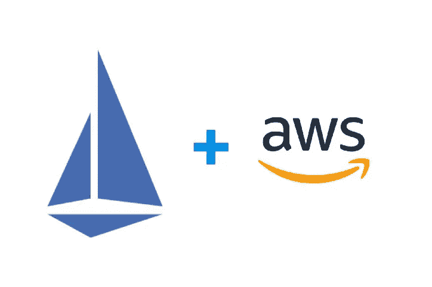

# Istio:共享入口/AWS ALB、带条件的舵图表、Istio 和外部

> 原文：<https://itnext.io/istio-shared-ingress-aws-alb-helm-chart-with-conditions-istio-and-externaldns-c75b5d188d51?source=collection_archive---------6----------------------->



让我们带着 Istio 继续我们的旅程。

以前的零件:

1.  [Istio:Kubernetes 中的概述和运行服务网格](https://rtfm.co.ua/en/istio-an-overview-and-running-service-mesh-in-kubernetes/)
2.  [Istio:外部 AWS 应用负载平衡器和 Istio 入口网关](https://rtfm.co.ua/en/istio-external-aws-application-loadbalancer-and-istio-ingress-gateway/)

除了 Istio，在这篇文章中，我们还将配置 ExternalDNS，详见 [Kubernetes:从入口](https://rtfm.co.ua/en/kubernetes-update-aws-route53-dns-from-an-ingress/)更新 AWS Route53 DNS。

下面描述的一切都是一种概念验证，将被部署到同一个 AWS Elastic Kubernetes 服务开发集群。

*   [目标](https://rtfm.co.ua/en/istio-shared-ingress-aws-alb-helm-chart-with-conditions-istio-and-externaldns/#Goals)
*   [共享入口/AWS ALB](https://rtfm.co.ua/en/istio-shared-ingress-aws-alb-helm-chart-with-conditions-istio-and-externaldns/#Shared_IngressAWS_ALB)
*   [测试应用](https://rtfm.co.ua/en/istio-shared-ingress-aws-alb-helm-chart-with-conditions-istio-and-externaldns/#Testing_applications)
*   [Istio:共享入口/AWS ALB 和头盔](https://rtfm.co.ua/en/istio-shared-ingress-aws-alb-helm-chart-with-conditions-istio-and-externaldns/#Istio_shared_IngressAWS_ALB_and_Helm)
*   [规划:条件](https://rtfm.co.ua/en/istio-shared-ingress-aws-alb-helm-chart-with-conditions-istio-and-externaldns/#Planning_conditions)
*   [创建舵图和模板](https://rtfm.co.ua/en/istio-shared-ingress-aws-alb-helm-chart-with-conditions-istio-and-externaldns/#Creating_Helm_chart_and_templates)
*   [部署](https://rtfm.co.ua/en/istio-shared-ingress-aws-alb-helm-chart-with-conditions-istio-and-externaldns/#Deployment)
*   [服务，虚拟服务，网关](https://rtfm.co.ua/en/istio-shared-ingress-aws-alb-helm-chart-with-conditions-istio-and-externaldns/#Service_VirtualService_Gateway)
*   [入口](https://rtfm.co.ua/en/istio-shared-ingress-aws-alb-helm-chart-with-conditions-istio-and-externaldns/#Ingress)
*   [Istio 和 ExternalDNS](https://rtfm.co.ua/en/istio-shared-ingress-aws-alb-helm-chart-with-conditions-istio-and-externaldns/#Istio_and_ExternalDNS)
*   [ExternalDNS 不会为 Istio Gateway 和 VirtualService 创建记录:“无法生成端点”](https://rtfm.co.ua/en/istio-shared-ingress-aws-alb-helm-chart-with-conditions-istio-and-externaldns/#ExternalDNS_doesnt_create_records_for_Istio_Gateway_and_VirtualService_No_endpoints_could_be_generated)

# 目标

所以，现在我有三个任务:

1.  测试一个共享的 AWS 应用程序负载平衡器(AWS ALB)和 Istio 入口网关如何与不同名称空间中的应用程序一起工作
2.  创建带有模板的舵图，以便能够选择创建入口、Istio 网关和 Istio 虚拟服务
3.  添加 Istio 网关或 VirtualService 时，配置 ExternalDNS 以在 AWS Route53 中创建记录

首先，让我们看看 Istio Ingress Gateway 如何与位于专用名称空间中的应用程序一起工作。为此，我们将创建一个入口，它将创建一个带有 [ALB 入口控制器](https://rtfm.co.ua/en/aws-elastic-kubernetes-service-running-alb-ingress-controller/)的 AWS 应用负载平衡器，以及两个测试应用，每个应用都有自己的服务、网关和虚拟服务。

在 Ingress/AWS ALB 中，我们将描述主机，这将触发 [ExternalDNS](https://rtfm.co.ua/kubernetes-obnovlenie-dns-v-route53-pri-sozdanii-ingress/) 创建记录。此外，这里我们将执行 SSL 终止—将从 AWS 证书管理器附加 SSL 证书。

在每个应用的网关中，我们将开放 Istio 入口网关上的端口，并添加该网关将接受流量的主机。

共享入口将在`istio-system`名称空间中创建，因为它需要访问 Istio 入口服务。

实际上，我们可以创建一个共享网关，但是在讨论的最后[这里> > >](https://discuss.istio.io/t/istio-ingressgateway-controller-and-namespaces/1217/14) 人们说每个应用程序有一个专用网关会更好，这似乎更正确，所以让我们这样做。

因此，现在我们将创建:

1.  专用入口/AWS ALB，在 Route53 的`istio-system`命名空间中有两个测试记录
2.  在名称空间`backend-app-1-ns`和`backend-app-2-ns`中测试 *app1* 和 *app2* 相应地，每个应用都有自己的部署、服务、网关和虚拟服务

第二个任务将更加有趣:需要创建 Helm 模板来在不同的环境(类似于开发和生产)上部署应用程序，以在具有不同入口和 Istio 配置的各种环境上部署应用程序。

在第三项任务中，我们将配置 ExternalDNS 以与 Istio Gateway 和 VirtualService 一起工作。

下面的一些部分可能会令人困惑，但我已经尽可能简单地描述了它们。

# 共享入口/AWS ALB

为 Ingress/ALB 创建清单文件— `common-ingress-gateway.yaml`:

```
---
apiVersion: extensions/v1beta1
kind: Ingress
metadata:
  name: backend-common-alb
  namespace: istio-system
  annotations:
    # create AWS Application LoadBalancer
    kubernetes.io/ingress.class: alb
    # external type
    alb.ingress.kubernetes.io/scheme: internet-facing
    # AWS Certificate Manager certificate's ARN
    alb.ingress.kubernetes.io/certificate-arn: "arn:aws:acm:us-east-2:534***385:certificate/db886018-c173-43d0-b1be-b940de71f2a2"
    # open ports 80 and 443 
    alb.ingress.kubernetes.io/listen-ports: '[{"HTTP": 80}, {"HTTPS":443}]'
    # redirect all HTTP to HTTPS
    alb.ingress.kubernetes.io/actions.ssl-redirect: '{"Type": "redirect", "RedirectConfig": { "Protocol": "HTTPS", "Port": "443", "StatusCode": "HTTP_301"}}'
    # ExternalDNS settings: [https://rtfm.co.ua/en/kubernetes-update-aws-route53-dns-from-an-ingress/](https://rtfm.co.ua/en/kubernetes-update-aws-route53-dns-from-an-ingress/)
    external-dns.alpha.kubernetes.io/hostname: "app1-test-common-ingress.example.com, app2-test-common-ingress.example.com"
spec:
  rules:
  - http:
      paths:
        - path: /*
          backend:
            serviceName: ssl-redirect
            servicePort: use-annotation
        - path: /*
          backend:
            serviceName: istio-ingressgateway
            servicePort: 80
```

这里，在`annotations`中，我们描述了将由外部域名创建的域名，它们将被映射到 AWS ALB 的 URL，在`backend`中，我们将把所有流量发送到`istio-ingressgateway` Kubernetes 服务。

部署它:

```
$ kubectl apply -f common-ingress-gateway.yaml
ingress.extensions/backend-common-alb created
```

检查入口/大气:

```
$ kubectl -n istio-system get ingress backend-common-alb
NAME CLASS HOSTS ADDRESS PORTS AGE
backend-common-alb <none> * aadca942-***1826302788.us-east-2.elb.amazonaws.com 80 72s
```

和外部 DNS 日志:

```
…
time=”2021–04–12T09:45:02Z” level=info msg=”Desired change: CREATE app-1-test-common-ingress.example.com A [Id: /hostedzone/Z30KLN6M3D0LB6]”
time=”2021–04–12T09:45:02Z” level=info msg=”Desired change: CREATE app-1-test-common-ingress.example.com TXT [Id: /hostedzone/Z30KLN6M3D0LB6]”
time=”2021–04–12T09:45:02Z” level=info msg=”Desired change: CREATE app-2-test-common-ingress.example.com A [Id: /hostedzone/Z30KLN6M3D0LB6]”
time=”2021–04–12T09:45:02Z” level=info msg=”Desired change: CREATE app-2-test-common-ingress.example.com TXT [Id: /hostedzone/Z30KLN6M3D0LB6]”
time=”2021–04–12T09:45:03Z” level=info msg=”4 record(s) in zone example.com. [Id: /hostedzone/Z30KLN6M3D0LB6] were successfully updated”
…
```

尝试访问 URL，必须得到一个错误，因为 Istio 入口网关尚未配置:

```
$ curl -I [https://app-1-test-common-ingress.example.com](https://app-1-test-common-ingress.example.com)
HTTP/2 502
date: Mon, 12 Apr 2021 09:46:11 GMT
server: istio-envoy
```

是的，502 错误，因为 Istio 入口网关还没有域的路由:

```
$ istioctl proxy-config routes -n istio-system istio-ingressgateway-8459df68cb-bh76b
NOTE: This output only contains routes loaded via RDS.
NAME DOMAINS MATCH VIRTUAL SERVICE
* /healthz/ready*
* /stats/prometheus*
```

现在，让我们创建测试应用程序，我们将在其中描述 Istio 入口网关的设置。

## 测试应用程序

除了应用程序和服务的名称空间和名称之外，这两个应用程序完全相似。

在这里，我们将创建:

*   命名空间
*   部署
*   服务
*   门
*   虚拟服务

整个清单如下:

```
---
apiVersion: v1
kind: Namespace
metadata:
  name: backend-app-1-ns
  labels:
    istio-injection:
      enabled
---
apiVersion: apps/v1
kind: Deployment
metadata:
  name: backend-app-1-deploy
  namespace: backend-app-1-ns
  labels:
    app: backend-app-1
    version: v1
spec:
  replicas: 2
  selector:
    matchLabels:
      app: backend-app-1
  template:
    metadata:
      labels:
        app: backend-app-1
        version: v1
    spec: 
      containers:
      - name: app1
        image: nginxdemos/hello
        ports:
        - containerPort: 80
        resources:
          requests:
            cpu: 100m
            memory: 100Mi
        readinessProbe:
          httpGet:
            path: /
            port: 80
---
apiVersion: v1
kind: Service
metadata:
  name: backend-app-1-servcie
  namespace: backend-app-1-ns
spec:       
  selector:
    app: backend-app-1
  ports:    
    - name: http
      protocol: TCP
      port: 80
---
apiVersion: networking.istio.io/v1alpha3
kind: Gateway
metadata:
  name: backend-app-1-gateway
  namespace: backend-app-1-ns
spec:
  selector:
    istio: ingressgateway
  servers:
  - port:
      number: 80
      name: http
      protocol: HTTP
    hosts:
    - "app-1-test-common-ingress.example.com"
---
apiVersion: networking.istio.io/v1alpha3
kind: VirtualService
metadata:
  name: backend-app-1-virtualservice
  namespace: backend-app-1-ns
spec:
  hosts:
  - "app-1-test-common-ingress.example.com"
  gateways:
  - backend-app-1-gateway
  http:
  - match:
    - uri:
        prefix: /
    route:
    - destination:
        host: backend-app-1-servcie
        port:
          number: 80
```

部署它:

```
$ kubectl apply -f app1.yaml
namespace/backend-app-1-ns created
deployment.apps/backend-app-1-deploy created
service/backend-app-1-servcie created
gateway.networking.istio.io/backend-app-1-gateway created
virtualservice.networking.istio.io/backend-app-1-virtualservice created
```

复制清单文件，将 *app-1* 改为 *app-2* ，同样部署:

```
$ kubectl apply -f app2.yaml
namespace/backend-app-2-ns created
deployment.apps/backend-app-2-deploy created
service/backend-app-2-servcie created
gateway.networking.istio.io/backend-app-2-gateway created
virtualservice.networking.istio.io/backend-app-2-virtualservice created
```

再次检查 Istio 的路线:

```
$ istioctl proxy-config routes -n istio-system istio-ingressgateway-8459df68cb-bh76b=
NOTE: This output only contains routes loaded via RDS.
NAME DOMAINS MATCH VIRTUAL SERVICE
http.80 app-1-test-common-ingress.example.com /* backend-app-1-virtualservice.backend-app-1-ns
http.80 app-2-test-common-ingress.example.com /* backend-app-2-virtualservice.backend-app-2-ns
```

并尝试访问 *app-1* 的 URL:

```
$ curl -I [https://app-1-test-common-ingress.example.com](https://app-1-test-common-ingress.example.com)
HTTP/2 200
date: Mon, 12 Apr 2021 09:52:13 GMT
content-type: text/html
server: istio-envoy
```

酷，现在一切正常。现在，我们有一个用 Kubernetes Ingress 创建的共享 AWS ALB，它通过 Istio Ingress 网关向两个专用应用程序和专用名称空间发送流量。

丢弃资源，但将入口留在共享负载平衡器中，以供进一步测试:

```
$ kubectl delete -f app1.yaml
$ kubectl delete -f app2.yaml
```

让我们看看舵轮图。

# Istio:共享入口/AWS ALB 和头盔

## 规划:条件

下面的任务很重要:我们有一个开发 EKS 集群，和一个生产 EKS。

在开发集群上，我们已经有了 Istio，它正在那里进行测试，但不是针对所有在那里运行的应用程序。在生产集群上，我们还没有安装 Ietio，但将来会安装。

此外，我们所有的应用程序现在都在专用的名称空间中，并且有专用的 Ingress/AWS ALB。

在开发集群上，我想改变这种方法，现在使用共享的 Ingress/ALB，并通过 Istio Ingress 网关发送所有流量，但在生产集群上，保持原样，即每个应用程序将使用自己的 ALB，目前，他们将直接向应用程序的服务发送流量，将来，当我们在生产集群上实施 Istio 时，我们需要将 Ingress 更改为使用 Istio Ingress 网关。

但是，开发和生产应用程序可能会使用或不使用 Istio，因为它在我们的架构中还处于“早期阶段”,并且应用程序的一些时间设置会有所不同，因此需要创建这样一个掌舵图，它可以配置必要的资源和入口设置。

所以，一开始，需要т.е。во-первых — надо确定图表使用自己的入口还是共享的入口？第二件事是，如果它使用自己的入口，它将使用哪个后端——Istio 入口网关还是应用程序的公共服务？如果它将使用 Istio 入口网关，图表必须创建网关和虚拟服务资源。

因此，我们的模板必须接受三种配置方案:

1.  使用共享负载平衡器和 Istio: Istio 入口网关负载平衡器和 Istio 入口网关服务作为`backend`
2.  拥有/专用于应用和 Istio 入口网关的负载平衡器:使用 Istio 入口网关服务为应用创建入口`backend`
3.  拥有/专用于应用程序的负载平衡器，但没有 Istio:使用应用程序的服务作为`backend`为应用程序创建入口

即:

1.  入口是共享的还是自己的？
2.  如果共享—不创建入口资源
3.  如果拥有，然后创建一个入口，但选择后端 Istio 入口服务，或一个应用程序的公共 Kubernetes 服务
4.  入口后端——是应用程序的组织还是服务？
5.  如果是 Istio，那么需要将`backend`设置为`serviceName: istio-ingressgateway`，并创建网关和虚拟服务资源
6.  如果是应用程序的服务，则将`baсkend`设置为`serviceName: <APPNAME>-service`，不创建网关和虚拟服务资源

为了实现这个目标，让我们使用一个`values.yaml`——我们为开发和生产环境准备了专用文件。

在这些文件中，我们可以定义两个参数— `istio.enabled`和`ingress.enabled`。

这将使我们能够为 Dev `ingress.enabled=false`设置，但不创建入口，而是设置`istio.enabled==true`并创建网关和 VirtualService，这将由来自`istio-system`名称空间的共享入口/ALB 使用。

对于生产，我们将能够设置`ingress.enabled=true`和`istio.enabled=false`，然后图表将通过当前使用的方案进行部署，稍后，当我们在生产集群上实施 Istio 时，我们将这些值设置为`ingress.enabled=true`和`istio.enabled=true`，这将创建一个专用的入口/负载平衡器，它将通过 Istio 入口网关发送流量。

好吧，我们试试。

## 创建舵图和模板

创建新图表:

```
$ helm create app-1
Creating app-1
```

创建目录以保存用于开发和生产的`values.yaml`:

```
$ mkdir -p app-1/env/{dev,prod}
```

删除默认模板和值:

```
$ rm -r app-1/templates/* app-1/values.yaml
```

在这些目录中创建自己的值文件:

```
$ vim -p app-1/env/dev/values.yaml app-1/env/prod/values.yaml
```

对于开发人员— `app-1/env/dev/values.yaml`:

```
appConfig:
  name: "backend-app-1"
  version: "v1"
  url: "dev-app-1-test-common-ingress.example.com"

istio:
  enabled: true

ingress:
  enabled: false
```

不要创建入口，而是创建网关和虚拟服务。

生产— `app-1/env/prod/values.yaml`:

```
appConfig:
  name: "backend-app-1"
  version: "v1"
  url: "prod-app-1-test-common-ingress.example.com"

istio:
  enabled: false

ingress:
  enabled: true
```

在这里，将创建一个入口作为专用 AWS ALB，但不会创建资源—入口将直接向应用程序的服务发送流量

创建模板文件:

```
$ vim -p app-1/templates/ingress.yaml app-1/templates/service.yaml app-1/templates/deployment.yaml
```

我们不会在那些模板中定义`namespace`(仅用于入口，见下文)，因为名称空间将由 Helm 在部署期间创建。

## 部署

这里没有变化，只是一些值取自`values.yaml`:

```
--- 
apiVersion: apps/v1
kind: Deployment
metadata:
  name: {{ .Values.appConfig.name }}-deploy
  labels:
    app: {{ .Values.appConfig.name }}
    version: {{ .Values.appConfig.version }}
spec:
  replicas: 2
  selector:
    matchLabels:
      app: {{ .Values.appConfig.name }}
  template: 
    metadata:
      labels:
        app: {{ .Values.appConfig.name }}
        version: {{ .Values.appConfig.version }}
    spec: 
      containers:
      - name: web-app
        image: nginxdemos/hello
        ports:
        - containerPort: 80
        resources:
          requests:
            cpu: 100m
            memory: 100Mi
        readinessProbe:
          httpGet:
            path: /
            port: 80
```

## 服务，虚拟服务，网关

在这里，我们将始终创建一个带有条件检查的服务:如果`ingress.enabled==true`，那么设置`type: NodePort`，这样我们的负载平衡器将能够向 WorkerNode 发送流量。如果是`false`，那么使用缺省值`ClusterIP`，这样我们的请求就不会经过额外的 Iptables 规则，而是直接发送到一个 Pod 离开的 WorkerNode(参见 [Kubernetes: Service，load balancing，kube-proxy，和 iptables](https://rtfm.co.ua/en/kubernetes-service-load-balancing-kube-proxy-and-iptables/) ):

```
--- 
apiVersion: v1
kind: Service
metadata:
  name: {{ .Values.appConfig.name }}-service
spec:
  {{- if .Values.ingress.enabled }}
  type: NodePort
  {{- end }}
  selector:
    app: {{ .Values.appConfig.name }}
  ports:
    - name: http
      protocol: TCP
      port: 80
```

然后，将检查`istio.enabled`条件，如果设置为`true`，将创建网关和虚拟服务资源:

```
{{- if .Values.istio.enabled }}
---
apiVersion: networking.istio.io/v1alpha3
kind: Gateway
metadata:
  name: {{ .Values.appConfig.name }}-gateway
spec:     
  selector: 
    istio: ingressgateway
  servers:
  - port: 
      number: 80
      name: http
      protocol: HTTP
    hosts:  
    - {{ .Values.appConfig.url }}
---         
apiVersion: networking.istio.io/v1alpha3
kind: VirtualService
metadata:
  name: {{ .Values.appConfig.name }}-virtualservice
spec:
  hosts:
  - {{ .Values.appConfig.url }}
  gateways:
  - {{ .Values.appConfig.name }}-gateway
  http:
  - match:
    - uri:
        prefix: /
    route:
    - destination:
        host: {{ .Values.appConfig.name }}-service
        port:
          number: 80
{{- end }}
```

## 进入

对于`ingress.enabled`条件中的入口，首先将检查是否需要创建入口，如果需要，那么将检查使用哪个名称空间，就像我们将使用 Istio 一样，那么这个入口必须在`istio-system`名称空间中创建，如果是“公共”入口，那么在应用程序的名称空间中创建。

稍后，我们将使用`istio.enabled`检查它的流量将被发送到哪里——发送到 Istio 或应用程序的一个公共服务:

```
{{- if .Values.ingress.enabled }}
--- 
apiVersion: extensions/v1beta1
kind: Ingress
metadata:
  name: {{ .Values.appConfig.name }}-alb
  {{- if .Values.istio.enabled }}
  namespace: istio-system
  {{- end }}
  annotations:
    kubernetes.io/ingress.class: alb
    alb.ingress.kubernetes.io/scheme: internet-facing
    alb.ingress.kubernetes.io/certificate-arn: "arn:aws:acm:us-east-2:534***385:certificate/db886018-c173-43d0-b1be-b940de71f2a2"
    alb.ingress.kubernetes.io/listen-ports: '[{"HTTP": 80}, {"HTTPS":443}]'
    alb.ingress.kubernetes.io/actions.ssl-redirect: '{"Type": "redirect", "RedirectConfig": { "Protocol": "HTTPS", "Port": "443", "StatusCode": "HTTP_301"}}'
    external-dns.alpha.kubernetes.io/hostname: {{ .Values.appConfig.url }}
spec:   
  rules:
  - http:
      paths:
        - path: /*
          backend:
            serviceName: ssl-redirect
            servicePort: use-annotation
        - path: /*
          backend:
          {{- if .Values.istio.enabled }}
            serviceName: istio-ingressgateway
          {{ else }}
            serviceName: {{ .Values.appConfig.name }}-service
          {{- end }}
            servicePort: 80
{{- end }}
```

使用`--debug`和`--dry-run`运行舵-不得打印入口，但必须提供带有虚拟服务的网关:

helm upgrade—install back end-app-1—命名空间 dev-back end-app-1-ns—create-namespace-f app-1/env/dev/values . YAML app-1/—调试—模拟运行

如果这里没有错误，那么将其部署到开发集群:

```
$ helm upgrade --install backend-app-1 --namespace dev-backend-app-1-ns --create-namespace -f app-1/env/dev/values.yaml app-1/
Release “backend-app-1” does not exist. Installing it now.
NAME: backend-app-1
LAST DEPLOYED: Mon Apr 12 18:03:08 2021
NAMESPACE: dev-backend-app-1-ns
STATUS: deployed
REVISION: 1
TEST SUITE: None
```

检查`dev-backend-app-1-ns`名称空间中的入口:

```
$ kubectl -n dev-backend-app-1-ns get ingress
No resources found.
```

很好，我们必须看到网关和虚拟服务的创建:

```
$ kubectl -n dev-backend-app-1-ns get gateway
NAME AGE
backend-app-1-gateway 38s
kubectl -n dev-backend-app-1-ns get virtualservice
NAME GATEWAYS HOSTS AGE
backend-app-1-virtualservice [backend-app-1-gateway] [dev-app-1-test-common-ingress.example.com] 65s
```

很好！

现在，部署一个“生产”:

```
$ helm upgrade --install backend-app-1 --namespace prod-backend-app-1-ns --create-namespace -f app-1/env/prod/values.yaml app-1/
```

检查它在`prod-backend-app-1-ns`名称空间中的入口，因为我们在这里设置了不使用 Istio:

```
$ kubectl -n prod-backend-app-1-ns get ingress
NAME CLASS HOSTS ADDRESS PORTS AGE
backend-app-1-alb <none> * aadca942-***-49478225.us-east-2.elb.amazonaws.com 80 4m54s
```

对于开发环境，更新我们在最开始创建的入口——这是我们的共享入口。在这里添加`external-dns.alpha.kubernetes.io/hostname`，这样 ExternalDNS 将创建一个映射到此负载平衡器的记录:

```
...
    # ExternalDNS settings: [https://rtfm.co.ua/en/kubernetes-update-aws-route53-dns-from-an-ingress/](https://rtfm.co.ua/en/kubernetes-update-aws-route53-dns-from-an-ingress/)
    external-dns.alpha.kubernetes.io/hostname: "dev-app-1-test-common-ingress.example.com"
...
```

应用:

```
$ kubectl apply -f common-ingress-gateway.yaml
ingress.extensions/backend-common-alb configured
```

检查 Istio 入口网关路由—我们现在只能看到 Dev 路由:

```
$ istioctl proxy-config routes -n istio-system istio-ingressgateway-8459df68cb-bh76b — name http.80
NOTE: This output only contains routes loaded via RDS.
NAME DOMAINS MATCH VIRTUAL SERVICE
http.80 dev-app-1-test-common-ingress.example.com /* backend-app-1-virtualservice.dev-backend-app-1-ns
```

或者这样:

```
$ istioctl proxy-config routes -n istio-system istio-ingressgateway-8459df68cb-bh76b — name http.80 -o json | jq ‘.[].virtualHosts[].domains[0], .[].virtualHosts[].routes[].route.cluster’
“dev-app-1-test-common-ingress.example.com”
“outbound|80||backend-app-1-service.dev-backend-app-1-ns.svc.cluster.local”
```

并尝试访问应用程序的 URL。

产品:

```
$ curl -I [https://prod-app-1-test-common-ingress.example.com](https://prod-app-1-test-common-ingress.example.com)
HTTP/2 200
date: Tue, 13 Apr 2021 12:47:15 GMT
content-type: text/html
server: nginx/1.13.8
```

`server: nginx/1.13.8` -从 NGINX 收到的响应，这意味着请求通过负载均衡器直接发送给应用程序的服务。

和 Dev:

```
$ curl -I [https://dev-app-1-test-common-ingress.example.com](https://dev-app-1-test-common-ingress.example.com)
HTTP/2 200
date: Tue, 13 Apr 2021 12:47:18 GMT
content-type: text/html
server: istio-envoy
```

`server: istio-envoy` -流量通过共享负载平衡器，然后到达 Istio 入口网关，然后到达一个 sidecar 容器，该容器带有应用程序 Pod 中的 Envoy 代理。

现在，让我们检查第三个可用的方案—创建一个专用入口，但是为它启用 Istio。

在`app-1/env/prod/values.yaml`中将`istio.enabled`更改为*真*，`ingress.enabled`我们已经设置为*真*:

```
appConfig:
  name: "backend-app-1"
  version: "v1"
  url: "prod-app-1-test-common-ingress.example.com"

istio:
  enabled: true

ingress:
  enabled: true
```

更新设置:

```
$ helm upgrade --install backend-app-1 --namespace prod-backend-app-1-ns --create-namespace -f app-1/env/prod/values.yaml app-1/
```

再次检查 Istio 入口网关路由:

```
$ istioctl proxy-config routes -n istio-system istio-ingressgateway-8459df68cb-bh76b --name http.80
NOTE: This output only contains routes loaded via RDS.
NAME DOMAINS MATCH VIRTUAL SERVICE
http.80 dev-app-1-test-common-ingress.example.com /* backend-app-1-virtualservice.dev-backend-app-1-ns
http.80 prod-app-1-test-common-ingress.example.com /* backend-app-1-virtualservice.prod-backend-app-1-ns
```

是的，我们现在有了一条通往生产后端的新路线。

检查`prod-backend-app-1-ns`名称空间中的入口:

```
$ kubectl -n prod-backend-app-1-ns get ingress backend-app-1-alb
Error from server (NotFound): ingresses.extensions “backend-app-1-alb” not found
```

好，检查一下`istio-system`名称空间:

```
$ kubectl -n istio-system get ingress backend-app-1-alb
NAME CLASS HOSTS ADDRESS PORTS AGE
backend-app-1-alb <none> * aadca942-***-1554475105.us-east-2.elb.amazonaws.com 80 8m52s
```

用`curl`试试:

```
$ curl -I [https://prod-app-1-test-common-ingress.example.com](https://prod-app-1-test-common-ingress.example.com)
HTTP/2 200
date: Tue, 13 Apr 2021 13:14:34 GMT
content-type: text/html
server: istio-envoy
```

`server: istio-envoy` -太好了！我们的交通现在正在通过 Istio。

# 内部和外部

最后一件事是将 ExternalDNS 与 Istio 一起使用。

目前，当使用共享入口和负载平衡器时，我们可以在该入口的注释中指定主机/URL，但该入口不会受应用程序的舵图影响，因为它是从专用清单创建的`common-ingress-gateway.yaml`。

因此，为了能够在应用程序部署期间创建 DNS 记录，我们需要更新共享入口的注释，这导致了额外的自动化和复杂性。

相反，我们可以在某种程度上配置 ExternalDNS，它不仅会使用 Ingresses 注释，还会使用 Istio 的资源。

让我们更新它的部署并添加`--source=istio-gateway`和/或`--source=istio-virtualservice`，参见文档[此处> > >](https://github.com/kubernetes-sigs/external-dns/blob/master/docs/tutorials/istio.md) :

```
...
      containers:
      - args:
        - --log-level=info
        - --log-format=text
        - --events
        - --policy=upsert-only
        - --provider=aws
        - --registry=txt
        - --interval=2m
        - --source=service
        - --source=ingress
        - --source=istio-gateway
        - --source=istio-virtualservice
...
```

从`common-ingress-gateway.yaml`上取下线:

```
...
external-dns.alpha.kubernetes.io/hostname: "dev-app-1-test-common-ingress.example.com"
...
```

现在，将从网关的`spec.servers.hosts`或虚拟服务的`spec.hosts`在网关和/或虚拟服务中设置主机名。

另外，检查 ExternalDNS 是否能够读取其 ClusterRole `external-dns`中的 Istio 资源:

```
...
- apiGroups:
  - networking.istio.io
  resources:
  - virtualservices
  - gateways
  verbs:
  - get
  - list
  - watch
...
```

## ExternalDNS 不会为 Istio Gateway 和 VirtualService 创建记录:“无法生成任何端点”

但是这里我面临一个问题。

在 ExternalDNS 部署中启用`--debug`并检查其日志:

```
…
time=”2021–04–14T12:53:05Z” level=debug msg=”Adding event handler for Istio VirtualService”
time=”2021–04–14T12:53:05Z” level=debug msg=”Adding event handler for Istio Gateway”
time=”2021–04–14T12:53:05Z” level=debug msg=”Adding event handler for service”
time=”2021–04–14T12:53:05Z” level=debug msg=”Adding event handler for ingress”
…
level=debug msg=”No endpoints could be generated from ingress istio-system/backend-common-alb”
…
```

创建了 istio 的处理程序，因此 ExternalDNS 可以看到 Istio 的更新，但不能创建新记录。

这是因为 Istio 入口网关服务是使用节点端口服务的类型创建的，以使其与共享负载平衡器而不是默认负载平衡器一起工作，并且 ExternalDNS 无法解析 VirtualService 来确定从`common-ingress-gateway.yaml`清单创建的外部入口的 [Kubernetes 端点](https://rtfm.co.ua/en/kubernetes-what-is-endpoints/)。

我们可以用一个小技巧来“修复”它:在 VirtualService 注释中直接指定 ALB 的 URL。

尽管如此，请记住，在某些情况下，将使用专用的 Ingress/ALB 创建一个 VirtualService，然后我们不需要添加此注释。

因此，向 VirtualService 清单添加一个新条件— `if not .Values.ingress.enabled`:

```
apiVersion: networking.istio.io/v1alpha3
kind: VirtualService
metadata:
  name: {{ .Values.appConfig.name }}-virtualservice
  {{- if not .Values.ingress.enabled }}
  annotations:
    external-dns.alpha.kubernetes.io/target: {{ .Values.istio.externalURL }}
  {{- end }}
...
```

并在`app-1/env/dev/values.yaml`文件中为`istio.externalURL`设置一个蓝色——它将足够持久，并将仅用于开发环境:

```
...
istio:
  enabled: true
  externalURL: "aadca942-istiosystem-backe-3ee2-700661912.us-east-2.elb.amazonaws.com"
...
```

总之，服务、网关和 VirtualService 将有这样一个清单:

```
--- 
apiVersion: v1
kind: Service
metadata:
  name: {{ .Values.appConfig.name }}-service
spec:
  {{- if .Values.ingress.enabled }}
  type: NodePort
  {{- end }}
  selector:
    app: {{ .Values.appConfig.name }}
  ports:
    - name: http
      protocol: TCP
      port: 80

{{- if .Values.istio.enabled }}
--- 
apiVersion: networking.istio.io/v1alpha3
kind: Gateway
metadata:
  name: {{ .Values.appConfig.name }}-gateway
spec:
  selector:
    istio: ingressgateway
  servers:  
  - port:
      number: 80
      name: http 
      protocol: HTTP
    hosts:
    - "*"
---       
apiVersion: networking.istio.io/v1alpha3
kind: VirtualService
metadata:
  name: {{ .Values.appConfig.name }}-virtualservice
  {{- if not .Values.ingress.enabled }}
  annotations:
    external-dns.alpha.kubernetes.io/target: {{ .Values.istio.externalURL }}
  {{- end }}
spec:
  hosts:
  - {{ .Values.appConfig.url | quote }}
  gateways:
  - {{ .Values.appConfig.name }}-gateway
  http:
  - match:
    - uri:
        prefix: /
    route:
    - destination:
        host: {{ .Values.appConfig.name }}-service
        port:
          number: 80
{{- end }}
```

部署它并检查外部 DNS 日志:

```
…
time=”2021–04–14T13:05:00Z” level=info msg=”Desired change: CREATE dev-app-1-test-common-ingress.example.com A [Id: /hostedzone/Z30KLN6M3D0LB6]”
time=”2021–04–14T13:05:00Z” level=info msg=”Desired change: CREATE dev-app-1-test-common-ingress.example.com TXT [Id: /hostedzone/Z30KLN6M3D0LB6]”
…
```

用`curl`再试一次:

```
$ curl -I [https://dev-app-1-test-common-ingress.example.com](https://dev-app-1-test-common-ingress.example.com)
HTTP/2 200
date: Wed, 14 Apr 2021 13:21:11 GMT
content-type: text/html
server: istio-envoy
```

完成了。

*最初发布于* [*RTFM: Linux、DevOps、系统管理*](https://rtfm.co.ua/en/istio-shared-ingress-aws-alb-helm-chart-with-conditions-istio-and-externaldns/) *。*