# (第三部分。)在 Unity 中创造僵尸敌人

> 原文：<https://itnext.io/it-follows-creating-zombie-enemies-in-unity-part-3-of-unity-gamedev-series-988da87c8273?source=collection_archive---------2----------------------->

在这一部分，我将向你展示如何在 NavMesh 上制造敌人。我会让他们追我，适当的碰撞物体。

如果你想拥有和本教程完全一样的场景，完成这个系列的前两部分。

[](https://medium.com/@janjilecek/basics-of-3d-animation-in-unity-tutorial-d2d6ff3bc6b7) [## Unity 中的 3D 动画基础[教程]

### 这是一个新游戏开发系列的开始。我将向你展示使用 Unity 游戏引擎的基础知识。统一…

medium.com](https://medium.com/@janjilecek/basics-of-3d-animation-in-unity-tutorial-d2d6ff3bc6b7) [](/how-to-write-a-simple-3d-character-controller-in-unity-1a07b954a4ca) [## 如何在 Unity 中编写一个简单的 3D 角色控制器

### 这是我的游戏开发系列的第二部分。设置行走(和其他动画)见第一部分。

itnext.io](/how-to-write-a-simple-3d-character-controller-in-unity-1a07b954a4ca) 

# 头号公敌

创建一个*敌人*对象

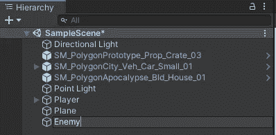

免费的合成多边形包提供了许多免费的角色模型。有四个豆人模型，一男一女。现在，有另一个不同质地的男人会很无聊，我也不想同时被一百个女人追。所以我选择了一个警察豆模型，这似乎很好地代表了我对极权主义国家的普遍恐惧(开玩笑)。选择一个模型并将其拖动到场景中。

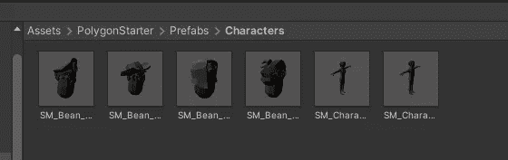

我和警察豆怪一起去。母它对着*的敌人*的对象。

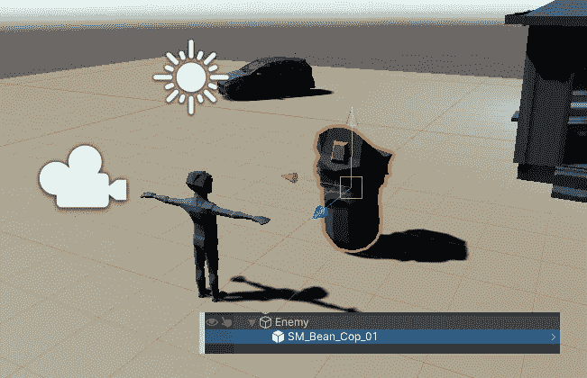

创建一个敌方脚本，并将其分配给敌方对象。

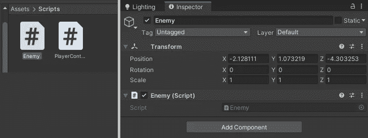

# 寻路-让敌人追你

打开导航面板

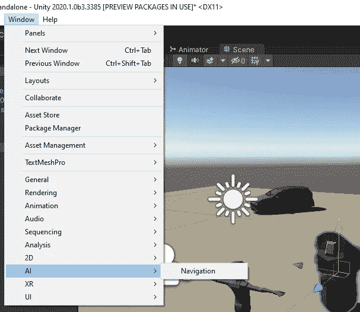

一旦打开，选择平面对象并检查*导航静态。*同时检查该区域是否设置为*可步行*。


然后切换到烘焙面板，用烘焙按钮进行烘焙。

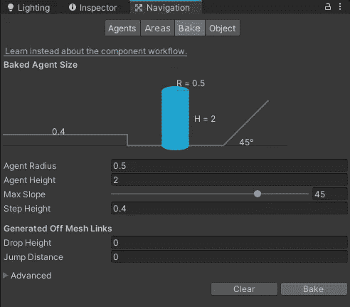

现在场景是这样的。


现在我需要改变场景对象为*不可行走。*点击单个对象并更改其导航。然后*烤*它。

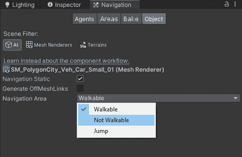

然后它会开始看起来像这样。敌人将无法通过这些通道。他只知道可步行的区域。

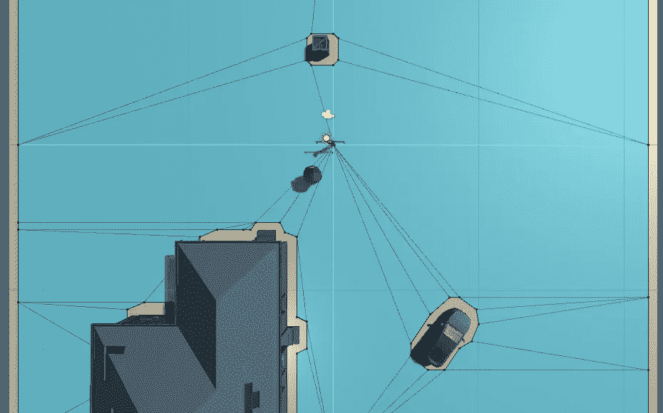

敌人需要一些基本的情报来追踪玩家。给他添加 *NavMeshAgent* 组件(选择*玩家*和*添加组件)。*如果边界框很奇怪，编辑它以适应至少一点。

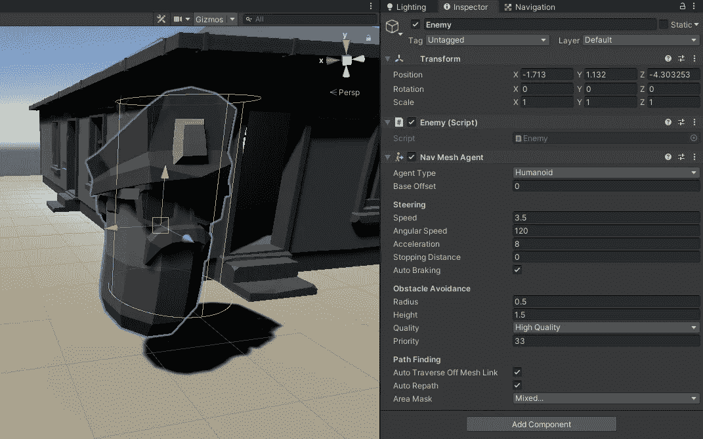

然后给他分配 NavMeshAgent 引用，这样他就知道可以在什么上面行走了。然后告诉他要进行什么样的转换。这都是基于参考的，所以一旦玩家移动，路径也会自动更新。

```
using UnityEngine;
using UnityEngine.AI;
public class **Enemy** : MonoBehaviour
{
    private NavMeshAgent pathfinder;
    private Transform target;

    void **Start**()
    {
        pathfinder = GetComponent<NavMeshAgent>();
        target = GameObject.Find("Player").transform;
    }
    void **Update**()
    {
        pathfinder.SetDestination(target.position);
    }
}
```

警察正在追我们。

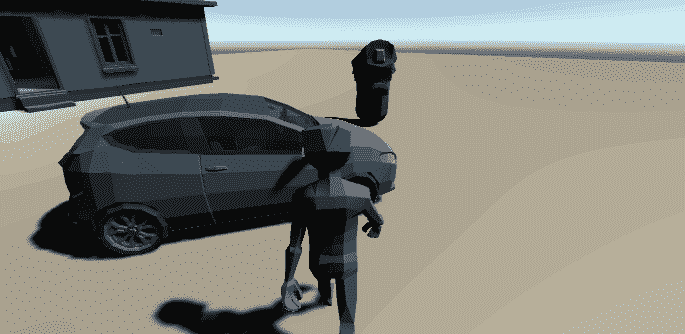

如果你刚刚开始学习如何开发游戏，你可以关注我的 udemy 初学者 Unity 开发课程:

[](https://www.udemy.com/course/make-a-3d-game-in-unity-2020-from-scratch-with-free-assets/?referralCode=8B96F6C67527AEEA39D9) [## 完整指南:Unity 2020 中的动作恐怖 3D 游戏

### 大家好，我叫 Jan Jileč ek，是一名拥有计算机科学硕士学位的专业游戏开发人员，我…

www.udemy.com](https://www.udemy.com/course/make-a-3d-game-in-unity-2020-from-scratch-with-free-assets/?referralCode=8B96F6C67527AEEA39D9) 

# 敌人产卵器

我会在*导航网*上的随机位置制造敌人。我们开始吧！

首先，我们需要让敌人成为一个预置，这样就有可能在我们设定的配置中很容易产生它的实例。只需在层级浏览器中抓取*敌人*模型，并将其拖入资产浏览器。砰，它是一个预制的。

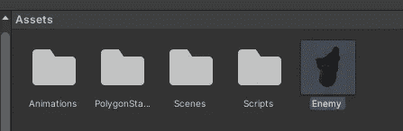

在场景中创建一个新对象，将其命名为*产卵者*。创建一个同名的新脚本，并将其分配给对象。下面的脚本将在(0，0，0)坐标中生成一个新对象。

```
using UnityEngine;

public class **Spawner** : MonoBehaviour
{
    public Enemy **enemy**;
    void **Start**()
    {
        Enemy spawnedEnemy = Instantiate(enemy, Vector3.zero, Quaternion.identity) as Enemy;
    }
}
```

将*敌人*预设分配给它。你跑完游戏后，会有两个敌人追你。你可以删除原来的*敌人*物体，因为从现在开始它将从敌人预设中实例化。

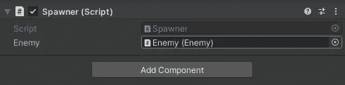

现在是最重要的部分:随机产卵。使用 *RandomNavmeshLocation* 函数，我在*可行走的*网格上随机选择一个地方。然后我在循环的*中调用它。有多少敌人得到产卵是由 *numberOfEnemies v* 变量控制的(由于 *Range 属性*，我可以使用滑块从编辑器中控制它)。spawner 的半径由 range 变量控制，我将每个敌人对象保存到一个列表中。*

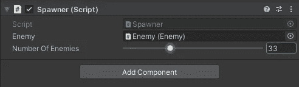

```
using System.Collections.Generic;
using UnityEngine;
using UnityEngine.AI;

public class **Spawner** : MonoBehaviour
{
    public Enemy **enemy**;
    private List<Enemy> enemies;

    [Range (0,100)]
    public int **numberOfEnemies** = 25;
    private float range = 70.0f;

    void **Start**()
    {
        enemies = new List<Enemy>(); *// init as type* for (int index = 0; index < numberOfEnemies; index++)
        {
            Enemy spawned = Instantiate(enemy, RandomNavmeshLocation(range), Quaternion.identity) as Enemy;
            enemies.Add(spawned);
        }
    }

    public Vector3 RandomNavmeshLocation(float radius)
    {
        Vector3 randomDirection = Random.insideUnitSphere * radius;
        randomDirection += transform.position;
        NavMeshHit hit;
        Vector3 finalPosition = Vector3.zero;
        if (NavMesh.SamplePosition(randomDirection, out hit, radius, 1))
        {
            finalPosition = hit.position;
        }
        return finalPosition;
    }
}
```

# 我们结束了。

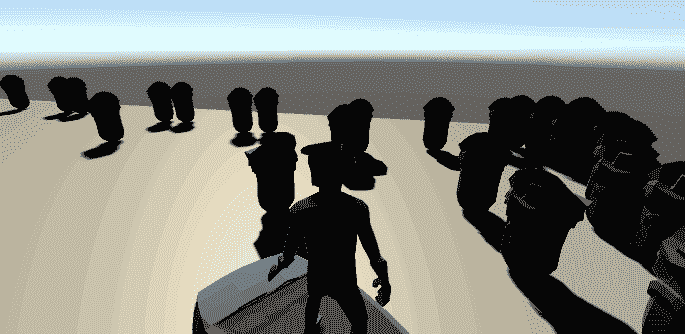

100 个豆子僵尸警察

## 在下一部分，我将实现心灵遥控来击退这些僵尸杂种。敬请关注。

我的 [github](https://github.com/janjilecek/unity_tutorial/tree/master/Assets/Scripts) 上有项目代码。