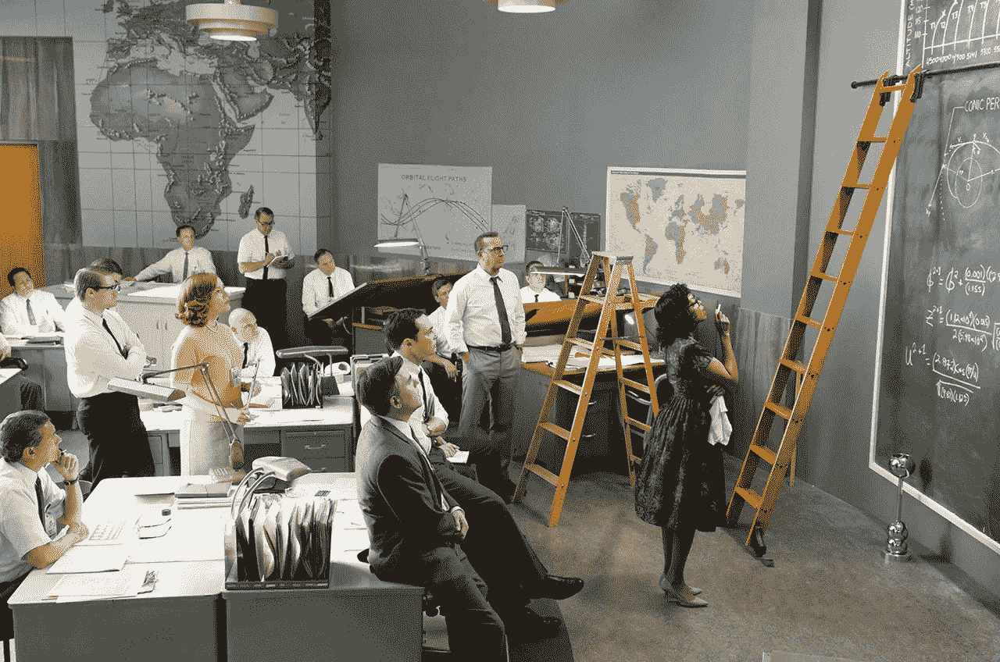
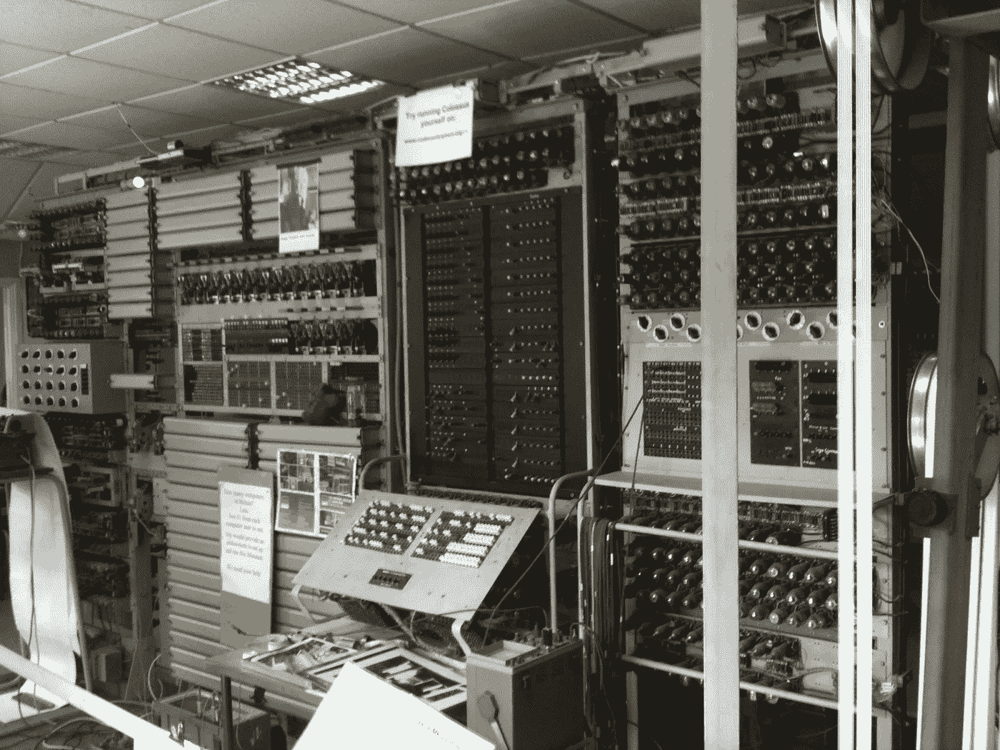
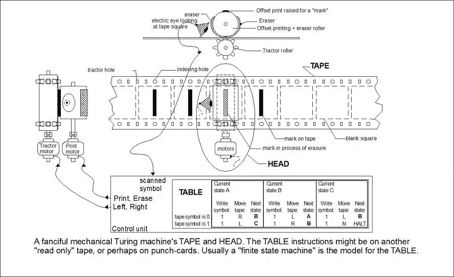
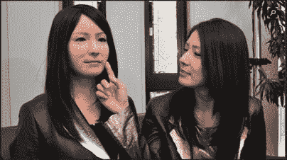
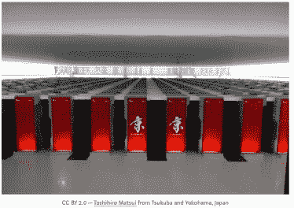
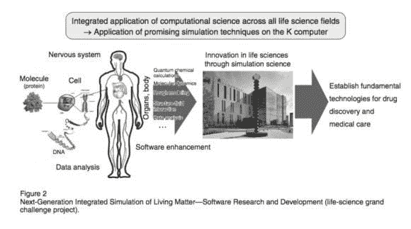

# 也许是时候保护计算机科学家免受他们自己大脑的诱惑了。

> 原文：<https://itnext.io/it-may-be-time-to-protect-computer-scientists-from-the-siren-call-of-their-own-brain-cdf8038451a9?source=collection_archive---------1----------------------->

计算机作为大脑的比喻一直很有力，但它正变得有点误导。早在个人电脑发明之前，人们就用“交换机”这个词来表达同样的意思。然而，大脑不是储存垃圾的地方， ***意识也不是存放*的地方。**突触也远比电路复杂。处理速度和短期记忆容量都不是固定的，而 RAM 则是。

“计算机”这个术语从 17 世纪早期就开始使用了，最早的文字记载可以追溯到 1613 年。它的意思是“计算的人”。在电子计算机商业化之前，计算机指的是进行数学计算的人。正如电影《T4》**《隐藏的人物》** 所描绘的那样，“人类计算机”被要求遵循固定的规则，没有权力在任何细节上偏离规则。以女性为主的团队经常被组织起来进行冗长而乏味的计算，并安排好规则和工作，以便由一组“计算机”并行执行。

[**巨像**](http://www.geograph.org.uk/photo/1590854) **，**这里的图片，是英国密码破译者在 1943-1945 年间开发的一套计算机，用来帮助对 [**洛伦兹密码**](https://en.wikipedia.org/wiki/Lorenz_cipher) 进行密码分析。巨像使用真空管来执行布尔和计数操作。巨像被认为是世界上第一台可编程的电子数字计算机，尽管它是通过开关和插头而不是存储程序来编程的。

图灵机，如下图，是 1936 年由 [**艾伦·图灵**](https://en.wikipedia.org/wiki/Alan_Turing)**使用巨像的密码破译员之一发明的。他称他的机器为 a-机器，因为它自动化了计算机程序。**

****

**图灵机是一种计算的数学模型，它定义了一种抽象机器，该机器根据一个规则表来操纵一条带上的符号。尽管模型很简单，但给定任何计算机算法，都可以构建一个能够模拟该算法逻辑的图灵机。**

**图灵的“a-machine”将计算的重心从硬件切换到软件，开发“**”编程语言来构建软件应用。所谓的第二代编程语言(2GL)或汇编语言与特定计算机的指令集体系结构紧密相关。然而，他们让“程序”变得更加可读，并让程序员摆脱了第一代编程语言(1GL)繁琐且容易出错的[**内存“地址**](https://en.wikipedia.org/wiki/Memory_address)计算。****

********

****然而，最近，特别是随着 [**人工智能(AI)**](https://en.wikipedia.org/wiki/Artificial_intelligence)的出现，脑机作为软件和使能技术的隐喻出现了。([许多“](https://www.psychologytoday.com/blog/the-social-emotional-brain/200904/unplugging-the-computer-metaphor) [**Actroid**](https://en.wikipedia.org/wiki/Actroid) ”机器人酷似年轻的日本女性。Kokoro“act roids”会说日语、汉语、韩语和英语，会做手势，还会模仿眼球运动，这有点令人毛骨悚然。Henn-na 酒店(其名称的意思是“奇怪的酒店”)将有部分员工是“机器人”，他们担任接待员、服务员、清洁工和衣帽间服务员。****

****由于各种原因，这种计算的“人形观点”是危险的，至少是“Kurzweilian”对人类的“接管”。更令人担忧的是，使用人脑作为计算的隐喻可能会产生成本，但最终会发现大脑是一个不合适的模型，如果有不同的计算和软件概念，我们本可以取得更大的成就。****

****人脑是专门用于信号处理的生物器官。它接收来自全身的感觉输入信号，并发出运动信号来激活肌肉。在大脑内部，信号在 1000 亿个神经元之间不断循环。虽然人类大脑是一个“信号处理系统”，但它不“仅仅”是一个信息处理“设备”，它当然不是一台计算机，甚至不是图灵机。****

****脸书产品经理保罗·金说:“与数字计算机不同，人脑不使用二进制逻辑或二进制可寻址存储器，也不进行二进制运算。大脑中的信息是用统计近似值和估计值来表示的，而不是精确值。大脑也是****的非确定性。**它不能以无错精度重放指令序列。所以在所有这些方面，大脑绝对不是“数字化”的。信号处理不同于信息处理。******

****一种分析人类反应时间的新方法显示，大脑每秒处理大约 60 比特的信号。 这不是整个大脑的信息处理能力，而是对特定任务期间输入/输出能力的一种衡量。法国普罗旺斯大学的 Fermin Moscoso del Prado Martín 说:“这一发现表明了一个适应性系统，其中处理负载根据任务需求动态调整。”根据德尔·普拉多·马丁的说法，“这是有道理的。假设大脑以相同的速度进行信号处理，而不管手头的任务有多复杂，这似乎很疯狂。”****

****根据加州大学欧文分校的理查德·海尔和新墨西哥大学的雷克斯·荣格对 37 项影像研究的回顾，详细情况见《行为和大脑科学》杂志 [**，**](https://www.livescience.com/1863-theory-intelligence-works.html) 表明，智力与大脑大小或特定的大脑结构关系不大，而是与信息在大脑中传播的效率有关。然而，就处理能力而言，人类大脑的路径显然无法与现代计算机竞争。****

****The[**K computer**](https://en.wikipedia.org/wiki/K_computer)**,** named for the Japanese word “kei” (京), meaning 10 quadrillion (1016) is a supercomputer manufactured by Fujitsu, currently installed at the [**Riken Advanced Institute for Computational Science**](https://en.wikipedia.org/wiki/Riken) campus in Kobe, Japan.****

****K 执行 10 千万亿次浮点运算。(每秒浮点运算次数)。千万亿次浮点运算是 1⁰ ⁵.k 能在一秒钟内完成十次 1⁰ ⁵运算。****

********

****K 计算机基于分布式内存架构，拥有超过 80，000 个计算节点。它被用于各种复杂的应用，包括气候研究、灾难预防和医学研究。K 计算机的操作系统是基于 Linux 内核的，附加的驱动程序是为使用多台计算机而设计的。****

****[**Abhishek Kumar**](https://www.technologyreview.com/s/415041/new-measure-of-human-brain-processing-speed/)**一位软件开发人员，创造了一种有趣的方法来预测从 20 世纪 50 年代到今天计算机处理能力的提高，以评估 [**摩尔定律**](https://en.wikipedia.org/wiki/Moore%27s_law) 。库马尔将 20 世纪 50 年代的 UNIVAC 与 K 的处理能力进行了比较，然后逐年计算改进情况，看看今天的计算机是比摩尔博士预期的更好还是更差。与 K 的 10 千万亿次运算相比，UNIVAC 的 2000 次运算显得可笑。(FLOPS 代表“每秒浮点运算数”)。一个千万亿次浮点运算是 1015 次运算。K 在一秒钟内可以执行 1015 次运算。******

****Kumar 接着问道，“*如果我们只给 UNIVAC 一个千万亿次浮点运算的指令，处理它需要多少时间？根据 Kumar 的计算，UNIVAC 执行一次 petaflop 指令需要 15855 年或者大约 159 个世纪。**K 可以在十分之一秒内完成同样的计算。*******

****库马尔接着推理，根据摩尔定律，每两年计算能力应该增加一倍。从 1950 年开始，大概 70 年了。除以 2，自 1950 年以来有 35 个两年期。所以根据摩尔定律，今天的计算能力应该是每秒 70000(UNIVAC 的 2000 * 35)次运算。K 的性能要比它好 14000 倍。因此**K 的性能比摩尔定律让我们期望的要好 14000 倍**。****

****诗人不是唯一创造隐喻的人。隐喻无处不在。我们的日常语言中充满了它们。我们不假思索地使用隐喻进行日常交流，如手机、高速公路、灯泡、爱情、反恐战争等。。许多人认为每个单词都是一个隐喻，或者隐喻思维让我们能够构建现实。****

****然而，在为计算创建概念模型时，我们需要 [**注意我们如何使用隐喻**](http://rationallyspeaking.blogspot.com/2011/04/perils-of-metaphorical-thinking.html) **。如果我们没有意识到，它们可以很容易地过滤和影响我们的思维和感知。由于“计算机是大脑”的比喻，将现代计算机的能力限制到人脑的计算能力，是我们限制自己能力的一种危险方式。有心理学家对把[**大脑比作电脑隐喻**](https://www.psychologytoday.com/blog/the-social-emotional-brain/200904/unplugging-the-computer-metaphor) 也有同感。日本人没有对自己施加这些限制。******

**日本全国推行的“生活创新”增长战略与日本人民渴望健康长寿的愿望直接相关。 [**下一代生命物质集成模拟软件研发项目**，](http://fujitsu/%20Sci.%20Tech.%20J.,%20Vol.%2048,%20No.%203,%20pp.%20357–363%20(July%202012))由 RIKEN 监督，该 RIKEN 开发了 K 计算机，其目标是为此提供一个技术平台。该项目的一个关键目标是通过从多个角度在不同层面上全面系统地应用软件来理解生物现象。为此，日本政府利用 K 计算机建立了非常具有战略意义的研究领域，比如模拟生物。他们没有把自己的思维局限在像人脑这样舒适的概念上。**

****

**也许是时候保护所有的计算机科学家免受他们自己大脑的诱惑了。**

**___________________________________________________________________**

****备注:****

1.  **http://big think . com/re-envision-Toyota-blog/the-electronic-brain-your-mind-a-computer**
2.  **[https://en.wikipedia.org/wiki/Programming_language#History](https://en.wikipedia.org/wiki/Programming_language#History)**
3.  **[https://www.livescience.com/49711-japanese-robot-hotel.html](https://www.livescience.com/49711-japanese-robot-hotel.html)**
4.  **[https://www.quora.com/Is-the-human-brain-analog-or-digital](https://www.quora.com/Is-the-human-brain-analog-or-digital)**
5.  **人脑处理速度的新衡量标准——麻省理工科技评论**
6.  **[https://www . live science . com/1863-theory-intelligence-works . html](https://www.livescience.com/1863-theory-intelligence-works.html)**
7.  **https://en.wikipedia.org/wiki/K_computer**
8.  **[https://breathe publication . com/un ivac-vs-k-超级计算机-709909925cf3](https://breathepublication.com/univac-vs-k-supercomputer-709909925cf3)**
9.  **[http://rational ly speaking . blogspot . com/2011/04/risks-of-anatomical-thinking . html](http://rationallyspeaking.blogspot.com/2011/04/perils-of-metaphorical-thinking.html)**
10.  **富士通 Sci。技术。j .，第 48 卷，第 3 期，第 357-363 页(2012 年 7 月)**