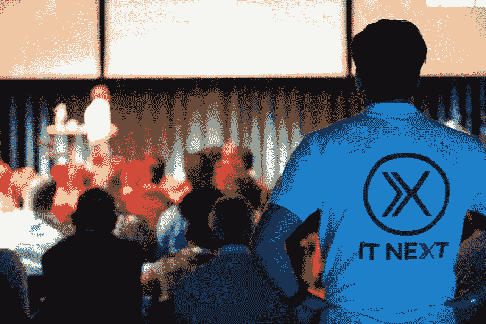

# ITNEXT SUMMIT 2016 回顾

> 原文：<https://itnext.io/it-next-summit-2016-7e2cad6313b6?source=collection_archive---------7----------------------->

2016 年 ITNEXT 峰会是 ITNEXT 的第一场正式活动，于 2016 年 9 月 15 日举行。ITNEXT SUMMIT 是由 LINKIT 发起的 ITNEXT 年度大会。ITNEXT 峰会聚焦于**分享**知识、**联系**人、**激励** IT 专业人士和爱好者。

峰会分享 [ITNEXT 的核心愿景](/about-it-next-aba26e89da2b)；成为一个知识驱动的社区。通过此次峰会，我们扩大了我们的社区，并创造了另一个很好的机会来建立**关系网**、**拓宽**和**加深**在各个层面的知识。

七位国内和国际演讲者分享了他们关于自由软件运动、荷兰国防部内部的网络安全、物联网架构以及数据科学和分析的知识和愿景。《可计算》杂志发表了两篇文章，[评论了](https://www.computable.nl/artikel/expertverslag/expertverslag/5839839/4573232/free-software-cyberoorlog-en-slimme-schepen.html)主题演讲和[活动](https://www.computable.nl/artikel/expertverslag/expertverslag/5839839/4573232/free-software-cyberoorlog-en-slimme-schepen.html)(荷兰语)。

我们的下一个活动是 [ITNEXT SUMMIT 2019](http://www.itnextsummit.com) ，这次是 10 月在阿姆斯特丹。早盲鸟票已经[有了](https://www.eventbrite.nl/e/tickets-itnext-summit-2019-53804190783)！我们邀请你加入！

