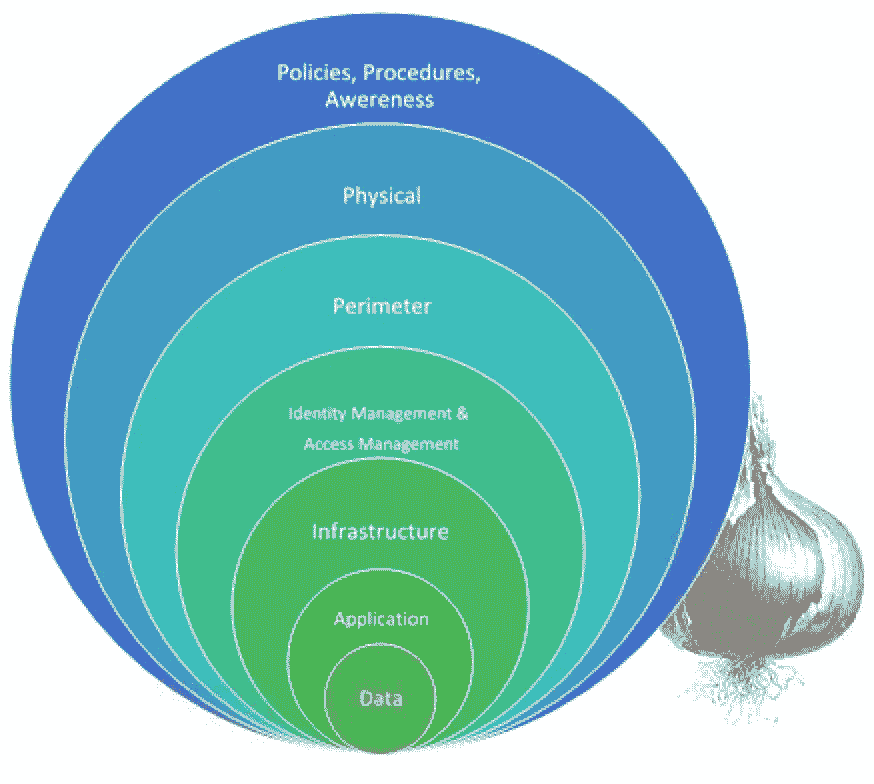

# 根据洋葱的层次来看 IT 安全

> 原文：<https://itnext.io/it-security-volgens-de-gelaagdheid-van-een-ui-9ee12d3c1f55?source=collection_archive---------0----------------------->

我在安防领域的第一步就是不断地迷失在模型框架和准则的泥潭里。被各种各样的解决方案所困扰，我一直在寻找一种固定的方式。

参考模型在哪里？它将所有的事情放在正确的上下文中，并以逻辑方式组织关系？在我的 CISSP 考试前，我研究了很多模型，但我没有找到一个完整的方法。这些概念往往过于详细或纯粹，以致于无法从 it 安全三单元(可用性、完整性和机密性)中提取特定组件。

在我继续寻找终极安全模型的过程中我发现了一种基于洋葱皮的方法。本文作了一个简短的评估。

## **洋葱的做法**

洋葱的方法是基于安全原理" T2 "防御深度" T3 "也就是分层防御。这个概念在很久以前是城堡建筑的最佳象征。他们先建了一道密道，然后是厚厚的外墙，然后是内层，然后才是通往出口的内层。

想像一下洋葱的方法:要访问珍贵的数据(在洋葱的中心)，必须先通过一些安全层(裙部)。

**洋葱方法模型**

该模型描述了至少要实现的安全层，以便正确保护数据。以下是每个图层的简要说明:

**安全级别较低**

**目标**

*政策、程序和提高警觉*

确保员工了解并执行 IT 安全政策。

*物理的*

物理安全性。例如，通过数据加密、访问和火灾安全。

*周长*

保护 IT 环境的外层。例如，通过防火墙、入侵检测系统(IDS)和防恶意软件。

*身份&访问管理*

控制用户访问和身份的图层。例如，通过密码管理、数据分类和双因素身份验证(2FA)。

*基础设施*

网路基础建设的安全性。例如，服务器监控、补丁程序管理和冗馀措施。

*应用程序*

确保应用程序的安全性。例如，通过程序性的渗透和漏洞测试。

*数据*

保护资料。例如，通过加密、备份和数据恢复系统。

## **优点**

透过阶层式模型工作具有下列优点:

*   清晰的沟通。
    模型的优点是可以参考，使通信更容易。如果您的组织正在开发一个应用程序，那么在安全级别上部署和测试的内容将是显而易见的。
*   增强的冗馀性。
    如果第一层内的安全被破坏，那么下一层内的攻击者将被先发制人地阻止，然后重新开始攻击游戏。
*   增强的合规性。
    通过实施该模型，人们(部分)满足一些行业合规性要求，如[hipaa](https://en.wikipedia.org/wiki/Health_Insurance_Portability_and_Accountability_Act)或 [PCI](https://en.wikipedia.org/wiki/Payment_Card_Industry_Data_Security_Standard) 。

## **缺点**

当然，在特定的证券模型下工作也有缺点。对于攻击者来说，已经很清楚一家公司是如何安排安全的。有了这些信息黑客在准备袭击时可能会考虑到这一点。

另一个缺点是，模型没有明确指出每一层要部署的内容。因此，企业需要进入多远，仅仅是防火墙，还是甚至是[数据二极管](https://en.m.wikipedia.org/wiki/Unidirectional_network)？什么时候够？

## **结论**

当然，也有一些替代框架的发布，名称更为突出，例如“t15”Cisco 安全开发生命周期[t16(SDL)， [ISO 21827:2008 系统安全工程能力成熟度模式[t18(SSE-CMM)或“t19”Sherwood 应用业务安全体系结构”](http://www.iso.org/iso/home/store/catalogue_tc/catalogue_detail.htm?csnumber=44716)

IT 安全的当前趋势主要集中在安全方面(T10)[如果我们受到攻击或攻击怎么办？号。而分层模型则是为了防止攻击。但是，建议您使用当前趋势(如[[siem]T3 软件、位置](https://en.wikipedia.org/wiki/Security_information_and_event_management)[SOC](https://en.wikipedia.org/wiki/Security_operations_center)或[安全随设计](https://en.wikipedia.org/wiki/Secure_by_design)来更新模型，以保持可应用性值。

洋葱路由提供了一个清晰而实用的视图，以实现基本的安全级别。因此，该模型对于需要从安全性开始或希望构建更多结构的公司非常有用。重要的一点是如何设置图层内容以充分保护数据；不幸的是，必须在每个特定环境中设置图层内容。基本的安全级别在许多情况下是不足够的，但所绘制的模型提供了坚实的基础。