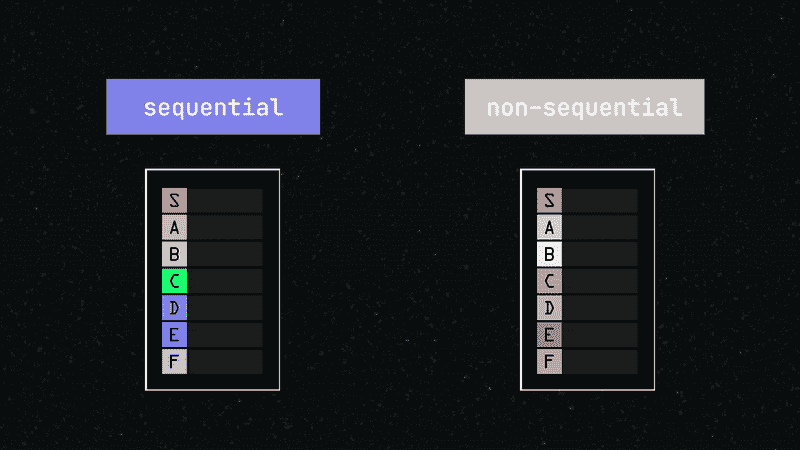
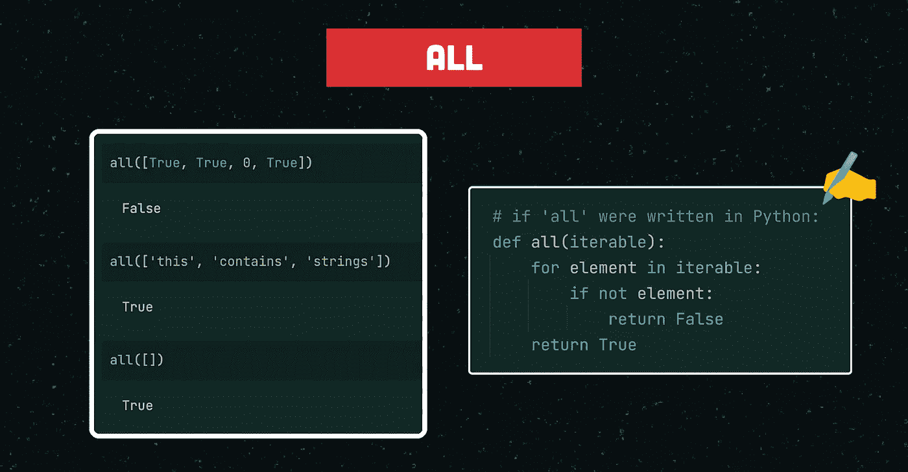
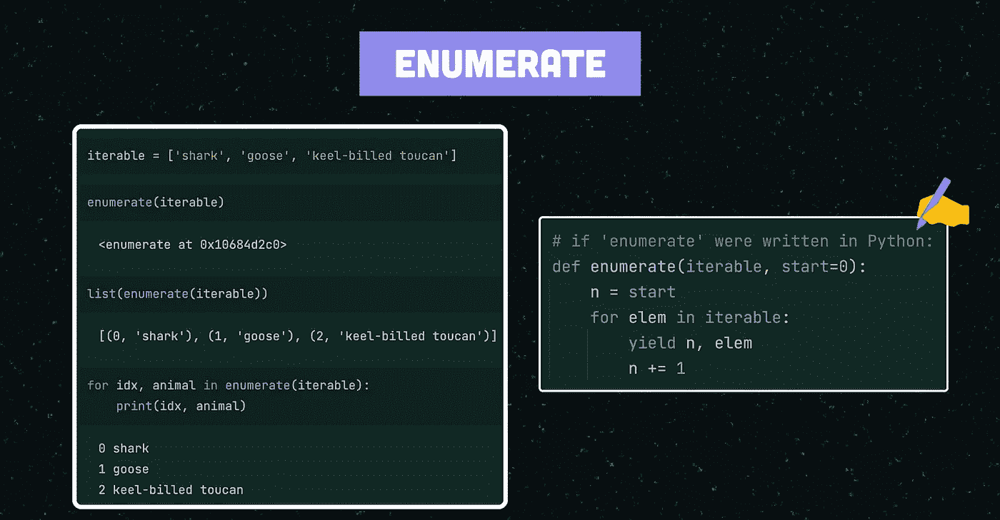
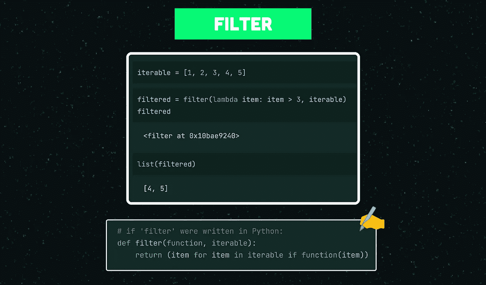
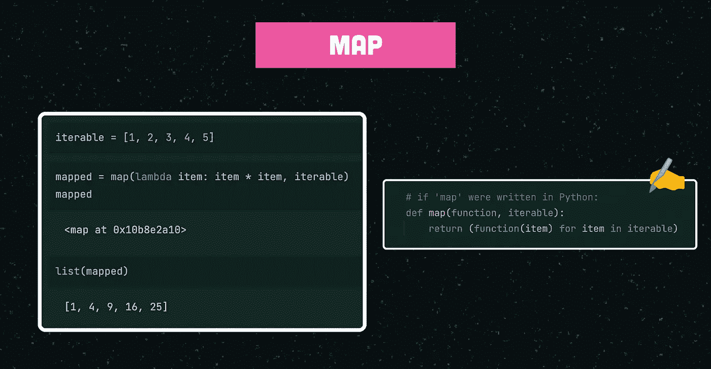
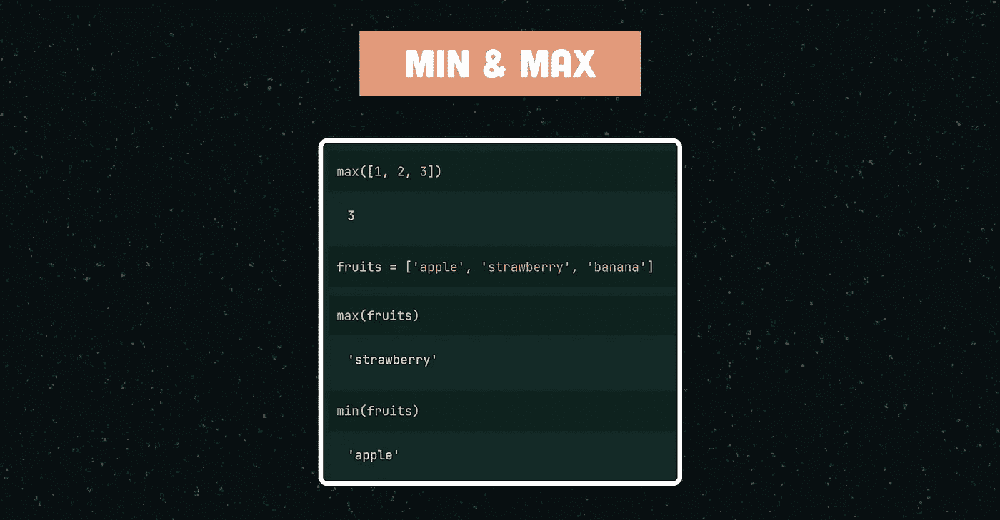
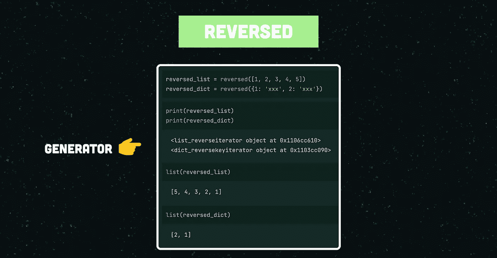
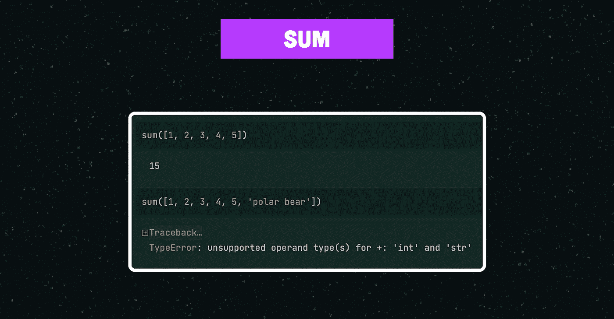
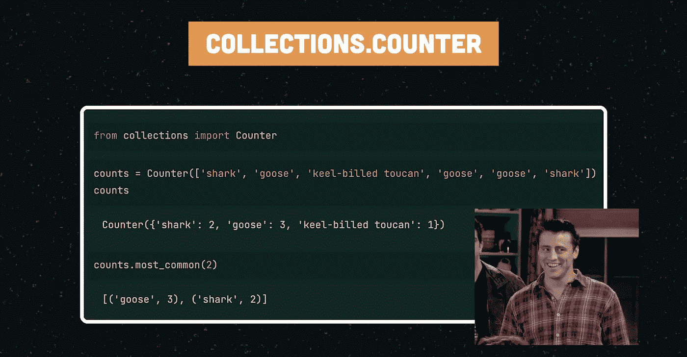

# 迭代器函数

> 原文：<https://itnext.io/iterator-functions-33265a99e5d1?source=collection_archive---------2----------------------->

## 使用 Python 的内置函数高效迭代

大家好，在这篇文章中，我将演示几个内置的 **Python** **迭代器函数**来有效地处理你的 iterables】而不用 for 循环。

这篇文章在 YouTube 上也有视频格式。

## 概观

下面是这篇文章的内容:

*   可重复项的简要说明
*   迭代器函数为什么有用
*   演示 **10** 内置迭代器函数(以及 **1** 奖励)

本文中包含的功能如下:

*   功能 1: `all`
*   功能二:`any`
*   功能三:`enumerate`
*   功能四:`filter`
*   功能五:`map`
*   功能 6: `min`
*   功能 7: `max`
*   功能 8: `reversed`
*   功能 9: `sum`
*   功能 10: `zip`
*   奖金:`collections.Counter`

## 可重复项的简要说明

> iterable 是能够一次返回一个成员的任何 Python 对象，允许它在循环中迭代。

有按特定顺序排列项目的*序列*可重复项，例如列表、元组、字符串和字典。

还有*不连续的*集合是可迭代的。例如，一个集合是可迭代的，尽管缺乏任何特定的顺序。

Iterables 是 Python 和任何其他编程语言的基础。知道如何有效地利用它们将会对你的代码质量产生明显的影响。

顺序与非顺序可迭代。

## 迭代器函数为什么有用

一般来说，通过创建一个 [for 循环](https://wiki.python.org/moin/ForLoop)可以很容易地处理 iterable，该循环允许连续处理 iterable 中的每一项。

但是，您可能会发现自己经常编写彼此相对相似的循环。

由于这个原因，有很多很棒的内置 Python 函数可以帮助你处理你的可迭代对象，而不需要重新发明轮子。

它们是**快速**、**内存高效、**并且当正确使用时会使你的代码**更加简洁易读**。

> 💡Python 的内置函数实际上是用 C 编写的，因此对于 Python 的标准来说非常高效。

在接下来的章节**中，我将解释 10 个内置迭代器函数**，并且在有用的时候提供一个简化的 for 循环等价物来帮助你理解这个函数是如何工作的。

## 功能 1:所有

`all()`接受一个 iterable 作为参数，如果*iterable 的所有*元素的值都为`True`，则返回`True`。否则返回`False`。

注意，如果 iterable 为空，`all()`也会返回`True`。

内置迭代器函数“all”及其 Python 等效函数。

## 功能 2:任何

`any()`将 iterable 作为参数，如果 iterable 的任何元素的*计算结果为`True`，则返回`True`。否则返回`False`。*

与`all()`相反，如果 iterable 为空，则返回`False`。

## 功能 3:枚举

`enumerate()`将一个 iterable 作为参数，并返回一个[生成器](https://wiki.python.org/moin/Generators)，该生成器为 iterable 中的每个连续项分配一个递增的数字。

默认情况下，增量从 0 开始，但是可选的`start`参数可以提供不同的起始值。

内置迭代器函数“enumerate”及其 Python 等效函数。

## 功能 4:过滤

顾名思义，`filter()`用于创建一个 iterable 的子集。

该函数将一个 iterable 和一个*条件函数*作为参数，并将该函数应用于 iterable 中的每一项。只有条件函数返回`True`的项目被保留并存储在子集中。

内置迭代器函数“filter”及其 Python 等效函数。

## 功能 5:地图

`map()`是我最喜欢的内置 Python 函数之一，用于转换 iterable 的条目。

它将一个 iterable 和一个 *transformer 函数*作为参数，并将该函数应用于 iterable 的每一项，产生结果(即返回一个生成器)。

内置迭代器函数“map”及其 Python 等效函数。

## 功能 6 和 7:最小和最大

顾名思义，`min()`和`max()`分别返回一个 iterable 的最小值和最大值。Python 的小于或大于操作符的通常行为(即`<`或`>`)用于确定函数的输出。

请注意，如果您对字符串列表上的`min()`和`max()`函数的输出感到困惑(例如下图)，请理解字符串是根据其字母顺序进行计算的。

内置迭代器函数“map”。

## 功能 8:反转

简单却有用。它反转提供的 iterable 并产生结果(即返回一个生成器)。

注意，只要提供了一个字典，就会返回字典的*键*的反向迭代器，而不是一个反向字典。

内置迭代函数“reversed”。

## 功能 9:求和

这里不多说！`sum()`将 iterable 中的所有元素相加并返回结果。

注意，不支持字符串，即使字符串支持`+`运算符(参见下图中的错误)。

> *💡*如果你想“加总”一组字符串，使用`string.join()`代替。

内置迭代函数“reversed”。

## 功能 10:拉链

是我的另一个最爱。它允许并行迭代几个可迭代对象*，产生一个包含元组的生成器，元组包含每个可迭代对象的一个项目。*

*为了形象化`zip()`的输出，想象你在衣服上发现的拉链:它将两个不同的部分连接在一起(或者在这种情况下:两个或更多！).*

*如果提供的可重复项长度不同，最短的*可重复项决定输出的长度。**

**

*内置迭代器函数“zip”。*

## *额外收获:收藏。计数器*

*有一个*非内置的*函数，我只是让*的*包含在本文中:来自 Python 的`collections`模块的`Counter()`函数。*

*顾名思义，`Counter()`对 iterable 的元素进行计数，并返回一个集合，其中**元素**存储为**字典** **键**，它们的*计数*存储为*字典* *值。**

> *💡Python 默认包含了`*collections*`库，所以不需要下载。*

*要使用`Counter()`，我们首先必须从 Python 的`collections`库中导入该类。然后，我们可以简单地将一个 iterable 传递给它的构造函数，而`Counter()`会为我们做所有困难的工作！*

*请注意，出现次数相同的元素按第一次出现的顺序排序。*

**

*Python 默认“集合”库中的“计数器”函数。*

*如果你只是对 iterable 中最频繁出现的元素感兴趣，`Counter()`提供了一种叫做`most_common(n)`的便捷方法。它返回最常见的 N 个元素及其数量的列表，从最常见到最不常见排序。*

*本文到此为止！我希望你觉得它有用，并记住:*

> *每天使用内置代码可以避免多余的代码*

*如果你从这篇文章中学到了一些新东西，请考虑订阅我的 [YouTube 频道](https://www.youtube.com/channel/UCkihi0v-znRdhS_Fib4Vqxg)或者关注我的 Medium。谢谢！🙂*

**这篇文章和相应的视频是我的 Python Snippets 系列的一部分，其中我以字节大小的格式涵盖了围绕 Python 编程的各种主题。**

**