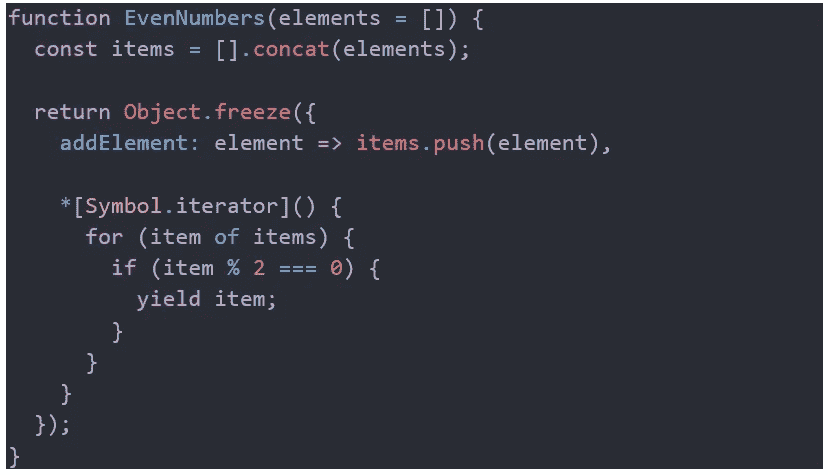
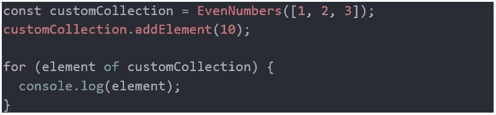
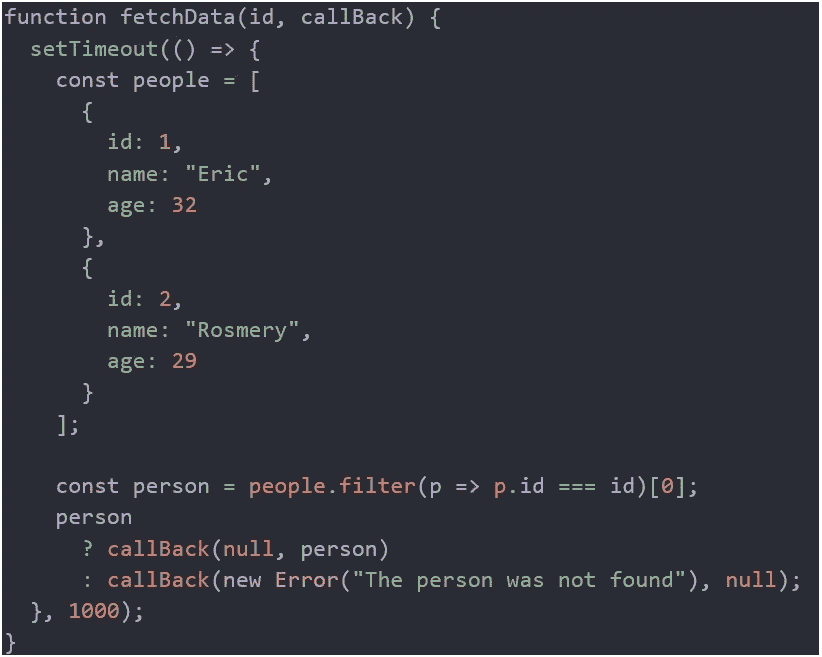
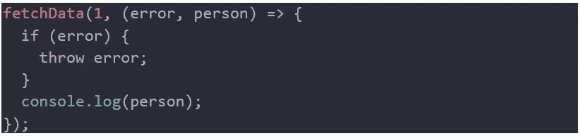
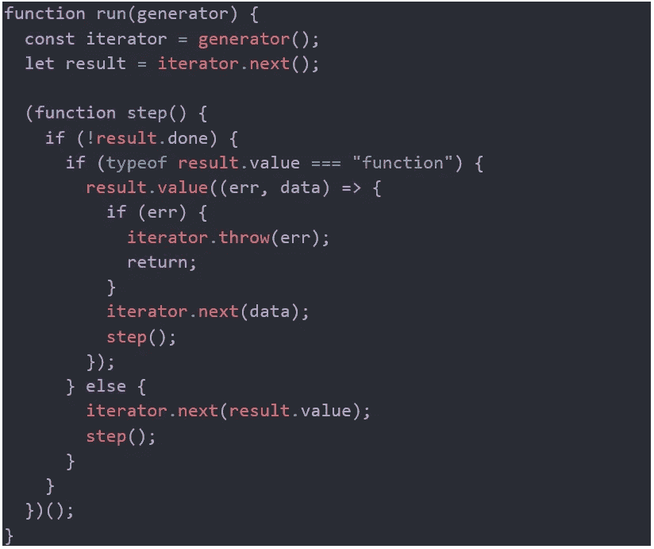
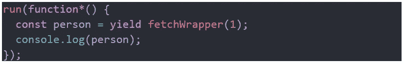

# 迭代器和生成器在现代 JavaScript 中确实有一席之地。

> 原文：<https://itnext.io/iterators-and-generators-do-have-a-place-in-modern-javascript-d4cb589b491?source=collection_archive---------1----------------------->

不同的软件开发人员多次问我迭代器/生成器(I/G)的可能用例。我也注意到有些人质疑我们是否真的需要它们，我并不责怪他们，因为在现代 JavaScript 中，大部分时间有各种各样的方法来做同样的事情。

在本文中，我将通过使用更简单的示例来分享我使用 I/G 的两个场景，但这两个场景具有实际的内涵和重要性。这并不是解释迭代器、可迭代对象和生成器是什么或者它们是如何工作的。有很好的来源可以学习，例如，[https://www.youtube.com/watch?v=ategZqxHkz4](https://www.youtube.com/watch?v=ategZqxHkz4)，或者如果你是爱读书的人[https://developer . Mozilla . org/en-US/docs/Web/JavaScript/Guide/Iterators _ and _ Generators](https://developer.mozilla.org/en-US/docs/Web/JavaScript/Guide/Iterators_and_Generators)，或者我最喜欢的解释:*理解 ECMAScript 6:JavaScript 开发人员权威指南*，作者 Nicholas C. Zakas。如果你一开始不能理解所有的事情，不要感到失望或沮丧；包括道格拉斯·克洛克福特在内的非常聪明的人都承认这是一个复杂的话题。所以我决定写这篇文章来分享我是如何和为什么使用它们的，以防我的个人经历可以帮助到某人。

第一种情况:定制的可迭代序列。

*我需要一个数字集合，当迭代时，它只给我偶数，我希望能够将偶数选择逻辑封装到我的自定义集合中，因此使用它的代码不需要考虑这一点。*

*EvenNumbers* 函数接受一个可选数组，该数组允许您初始化内部数组，该数组用于维护所有先传递或后插入的元素/项目。它返回一个不可变的对象，该对象有两个属性，一个添加新元素的函数和一个符号，在本例中，该符号用于实现自定义集合的默认迭代器。

那么我们可以这样使用这个函数:

我们创建了一个自定义集合，用一个包含三个元素的数组初始化，后来我们又向它添加了一个数字。然后我们迭代集合并将每个元素记录到浏览器控制台。如果您尝试一下，您应该只看到数字 2 和 10 被打印到控制台上。这段代码的美妙之处在于， *EvenNumbers* 函数的消费者知道会发生什么，而不用担心偶数选择逻辑，因为所涉及的逻辑被 *EvenNumbers* 函数本身封装了。我知道你可能认为代码的可维护性和重用会从这种方法中受益，我也是这么想的。当迭代逻辑比简单地选择偶数要复杂得多时，尤其如此。

如果你想在一个新的数组中包含所有的偶数，只需要一行代码，你可以这样做:

为了验证，继续将*平均值*打印到控制台。

第二种情况:编写看起来同步的异步代码。

异步 api 非常常见，比如 Node.js 的 *readFile* 函数([https://nodejs . org/API/fs . html # fs _ fs _ readFile _ path _ options _ callback](https://nodejs.org/api/fs.html#fs_fs_readfile_path_options_callback))。这个想法很简单，在输入参数之后，函数将另一个函数作为参数，称为 callback，当结果准备好或者动作已经完成时，这个函数将被执行。在 *readFile* (以及 Node.js 中更多的函数)的情况下，如果从磁盘读取文件时出错，回调函数通过传递错误来执行，如果一切正常，则通过传递文件的内容来执行。

我们将使用一个名为 *fetchData* 的函数，其工作方式与 *readFile* 相同:

为了模拟一个需要一些时间才能完成的异步操作，我们使用了 *setTimeout* ，传递给它的 lambda 函数将在大约 1 秒后执行(从技术上讲，它不会在大约 1 秒后执行，它首先被放入异步作业队列，当轮到它时，它将被执行)。这个函数试图根据提供的 id 找到一个人，如果找到了，就通过将这个人传递给回调函数来调用它。另一方面，如果指定的 id 不属于任何人，则向回调函数传递一个错误。 *fetchData* 的工作方式与 *readFile、*非常相似，我们可以通过调用互联网上的一些 API 来实现真正的获取，但是我想让事情变得简单并且在内部进行。

使用该函数的典型方式是:

我们已经调用了 *fetchData* 并传递了值 1 作为 id，我们还传递了回调函数作为第二个参数。这样，如果找到了这个人，我们就把它的数据记录到控制台，如果没有，我们就抛出错误。

我知道您知道这种异步的做事方式，包括错误处理逻辑，会变得非常混乱，导致所谓的回调地狱。这就是为什么更好的替代品出现了，比如承诺和观察者/可观察物。当使用 Promises 时，你用 *then 和 catch* 链接你的方法调用，这不会使你的代码看起来像同步的，也不会让你以那种方式推理。为了克服这一点， *async/await* 使用了 JavaScript，它在幕后使用了 Promises，但是它已经为你处理好了，所以你可以编写看起来同步的异步代码。遗憾的是，即使所有主流浏览器都支持 *async/await* ，也不是到处都支持；你可以使用 *Babel* 让它工作，但生成的代码非常庞大，我看到一个 *async* *函数*在被 *Babel* 编译后从 5 行增加到 60 多行。

所有这些导致了我的第二个用例，我使用了 I/G，编写了看起来同步的异步代码，请跟我来。

我们已经围绕 *fetchData* 编写了一个包装器，它只不过是一个将 id 作为参数的函数，并通过传递 id 和回调来返回一个接受回调并执行 *fetchData* 的函数。

现在是我真正指望你熟悉 I/G 的时候了，否则，可能很难理解下一个函数，也就是通常所说的异步任务运行器。

有像 T21 这样的库提供类似的运行发电机的功能。不需要理解*运行*功能就可以使用；在 C#中，有“一些魔法”来处理 *async/await* 如何工作，包括一个状态机，我们大多数人(C#开发人员)已经成功地在 C#中进行了异步编程，却不知道这个状态机是如何工作的或者为什么会这样工作。但我给你的建议永远是，研究、研究、学习，这样你才能明白你在用什么，即使它看起来像一个黑匣子，那也会给你优势，让你感到快乐。

现在我们要做的就是:

注意包含*代码行如何产生*，下一行使用它产生的结果看起来像同步编程，没有回调，没有 *then/catch* 链接，它看起来像 C# *async/await。*

将这种异步任务运行器模型与 Promises 结合起来，将会给您带来更大的能力和灵活性。如果您的需求和环境允许，ECMAScript *async/await* 可能会更好地控制异步流；除非你需要处理更复杂的场景，需要 I/G 的灵活性和强大功能。

就我个人而言，只要可行我就使用 RxJS，我热爱反应式编程，我在我的文章中谈到过:[https://it next . io/functional-Reactive-Programming-explained-in-a-simple-way-in-a-simple-way-yes-in-a-simple-way-925 b 14 cddf 75](/functional-reactive-programming-explained-in-a-simple-way-in-javascript-yes-in-a-simple-way-925b14cddf75)和[https://it next . io/I-won-won-to-see-you-do-it-better-and-cleaner-without-Reactive-Programming-Programming-545 face 1 所以，正如我一直建议的(因为我像你一样，艰难地学会了)，为手头的工作选择正确的工具，最后，对你的解决方案感到高兴和满足。](/i-would-love-to-see-you-do-it-better-and-cleaner-without-reactive-programming-545face12e1a)

我很抱歉没有在本文中一行一行地解释代码，这超出了我的目标，我的目标是与那些熟悉 I/G 的人(他们想知道实际的用例)分享我在哪里以及为什么使用它们。

编码快乐！