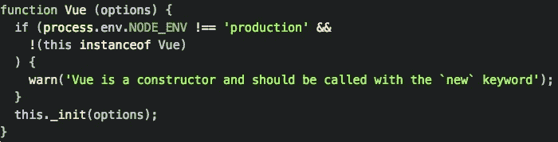
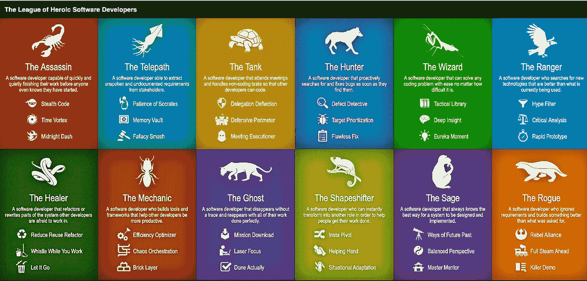
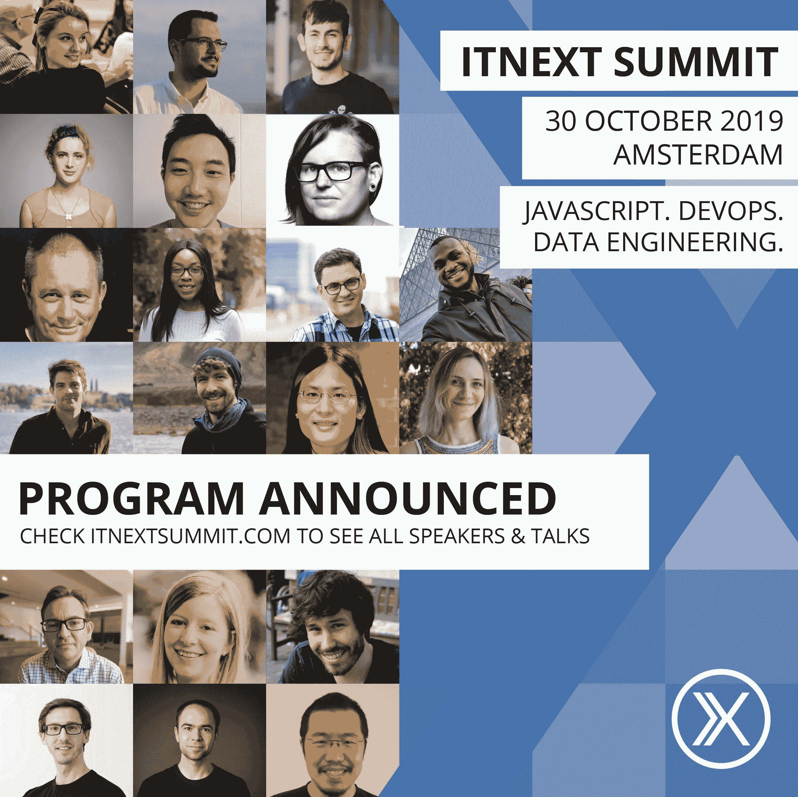

# ITNEXT.io 简讯八月

> 原文：<https://itnext.io/itnext-io-newsletter-august-e59bb20ae300?source=collection_archive---------4----------------------->

# 我们的第 13 版有了新的面貌！

在过去的一个月里，我们发表了许多深入的文章，本期简讯重点介绍了其中的一些。在讨论这个话题之前，我们想提两件事:

*   将于 10 月 30 日举行的 2019 年 ITNEXT 峰会的所有[演讲人](https://www.itnextsummit.com/sprekers/)已经公布。不要错过[早鸟票](https://www.eventbrite.nl/e/tickets-itnext-summit-2019-53804190783#tickets)，请在 8 月 31 日前领取！
*   ITNEXT 由 [LINKIT](https://www.linkit.nl) 创立。我们还组织每月一次的聚会。如果你住在荷兰，查看即将举行的活动。我们希望很快见到你。

**享受阅读文章的乐趣:)**

# 如何确保 NodeJS 应用程序或 API 的安全🔐

你听说过像 **DOS 攻击、XSS 和 SQL/NoSQL 注入攻击这样的术语吗？**你当然有！构建应用程序和 API 时，您会希望它们尽可能安全。但是具体怎么做呢？

在[这篇文章](/make-security-on-your-nodejs-api-the-priority-50da8dc71d68?source=friends_link&sk=cf67ce6258b85cd71dc75660fb48cceb)中，Andreas 向您展示了一些最佳实践，并逐一分析了每种攻击！

# 重生后的生活🤯

如果您怀疑是否应该在您的下一个应用程序中使用 Redux，那么[查看这篇文章](/life-after-redux-21f33b7f189e?source=friends_link&sk=a2566ae4b3b28797505a1295d70392fe)。Rudi Yardley *探讨了如何将 React 的新 useReducer 挂钩与简单的事件总线相结合，从而为您的应用程序架构提供急需的可伸缩性，同时防止 Redux 在大型应用程序中经常出现的一些问题*

别忘了查看他在 GitHub 上的最新开源项目:[PDSL——一个用于创建谓词函数的富有表现力的声明性工具包](https://github.com/ryardley/pdsl)

# 递归初学者指南👨‍🎓👩‍🎓

正如你可能知道的，学习和理解递归真的很有挑战性。如果你正试图通过使用斐波那契和指数函数来学习它，祝你好运。这些值实际上和递归没有任何关系。相反，这篇文章建议你应该使用数组。这让一切变得简单多了！

# javascript #学习

# JavaScript(ECMAScript)的现状:2019 年及以后

GitHub 上最常用的语言是什么？如果你的答案是 JavaScript，你就是✅.如果你没有脱口而出 JS，那么查看[这篇文章](/status-of-javascript-ecmascript-2019-beyond-5efca6a2d233)，了解 ECMAScript 2018 的主要特性以及预计将被纳入以下规范的提案，ECMAScript 2019 和 ECMAScript 2020。

# 现代 JavaScript，🔟从今天开始，你应该使用的东西

您可能完全不熟悉 JavaScript，也可能这些年来只是偶尔使用它。不过有一点是清楚的——很多东西都变了，有一些特性你应该使用。在这篇文章中，克里斯·诺林描述了如果你对 JavaScript 认真的话，你应该每天使用的特性。

# 深入了解 Vue.js 源代码🏊‍♂️🏊‍♀️

刚接触 Vue.js？一直想了解更多关于 Vue.js 的知识还是只是好奇？这本关于 Vue.js 的神奇的书绝对值得一读！[让我们一头扎进 Vue.js 源代码](/a-deep-dive-in-the-vue-js-source-code-4601a3f5584?source=friends_link&sk=b19fa84aa33b0c6e1a9f24af2460faa8) (v2.5.15)。

# “没有办法防止这种情况”，❌❌唯一一个经常发生这种情况发展社区说

“这是一个可怕的悲剧，但有时这些事情就这么发生了，没有人能阻止它们，”fullstack 开发者 Bob Dynald 在 Reddit 上说。这与经历了大量软件包管理灾难的数千万开发人员所表达的观点相呼应。这个[社区](https://www.reddit.com/r/programming/comments/cjnoqi/no_way_to_prevent_this_says_only_development/)经历意外软件包更新的可能性是其他已建立社区的 200 倍。

**文章的灵感来自于*[没有办法阻止这种事情的发生，只说国家在那里经常发生这种事情](https://www.theonion.com/no-way-to-prevent-this-says-only-nation-where-this-r-1835173950)*文章由洋葱发布。**

# *测试驱动开发是愚蠢的。跟我打。💪*

*不喜欢测试驱动开发？那你可能会喜欢这篇文章！迈克·克罗宁认为一个伟大的想法隐藏在一个糟糕的实现背后。就像一个阴暗的影响者巧妙地删除了他们的自然脂肪团，这给了小开发者不切实际的目标。阅读[此处](/test-driven-development-is-dumb-fight-me-a38b3033280c?source=friends_link&sk=54a6ea9ec2b9b83f87659da685088a16)他为什么会有这种感觉！*

**

# *Kubernetes:第 1 部分—架构和主要组件概述🏗️*

*在[的这篇文章](/kubernetes-part-1-architecture-and-main-components-overview-a9ce97264a74)中，Arseny Zinchenko 简要介绍了 Kubernetes 的主要组件及其架构。他承诺在下一篇文章中，会更仔细地研究它的配置和用法，以及 AWS EKS 的例子*

# *获取 Kubernetes 节点的外壳*

*在 Kubernetes 集群的整个生命周期中，您可能需要访问一个集群工作节点。这种访问可以用于维护、配置检查、日志收集或其他故障排除操作。更重要的是，如果您可以在需要时启用这种访问，并在完成任务后禁用它，那就更好了。*

*虽然可以配置对每个 Kubernetes 节点的 SSH 访问，但这种解决方案增加了攻击面，并增加了维护 SSH 基础设施的额外开销(访问日志、堡垒、SSH 密钥等)。)*

*在[的这篇文章](/get-a-shell-to-a-kubernetes-node-9b720a15a4fe)中，Alexei Ledenev 建议采用 Kubernetes 方法并部署一个 pod(作为 DeamonSet ),这将使 shell 能够按需访问选定的 Kubernetes 节点。*

# *使用 Ansible、CloudFormation 和 CodeBuild 将 AWS 基础设施作为代码进行管理🌆*

*在 AWS 云平台上供应和配置资源时，有各种各样的工具、服务和工作流可用。然而，在现实中，大多数选择通常基于团队经验、供应商关系和特定的业务案例。*

*[这篇文章](/managing-aws-infrastructure-as-code-using-ansible-cloudformation-and-codebuild-7edb2e515dff)探讨了这样一套易于集成的工具，用于供应和配置 AWS 资源。这些工具是 Red Hat Ansible、AWS CloudFormation 和 AWS CodeBuild 以及其他一些技术。*

# *Argo:Kubernetes 的工作流引擎*

*来自 [Applatix](https://applatix.com/) 的 Argo 是一个开源项目，它为 Kubernetes 提供了容器原生工作流，将工作流中的每个步骤作为容器来实现。如果你想知道更多关于蓉城的事情，请查看[这篇文章](/argo-workflow-engine-for-kubernetes-7ae81eda1cc5?source=friends_link&sk=bb194e8a8be13a1ff5c888cd55190f4b)。*

*我们还有一个很好的系列供你阅读😁，检查*

# *Kubernetes 之旅—启动并运行云计算:*

*   *[**简介**](/kubernetes-journey-up-and-running-out-of-the-cloud-introduction-f04a811c92a5)*
*   *[**架构概述**](/kubernetes-journey-up-and-running-out-of-the-cloud-architecture-overview-e75763b54922)*
*   *[**技术堆栈**](/kubernetes-journey-up-and-running-out-of-the-cloud-technology-stack-9c472aafac4e)*
*   *[**网络**](/kubernetes-journey-up-and-running-out-of-the-cloud-network-5341831ed712)*
*   *[**Kubernetes 概述**](/kubernetes-journey-up-and-running-out-of-the-cloud-kubernetes-overview-5012994b8955)*
*   *[**主人和工人**](/kubernetes-journey-up-and-running-out-of-the-cloud-master-and-worker-6328775b347f)*
*   *[**ETCD**](/kubernetes-journey-up-and-running-out-of-the-cloud-etcd-b332d1be474c)*
*   *[**法兰绒**](/kubernetes-journey-up-and-running-out-of-the-cloud-flannel-c01283308f0e)*

**

# *顶部🔟我在 Go 项目中见过的最常见的错误*

*你经常下围棋吗？学习有困难？每个人都会犯错，Teiva 已经列出了一个相当全面的清单。阅读这篇关于我在 Go 项目中见过的[十大最常见错误的精彩文章。](/the-top-10-most-common-mistakes-ive-seen-in-go-projects-4b79d4f6cd65)*

**

# *Swift 中的 LinkedList—在 Swift Playgrounds 中编写 linked list 数据结构。*

*你听说过链接列表吗？它是节点的集合，每个节点都包含数据和指向前一个节点的指针。数据不是按数组而是按节点在内存中的物理位置排序的。而是按照它所连接的其他节点来排序。这篇文章向你展示了如何在 Swift 5 和 Xcode Playgrounds 中创建一个 LinkedList。[作者](https://www.maxcodes.io/)也在他的网站上提供了令人惊叹的课程，你应该去看看！*

# *下面是激动人心的新闻和更新！*

**

*JESHOOTS.COM 在 [Unsplash](https://unsplash.com?utm_source=medium&utm_medium=referral) 上[拍照](https://unsplash.com/@jeshoots?utm_source=medium&utm_medium=referral)*

## *你可能错过的精彩播客🎧：*

*想成为这个博客和其他博客更好的技术作家吗？瑞秋·安德鲁和[的播客](https://player.fm/series/shoptalk-19036)将向你展示如何→ [⏯️](https://player.fm/series/shoptalk-19036/ep-371-technical-writing-with-rachel-andrew)↓(音频)*

*介绍**[**Laravel Vapor**](https://vapor.laravel.com/)**by**[**Taylor Otwell**](https://twitter.com/taylorotwell)，面向 Laravel 应用的全新无服务器平台。了解队列在 Vapor 中是如何工作的，并看看它是如何执行的！→ [⏯️](https://player.fm/series/series-1401837/ep-120-taylor-otwell-serverless-laravel-with-vapor) ←(音频)*******

*****杰克和苏尔马深入研究了 JavaScript 中的变量范围。var 与 const/let 和脚本与模块→ [⏯️](https://youtu.be/5LEuJNLfLN0)↓(视频)*****

# *****好玩的东西！*****

*****认得这个吗？*****

**********

*****英雄软件开发者联盟由[尼尔在软件上](https://neilonsoftware.com/heroic-software-developers/the-telepath/)*****

*****一个不错的小游戏，看看你是哪一类的开发人员。*****

*****在这里回答问题来决定哪一个[英雄开发者阶层](https://heroes.neilon.software/)最能描述你。*****

# *****🎉ITNEXTSUMMIT 2019🎉*****

*****2019 年 10 月 30 日星期三，我们的年度活动 [ITNEXT SUMMIT 2019](https://www.itnextsummit.com) 将在阿姆斯特丹的 Pakhuis de Zwijger 举行。今年的活动有三个平行赛道，分别是 **JavaScript、DevOps** 和**数据工程**。该活动的目标是 IT 专业人士，他们希望加深自己的知识并结识志同道合的朋友。*****

**********

*****我们还提供多样性门票。你是否属于 IT 行业中代表性不足的群体？申领一张免费多样性门票。检查[*https://diversitytickets.org/en/events/426*](https://diversitytickets.org/en/events/426)*****