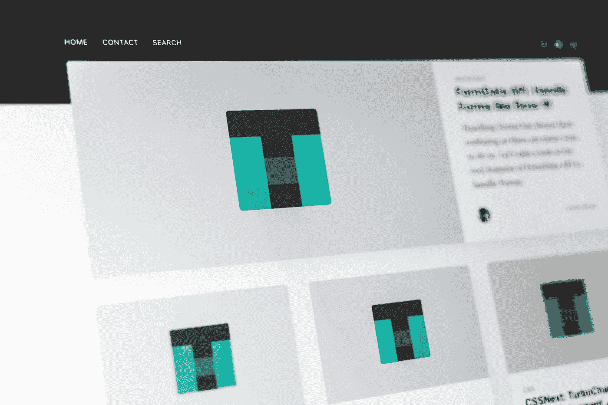
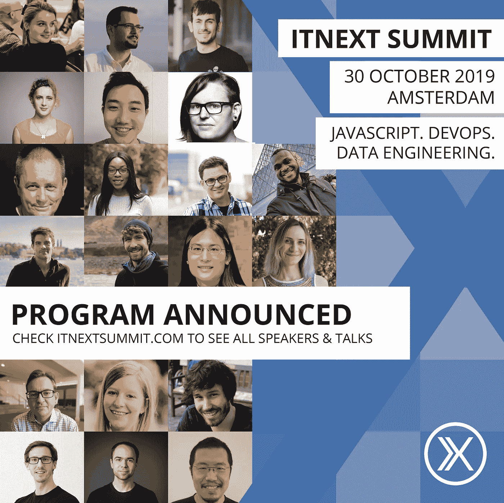

# ITNEXT.io 简讯 9 月

> 原文：<https://itnext.io/itnext-io-newsletter-september-d8ca482f067e?source=collection_archive---------4----------------------->

14 日&夏末版！

照片由[布伦丹·丘奇](https://unsplash.com/@bdchu614?utm_source=unsplash&utm_medium=referral&utm_content=creditCopyText)在 [Unsplash](https://unsplash.com/search/photos/begin-of-fall?utm_source=unsplash&utm_medium=referral&utm_content=creditCopyText) 上拍摄

我们希望你们都度过了一个美好的假期，享受了这个夏天！为了帮助你重新开始工作，我们挑选了一些优秀的文章供你阅读！然而，在此之前，我们想提两件事:

*   早鸟票销售期已经过去，但我们肯定会有一些折扣期。所以一定要留意这些！10 月 30 日见！
*   ITNEXT 由 [LINKIT](https://www.linkit.nl/) 创立。我们还组织每月一次的聚会。如果你住在荷兰，查看即将举行的活动。我们希望很快见到你。

**享受阅读文章的乐趣:)**

# NestJS 入门🏁

你开始使用 NestJS 了吗？然后你应该浏览一下本教程，学习如何用 TypeScript & NestJS 构建 web 服务。这个简单的带有 NestJS 的 API 服务器将处理一个基本的应用程序场景:创建、存储和检索一个普通商店的产品列表。

# 如何使用 React 挂钩构建动态的受控表单(2019)🏗

[React](https://reactjs.org/) 的新[钩子](https://reactjs.org/docs/hooks-intro.html)让构建 UI 变得前所未有的简单，但是有些东西比如 ***动态表单*** 还是有点难以理解。这就是我们今天设计的全部。因为我们使用了新的钩子，我们不会像以前那样使用任何类。你可以在这里找到这篇透彻的文章。

# 浏览器如何呈现网页？— DOM、CSSOM 和渲染

为了理解浏览器如何呈现网页，[这篇文章](/how-the-browser-renders-a-web-page-dom-cssom-and-rendering-df10531c9969?source=friends_link&sk=e2ef9680e6c23545e109a5f1d50761ee)深入研究了 DOM 和 CSSOM。浏览器阻止网页的某些呈现，直到某些资源被首先加载，而其他资源被异步加载。

照片由 [Pankaj Patel](https://unsplash.com/@pankajpatel?utm_source=unsplash&utm_medium=referral&utm_content=creditCopyText) 在 [Unsplash](https://unsplash.com/@pankajpatel?utm_source=unsplash&utm_medium=referral&utm_content=creditCopyText) 上拍摄

另外，请不要错过 Lorenzo Spyna 关于推送通知的以下文章:

# [反应推送通知(带挂钩)](/react-push-notifications-with-hooks-d293d36f4836?source=friends_link&sk=1b8c709422f2ee1c211c2f1521ff7dfc)

# [用 JavaScript 推送通知](/an-introduction-to-web-push-notifications-a701783917ce?source=friends_link&sk=b8e05ad5ca39eaf4a2114df236e80047)

# 。网芯很性感，你应该知道的🎉

了解原因。网芯很性感，你应该知道的！作者的目的是让你相信我们可以在 **C#** 和**中**轻松**和**快速**开发。NET Core** ，就像我们在 JavaScript 和 NodeJS 中能做的一样。

想知道怎么回事吗？这里全部看完[。](/https-medium-com-buisson-jeremy-net-core-is-sexy-and-you-should-know-it-a3d0c2eeedc4?source=friends_link&sk=dbb4a40c487074a20dcf79d9aff96b52)

# 用于数组的 Ruby 备忘单🚨

在[这篇文章](/a-ruby-cheatsheet-for-arrays-c8e5275155b5?source=friends_link&sk=16fc332f7a9b9ccef55309c5ca0fc5db)中，你可以找到适用于初学者和健忘的专业人士的技巧和窍门！简而言之，在你面前有大量方便的 Ruby 数组方法。为了简短起见，作者将返回值写在注释中，所以`arr # -> "stuff"`意味着`arr`的返回值是`“stuff”`。

# Git Rebase ⪭的优势

Medium 上阅读量最大的一篇关于 *git rebase* 的文章鼓励不要这么做。[这篇文章](https://medium.com/@fredrikmorken/why-you-should-stop-using-git-rebase-5552bee4fed1)建议重设基数的唯一目的是为了有一个好看的 git 日志历史。

> 我得出的结论是，这是虚荣心作祟。重置基础是一个纯粹的美学操作。

我想列出几个好的理由*为什么*，在我看来，重置基础是一个很好的做法，可以给你的工作流程带来很多好处。

# 在 Flutter 🧮建立一个计算器应用程序

在[这篇文章](/building-a-calculator-app-in-flutter-824254704fe6?source=friends_link&sk=346e420e7119e06f2e57049a915be503)中，你将学习如何用 Dart 和 Flutter 构建一个简单的计算器应用。Dart 语言和 Flutter SDK 中可用的优秀特性为现代开发人员提供了一个强大的工具包，用于快速尝试新想法和构建高性能应用程序。

由 [Kelly Sikkema](https://unsplash.com/@kellysikkema?utm_source=unsplash&utm_medium=referral&utm_content=creditCopyText) 在 [Unsplash](https://unsplash.com/search/photos/calculator?utm_source=unsplash&utm_medium=referral&utm_content=creditCopyText) 上拍摄的照片

# 如何用 PHP 搭建微服务？& PHP 微服务框架— Swoft 2.0.5 发布

构建微服务架构有不同的方式。如果使用传统的 PHP 框架，是很难实现的。但是相比之下使用 Swoft 就非常容易了。

凭借其高性能和稳定性，在本文[中找出为什么您应该使用 Swoft 而不是传统 PHP。](/how-to-use-php-to-implement-microservice-94957206abc6?source=friends_link&sk=d55b4879f9ad6dd31f25f27398346ed2)

如果你想知道 Swoft 到底是什么，看看这篇文章。简而言之，Swoft 是一个基于 Swoole 扩展的 PHP 微服务协程框架。

Swoft 通过三年的积累和方向探索，将 Swoft 打造成 PHP 界的春天云，是 PHP 高性能框架和微服务管理的不二之选。

# 用 Karma 和量角器容器记录一个有角度的应用程序

想知道如何在本地机器上用最少的设置开发 Angular 应用程序吗？生产怎么样？[本教程](/dockerizing-an-angular-app-with-karma-and-protractor-containers-3b4c53ea807f?source=friends_link&sk=ec5972668c31aef8e9e6a3d69e498bb0)将偷工减料！它将向您展示如何对 Angular 应用程序进行 Docker 化，使用 Angular CLI 进行构建，并最终使用 Docker 和 Docker Compose 进行开发和生产。

# 通过 GitOps 在 Kubernetes 上持续交付

GitOps 是由 [Weaveworks](https://weave.works) 推出的一种连续交付方式。它通过使用 Git 作为声明性基础设施和应用程序的单一事实来源来工作。

[本帖](/continuous-delivery-with-gitops-591ff031e8f9?source=friends_link&sk=bfa2206e9b264827acc5ce9f1802d909)将演示 [Flux](https://fluxcd.io) ，它是 GitOps 的核心组件，几周前在 CNCF 的沙盒中被接受。

# 在 Outsystems 中用省略号(…)截断字符串

作为一名 OutSystems 开发人员，您肯定遇到过由于文本换行而导致双倍大小的 div 或表格行中文本溢出的问题。使用 CSS 可以很容易地解决这个问题。怎么会？在[这篇文章](/truncating-a-string-with-ellipsis-in-outsystems-640a10fc73b2?source=friends_link&sk=4c3887b779724bb5baa8e58aa82664bf)中，joo 将使用两个容器包装文本来演示这一点。

# OutSystems 移动开发最佳实践，为什么？📱

OutSystems 移动开发最佳实践的存在是有原因的。William 将在本文[中解释为什么遵循这些最佳实践是必要的。](/outsystems-mobile-development-best-practices-why-47d1b5dacea0)

# 将外部系统环境从 JAVA 堆栈迁移到。网络堆栈

在 OutSystems 的最新版本中。NET-stack 更新了，而 Java-stack 没有更新。是时候考虑是继续使用 Java 还是迁移到. NET 了。在本文[中，Kees Kleybeuker 将带您一步步完成迁移。](/migrate-outsystems-environment-from-java-stack-to-net-stack-ca2daeb9c42f)

# 下面是激动人心的新闻和更新！

照片由[rawpixel.com](https://www.pexels.com/@rawpixel?utm_content=attributionCopyText&utm_medium=referral&utm_source=pexels)从[像素](https://www.pexels.com/photo/woman-leaning-on-desk-reading-newspaper-1376868/?utm_content=attributionCopyText&utm_medium=referral&utm_source=pexels)拍摄

# 你可能错过的精彩播客🎧：

想成为最好的软件开发者吗？希望建立务实的团队？→ [⏯️](https://player.fm/series/coding-blocks-software-and-web-programming-security-best-practices-microsoft-net/the-pragmatic-programmer-how-to-build-pragmatic-teams) ←(音频)*艾伦·安德伍德，迈克尔·奥特洛，乔·扎克。*

看看用 React 和 Redux 与 [**马特·比尔曼**](https://twitter.com/biilmann)[**Netlify**](https://www.netlify.com/)的 CEO 一起构建 Netlify 仪表盘吧！在这里调谐→ [⏯️](https://player.fm/series/series-1401837/ep-122-matt-biilmann-architecting-the-netlify-dashboard-with-react-and-redux) ←(音频)*亚当·瓦森*

你应该读一读新版的《实用程序员》和迪夫·托马斯，安迪·亨特！你可以在这里找到它:在这里收听→ [⏯️](https://player.fm/series/codenewbie-1250448/s9e8-why-you-should-read-the-new-edition-of-the-pragmatic-programmer-dave-thomas-andy-hunt) ←(音频)*由 CodeNewbie。*

# 好玩的东西！

开发商开发商！微软的东西，试试看！

开发者开发者，一个模仿史蒂夫·鲍尔默的微软开发者的网站

你可以在这里画出自己的身影:[http://developersdevelope.rs/](http://developersdevelope.rs/)

# 🎉ITNEXTSUMMIT 2019🎉

2019 年 10 月 30 日星期三，我们的年度活动 [ITNEXT SUMMIT 2019](https://www.itnextsummit.com/) 将在阿姆斯特丹的 Pakhuis de Zwijger 举行。今年的活动有三个平行赛道，分别是 **JavaScript、DevOps** 和**数据工程**。该活动的目标是 IT 专业人士，他们希望加深自己的知识并结识志同道合的朋友。

我们也提供多样性门票。你是否属于 IT 行业中代表性不足的群体？申领一张免费多样性门票。检查:[*https://diversitytickets.org/en/events/426*](https://diversitytickets.org/en/events/426)