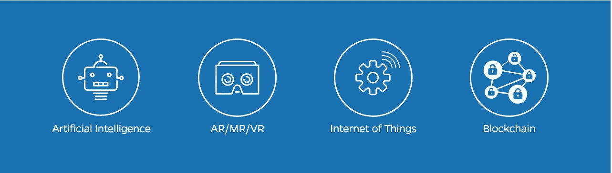

# 2017 年 ITNEXT 峰会

> 原文：<https://itnext.io/itnext-summit-2017-b53e2bd6d4cd?source=collection_archive---------0----------------------->

**分享。连接。合作。学习。**
我们以此为座右铭。 [*ITNEXT SUMMIT 2017*](http://www.itnextsummit.com) 是一场创新公司和个人将揭开其产品和知识神秘面纱的盛会，展示未来解决方案背后的技术。

不要指望仅仅讨论 5 到 10 年后会发生什么。这是一个地方，看看幕后有什么是可能的实施和应用，了解什么似乎是不可能的，但现在是可行的！

通过此次峰会，我们扩大了我们的社区，并创造了另一个连接、扩展和深化知识的绝佳机会！
所有这些都有一个愿望，那就是加强 ITNEXT 社区，利用技术改善我们周围的世界。

你渴望参加这个年会，一个未来的聚会，或者你想成为它的作家吗？报名参加[峰会](http://www.itnextsummit.com)，成为我们 [Meetup](http://meetup.com/itnext) 的成员，加入 [ITNEXT.io](https://itnext.io/) 。峰会将于 11 月 15 日在阿姆斯特丹 179 号举行。

请记住，2017 年 ITNEXT 峰会的重点不是如果和为什么，而是技术部分如何工作。所以，点燃你的想法，并准备好与工程师同事、决策者、投资者和所有好奇的技术达人交流。他们会围绕着你讨论新的趋势和可能性，让你更接近未来。所有这些都是由来自这个世界之外的演讲者和令人惊讶的展览所激发的。

你可以在网站上查看[节目](https://www.itnextsummit.com/program/)，我们有 11 场精彩的演讲，包括来自 IBM 的[Erno doorenspreet](https://www.linkedin.com/in/erno-doorenspleet-4664b71/)作为我们的[主题演讲人](https://www.itnextsummit.com/sprekers/erno-doorenspleet/)。您还可以欣赏来自野餐会的丹尼尔·格布勒(Daniel Gebler)和荷兰国际集团的塞斯·范·维克(Cees van Wijk)等演讲者。

来吧，让我们一起向前看！