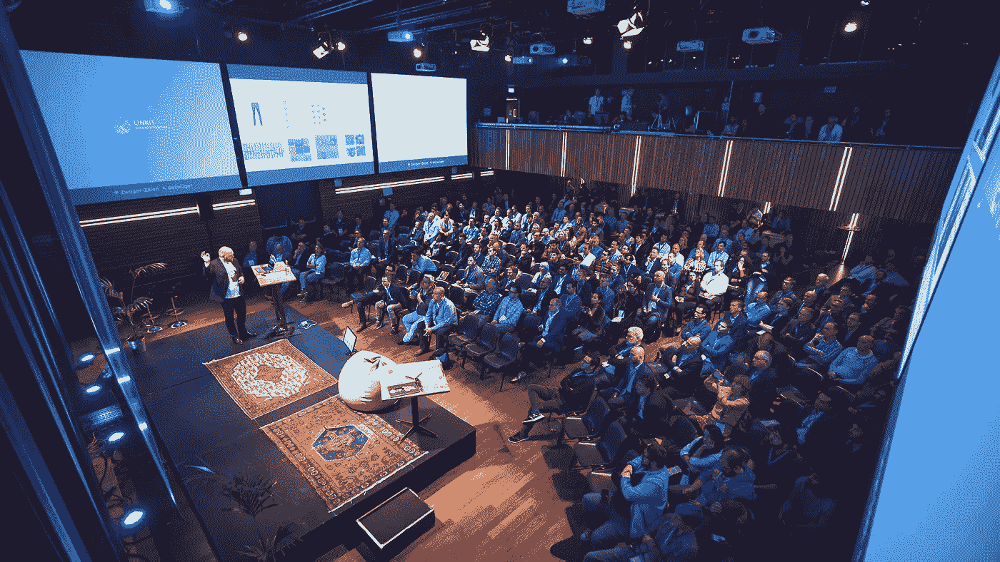
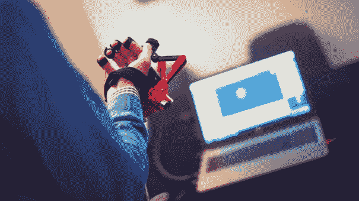
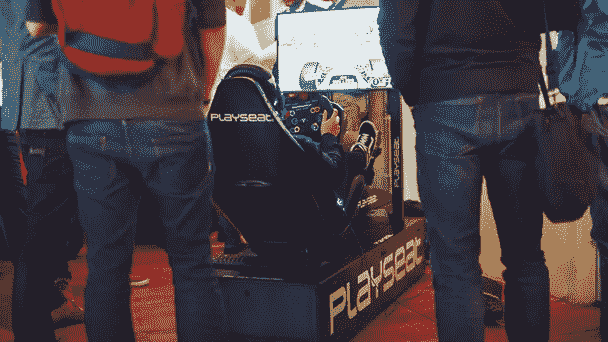
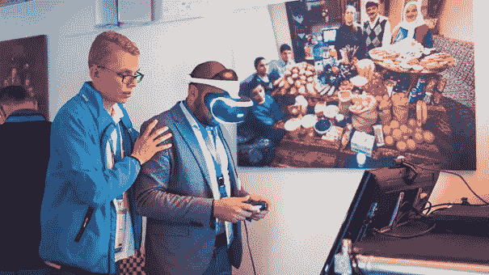
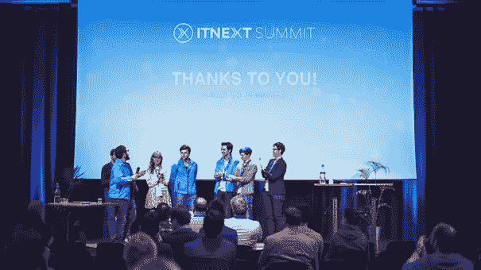

# ITNEXT SUMMIT 2017 回顾

> 原文：<https://itnext.io/itnext-summit-2017-in-brief-859f8998dff1?source=collection_archive---------0----------------------->

11 月 15 日，2017 年 ITNEXT 峰会在阿姆斯特丹的 Pakhuis de Zwijger 举行。今年峰会的重点是人工智能、AR/MR/VR、物联网和区块链。13 位出色的演讲者和 8 家激动人心的初创公司一起展示了这些话题。峰会的口号是“ ***”。科技的未来看起来像魔法。知道它背后的代码*** ，用它我们旨在实现炒作成现在可能的样子。

300 多名 IT 专业人员和经理参加了几场会议，在休息期间，他们在测试体验区找到了灵感，在那里，初创公司展示了他们的产品，并解释了他们产品和服务背后的技术。

此外，参观者有一个很好的机会建立关系网，认识他们领域里的了不起的人。他们还被挑战在虚拟现实游戏和 F1 游戏座椅中创造记录。

ITNEXT Summit 2019 定于 2019 年 10 月 30 日举行。地点、主题和演讲人将稍后公布，请访问 ITNEXT 峰会[网站](https://www.itnextsummit.com/)了解最新动态。

