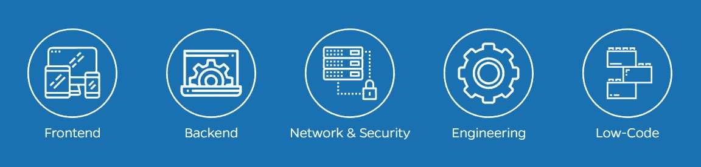
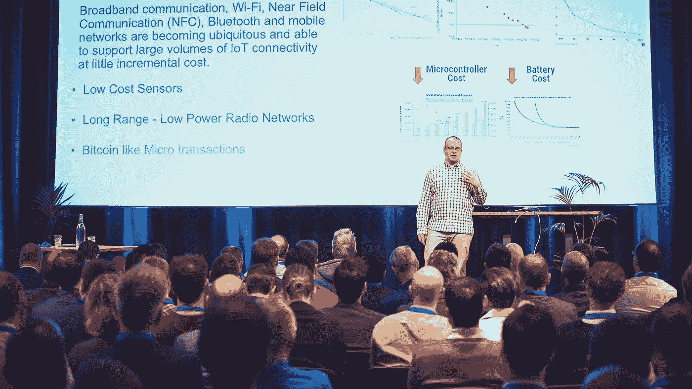
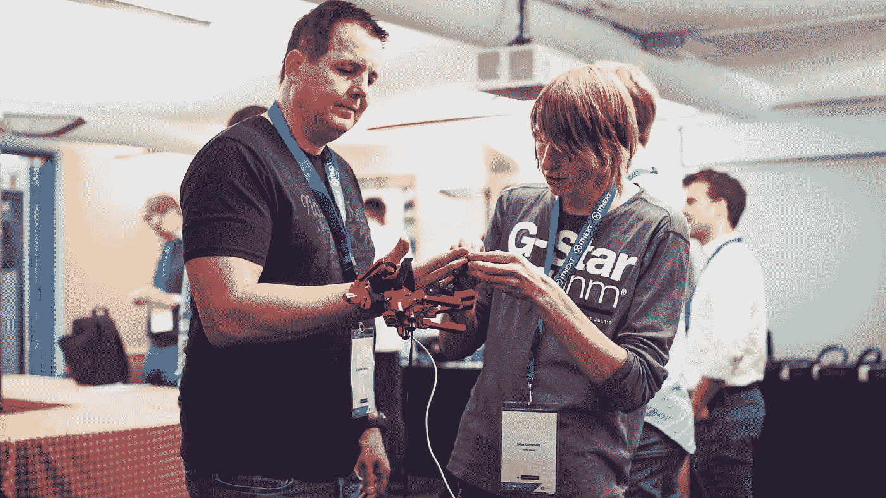
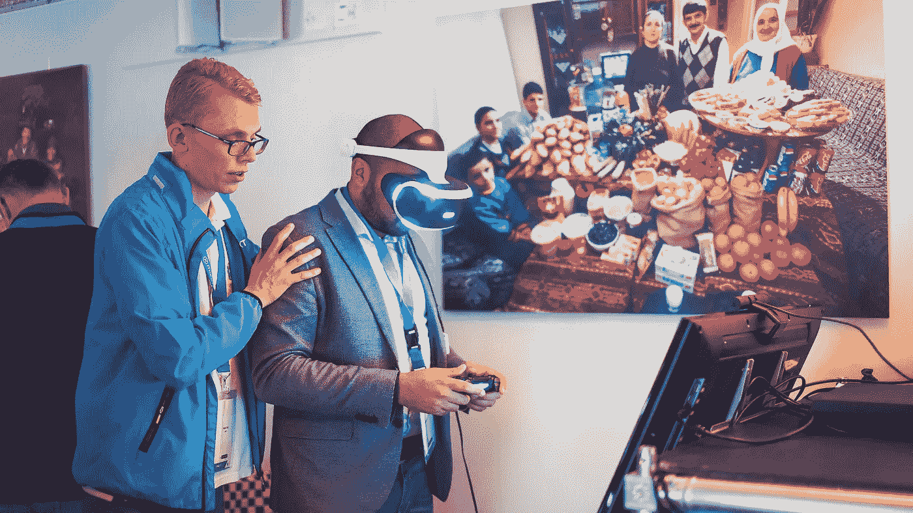
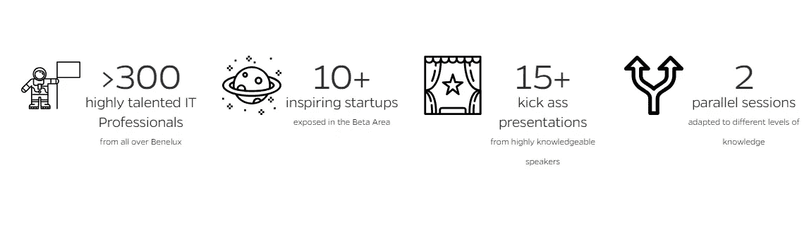

# ITNEXT SUMMIT 2018 回顾

> 原文：<https://itnext.io/itnext-summit-2018-a0bdccd3351a?source=collection_archive---------7----------------------->

## **学习。分享一下。连接**

我们靠这句格言生活，“**学习。分享一下。连接"**。在 2018 年 ITNEXT 峰会上，创新公司和人们揭开了他们产品和知识的神秘面纱，展示了未来解决方案背后的技术。通过此次峰会，我们扩大了我们的社区，并创造了另一个连接、扩展和深化知识的绝佳机会！

[ITNEXT Summit 2018](http://www.itnextsummit.com/) 以多种形式翻译了她的座右铭:(国际)国家演讲者的知识讲座，由(10+家)科技创业公司的展台代表的创业区，以及赞助商区。

# **知识讲座**

在#ITNEXTSUMMIT 期间，我们展示了在上市时间是最关键因素之一的时代构建可扩展应用程序所需的技术和技能。我们希望您喜欢来自鼓舞人心的**商业轨道**的讲座，了解市场领导者的成功经验和教训。对于那些希望获得更多技术知识和实践机会的人来说，我们有一个广泛的**技术讲座**，我们的国际演讲者将在这里展示下一代前端开发、后端开发、网络、网络安全、云原生基础设施、数据工程和低代码开发！

查看会谈 [**此处**](https://www.itnextsummit.com/keynotes-handouts-itnext-summit-2018/) **。**

# 启动区域

创业区由 10 多家科技创业公司代表。我们向初创公司提供免费曝光，因为我们总体上拥抱技术发展。唯一的条件是，初创公司与观众分享其产品/服务背后的技术。我们的观众喜欢编码和向他人学习。这就是我们创造这种双赢局面的原因。免费曝光创业公司，以回报向我们的观众展示酷技术及其背后的代码。你和/或你的朋友认为这很有趣吗？请填写 2019 年的申请表，届时我们会通知您！

# 赞助商区域

描述所有赞助选项和伴随风险的赞助文件可在下面的链接中找到。你是否知道或者你是否是一个合适的组织，想要提高他们的品牌知名度，或者想要将他们/你的名字与知识分享活动联系起来？不要害怕在 2019 年尝试一下，或者让他们参考赞助商文档和我们以前的成功案例。点击 [***此处***](https://www.itnextsummit.com/wp-content/uploads/2019/01/itnext-sponsor-doc-2019-1.pdf) 查看 2019 赞助商文件！

# 绝佳的机会

ITNEXT 提供的服务非常独特！你不能参加在荷兰举行的任何活动，来自**谷歌** *(英国)***亚马逊** *(西雅图)* **NodeJS** *(博洛尼亚)****朵拉** *(旧金山)*的杰出国际演讲者聚集在一起，就为了这样一张低预算的门票。2018 年常规门票价格为*€9.9 万！**

**

# *程序*

*想知道程序是什么样子的，你错过了哪些演讲者？请点击此链接查看→[https://www.itnextsummit.com/program-2018/](https://www.itnextsummit.com/program-2018/)*