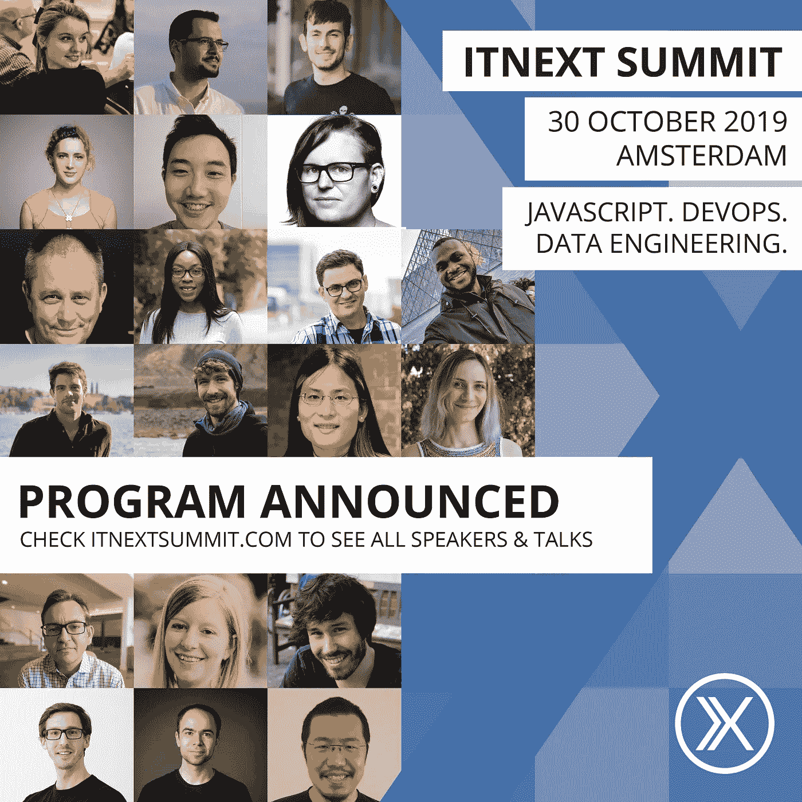

# 2019 年 ITNEXT 峰会

> 原文：<https://itnext.io/itnext-summit-2019-384f998aedc8?source=collection_archive---------4----------------------->

## 完整的程序宣布:现在购买您的机票！

2019 年 10 月 30 日星期三，我们的年度活动 [ITNEXT Summit 2019](https://www.itnextsummit.com) 将在阿姆斯特丹的 Pakhuis de Zwijger 举行。今年的活动有三个平行的赛道，分别是 **JavaScript、DevOps 和数据工程**。该活动的目标是 IT 专业人士，他们希望加深自己的知识并结识志同道合的朋友。

您是否想了解更多关于卓越生产核心的最佳实践？你是否明智地为人工智能项目选择数据？你想知道如何从 AWS Lambda 开始革新你的软件过程吗？您是否在随着时尚的变化而改变 JS 框架，并想在哪些方面花时间做出深思熟虑的决定？如果这些问题中的一个或多个触发了你的开发者思维，那么你最好不要错过下一次峰会！在本次活动中，演讲者将展示下一代技术和必要的技能，以在一个上市时间是最关键因素之一的时代构建可扩展的应用程序。

ITNEXT 峰会为每个人创造了一个安全和包容的环境，今年，**多样性**是一个优先事项。因此，我们邀请了 Tara Ojo 和 Holden Karau 两位了不起的工程师担任第一期和第二期主题演讲嘉宾。Liz Fong-Jones，前谷歌 SRE，现蜂巢 SRE 开发倡导者，将做另一个精彩(有趣)的主题演讲。Kris Nova，世界上最杰出的 Kubernetes 工程师之一，将做闭幕主题发言。所有这些出色的工程师在社区中都有很强的影响力，也是技术领域中代表性不足的群体的一部分。

其他出色的演讲者来自不同的公司，如 Google、Amazon Web Services、Buffer、Atlassian 等。前往[www.itnextsummit.com](http://www.itnextsummit.com)查看完整的节目并购买您的门票！我们还提供多样性门票。你是否属于 IT 行业中代表性不足的群体？申领一张免费多样性门票。检查[*https://diversitytickets.org/en/events/426*](https://diversitytickets.org/en/events/426)