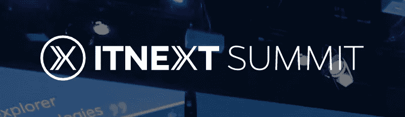
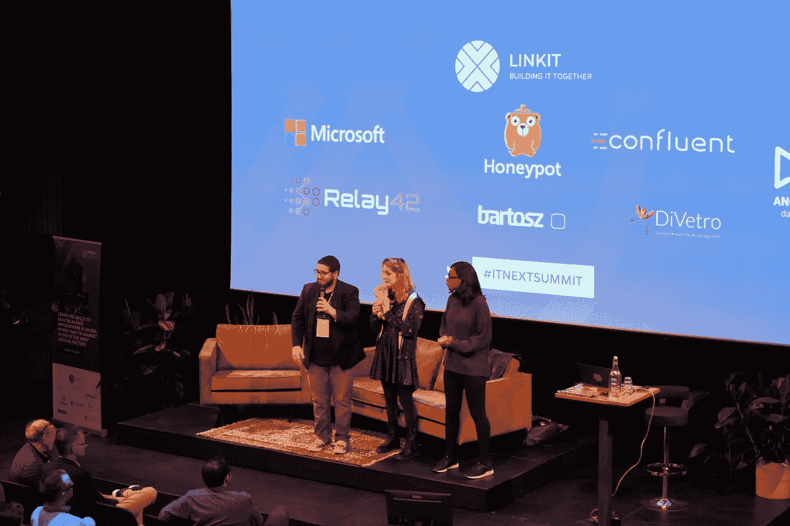
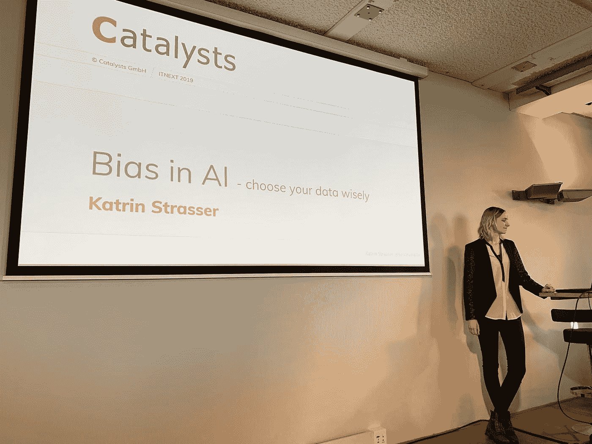
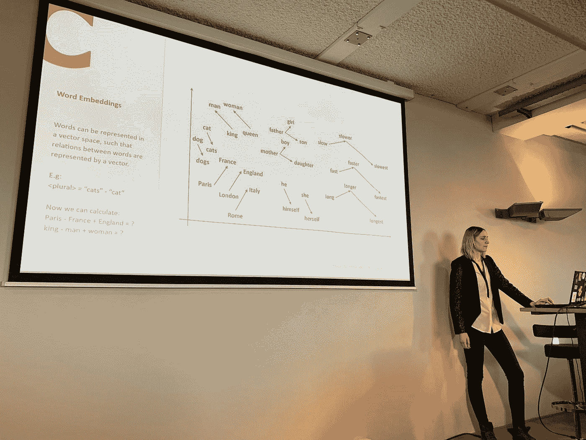
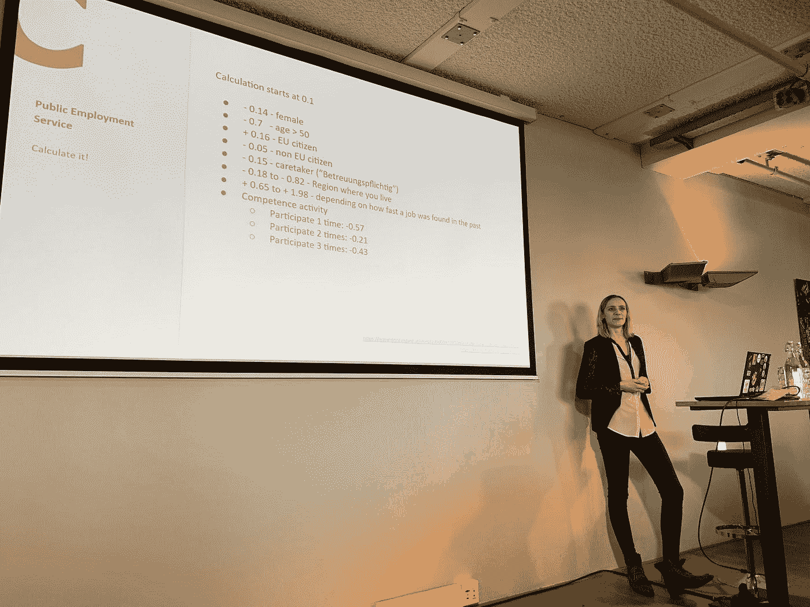
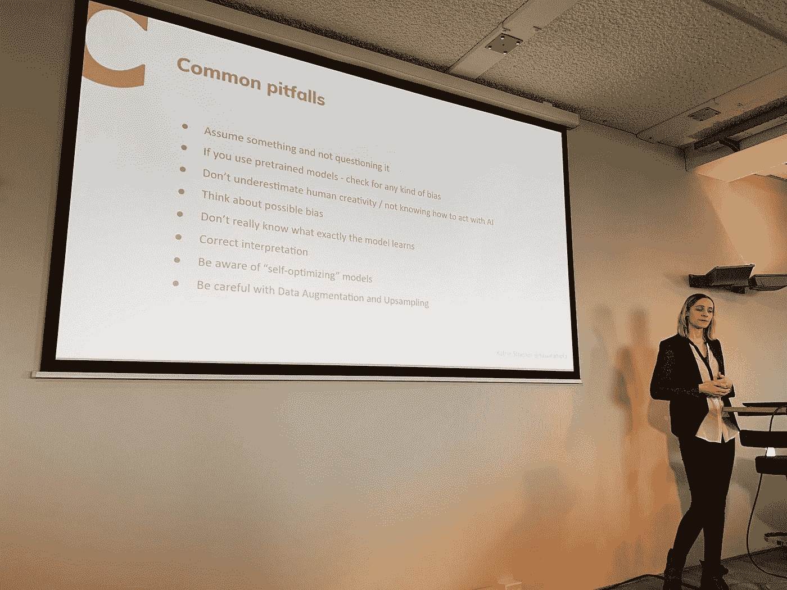
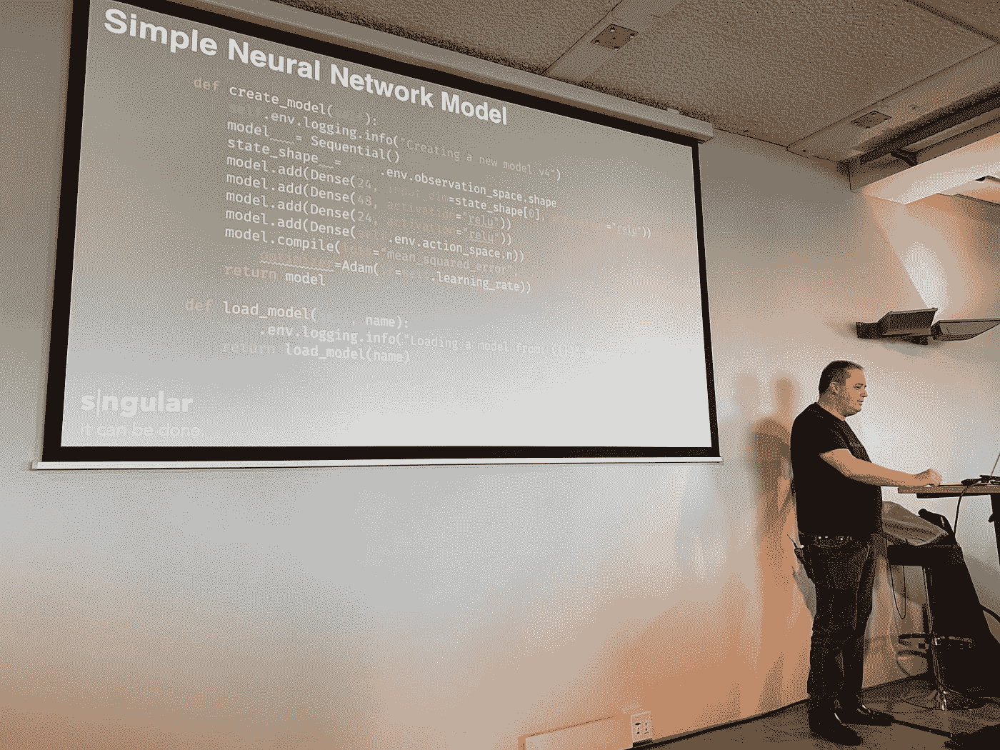

# ITNEXT Summit 2019，数据工程专题回顾

> 原文：<https://itnext.io/itnext-summit-2019-data-engineering-track-recap-f08ce5a775aa?source=collection_archive---------5----------------------->

2019 年版的 [ITNEXT 峰会](https://www.itnextsummit.com/)于 2019 年 10 月 30 日在荷兰阿姆斯特丹举行。

大约有 450 多名热情的与会者前来向伟大的专家学习并获得灵感。

有 3 个音轨:

*   Java Script 语言
*   DevOps
*   数据工程

每条赛道都由一名主持人带领和策划:

内容策展人和组织者:从右至左:[塔拉·奥乔](https://twitter.com/tara_ojo)(沙威脚本)[霍尔登·卡劳和布(数据工程师)](https://twitter.com/holdenkarau)和[蒂亚戈·德·法里亚](https://twitter.com/thiagoavadore)(德沃普斯)

从议程来看，可以说 Devops 挤满了无服务器会议，数据工程师课程侧重于机器学习。这反映了欧洲行业正在发生的事情，但不仅仅是欧洲！大规模的机器学习开始在全球范围内兴起，似乎许多公司和开源软件都试图为这些挑战创造一个解决方案。**相当激动人心的时代！**

数据工程方向有 5 节课:

## 1.人工智能中的偏见——明智地选择您的数据:

Katrin Strasser 揭开了这个话题的序幕，他首先强调了我们都遭受的无意识偏见。这是刻板印象、文化、教育、环境等等的直接反映。她继续举例说明人工智能在银行、保险、法院、公共服务、军事等机构中的应用，以下是一些使用案例:

*   申请贷款——一个人偿还贷款的概率
*   法院判决——有罪/无罪
*   医院——一个人痊愈的几率有多大
*   公共就业服务——是否值得投资在这个人身上以获得一份工作？
*   给人分类

为什么数据如此重要？这是因为 AI 什么都不懂！

人工智能严格受限于我们输入的数据。

偏向在哪里？数据可以有偏差！对人类进行分类的大部分数据是由……产生的。人类！这造成了一个恶性循环，人工智能强调偏见。

来自自然语言处理(NLP)领域的单词嵌入说明了刻板印象偏见是如何来自语料库的:

卡特琳展示了人类分类算法如何主要基于我们无法控制的特征。

公共就业服务的评分标准——它对就业市场上的机会进行评级

Katrin 继续进行人脸识别，每天 30 万人的错误率为 0.34%，这是一个巨大的数字。

我们能做些什么来修复它？了解你的数据！

了解您的用例并保持警惕。

检查模型！了解常见的陷阱

## 2.如何使用强化学习解决犯罪修道院

在他的会议中，Juantomas Garcia 向我们展示了使用强化学习来赢得游戏的过程，他的例子集中在 Abbey Of The Crime——一个西班牙游戏上。将啤酒和科技项目结合起来可能会导致糟糕的工程设计:

项目中的步骤和注释:

1.  将游戏从 Z80 汇编移植到 C++。
2.  衡量问题空间以及需要采取多少步骤才能成功。
3.  创建一个嵌入式 web 服务器来捕获步骤和游戏矩阵——收集信息是花费了 **95%** 工作时间的部分，这是项目中**最难的**部分！
4.  你的电脑没有足够的处理能力，把所有东西容器化，部署到公有云。公共云提供了许多现成的人工智能功能和规模解决方案。[这是 Azure](https://azure.microsoft.com/en-us/free?WT.mc_id=itnext-blog-adpolak) 的 200 美元启动信用。
5.  游戏和项目产生了 1 TB 的数据。
6.  你可能只会写 10 行 AI，剩下的都是 API 和数据工作:

7.该项目正在进行中！还没完成。你可以在 G [ithub](https://github.com/LaAbadIAdelCrimen) 上凑热闹。

## 3.Philipp Krenn 的《让您的数据变得精彩:

在一天的这个时候，我非常需要咖啡。

以下是霍尔登·卡劳的专题推文:

## 4.围绕 Kubeflow 组织数据工程:

会议开始时，向观众提出了一个互动问题—您的数据挑战是什么？观众填写了一份表格，我们在屏幕上看到了它的实况——非常棒！

我们继续构建机器学习管道的移动部分，以及我们如何在团队之间分配工作，以及我们如何使用 K [ubeflow](https://www.kubeflow.org/) 来可视化所有部署和工作部分:

我们如何与云集成:

这是一次很棒的会议，它让我们了解了 Kubeflow、ML pipelines 以及如何让每个人一起工作。

数据工程师专题讲座的闭幕会议是:

# 5.流数据之外的流处理

Stephan 是 F [link](https://flink.apache.org/) 的共同创建者之一，他向我们介绍了什么是流处理以及未来会带来什么:

该讲座向我们介绍了 3 种流处理概念:

*   **使用 SQL 进行流处理** —过滤、丰富、聚合、连接等。
*   **有状态事件驱动处理/全状态功能**—协调和维护状态。
*   **—功能为服务，来自无服务器世界，大部分时间无状态，以计算为中心。**

**Stephan 最后举例说明了如何将所有这些技术整合到一个系统中，在演示示例中，他展示了拼车后端的高级架构:**

**总的来说，这是一次很棒的会议，让我们看到了 Flink 的发展方向和行业需求。**

## **这是一个总结！**

**这只是 2019 年下一届峰会的一瞥。总的来说，会议有精彩的环节，最新的内容，充满了开放和**欢迎**的社区氛围。**

**感谢所有让 2019 年下一届峰会成为可能的人！**