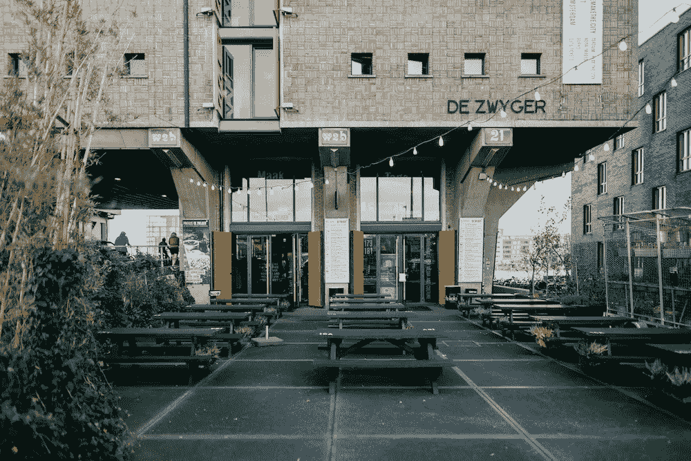
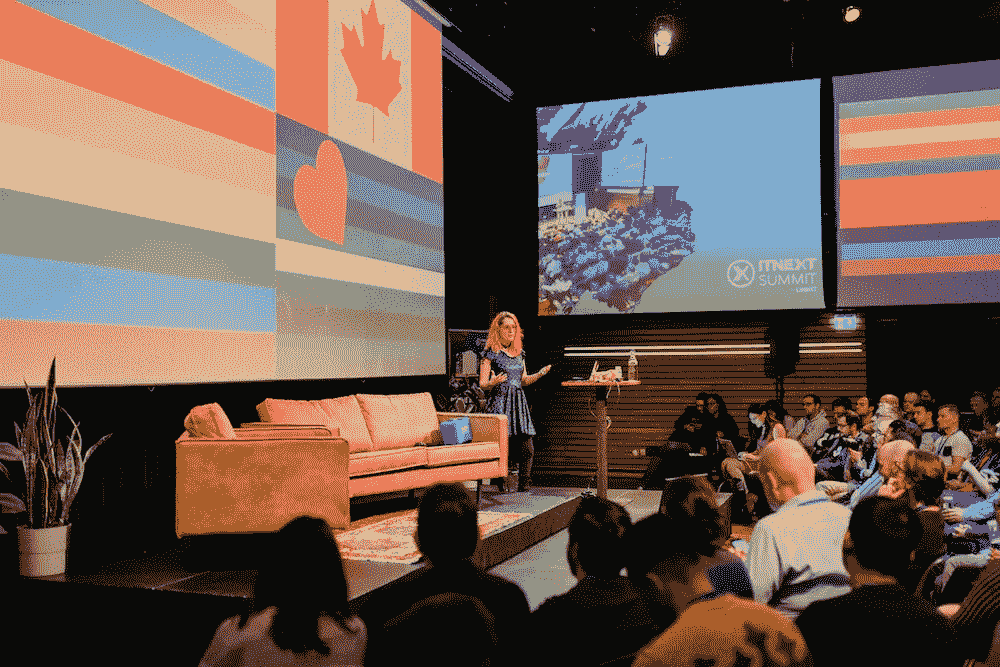
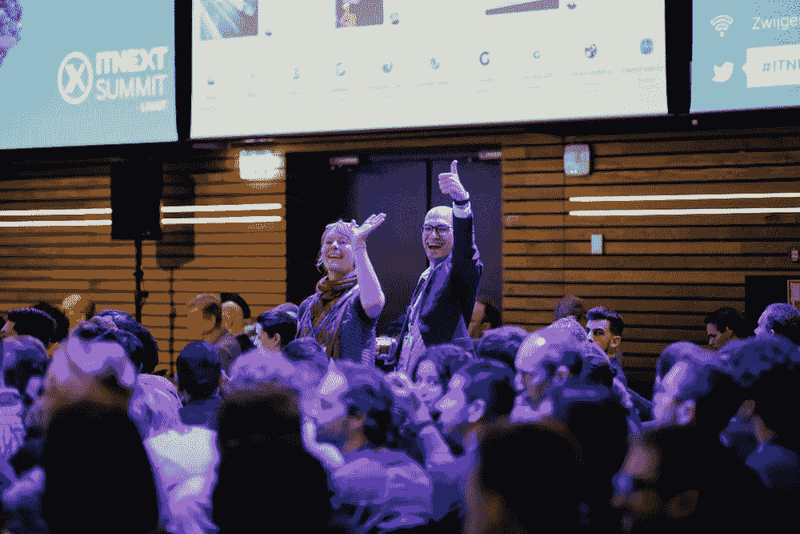
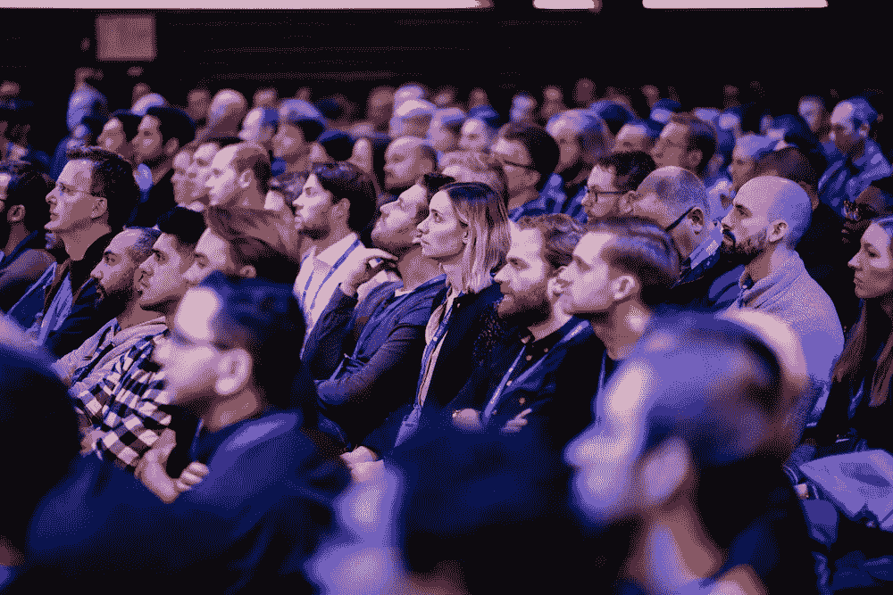
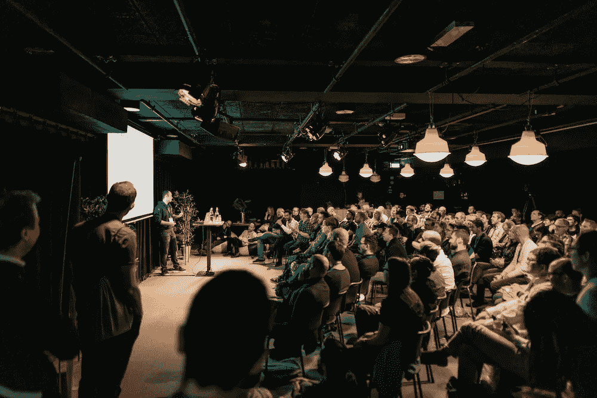
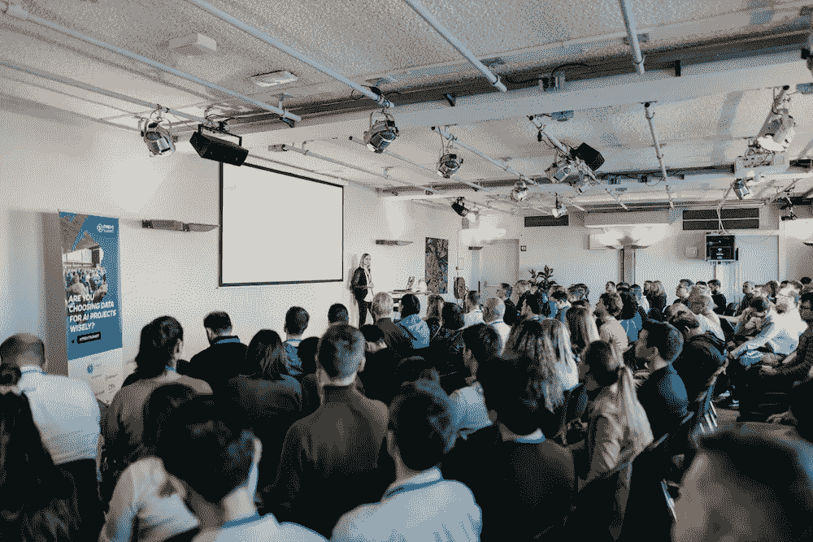
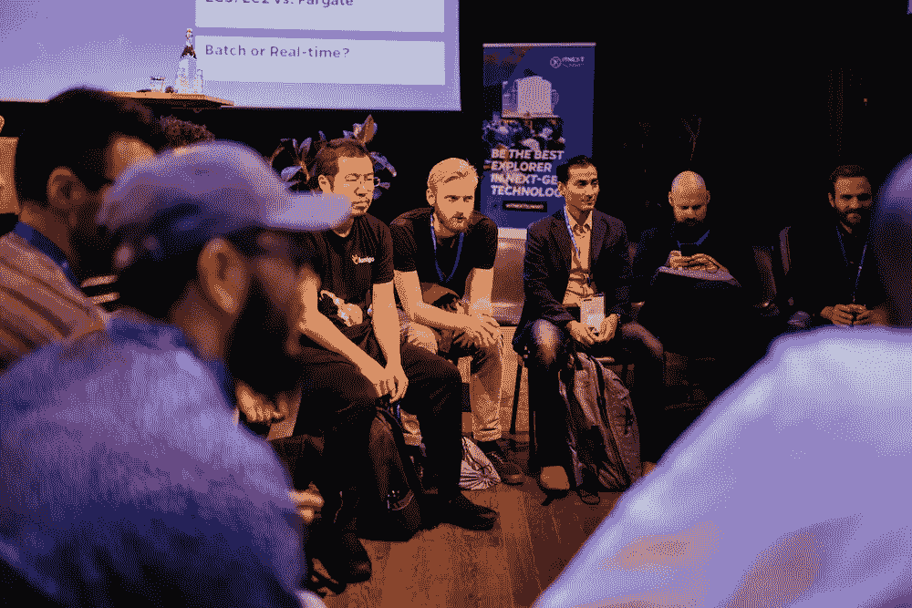
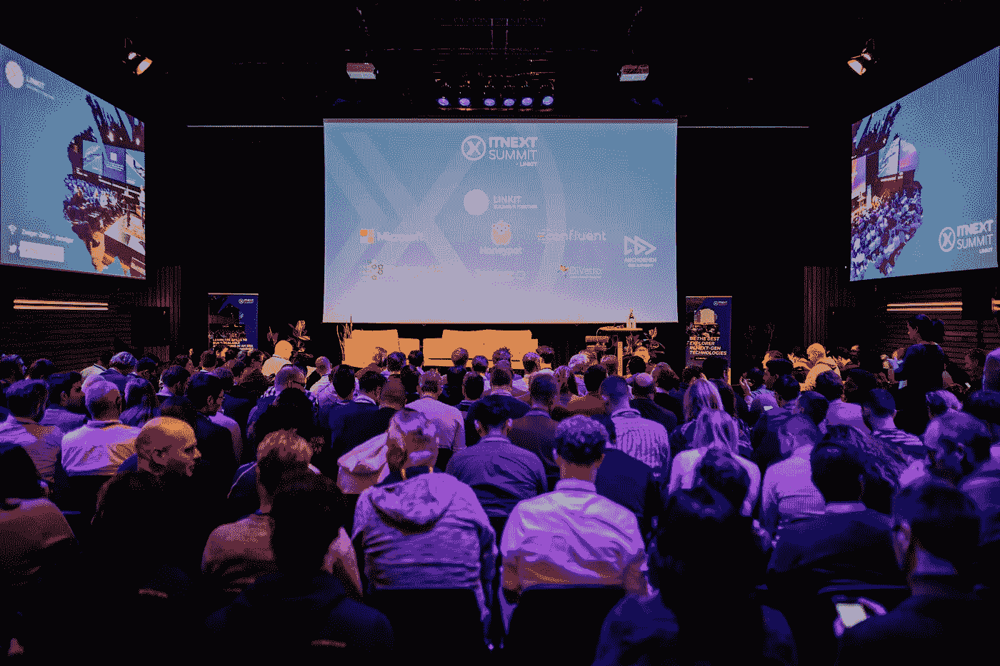

# ITNEXTSUMMIT 2019 回顾

> 原文：<https://itnext.io/itnextsummit-2019-in-retrospect-4bc5452d10fb?source=collection_archive---------5----------------------->

## 学习。分享一下。连接。

在 ITNEXT 峰会之前，与所有演讲者一起进餐、分享期望和知识是一种传统，但尤其是享受一个舒适的夜晚作为活动的热身。峰会前一天晚上，我们在雅加达阿姆斯特丹酒店享用了一顿丰盛的晚餐。

> 超过 550 张注册门票，20 位演讲者分三个部分，7 位赞助者，这是一次很有希望的盛会！

2019 年 10 月 30 日星期三，我们的年度活动 ITNEXT 峰会在阿姆斯特丹的 Pakhuis de Zwijger 举行。今年的峰会是一个多轨道互动会议，面向那些想知道 **JavaScript** 、 **DevOps** 和**数据工程**下一步发展的有远见的开发者。

## 多样性

分享高质量的知识是我们的核心价值，也是我们存在的理由。此外，技术是为人类建造的，也是由人类建造的。不同的心态和观点代表了一个更好的学习和分享环境:ITNEXT 倡议背后的核心理念。因此，多样性是我们第四届 ITNEXT 峰会的重点之一。

## 精彩的主题演讲

我们以 Liz Fong-Jones*(Honeycomb)*、Holden Karau*(Apple)*和 Tara Ojo *(FutureLearn)* 的三场全体主题演讲开始了这一天。Kris Nova *(Sysdig)* 是当天全体会议的闭幕主题。凭借他们渊博的知识、幽默感和在 IT 社区的足迹，他们将我们的演讲者项目带到了一个新的高度！查看他们的谈话[这里](https://www.itnextsummit.com/sprekers/)！

## 三条不同的轨迹

我们生活在这样一个时代，构建软件不再是一成不变的常规。我们这一代人不知道朝九晚五的心态；相反，我们的目标是用每一个行动产生影响。渴望探索具有挑战性的机会是我们文化的一部分。为什么？因为我们比以往任何时候都想不断突破极限！

Tara Ojo 是 JavaScript 的主席。她挑选了五个精彩的演讲。请在[网站](https://www.itnextsummit.com/sprekers/)上找到所有的演讲！

**DevOps** Thiago de Faria 选择了 devo PS 赛道的所有演讲，房间一整天都座无虚席！对这些讲座感到好奇？检查他们[这里](https://www.itnextsummit.com/sprekers/)！

数据工程
数据工程的主席是霍尔登·卡劳。她喜欢各种严肃的谈话，混合一些轻松有趣的东西！欢迎来这里看讲座[！](https://www.itnextsummit.com/sprekers/)

今年我们在节目中引入了空地*(非会议)*。这个**非会议**部分是一个面向参与者的会议，与会者决定议程和讨论主题。

# 介绍视频

# 电影后

我们谨代表 LINKIT，为您能参加 ITNEXT 峰会而感到自豪。我们要感谢今年的赞助商:Anchormen、Bartosz、Confluent、Datadog、DiVetro、Honeypot、微软和 Relay42。

明年见！

