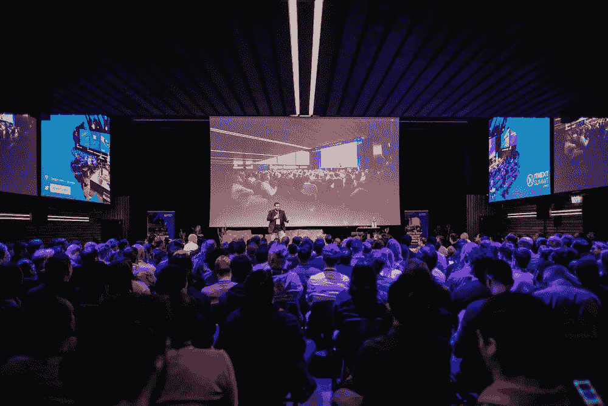

# ITNEXTSUMMIT

> 原文：<https://itnext.io/itnextsummit-c21f4fabae34?source=collection_archive---------4----------------------->

# 成为下一代技术的最佳探索者

**学习。分享一下。连接**

## [ITNEXTSUMMIT](https://www.itnextsummit.com/)

今年，我们庆祝 ITNEXT 年会五周年。2020 年 11 月 4 日周三、**下一届 2020 年峰会将在阿姆斯特丹**的 **Pakhuis de Zwijger** 举行。今年的峰会有三个平行的赛道，分别是 **JavaScript** 、**数据工程**和 **DevOps** 。该活动的目标是 IT 专业人士，他们希望加深自己的知识并结识志同道合的朋友。****

你对进步的 Web 应用程序、最新的 Web APIs、自动化和改进工作流的性能想法感兴趣吗？或者其他任何可以改善 JavaScript 开发者生活的东西？不要错过 JavaScript 课程！

在 DevOps 专题讲座中，我们希望讨论应用程序交付各个方面的持续改进。更高的安全性，更高的自动化程度，更高的功能满意度，以及更多的无服务器服务。

还是对机器学习工程、数据应用中的风险管理、数据管道的测试自动化和监控以及现代基础设施上的数据工程更感兴趣？那么下一届峰会 2020 是不是你应该去参加的活动呢！

我们将于 2020 年 11 月 4 日在阿姆斯特丹欢迎您！

## 关于它接下来

*ITNEXTSUMMIT 是由*[*LINKIT*](https://medium.com/u/b1c5d1d468f6?source=post_page-----c21f4fabae34--------------------------------)*发起的 ITNEXT 年度大会。我们专注于* ***分享*******连接*** *的人，以及* ***鼓舞*** *的 IT 专业人士和爱好者。**

**峰会股份* [*ITNEXT 的核心愿景*](/about-itnext-877f4197e8f6)*；成为一个知识驱动的社区。借助此次峰会，我们扩展了我们的社区，并为* ***联网*******拓宽*******深化知识*** *在* *内的每一个层面创造了又一个绝佳机会。****

****

## **以前的 ITNEXTSUMMIT 的！**

**想知道往年的节目是什么样子的，有哪些演讲者你可能错过了？**

**阅读以下关于每年峰会的所有信息:**

**[ITNEXTSUMMIT 2019](/itnextsummit-2019-in-retrospect-4bc5452d10fb)**

**[ITNEXTSUMMIT 2018](/itnext-summit-2018-a0bdccd3351a)**

**【2017 年 ITNEXTSUMMIT】**

**[ITNEXTSUMMIT 2016](/it-next-summit-2016-7e2cad6313b6)**