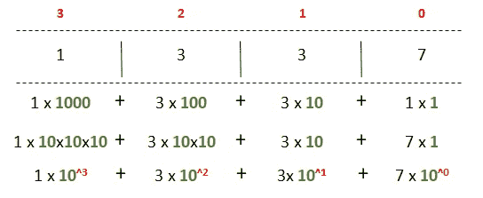
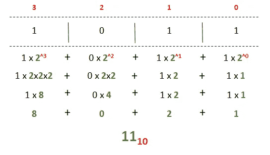
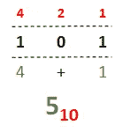
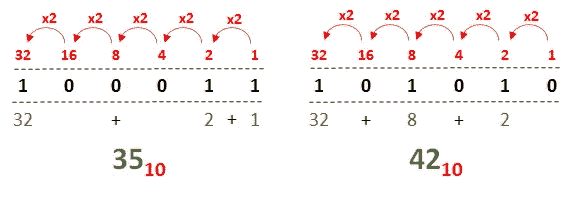
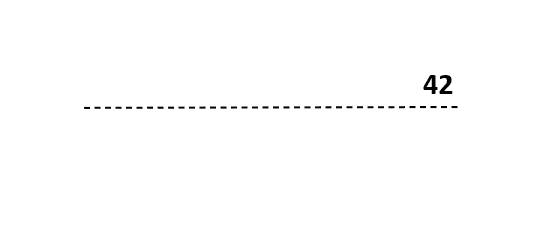
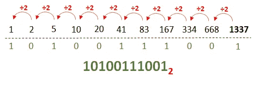
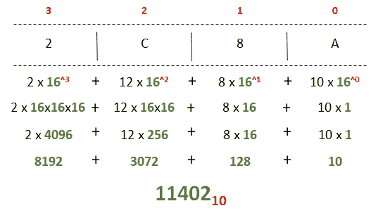
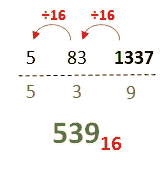
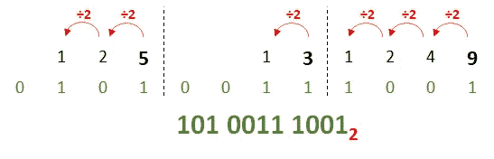

# 都只是 0 和 1:理解二进制

> 原文：<https://itnext.io/its-all-just-0-and-1-understanding-binary-8530629e1d1f?source=collection_archive---------2----------------------->

我们经常听到或者说，电脑只是一堆 1 和 0。这一系列的小文章试着解释一下是什么意思！

我们如何想象计算机使用 0 和 1

本文是系列文章的第一部分；你可以在这里找到其他人:

*   [**第一部分——理解二进制**](/its-all-just-0-and-1-understanding-binary-8530629e1d1f)
*   [第二部分——关于位和字节](https://jbuisson.medium.com/its-all-just-0-and-1-about-bit-and-bytes-683b2d2b821a)
*   第 3 部分—二元运算(即将发布)
*   第 4 部分—电子学中的二进制(即将发布)

# **第 1 部分-** 了解二进制

我第一次在学校接触二进制是在 20 多年前，墙上有一张纸，上面写着这样的文字:

> 有 10 种人，理解二进制的人和其他人。

这个时候我才明白这个笑话。也许对你来说也是如此，但是不要担心，在你的阅读结束之前，你将能够自己向任何人解释它！

为了用二进制计数，我们首先需要了解我们在日常生活中是如何计数的，甚至不用去想它。

## 十进制计数

***十进制*** 一词来源于拉丁语“*Decem”*，意为 ***十个*** ，我们用十个符号来计数，用的是俗称的[阿拉伯数字](https://en.wikipedia.org/wiki/Arabic_numerals) : **0、1、2、3、4、5、6、7、8、**和 **9。**

如果你还不知道，在计算机科学中，我们从 0 开始计数，而不是从 1。

计数时，我们只是按照给定的顺序从一个符号移动到另一个符号。当我们在这个序列的末尾时，我们简单地从左边的一个新的符号行开始，每一行代表一个不同的单元。第一种是最简单的:您只需使用符号的值。第二个是符号值乘以 10。第三个乘以一百，以此类推。

通过做一些数学运算，我们可以解释我们是如何计算数字的。我已经将数字 **1337** 分解成下图中的行，从索引 0 到索引 3。我们可以非常快速地识别符号行和它的计算值之间的相关性。

我们每天都在不假思索地将数字分解成十进制。

十进制基本上意味着*、*或*、*十进制数。现在我们将看到应用完全相同的方法来用二进制表示数字是多么容易，它们是*“基数为 2 的数字”*，仅使用 0 和 1 符号。

在所有这些数字变得复杂之前，当十进制和二进制数字都存在时，我们将使用*“基数”*下标来区分它们。例如，十进制的 42 可以用下标₁₀来表示，二进制的下标₂如下:

十进制的 101₁₀是 101。

二进制的 101₂，相当于十进制的 5₁₀，你很快就会发现。

## 二进制计数

如果我们应用我们之前的模式，但是我们用基数 2 代替基数 10，下面是我们得到的二进制形式的“ *1011* ”:

**1011** ₂ 相当于 **11** ₁₀

如你所见，这很简单。我们不是像十进制那样将每一行乘以 ***10*** ，而是将左边的每一行乘以***。* ***2*** 表示符号的个数。**

**上面的模式可以很容易地用行值而不是索引重写，如下所示:**

****

**101₂相当于₁₀**

**下面是另外两个如何将二进制数转换成十进制数的例子，遵循相同的原则:**

****

****100011** ₂相当于**35**₁₀**t35**10101**₂相当于 **42** ₁₀****

**从这里开始，你可以准确地知道如何用二进制来计数，实际上，二进制就是简单地转换成十进制。但是如果反过来，从一个十进制数开始，计算它的二进制等效值呢？**

**顺便说一句，在你阅读的这一刻，你应该已经能理解我之前在文章*中写的*笑话*(当然，它只写作品)*:**

> *有一种人，懂二进制和其他的。*

## *十进制到二进制*

*将十进制数转换成二进制数有多种方法(*包括计算器…* )。但是我发现最简单的方法是用余数除以 ***2*** 。*

*使用这种方法，你从十进制数开始，除以 2，把结果写在左边，把余数留在下面。然后将这个结果再除以 2，仍然按住余数，并将新结果放在左边。当我们除以 2 时，唯一可能的余数是 0 或 1。一旦你达到结果 0，你就可以取所有的余数，你就有了你的二进制数。*

*让我们一步一步地把十进制 42 转换成它的二进制等效值:*

**

***42** ₁₀相当于 **101010** ₂*

*让我们用同样的方法来转换我们的第一个十进制数 1337:*

**

***1337** ₁₀相当于 **10100111001** ₂*

*从这一点开始，你就知道怎么读二进制数，怎么把十进制转换成二进制了！*

*但是正如你可能已经看到的，二进制记数法相当繁琐……这就是为什么五十年代中期的工程师们创造了二进制数的新基础，一种基于 ***16 个符号的*** 记数法，称为**十六进制**。*

## *当 16 比 2 好的时候*

*你可能在生活中不知不觉地接触过十六进制数字。例如，一些互联网提供商使用十六进制数字创建 WiFi 密码。这种记数法允许将四个符号的二进制数表示成单个符号的十六进制数，因此 ***1010*** 将变成*。**

**这 16 个数字的前 10 个符号(0、1、2、3、4、5、6、7、8 和 9)使用已知的十进制数，其余符号使用[拉丁字母](https://en.wikipedia.org/wiki/Latin_alphabet)的前 6 个字母:A、B、C、D、E 和 F。使用这些符号，一旦转换成十进制值，字母为: **A=10** ， **B=11** ， **C=12** ，**

****现在，使用与二进制完全相同的系统，下面是如何将十六进制转换为十进制:****

********

******2C8A** ₁₆相当于 **11402** ₁₀相当于 **101 100 1000 1010** ₂****

****对于十进制到十六进制:****

********

******1337** ₁₀相当于 **539** ₁₆****

****最后，将十六进制转换为二进制非常简单，因为每个十六进制符号代表 4 个二进制符号，您可以分别转换它们，然后将得到的二进制数连接起来，如下所示:****

********

******539** ₁₆相当于 **101 0011 1001** ₂****

****你几乎知道所有关于二进制的基本知识，如何阅读它，以及如何将它转换成更方便的格式！我希望你能学到一些东西，并像我喜欢写这篇文章一样喜欢它。请在评论中告诉我您的反馈和问题！****

> ****U **PDATE:** 在这篇文章发表后，我在这里创建了一个[小网站](https://binary.jeremy-buisson.fr/converter)以便能够快速地进行转换，你也可以在这里查看来自 [Gitlab 的源代码。](https://gitlab.com/jbuisson/binary)****