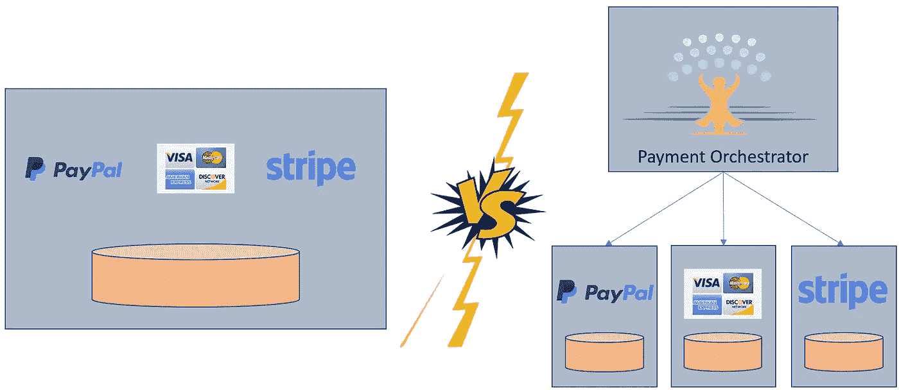
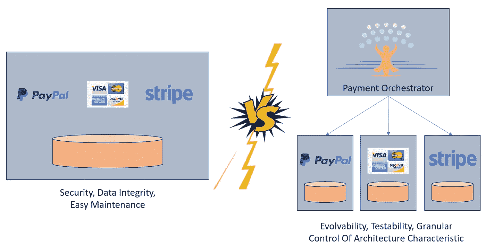
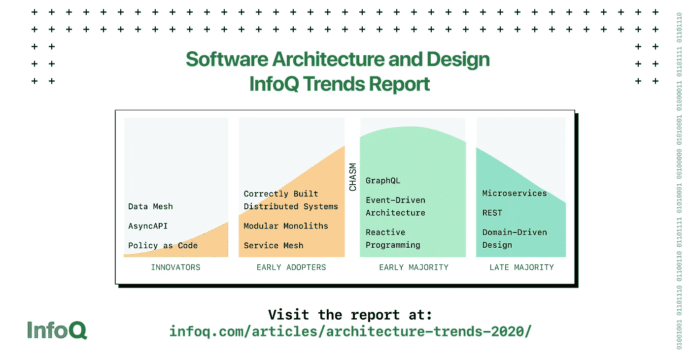
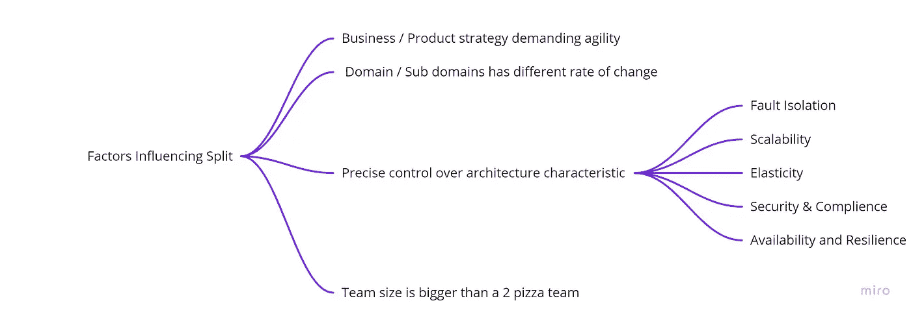
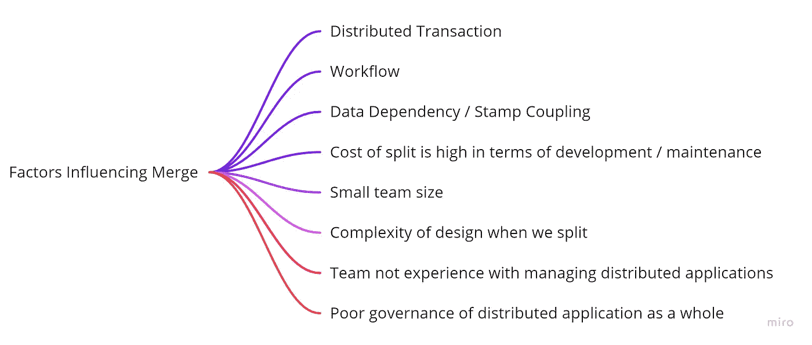
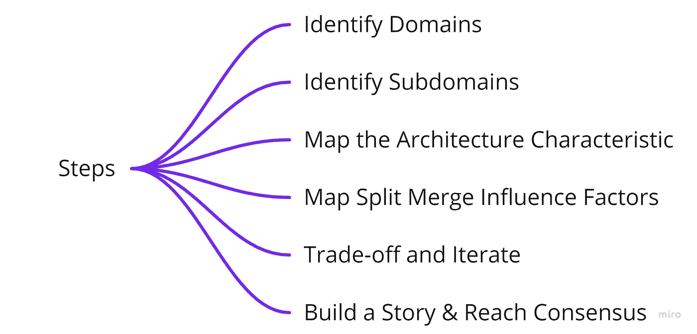

# 它回来了！建造整体建筑的趋势

> 原文：<https://itnext.io/its-back-a-trend-to-build-monolith-852aaa5e086f?source=collection_archive---------1----------------------->

## 微服务不是所有问题的答案。建筑师的工作是理解背景并确定构建整体服务与微服务的权衡

在过去 4 年与微服务的合作中，我看到了微服务采用过程中的各种故事。虽然这些故事中有许多是值得庆祝的成功故事，但其中一些确实造成了混乱局面。

如果我回头看看，为什么我们在这些例子中失败了？事实证明，当环境需要一个整体时，选择微服务是一个糟糕的设计决策。让我们看一个例子。假设我们需要为一个电子商务应用程序构建一个支付模块。你会选择以下哪个设计？

我展示这些设计时，许多人会选择第二个选择，因为设计的微服务性质。但是要选择 apt 选项，重要的是要理解设计的体系结构特征，并基于团队/产品所受限的当前约束来分析权衡。

## **设计方案 1:模块化整体式**

*   如果我们有一个管理所有微服务的小团队，我们可能会选择模块化整体设计，因为它易于维护。与整体式相比，由于存在多个活动部件，微维修设计将增加操作复杂性和维护成本。
*   如果数据完整性是一个关键的需求，我们可以再次选择模块化单片，因为它的事务提交/回滚能力。微服务设计必须追求最终的一致性和复杂的错误处理。
*   如果我们的 k8s 基础设施的安全治理薄弱，我们可能会选择模块化整体式。微服务设计将有一个更高的运动部件的攻击表面积。
*   如果我们的团队在微服务方面经验不足，我们可能会选择模块化 monolith，进行一次分阶段的微服务务实之旅。
*   当实施微服务设计的成本很高时，我们可能会选择模块整体。例如，我们可能最终会有一个事件源通信模式来缓解微服务设计的数据完整性问题。这将增加开发和维护的成本。

## **设计方案二:微服务**

*   如果管理支付的团队足够大，有专门的人来管理单个微服务，那么选择微服务设计可能会带来敏捷性。
*   如果产品团队战略性地决定在不久的将来添加更多的支付方式，微服务设计将提供可扩展性。
*   当我们有需要精细控制架构特征的需求时，我们可能会选择微服务，例如 1)信用卡支付处理的弹性负载 2)对条带支付供应商的合规性要求 Paypal 支付方法的可扩展性要求，因为业务进入了一个新的领域 4)支付方法之一的高可用性和弹性设计，因为它占交易的 95%以上。
*   当某个特定的支付方式代码频繁变化时，我们可能会选择微服务，以避免重新测试整个捆绑包。

> 总会有相互冲突的设计影响。架构师必须分析这些权衡，围绕设计选择构建一个故事，并与不同的涉众达成共识。

## 当建筑师很难

做一个架构师真的很难，尤其是手里有一个微服务架构选项。微服务架构是我见过的有很多权衡点的复杂架构模式之一。

*   REST、GRPC、GraphQL、事件源等通信模式各有利弊，需要对每个微服务进行权衡分析
*   聚合微服务、Orchestrator 微服务、编排数据收集、适配器微服务等模式必须仔细选择，从单个微服务的角度和整体生态系统的角度进行权衡。
*   实现带有 stamp 耦合的数据相关微服务是另一个挑战。
*   实现工作流，分布式事务增加了复杂性。

即使我们做权衡分析来构建一个故事，人们已经确信微服务是所有问题的通用解决方案。在产品团队中与更广泛的受众达成共识确实具有挑战性。最近的一些行业实例、文献趋势和微服务专家的观点拯救了我们。

## 2020 年信息趋势

如果我们看看 2020 年的 InfoQ 架构趋势，有几件事是非常清楚的:1)在早期采用者的象限中，模块化整体是一种趋势；2)正确构建分布式系统也是另一种趋势，它关注不同的权衡点分析。

这些趋势恰恰反映了 2017 年底推文中“凯尔西·海塔尔”对 2020 年的预测。

## 最近的行业例子

看看这一“细分”之旅，它使其微服务的某些部分回到了整体，这是一个鼓舞人心的例子。

微服务模式作者“Chris Richardson”在最近的一条推文中反映了同样的想法。

## 服务粒度:拆分与合并的权衡

在这里，我提出了我在进行合并/拆分权衡工作以决定微服务还是整体服务时考虑的一些方面

**分割因子**

**合并因素**

我很感谢您在评论中对这一拆分/合并因素的反馈。以下是我提出最终设计方案的步骤。

这可能不是一个非此即彼的决定。它可以是介于两者之间的任何地方，例如，一个周围只有很少服务支持的主要整体建筑。我希望阅读是有用的。让我们做出一些强有力的设计决策🚀。在下一篇文章中再见🏄

**订阅** [**牧神主题**](https://www.faun.dev/join?utm_source=medium.com/faun&utm_medium=medium&utm_campaign=faunmediumprebanner) **并获得每周精选的必读科技故事、新闻和教程的电子邮件** 🗞️

**关注我们的** [**推特**](https://twitter.com/joinfaun) 🐦**[**脸书**](https://www.facebook.com/faun.dev/) 👥**[**insta gram**](https://instagram.com/fauncommunity/)**📷**并加入我们的** [**脸书**](https://www.facebook.com/groups/364904580892967/) **和**[**Linkedin**](https://www.linkedin.com/company/faundev)**群**💬**。********

********

## ****如果这篇文章有帮助，请点击拍手👏按钮下面几下，以示你对作者的支持！⬇****