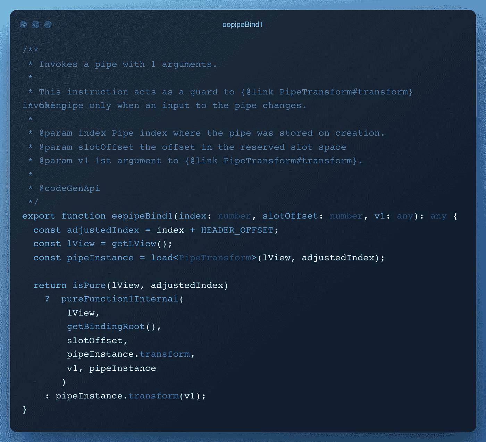
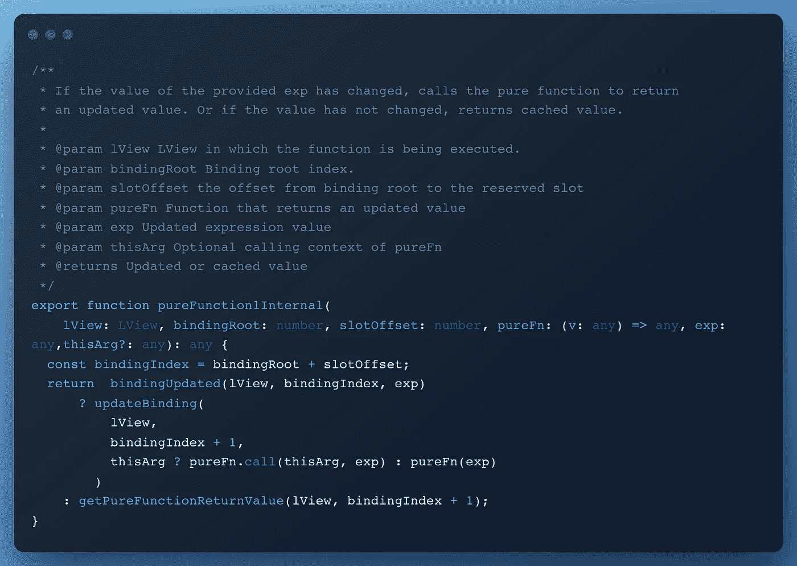
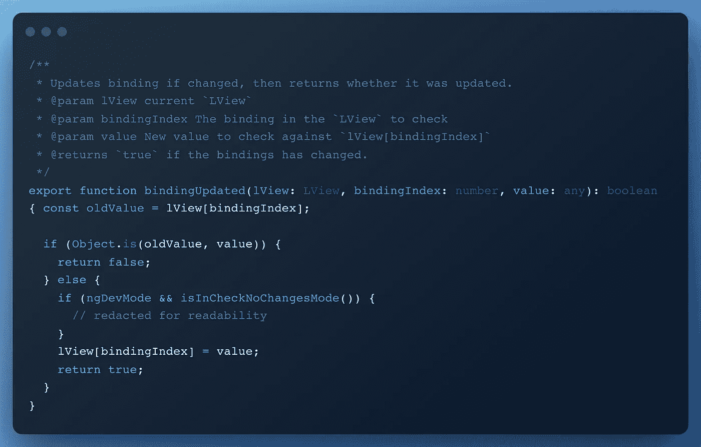
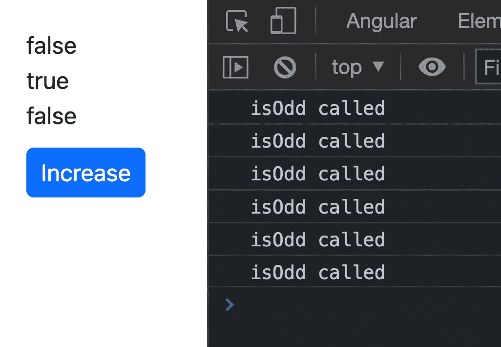
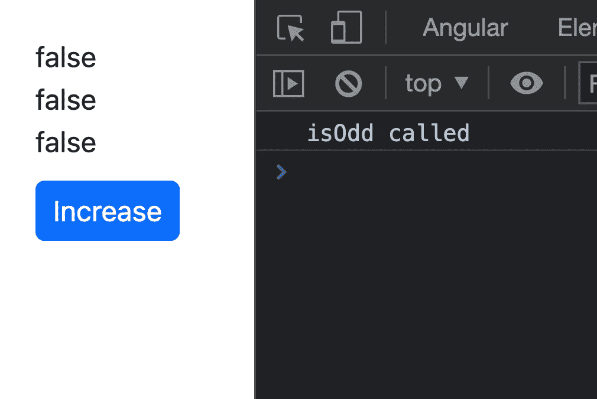

# 在角模板中使用函数调用是可以的！

> 原文：<https://itnext.io/its-ok-to-use-function-calls-in-angular-templates-ffdd12b0789e?source=collection_archive---------0----------------------->

"你不应该在角度模板上使用函数调用！"—这就是你会在网上看到的一切！我在这里向你证明事实并非总是如此！

## 问题

每次角度变化检测运行时(从事件、设置超时、手动或任何其他)，模板上的所有内容都将再次运行，函数调用也是如此。Angular 为什么要这么做？因为它需要检查模板上发生了什么变化，以便更新它。

如果函数做了一些繁重的工作，它将影响应用程序的性能，因为 Angular 更新视图的方式是同步的，它必须等待函数完成，然后更新视图。

## “使用管道”解决方案

我们最常看到的解决方案是“使用管道”。建议这样做，因为角度模板中的管道性能更好。怎么会这样？因为 Angular 只有在我们传递给它的参数发生变化时才会重新运行管道的**转换方法**。

**让我们证明这一点！**

## 让我们深入研究源代码

在新的 Angular 编译器(Ivy)中，模板被编译成指令。让我们举个例子，看看它会生成什么。

这是一个带有简单管道的组件。

下面是清理后生成的代码:

正如我们所见，在**第 29 行**中，我们看到 Angular 为模板代码生成了什么。

因此，有关于**创建 div** 、**添加文本**、**添加管道**、**关闭 div** 、**创建按钮并向其添加监听器**的说明……(Ivy 很酷的东西🌿).我们还可以看到 **if** / **else** 语句。它的作用是将**视图创建**与**视图更新**分开，如果创建视图，则第一个**视图，第二个视图用于更新部分。你可以在这里阅读更多关于那个[的内容。](https://github.com/angular/angular/blob/main/packages/core/src/render3/VIEW_DATA.md)**

我们对 33 号线和 43 号线感兴趣，因为那是管子表演魔术🪄.的地方在**行 33** 中，它在模板中注册管道，数据的绑定发生在**行 43** (在更新阶段)。我们看到它插入了一些文本，这些文本来自 **ɵɵpipeBind1()** 函数。让我们看看这个函数在🕵️‍♂️.下面做了什么

链接到源代码[这里](https://github.com/angular/angular/blob/main/packages/core/src/render3/pipe.ts#L123)

正如我们所看到的，前三行获取管道实例的信息，然后我们有一个返回语句。在返回中，我们有一个对 **isPure()** 的检查，它只是检查我们是否在管道装饰器中设置了纯字段 true 或 false。

如果我们已经将**纯字段**设置为**假**，它将直接返回**pipe instance . transform(v1)**值，这意味着 Angular 不会对管道做任何特殊处理，而只是再次运行**转换方法**。这与使用组件类中的方法是一样的。

如果管道是**纯**(就像我们的例子一样)，它将调用**pure function 1 internal helper 函数**，并将一些字段传递给它。让我们看看 **pureFunction1Internal** 在下面做什么。

链接到源代码[这里](https://github.com/angular/angular/blob/main/packages/core/src/render3/pure_function.ts#L307)

我们可以看到，它检查绑定是否在 **bindingUpdated 函数**中更新，如果是，它将**更新绑定**，否则它将**返回纯函数**的值(当前值)。让我们看看它在🕵️‍♂️.下面做什么检查

链接到源代码[这里](https://github.com/angular/angular/blob/main/packages/core/src/render3/bindings.ts#L46)

所以，它真正检查的是旧值是否与新值相同(使用 **Object.is()** )。*你会问:这是什么值？*我们传递给管道**转换方法**的参数。

这意味着，如果该方法的参数都没有改变，我们就可以开始了，我们可以返回 false，我们不必再次运行函数，我们可以只使用绑定的旧值。

这就是我们首先想要证明的，🥳.

## 这对我们意味着什么？

这意味着我们可以创建一个助手函数，它可以为我们完成神奇的 Angular 功能，而根本不需要使用管道😎。

这里是助手函数，我们将在下面解释它是如何工作的。

所以， **memo** 是一个接受函数作为参数并返回结果的函数。

在**第 6 行**中，我们检查功能参数是否已经改变，这就是**对不同功能**的帮助。它首先检查 args 的长度是否已经改变，如果是则返回 true，然后进行参数的等式检查(**就像 Angular 对管道**所做的那样)。

如果参数改变了，我们用新的参数再次调用函数并保存它的结果，如果没有，我们返回旧的值。

**怎么用？**

上面的例子转换成使用 memo 函数。

就这样！是的，我们在模板中使用了一个函数！而且是的，这样做不成问题！😄

## 有什么蹊跷吗？

有，有！当您在模板中调用 memo 函数并向其传递相同的值时，memo 函数会对您有所帮助，不要使用不同的参数，因为这样会破坏 memo 函数的“缓存”。

我这么说是什么意思？这里有一个例子。

因为我们在模板的不同位置传递不同的值，memo 函数将缓存每个实例的内容，而不是每次使用。

在这种情况下，每次我们点击按钮时，名为“T3”的“**将会显示 6 次。**

因此，如果我们在模板的所有地方传递相同的值，它将只触发一次。

这是控制台。

> 管道按函数使用进行缓存，而 memo util 按函数定义进行缓存。

## 这篇博文的想法和灵感？

这一切都要感谢来自 [**Pawel Kozlowski**](https://twitter.com/pkozlowski_os) 一位棱角分明的团队成员的推文。我只是想挖掘更多的源代码，并进一步解释它。

你对**反应**、**信号**、**性能**、**变化检测**感兴趣，还有其他类似的东西吗？去推特上关注 Pawel，他正在探索这个空间，并在推特上发布一些很酷的东西！

当你在 Twitter 上的时候，如果你想知道**最新的角度新闻**、**视频**、**播客**、**更新**、**RFC**、**拉请求**等等，也可以在 [@Enea_Jahollari](https://twitter.com/Enea_Jahollari) 关注我。如果你喜欢这篇文章，并希望看到更多这样的，请给我一个后续媒体！

**感谢您的阅读！**