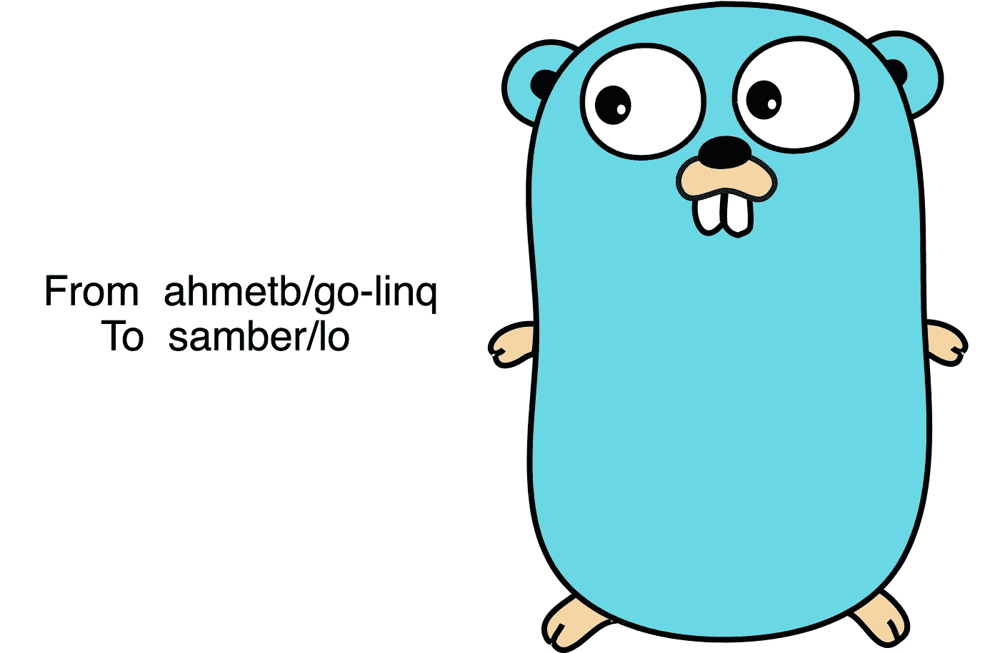

# 是时候用 samber/lo 代替 ahmetb/go-linq 了

> 原文：<https://itnext.io/its-time-to-replace-ahmetb-go-linq-with-samber-lo-e77b3c86ff1?source=collection_archive---------0----------------------->

与 Golang 一起工作时，我们经常需要操作一组数据。例如过滤、映射、求和等。

尽管这些操作中的大部分可以用一个简单的“for 循环”来完成，但这是相当繁琐的，我们宁愿避免它。

在 Golang1.18 之前，我们用 [**ahmetb/go-linq**](https://github.com/ahmetb/go-linq) 完成工作。

Golang1.18 发布后，语言中加入了内置的泛型支持， [**samber/lo**](https://github.com/samber/lo) 成为了更好的选择。

# 关于 ahmetb/go-linq

LINQ(language integrated query)是 C#中的一个概念， **ahmetb/go-linq** 借用这个思想，用 golang 重新实现。作为一个库，linq 帮助我们提高开发性能。

**注意**:是“开发性能”，不是“运行时性能”。

由于缺乏对 golang 的泛型支持，linq 选择反射来支持所有类型的切片。这注定 linq 不是很有效率。

根据作者(ahmetb)的[反馈](https://github.com/ahmetb/go-linq/issues/96#issuecomment-997313301)，linq 不会升级利用 golang 的内置泛型。

**Linq** 为每个方法提供了两个版本。

一个版本使用`interface{}`作为参数，用户必须在使用时将其转换为实际类型。

另一个版本是 type safer，由 **linq** 的作者推荐。但是这是有代价的——类型安全版本要慢得多。

**Linq** 有一个可链接的 API，这使得使用它成为一种乐趣。

在 golang1.18 之前， **linq** 是最好的选择。

# 关于 samber/lo

引自其主页:

> **samber/lo** 是基于 Go 1.18+泛型的 Lodash 风格的 Go 库。

lo 的想法来源于著名的 JavaScript 库 [**lodash**](https://github.com/lodash/lodash) 。它是 100%类型安全的，并且具有更好的性能。编译时检查将有助于我们避免大多数打字错误。所有这些好处从根本上来说都是来自 golang 仿制药。

如果你检查一下 **lo** 和 **linq** 的源代码，你会发现 **lo** 的源代码比 **linq** 要简单得多。这意味着维护和改进 **lo** 将比 **linq** 容易得多。

唯一的遗憾是 **lo** 没有提供可链接的 API，因为它没有引入额外的抽象层。

# 并排比较

接下来，我会选择几个常见的场景，用**lo**/**linq**/实现函数三次，进行相应的循环。通过这些例子，你会明白如何用不同的方法达到相同的目标。

以下是一些场景:

*   Uniq，从 int 切片返回唯一元素
*   仅当元素的模数为 13 时，才从 int slice 返回元素
*   映射，将所有元素从 int 切片转移到 string 切片

如上面的源代码所示， **lo** 可以提供最清晰、最简单的解决方案。

# 基准

让我们对所有功能进行基准测试。下面是对包含 10000 个元素的 int 切片进行基准测试的结果。

显然， **lo** 和“for-loop”函数的性能差不多，而且远远优于 **linq** 。

*   就速度而言， **lo** 比 **linq** 快 4-80 倍
*   至于内存分配，在某些场景下 **lo** 比 **linq** 好 10000 倍。

基准结果

# 结论

尽管我们上面举例的情景是不完整的，但不难得出结论:

*   lo 可以提供一个更简单的解决方案来实现业务逻辑
*   lo 可以提供更好的编译时检查
*   lo 的性能要好得多
*   在 golang1.18 发布后用 **lo** 替换 **linq** 可能是一个明智的决定。