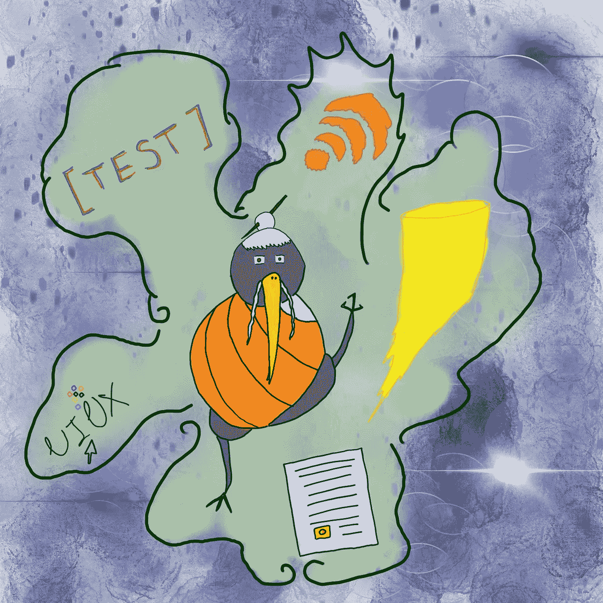
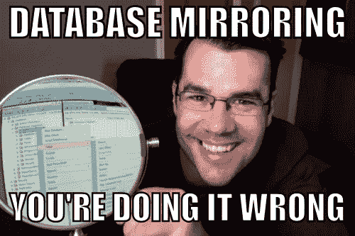
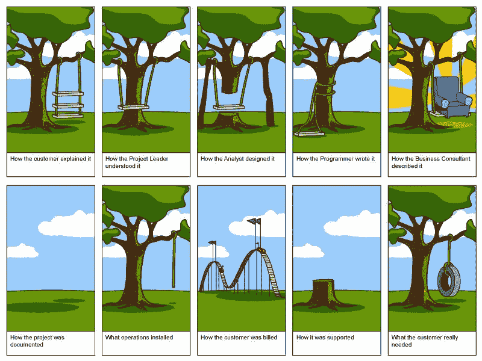

# 最重要的是

> 原文：<https://itnext.io/jack-of-all-it-1bee710507bc?source=collection_archive---------0----------------------->

当人们问我的职业时，我通常会说:“是的”。然后，如果他们坚持，我承认我是软件开发人员。两个月前，我还会纠正自己，澄清我实际上是一个软件开发团队的领导者——这是我很难向自己解释的事情。为什么我要这样回答？谁知道呢，我可能只是认为在内心深处我不希望人们把我仅仅看作一个软件开发人员，因为我相信软件开发人员只是我应该成为的人的一小部分。

一只聪明的老几维鸟知道真正的和谐

然后就是那个叫 [T 型人](https://en.m.wikipedia.org/wiki/T-shaped_skills)的东西，最近才知道。这样的人拥有他或她的专业领域的一套核心技能——用竖线 T 表示——以及一些关于邻近领域的良好知识。很明显，那是单杠。任何一个行业的专业人士都可能是 T 型的，除了开发者。哦，我相信，一个开发者 ***必须*** 是 T 型的，用 T 型的顶杠把五类人的技能构建成交付流程。我想是的。

# 类型 1:数据人

数据库管理员、数据库开发人员——这一大堆人。

数据库通常是软件系统的基石，尤其是当涉及到 web 应用程序时。很有可能它实际上会包含一些业务逻辑。这更容易证明为什么开发人员实际上需要很好地理解什么是数据库以及它们是如何工作的。

来自互联网的模因

不幸的是，尽管如此，许多开发人员仍然不相信他们需要了解这个领域，将所有的决策都留给了一些“DB 人”。这可能会带来两个不想要的结果:

1.  数据库将成为性能瓶颈。每一个潦草的脚本和未优化的表格都会导致缓慢的读取和混乱的写入，这将使你的应用程序的整体体验不愉快。这可能导致临时补丁、难看的意大利面条式代码、错误和不断增长的技术债务。对于那些不知道的人来说，这两件事都不是特别有利于一个人的幸福。
2.  和/或数据库将成为架构瓶颈。在这种情况下，它将取消或破坏您试图在代码中进行的所有好的更改。可扩展性、高可用性、弹性—所有这些都将被白白牺牲。

如果开发人员无法用 DBA 的语言向他们描述他们想要实现的目标，那么即使是世界上最好的 DBA 也无法避免这两个问题。更不用说，您将能够节省时间，例如，为您的微服务决定数据库的初始设计，或者优化单个 SQL 查询中的慢速读取，而不是调整您的应用程序代码。

下面是一个体面的开发人员应该熟悉的 DB 相关主题的清单:

1.  [最流行的 SQL 语句](https://www.codecademy.com/articles/sql-commands?r=master)。
2.  不同类型的数据库之间的差异。至少要有 [SQL](https://en.wikipedia.org/wiki/SQL#Procedural_extensions) 和主流类型的 [NoSQL](https://en.wikipedia.org/wiki/NoSQL#Types_and_examples_of_NoSQL_databases) 好吗？
3.  [SQL 索引](https://docs.microsoft.com/en-us/sql/relational-databases/indexes/clustered-and-nonclustered-indexes-described)。
4.  [数据标准化](https://en.wikipedia.org/wiki/Database_normalization)。
5.  [SQL profiler](https://docs.microsoft.com/en-us/sql/tools/sql-server-profiler/sql-server-profiler) 。
6.  [SQL 中数据的物理组织方式](https://blog.sqlauthority.com/2012/08/30/sql-server-beginning-sql-server-architecture-terminology/)。
7.  如何在您选择的 NoSQL 数据库中物理组织数据(例如 [MongoDB](https://www.mongodb.com/mongodb-architecture) )。
8.  奖金！高度理解[大数据](https://en.wikipedia.org/wiki/Big_data)和[数据分析](https://en.wikipedia.org/wiki/Business_intelligence)。
9.  奖金 2！记住区块链很可能是未来的事实，所以它不会被忘记。

好吗？很好！到下一个。

# 类型 2:基础设施人员

这是最大的一个，因为当人们谈到基础架构、IT 或运营时，他们往往会将一大堆不同的活动塞进这一学科:从技术支持到云管理。作为一名开发人员，您应该了解多少呢？答案是——大部分都是，所以这次我会给你提供不止一个清单。

如果你不知道你要驾驶的环境，你的车开多快也没用

**CL_1:网络和东西**

让我们面对一个无法否认的令人震惊的事实:世界上只有少数现代软件系统没有通过网络进行通信的组件。网络应用、物联网、多人游戏、SaaS 系统……因为有巨大的机会(我想大概是 97.347%，谁知道呢？)您编写了一个与通过线路发送数据有关的代码，这对于您来说是最有好处的，因为您非常了解这些数据是如何发送的！

1.  [OSI 模型](https://en.wikipedia.org/wiki/OSI_model)。
2.  T2 HTTP T3 是如何工作的。
3.  UDP 的工作原理[。](https://en.wikipedia.org/wiki/User_Datagram_Protocol)
4.  [HTTP 状态码](https://en.wikipedia.org/wiki/List_of_HTTP_status_codes)。
5.  [刀架](https://en.wikipedia.org/wiki/Rest)和[肥皂](https://en.wikipedia.org/wiki/SOAP)。
6.  什么是 [HTTPS](https://en.wikipedia.org/wiki/HTTPS) 为什么[它很重要](https://www.troyhunt.com/new-pluralsight-course-what-every-developer-must-know-about-https/)？
7.  [DNS](https://en.wikipedia.org/wiki/Domain_Name_System) 和[防火墙](https://en.wikipedia.org/wiki/Firewall_(computing))。
8.  负载均衡。

服务器、云、托管等。等等。这个列表将包括我能想到的关于托管你的应用程序后端的最直接的事情:

1.  [HTTP 服务器](https://en.wikipedia.org/wiki/Web_server)。
2.  [PaaS](https://en.wikipedia.org/wiki/Platform_as_a_service) 和 [IaaS](https://en.wikipedia.org/wiki/Infrastructure_as_a_service) 。
3.  [基础设施为代码](https://en.wikipedia.org/wiki/Infrastructure_as_Code)。
4.  [虚拟化](https://en.wikipedia.org/wiki/Virtualization)、[容器](https://en.wikipedia.org/wiki/Operating-system-level_virtualization)和[码头工人](https://en.wikipedia.org/wiki/Docker_(software))。
5.  奖金！[无服务器](https://en.wikipedia.org/wiki/Serverless_computing) ( [AWS Lambda](https://aws.amazon.com/lambda/) 、 [Azure Functions](https://azure.microsoft.com/en-us/services/functions/) )。

**CL _ 3:Build->Integrate**

最后，但同样重要的是，一旦你开始在一家中等规模的现代科技公司工作，你需要知道的事情。这就是如何构建应用程序并将其交付给用户。

1.  [版本控制](https://en.wikipedia.org/wiki/Version_control) ( [Git](https://git-scm.com) ， [TFS](https://en.wikipedia.org/wiki/Team_Foundation_Server) ， [SVN](https://en.wikipedia.org/wiki/Apache_Subversion) )。
2.  [包装经理](https://en.wikipedia.org/wiki/List_of_software_package_management_systems#Application-level_Dependency_managers) ( [NPM](https://www.npmjs.com) 、[努格特](https://www.nuget.org)、[鲍尔](https://bower.io)、[椰子](https://cocoapods.org))。
3.  集成服务器(例如 TeamCity)。
4.  [CI](https://en.wikipedia.org/wiki/Continuous_integration) / [CD](https://en.wikipedia.org/wiki/Continuous_delivery) (例如[team city](https://www.jetbrains.com/teamcity/)/[Octopus Deploy](https://octopus.com))。
5.  [特征切换](https://martinfowler.com/articles/feature-toggles.html)。
6.  [测井](https://www.codeproject.com/Articles/42354/The-Art-of-Logging)和[监控](https://landing.google.com/sre/book/chapters/monitoring-distributed-systems.html)。
7.  奖金！[黑暗发射](https://tech.co/the-dark-launch-how-googlefacebook-release-new-features-2016-04)。

# 类型 3:测试人员

首先，作为 2K17 的开发人员，你很可能在多功能团队的某种敏捷环境中工作，开发人员有时应该卷起袖子帮助 QA 进行测试。这是理解测试如何工作的一个合理的理由。

其次，作为一名优秀的开发人员，你会编写单元测试，不是吗？像往常一样？优秀的开发人员编写优秀的单元测试，因为拥有它们有很多好处。

最后，测试人员可能需要您的帮助来理解如何测试您计划编写的任何一段代码。所以，再说一次——你越了解他们工作的性质和他们说的语言，你的帮助就越有价值，越受欢迎。

1.  [测试类型](https://en.wikipedia.org/wiki/Software_testing)。
2.  [TDD](https://en.wikipedia.org/wiki/Test-driven_development) 。
3.  什么是[测试计划](https://en.wikipedia.org/wiki/Test_plan)和[如何编写一个](https://www.wikihow.com/Write-a-Test-Plan)。
4.  什么是[测试用例](https://en.wikipedia.org/wiki/Test_case)。
5.  [追溯矩阵](https://en.wikipedia.org/wiki/Traceability_matrix)。

# 第四类:用户界面/UX 设计师

这个对我来说很重要。事实上，不管你的工作有多抽象或低级，在某个时间点，在某个地方，人们会使用依赖于它的某种应用程序的某种用户界面。我想说的是，了解这个人将如何访问您的代码生成/处理/呈现的信息至少是一件好事。然而，对于一些开发人员来说，这是专业技能的一个基本要素。

有时很难全盘接受。摘自一本书*变焦由*伊斯特万·巴尼亚伊

我将以理论开始这个列表，我相信每个受过教育的开发人员都应该知道这个理论。尽管有时甚至被一些现在的 UI/UX 设计师忽略了:

1.  [人机交互](https://en.wikipedia.org/wiki/Human–computer_interaction)。
2.  [人体工程学](https://en.wikipedia.org/wiki/Human_factors_and_ergonomics)。
3.  [可访问性](https://en.wikipedia.org/wiki/Computer_accessibility) ( [以及一些如何正确使用的建议](https://medium.com/salesforce-ux/7-things-every-designer-needs-to-know-about-accessibility-64f105f0881b))。
4.  [字体](https://uxplanet.org/8-typography-tips-for-designers-how-to-make-fonts-speak-84741a4053c8)(也有[这个](https://blog.prototypr.io/how-to-use-typography-in-ui-design-ce045fa4ff2e))。
5.  [如何说图标](https://www.smashingmagazine.com/2016/10/icons-as-part-of-a-great-user-experience/)。
6.  国际化和本地化。
7.  奖金！什么是[认知心理学](https://en.wikipedia.org/wiki/Cognitive_psychology)的基本概念。

# 类型 5:BA/PO/产品什么的

衡量软件质量最重要的标准是它的商业价值。句号。现在记住这句话，我们作为开发人员，为什么必须能够有效地与 BAs 和 PO 沟通就变得非常清楚了。在这里，我所说的沟通是指能够以一种没有歧义的方式提出正确的问题，理解需求，对自己的工作将如何影响大局有一个清晰的看法，以及对产品有足够的了解，能够预测业务的未来需求。最后一个只会在某个时候让你的生活更轻松。

典型的

如果你不理解你的 PO 和 BAs，那么你可能不明白你在做什么。

1.  [BDD](https://en.wikipedia.org/wiki/Behavior-driven_development) 。
2.  [用户故事](https://en.wikipedia.org/wiki/User_story)。
3.  软件开发方法学。
4.  [敏捷方法论](https://en.wikipedia.org/wiki/Agile_software_development#Agile_software_development_methods)。
5.  奖金！[神话人月](https://en.wikipedia.org/wiki/The_Mythical_Man-Month)(与其说是奖金，不如说是必读书！).

# 额外收获:安全性

我对信息安全有强烈的看法。我相信它既不是一门学科，也不是一种实践或一件独立的事物。安全性是必须的，在开发周期的每个阶段都应该包含和评估安全性。它从来不是一个功能，也不能是一个事后的想法。

如果你想了解更多关于安全的知识却不知道从何开始， [**OWASP 十大**](https://www.owasp.org/index.php/Category:OWASP_Top_Ten_Project) ( [最新](https://www.owasp.org/images/7/72/OWASP_Top_10-2017_%28en%29.pdf.pdf))列表是一个很好的起点。

# 额外收获 2:敏捷宣言

任何敏捷方法的基础和基石。阅读它，打印它，并把它放在手边。

下次再见，男孩女孩们！