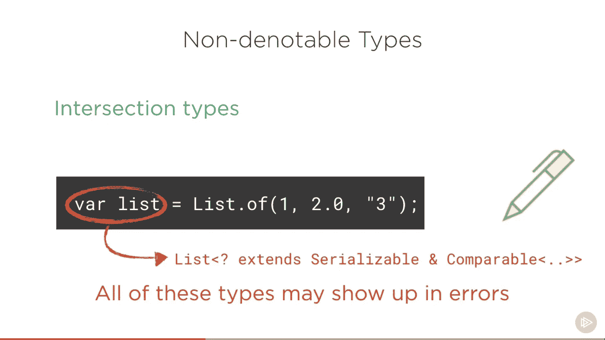
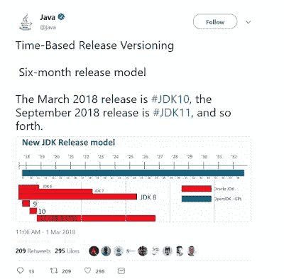
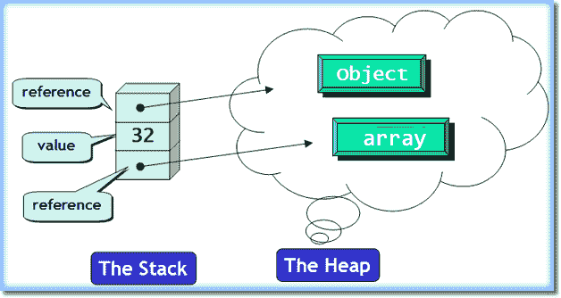
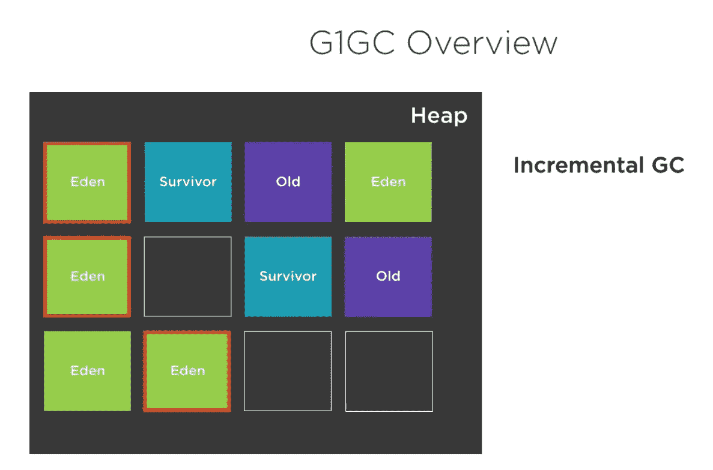
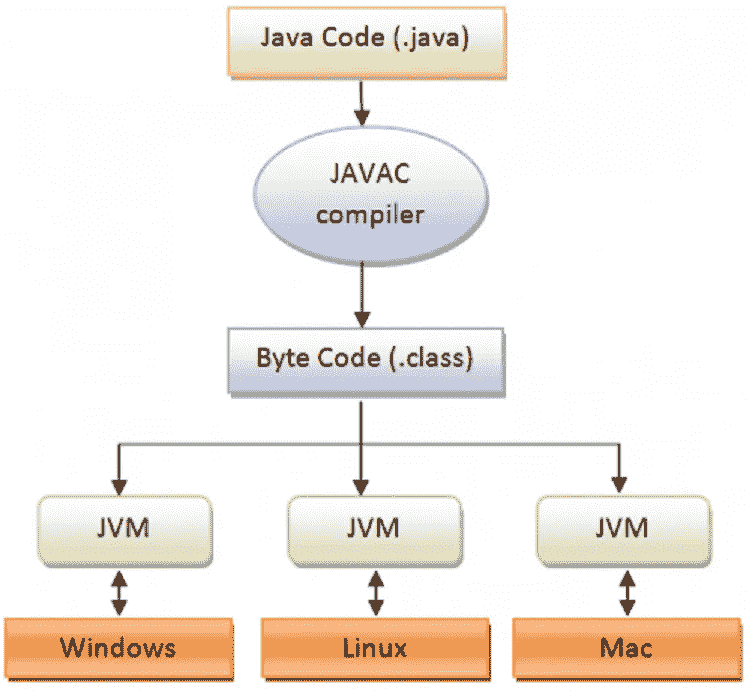
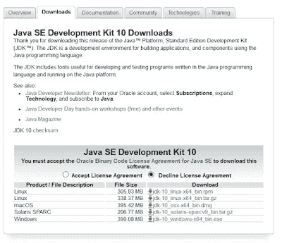

# 开始使用 Java 11 之前要重温的 10 个 JDK 的 10 个特性

> 原文：<https://itnext.io/java-10-features-you-should-revisit-before-jumping-on-java-11-8d4ad1693f70?source=collection_archive---------3----------------------->

[](https://pluralsight.pxf.io/c/1193463/424552/7490?u=https%3A%2F%2Fwww.pluralsight.com%2Fcourses%2Fwhats-new-java-10-local-variable-type-inference)

Java 10 中的新特性

大家好！您可能知道 Java 11 是在几个月前发布的。有很多关于它是否免费的讨论。我不会在本文中深入讨论这个问题，因为 Java 对我们大多数人来说仍然是免费的。

虽然许多 Java 开发人员都在谈论 JDK 11，但还有更多开发人员尚未开始使用 [Java 9](https://click.linksynergy.com/fs-bin/click?id=JVFxdTr9V80&subid=0&offerid=562016.1&type=10&tmpid=14538&RD_PARM1=https%3A%2F%2Fwww.udemy.com%2Fthe-complete-java-9-masterclass-beginner-to-expert%2F) 和 [Java 10](https://click.linksynergy.com/fs-bin/click?id=JVFxdTr9V80&subid=0&offerid=323058.1&type=10&tmpid=14538&RD_PARM1=https%3A%2F%2Fwww.udemy.com%2Fjava-the-complete-java-developer-course%2F) 。一些人甚至还没有在他们的项目中采用 [Java 8](http://www.java67.com/2014/09/top-10-java-8-tutorials-best-of-lot.html) 。

所以，在你欢迎 Java 11 之前，我建议你重温一下 Java 10 的这 10 个有趣的特性。

JDK 10 是新发布时间表中的第一个版本。每六个月你就会有一个新的 Java 版本。我知道这还为时过早，但 Java 11 已经发布，这是事实。

除了每六个月发布一次之外，每三年还有一次 LTS 发布，这是一个主要的 Java 发布。下一个 LTS 版本是 Java 11，应该会在九月份发布。所以你可以瞄准它。然后你可以在三年后更新到下一个 LTS 版本。尽管《JDK 10》看起来很快就要上映了，但《JDK 10》还是有一些有趣的特色。我还没有深入研究它的细节，但是乍一看，它们对我来说很有用也很有趣。

以下是对这些功能的简要说明:

# 1.局部变量类型推理(JEP 286)

类似于 [Javascript](http://www.java67.com/2017/12/10-programming-languages-to-learn-in.html) 、 [Kotlin](http://javarevisited.blogspot.sg/2018/02/5-courses-to-learn-kotlin-programming-java-android.html) 、 [Scala](http://javarevisited.blogspot.sg/2018/01/10-reasons-to-learn-scala-programming.html#axzz550Ppgfxg) ，现在 Java 也会有一个 var 关键字。该关键字允许您声明局部变量，而无需指定其类型。

类型将从上下文中推断出来。例如当你说

`var name = “Java”`

那么编译器已经知道类型是字符串。

我不知道这有多大用处，因为我已经很习惯看到`int i =0`或`String name = “Java”`。我喜欢变量声明行中的信息类型。看起来 Java 正在走 Scala 和 Kotlin 的老路，并试图从那里整合变化。

另外，注意 var 关键字只能用于[局部变量](https://javarevisited.blogspot.com/2012/02/difference-between-instance-class-and.html)(即方法或代码块内的变量)。您不能在类体内将它用于成员变量声明。

最后，它没有让 Java 成为像 [Python](http://javarevisited.blogspot.sg/2018/03/top-5-courses-to-learn-python-in-2018.html#axzz5AI0zTiE1) 一样的动态类型语言。Java 仍然是一种静态类型语言，一旦类型被指定，你就不能改变它。

例如，`var name = “Java”`可以，但是`name = 3;` 就不行。

正如 Sander Mak 在他的 Pluralsight 课程中所说，[**Java 10 的新特性**](https://pluralsight.pxf.io/c/1193463/424552/7490?u=https%3A%2F%2Fwww.pluralsight.com%2Fcourses%2Fwhats-new-java-10-local-variable-type-inference) **，**这是 Java 10 最引人注目的特性之一。这减少了在 Java 中声明局部变量所需的样板代码的数量。

[](https://pluralsight.pxf.io/c/1193463/424552/7490?u=https%3A%2F%2Fwww.pluralsight.com%2Fcourses%2Fwhats-new-java-10-local-variable-type-inference)

Java 10 的新特性

从一个简单的例子来看这并不明显，但是考虑一下方法返回复杂列表类型的情况。这需要大量的*尖括号*和[泛型](http://javarevisited.blogspot.sg/2011/09/generics-java-example-tutorial.html)来声明类型，这在那些情况下确实节省了时间:

```
var list = List.of(1, 2.0, "3")
```

这里列表将被推断为`list<? extends Serializable & Comparable<..>>`，它是一个交集类型。

# 2.基于时间的版本控制(JEP 322)

从 JDK 10 版本开始，Java 采用了每六个月发布一个新版本的时间表。

关于这是否是一种实用的方法，有很多争论。许多人说，每六个月你就会得到新的特性，这很好。许多人抱怨说，现在领养 JDK 还为时过早。

无论如何，这将是每三年发布一次 LTS 或主要版本的前进方向。

此外，更新元素将在功能元素增加一个月后增加。2018 年 4 月的 Java 版本将是 JDK 10.0.1，2018 年 7 月的版本将被命名为 JDK 10.0.2，以此类推。

[](https://pluralsight.pxf.io/c/1193463/424552/7490?u=https%3A%2F%2Fwww.pluralsight.com%2Fcourses%2Fwhats-new-java-10-local-variable-type-inference)

# 3.垃圾收集器接口(JEP 304)

这是 Java 10 更有趣和有用的特性之一，它增加了不同垃圾收集器的代码隔离，并为[垃圾收集器](https://javarevisited.blogspot.com/2011/04/garbage-collection-in-java.html#axzz4zt6jlTWS)引入了一个干净的接口。

这意味着从 JDK 构建中排除 GC 会更容易，在不影响代码库的情况下添加新的 GC 也会更容易。

您可以进一步查看 [Java 内存管理](https://click.linksynergy.com/fs-bin/click?id=JVFxdTr9V80&subid=0&offerid=323058.1&type=10&tmpid=14538&RD_PARM1=https%3A%2F%2Fwww.udemy.com%2Fjava-memory-management%2F)课程，了解更多关于 G1 垃圾收集以及 G1 和并发标记清除垃圾收集器之间的区别。

[](https://click.linksynergy.com/fs-bin/click?id=JVFxdTr9V80&subid=0&offerid=323058.1&type=10&tmpid=14538&RD_PARM1=https%3A%2F%2Fwww.udemy.com%2Fjava-memory-management%2F)

# 4.G1 的平行全气相色谱(JEP 307)

另一个有趣的特性是通过实现完全 GC 并行来改善 G1 最坏情况下的延迟。

如果您还记得，在 Java 9 版本中， **G1 是 JVM 的默认 GC。**这是为了避免完全 GC。当并发收集不能足够快地回收内存时，它最终会退回到[完全 GC。这就产生了一个问题。](http://javarevisited.blogspot.sg/2012/10/10-garbage-collection-interview-question-answer.html)

这一变化将使[完全垃圾收集算法](https://www.java67.com/2020/02/50-garbage-collection-interview-questions-answers-java.html)并行化，以便在发生 G1 完全垃圾收集这种不太可能发生的事件时，可以使用与并发收集中相同数量的线程来提高整体性能。

如果你想了解更多关于用于 G1 的**并行全 GC**，那么你应该看看 Sander Mak 的[**Java 10 的新特性**](https://pluralsight.pxf.io/c/1193463/424552/7490?u=https%3A%2F%2Fwww.pluralsight.com%2Fcourses%2Fwhats-new-java-10-local-variable-type-inference) 。您将了解 Java 10 版本的性能改进。

他已经很好地把一些重要的 JDK 特色放在他的短期课程中。

[](https://pluralsight.pxf.io/c/1193463/424552/7490?u=https%3A%2F%2Fwww.pluralsight.com%2Fcourses%2Fwhats-new-java-10-local-variable-type-inference)

# 5.备用内存设备上的堆分配(JEP 316)

这听起来是一个很酷的功能。它使 [HotSpot VM](http://www.java67.com/2016/08/10-jvm-options-for-java-production-application.html) 能够在用户指定的备用内存设备上分配 [Java 对象堆](https://javarevisited.blogspot.com/2011/05/java-heap-space-memory-size-jvm.html#axzz5SDsAfcC8)。

例如，此功能可以分配较低优先级的进程来使用 NV-DIMM 内存。相反，在多 JVM 环境中，只将较高优先级的进程分配给 DRAM。

Btw，如果你不太了解 JVM，建议你先从 Kevin Jone 的 [**了解 Java 虚拟机:内存管理**](https://pluralsight.pxf.io/c/1193463/424552/7490?u=https%3A%2F%2Fwww.pluralsight.com%2Fcourses%2Funderstanding-java-vm-memory-management) 开始。这是一门很好的 JVM 入门课程。

[](https://pluralsight.pxf.io/c/1193463/424552/7490?u=https%3A%2F%2Fwww.pluralsight.com%2Fcourses%2Funderstanding-java-vm-memory-management)

# 6.将 JDK 森林合并为一个单一的存储库(JEP 296)

这个新的 Java 10 特性完全是关于内务管理的。它将把 JDK 森林的众多储存库合并成一个单一的储存库。

*顺便说一句，如果你想了解更多关于 Java 11 和 Java 11 的新特性，那么别忘了看看 Sander Mak 的*[***Java 11 的新特性:长期支持***](http://bit.ly/2IjIy5x) *课程。*

# 7.根证书(JEP 319)

这是 Java 10 带来的另一个重要变化。如果你还记得，JDK 10 是在与 OpenJDK 的密切合作下创建的，这一点从这个特性中可以明显看出。

它将提供一组默认根证书颁发机构。这将使 OpenJDK 版本对开发人员更有吸引力。

它还旨在缩小 OpenJDK 和 Oracle JDK 版本之间的差异。在 OpenJDK 版本中，TLS 等关键安全组件现在将默认工作

# 8.实验性的基于 Java 的 JIT 编译器(JEP 317)

这是另一个有趣的特性，它使得基于 Java 的 JIT 编译器 **Graal** 能够被用作 Linux/x64 平台上的实验性 JIT 编译器[T4。](http://javarevisited.blogspot.sg/2011/12/jre-jvm-jdk-jit-in-java-programming.html)

如果您还记得的话，Graal 已经在 Java 9 中添加了，但是现在您可以使用下面的 [JVM 参数来启用它:](http://javarevisited.blogspot.sg/2011/11/hotspot-jvm-options-java-examples.html#axzz54oJiRW8k)

`-XX:+UnlockExperimentalVMOptions -XX:+UseJVMCICompiler`

如果你不知道 **Grall** 是一个新的基于 Java 的 [JIT 编译器](http://www.java67.com/2013/02/difference-between-jit-and-jvm-in-java.html)。它是一个实验性的**超前(AOT)编译器**的基础。

但是，请记住，它还处于实验阶段，您不应该将其用于生产。您可以进一步查看[Java 10 中的新特性](https://pluralsight.pxf.io/c/1193463/424552/7490?u=https%3A%2F%2Fwww.pluralsight.com%2Fcourses%2Fwhats-new-java-10-local-variable-type-inference)来了解更多关于这个新的多语言虚拟机的信息。

[](https://pluralsight.pxf.io/c/1193463/424552/7490?u=https%3A%2F%2Fwww.pluralsight.com%2Fcourses%2Fwhats-new-java-10-local-variable-type-inference)

# 9.线程本地握手(JEP 312)

Java 10 的这个[特性](http://bit.ly/2AHuthF)为提高虚拟机性能奠定了基础，它使得在不执行全局虚拟机保存点的情况下对应用程序线程执行回调成为可能。这意味着 [JVM](http://javarevisited.blogspot.sg/2011/11/hotspot-jvm-options-java-examples.html#axzz54oJiRW8k) 可以停止单个线程，而不仅仅是所有线程。

作为此功能或 JEP 312 的一部分，我们做了一些小的改进来提高虚拟机性能。一些记忆障碍被移除。JVM 和偏向锁通过停止单个线程来撤销偏向得到了改进。

# 10.移除本机标头生成工具(JEP 313)

这是 Java 10 的另一个关注内务管理的特性。它将从 JDK 中删除 **javah** 工具。这是一个单独的工具，用于在编译 JNI 代码时生成头文件，因为这可以通过 javac 完成。

您可以从甲骨文网站[这里](http://www.oracle.com/technetwork/java/javase/downloads/jdk10-downloads-4416644.html)下载 JDK 10，体验新功能:

[](http://www.oracle.com/technetwork/java/javase/downloads/jdk10-downloads-4416644.html)

以上就是关于 Java 10 或者 JDK 10 的一些**有趣的特性。您可以在 Oracle 的官方发行说明中找到更多的低级和 API 更改。当我了解到这些变化时，我也会写博客。您可以在 Java 访问这里继续关注更多的 JDK 10 文章和教程。**

其他**对 Java 程序员有用的资源**
[Java 10 的新特性作者 Sander Mak](https://pluralsight.pxf.io/c/1193463/424552/7490?u=https%3A%2F%2Fwww.pluralsight.com%2Fcourses%2Fwhats-new-java-10-local-variable-type-inference)
[Java 开发人员应该学习的 10 件事](http://javarevisited.blogspot.sg/2017/12/10-things-java-programmers-should-learn.html#axzz53ENLS1RB)
[面向程序员的 10 大 Java 8 教程](http://www.java67.com/2014/09/top-10-java-8-tutorials-best-of-lot.html)
[面向程序员的 10 大 Java 9 教程](http://www.java67.com/2018/01/top-10-java-9-tutorials-and-courses.html)
[Java 和 Web 开发人员应该学习的 10 个框架](http://javarevisited.blogspot.sg/2018/01/10-frameworks-java-and-web-developers-should-learn.html)
[Java 开发人员应该知道的 20 个库](http://javarevisited.blogspot.sg/2018/01/top-20-libraries-and-apis-for-java-programmers.html)

感谢您阅读本文。如果你喜欢 Java 10 的这些特性，请与你的朋友和同事分享。如果您有任何问题或反馈，请留言。祝 JDK 10 一切顺利

[](https://medium.com/javarevisited/the-java-programmer-roadmap-f9db163ef2c2) [## 2023 年 Java 程序员路线图

### 2023 年成为 Java 开发人员的图解指南，包含相关课程的链接

medium.com](https://medium.com/javarevisited/the-java-programmer-roadmap-f9db163ef2c2) [](https://medium.com/javarevisited/20-essential-java-libraries-and-apis-every-programmer-should-learn-5ccd41812fc7) [## 2023 年每个程序员都应该学习的前 22 个 Java 库和 API

### 成为更好的 Java 开发人员可以学习的最基本的 Java 库。它包括用于日志记录的 Java 库…

medium.com](https://medium.com/javarevisited/20-essential-java-libraries-and-apis-every-programmer-should-learn-5ccd41812fc7)