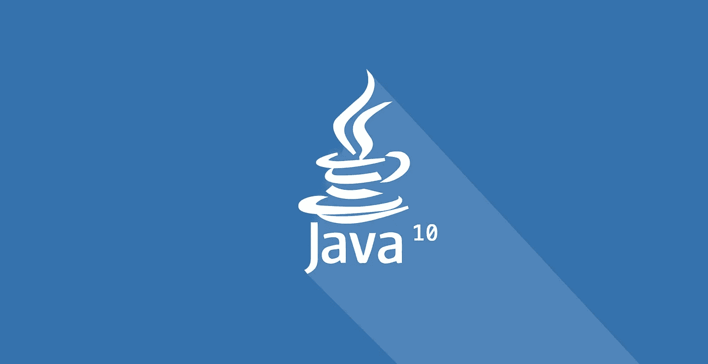
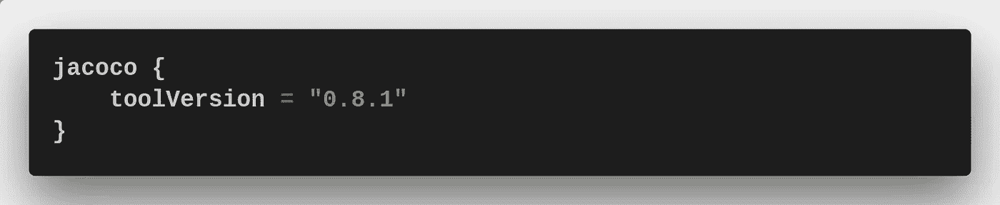

# Java 10 —迁移故事

> 原文：<https://itnext.io/java-10-migration-story-cdc65c05bb5a?source=collection_archive---------4----------------------->

> [点击这里在 LinkedIn 上分享这篇文章](https://www.linkedin.com/cws/share?url=https%3A%2F%2Fitnext.io%2Fjava-10-migration-story-cdc65c05bb5a%3Futm_source%3Dmedium_sharelink%26utm_medium%3Dsocial%26utm_campaign%3Dbuffer)

你可能知道 [**Java 10**](http://jdk.java.net/10/) 最近发布了。没有那么多新功能。至少对于 [**Kotlin**](http://kotlinlang.org) 开发者来说是这样……但是对于 **JVM** 本身还有[几个改进](http://www.oracle.com/technetwork/java/javase/10-relnote-issues-4108729.html)。我猜，在即将到来的版本中会有更多。从现在开始我们每年会得到两次！因此，我认为最好花些时间同步您的项目，以便将来更容易以相同的速度迁移。

我参与的主要项目是用 **Kotlin** 制作的基于 **SpringBoot** 1.5.X 的服务，它使用 **Postgres** 作为数据库。这时它使用的是 Java 8 。这么大的机会跳过 **Java 9** 直接跳到 10！受到这个想法的启发，我打开了我的笔记本电脑。

我使用 SDKman 安装 Java，但是对于 Java 10 来说，由于一些未知的原因，它会提供一个不完整的版本。所以这次我只好手动从官方[网站](http://jdk.java.net/10/)下载 bundle。

最大的问题是一些图书馆不再是 JDK 的一部分。这是个好消息——它变得越来越干净了。但结果是，您需要为您的项目定义额外的依赖项。你也可以在命令行参数中包含它们，因为它们实际上仍然在 **JDK** 中，但我认为最好将它们移到依赖项中，因为据我所知，它们将在未来的版本中完全删除。我的情况是:

第二期是 [**Jacoco Gradle 插件**](https://docs.gradle.org/current/userguide/jacoco_plugin.html) 。如果你用它来衡量代码覆盖率，有一个好消息——**Jacoco**本身支持 **Java 10** 。但是为了让 **Jacoco Gradle 插件**工作，我必须在我的 Gradle 构建文件中指定这样的工具版本:

还有最后被打破的部分— [**莫克托**](http://site.mockito.org/) 。这个问题可以通过添加一个新版本的 [**Bytebuddy**](http://bytebuddy.net/) 库来解决，如下所示:

经过这些修改，我能够构建和运行我的项目，所有测试都是绿色的。不要害怕迁移！下一步是准备 **Dockerbuild** 文件。但是这是下一篇文章的主题。