# Java 内存模型基础或者如何以正确的方式建立克隆人冲锋队

> 原文：<https://itnext.io/java-memory-model-fundamentals-or-how-to-build-stormtrooper-clones-army-in-a-correct-way-f20403504294?source=collection_archive---------7----------------------->

你好。


照片由[安德鲁·伍尔夫](https://unsplash.com/@andreuuuw?utm_source=medium&utm_medium=referral)在 [Unsplash](https://unsplash.com?utm_source=medium&utm_medium=referral) 上拍摄

在以前的帖子中，我们讨论了几个 Java 概念，这些概念可能会在 Java 面试中被问到。这篇文章将通过讨论 Java 内存模型(`JMM`)来继续这个话题。

好吧，我理解你的感受，如果这个话题听起来很无聊，甚至对你来说不那么重要。但是在我看来，在不知道它是如何工作的情况下使用任何工具都是危险的。我们，工程师，对我们为不同的服务和企业所制造的产品质量负责。如果我们不知道我们使用的工具，它可能会给我们带来一些意想不到的问题，如果不知道底层的原则，这些问题将很难或不可能被发现。

让我用下面的例子来证明:想象一下，在一个阳光明媚的日子里，达斯·维德来到帝国软件工程师办公室，让他制作工具，用冲锋队的原型和与叛军作战所需的士兵数量，为他制造出冲锋队克隆人军队。工程师回答说这是小菜一碟，几分钟就能完成。所以，他开始设计冲锋队模型:

然后创建一个`CloneBuilderService`:

由于所提供的评估，他很着急，没有空间来编写测试(请不要这样做)，所以他将这个`CloneBuilderService`提供给达斯·维达。嗯，这天晚些时候黑魔王收到一份报告，说有人在最近的星球上发现了叛军小队。只有六个叛军，所以用 100 个冲锋队消灭敌人绰绰有余。

我来介绍一下反叛者模型:

叛军和冲锋队之间的战斗是一步一步的战斗，冲锋队攻击第一个活着的叛军，然后叛军攻击第一个活着的冲锋队，之后，进行检查以了解战斗是否结束。活下来的队伍就是赢家。

我知道，检查算法可以写得更有效，但我的目标是通过降低性能来增加代码的可读性。

看起来，数学上的反叛者没有机会。我同意这一点！但是正如我在本文开头提到的，不了解底层 Java 概念可能会导致巨大的问题。

让我们看看，运行`BattleMain`会有什么结果:

```
The squad of clones is built. The size is 100Rebel [name='Gregar Typho', weapon='Gun'] is killed 
StormTrooper [name='Stormtrooper Prototype', weapon='Blaster'] is killedRebels win the battle!
```

怎么会这样如果你看到了问题的原因，并且理解了它的本质——干得好，伙计们！如果没有，也没关系，因为我们将在不久的将来回到这个话题。

我希望，我已经解释了研究这些概念的原因，比如`JMM`。所以，让我们开始旅程吧！

`JMM`分成两个主要区域:`Stack`和`Heap`。为了简单起见，让我们想象一下，它们都只是负责存储不同数据的数据结构。

## 堆栈

`Stack`内存是底层的堆栈数据结构。
如果你不知道这样的数据结构，没问题，用现实世界的例子很容易理解。想象一下，你有 5 本书(`A`、`B`、`C`、`D`、`E`)。你拿起书`A`并把它放在流上，然后你拿起书`B`并把它放在书`A`上，以此类推，直到没有书剩下。现在你有一列书，其中书`A`是最低的，书`E`是最高的。


摩根·哈珀·尼科尔斯在 [Unsplash](https://unsplash.com?utm_source=medium&utm_medium=referral) 上的照片

如果你需要拿书`A`，你必须先拿书`E`，然后再拿`D`->-`C`->-`B`，然后你才能拿`A`本身。在计算机科学中，它被称为`Last-In-First-Out` ( [LIFO](https://en.wikipedia.org/wiki/Stack_(abstract_data_type)) )，因为最后一个被放入数据结构的对象将是第一个从中取出数据的对象。

我希望，这是明确的，我们可以回到 Java。

`Stack`存储器用于存储:

1.  *原始类型(变量名及其值):*

让我们想象一下，我们有以下代码示例:

```
int a = 1;           // line 1
boolean b = true;    // line 2
```

如您所料，在执行第 1 行之后，`Stack`看起来如下:

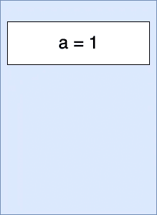

在第二行之后:

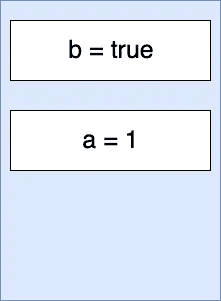

如果没有更多的代码，`Stack`将通过逐个删除每个元素来释放:`b`将首先被删除，`a`—`b`之后:


*2。对复杂数据类型(对象)的引用:*

它比基本类型部分稍微复杂一点。但是别担心，我们很快就会明白一切。

不介绍`Heap`就不可能解释这一部分。

## 垃圾堆

`Heap`用于存储可以在应用程序间共享的复杂对象的值。同样，为了简单起见，让我们假设它是某种数据结构，以无序的方式存储元素，但提供快速访问它们的机制。我建议使用这里的`HashMap`(在现实生活中，`Heap`的结构要复杂得多，但我们不打算潜得这么深)。

如果你对`HashMap`不熟悉，我们来修复一下这个。`HashMap`是一种键值数据结构。这是什么意思？这意味着我们放入的每个元素都包含了`key`和`value`。`key`用于快速访问元素值。

现实世界的例子是，当您访问一家银行时，员工要求您说出您的身份证号码(或护照号码——取决于国家),然后使用身份证号码(`key`)，员工获得您的帐户数据(`value`)以进行进一步的操作。

把`Heap`当成`HashMap`来讲，`key`是内存地址，`value`是对象值本身。例如，假设我们有以下代码示例:

```
String greetings = "Valar Morgulis!";
```

如您所见，我们已经创建了新的`String`对象。让我们想象一下，Java 内存管理将这个对象放入内存地址`ABC123`。所以，`Heap`会有如下状态:

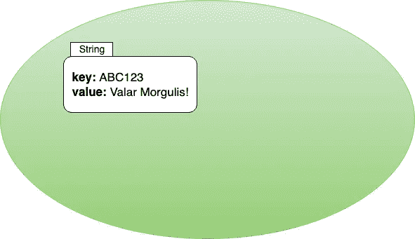

正如您可能看到的，在`Heap`中没有关于变量名的信息，但是对象值完全存储在那里。

现在，让我们回到`Stack`上来。如上所述，`Stack`存储对复杂数据类型(对象)的引用。

如果我们再看一下上一个代码样本，我们会发现只有一行代码，但是已经执行了三个动作。值为`Valar Morgulis!`的`String`对象已创建；
2。已创建名为`greeting`且类型为`String`的变量；
3。变量`greeting`现在指的是第一步中的物体。

因此，堆栈和堆具有以下状态:

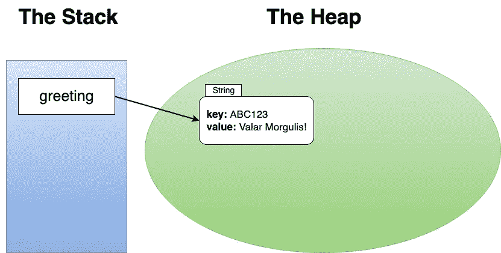

现在应该很清楚了。

总的来说，这是`Stack`和`Heap`背后的主要概念，但是让我们用更复杂的例子更深入一点。

考虑到我们有以下代码:

让我们一行一行地看 Java 内存行为(我省略了 main 方法声明行，以关注主题并保持画面清晰):

```
List<String> aryaStarkNameList = new ArrayList<>();
```

正如您从前面带有`String greeting`变量的代码示例中可能知道的那样，这一行代码执行 3 个动作:
1。创建`ArrayList`对象；
2。创建名为`aryaStarkNameList`且类型为`List<String>`的变量；
3。将变量`aryaStarkNameList`引用到第一步中的对象。

我敢肯定，你一定知道`Stack`和`Heap`现在是什么样子(从现在开始，我将省略把内存地址放到堆中，以使图像更清晰，因为它们将包含越来越多的数据):


让我们转到下一行代码:

```
aryaStarkNameList.add("Cersei");
```

在那里进行了哪些行动？
1。`String`已创建值为`Cersei`的对象；
2。`ArrayList`的第一个元素引用了这个`String`对象。

您看到这行代码和`String greeting`示例之间的主要区别了吗？当前代码没有创建局部变量，所以不会有任何东西被放入`Stack`。

如果这听起来很复杂，让我们试着从另一个角度来看:创建局部变量->将它放入列表之间的主要原因是什么:

```
String cersei = "Cersei";
aryaStarkNameList.add(cersei);
```

并将数据直接放入列表中:

```
aryaStarkNameList.add("Cersei");
```

?

主要原因是在第二个例子中没有办法直接调用带有值`Cersei`的`String`对象，但是第一个例子通过局部变量`cersei`提供了这样一种可能性。这就是为什么在第一个示例中，`cersei`变量将被放入`Stack`，但在第二个示例中——变量`Stack`将保持不变。

那么，让我们进一步看第二个例子:

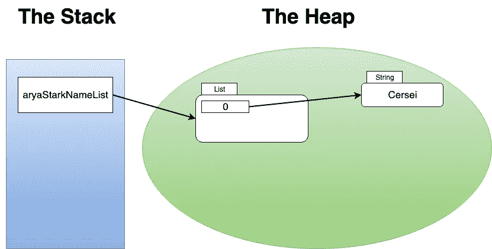

接下来的几行代码将元素添加到列表中，它们的行为与前面的代码相同，所以让我们继续:

```
aryaStarkNameList.add("Ilyn Payne");
aryaStarkNameList.add("Joffrey");
aryaStarkNameList.add("The Mountain");
aryaStarkNameList.add("The Hound");
```

根据`Stack`和`Heap`状态也没有什么意外:

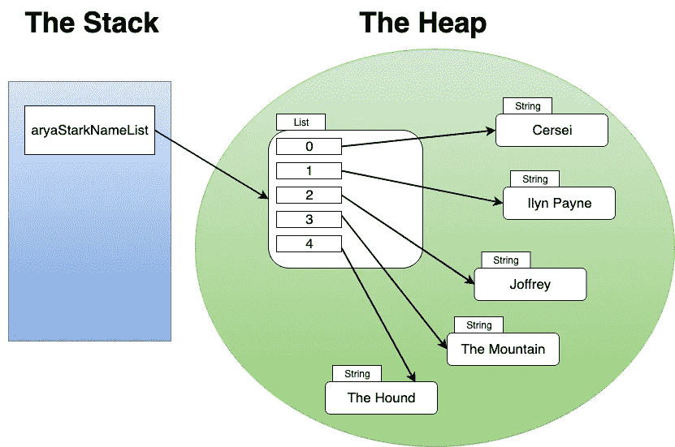

让我们继续下一行:

```
printList(aryaStarkNameList);
```

好了，现在我们进入新方法`void printList(List<String> listToPrint)`。正如您从方法签名中看到的，它接收了一个`String`的`List`。从 Java 内存的角度来看，创建了新的局部变量，该变量引用了`Heap`中与该方法调用中提供的变量相同的对象。这意味着`Stack`将要被修改:

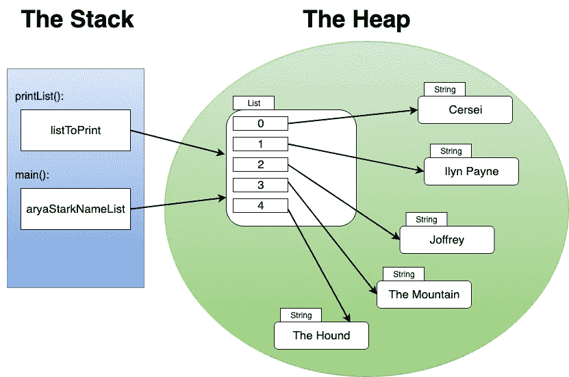

当然，列表内容会打印到控制台:

```
[Cersei, Ilyn Payne, Joffrey, The Mountain, The Hound]
```

我们已经完成了`printList()`方法，因此`Stack`将从此方法变量中释放:

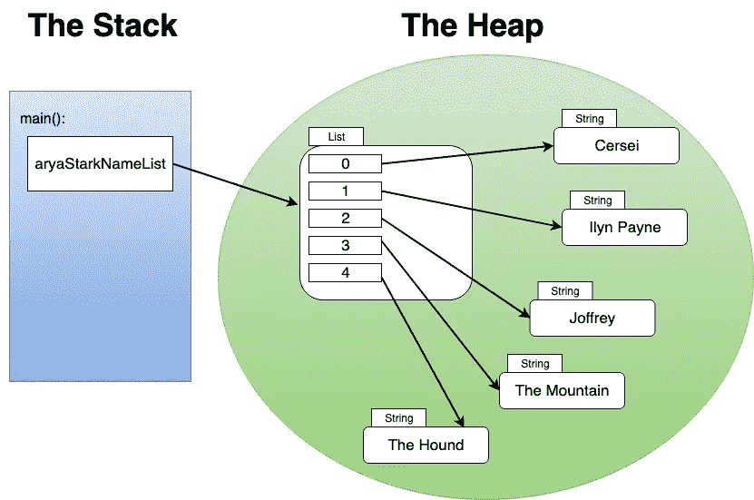

下一行代码是:

```
addNewNameToList(aryaStarkNameList, "Walder Frey");
```

好了，我们要进入一个新的方法，所以，现在，你应该能够解释，现在`Stack`和`Heap`会发生什么:当然，新的变量会被添加到`Stack`中，新的`String`对象值`Walder Frey`会出现在`Heap`中:

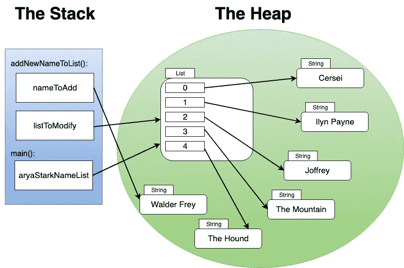

现在我们在`addNewNameToList()`方法里面:

```
listToModify.add(nameToAdd);
```

正如我们所看到的，列表将通过添加新元素进行修改。这是什么意思？会改变`listToModify`而不改变`aryaStarkNameList`吗？号码

理解这一点很重要，在 Java 中，当我们传递一个对象的值时，我们传递的是对它的引用。所以，当我们修改对象时，意味着我们修改了它在`Heap`中的值，但是引用将保持不变。这就是为什么物体的状态会被所谓的副作用改变。

让我们看一下 Java 内存，对所有这些有一个直观的理解:

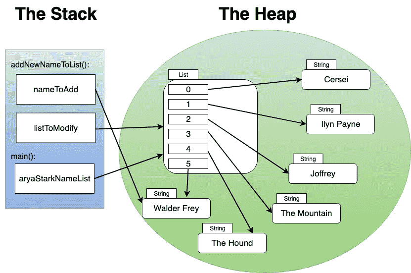

你会看到`Heap`中的`List`对象现在包含了一个元素，而`aryaStarkNameList`仍然引用它。

在我们完成了`addNewNameToList()`方法之后，`Stack`从方法数据中被释放:


我们已经完成了当前的类(除了发布了`Stack`和`Heap`)，但是让我稍微扩展一下，让您思考并检查一下，您是否理解 Java 内存概念和通过引用传递对象。

您可能已经注意到，已经创建了一个新方法`reinitializeList()`，并从`main()`方法中调用。问题是:控制台将打印什么，为什么？现在，你知道的比找到正确答案所需的更多。

让我们和哈巴狗一起思考一下=)


查尔斯·🇵🇭在 [Unsplash](https://unsplash.com?utm_source=medium&utm_medium=referral) 上拍摄的照片

好了，希望你已经顺利完成任务了，来看看正确答案:

```
reinitializeList(aryaStarkNameList);
```

我们正在进入一个新的方法，就像我们以前已经做过几次的那样，所以存储器有如下状态:

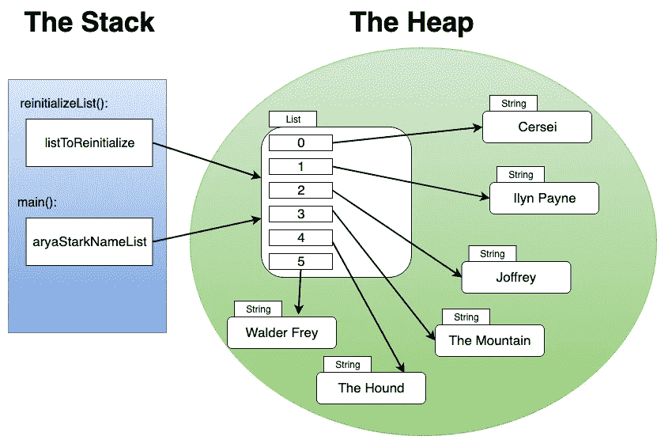

现在，我们在方法内部，所以让我们一行一行地来:

```
List<String> newNames = new ArrayList<>();
```

对我们来说小菜一碟，不是吗？

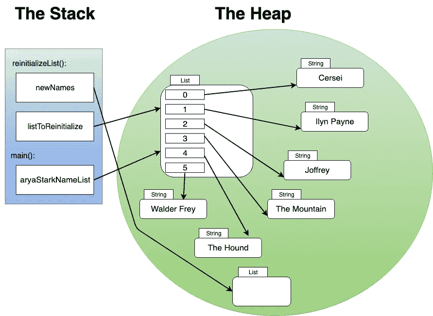

下一行代码也很简单:

```
newNames.add("John Snow");
```

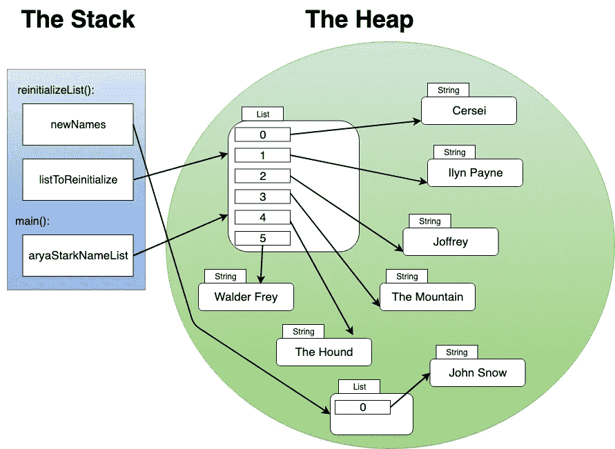

但是这个方法的最后一行可能有点棘手:

```
listToReinitialize = newNames;
```

那里发生了什么事？嗯，变量`listToReinitialize`不是指那庞大的`List`名字，而是开始指新创建的`List`。但是主要的问题是:它会以某种方式影响`aryaStarkNameList`吗？让我们在图片上看看:

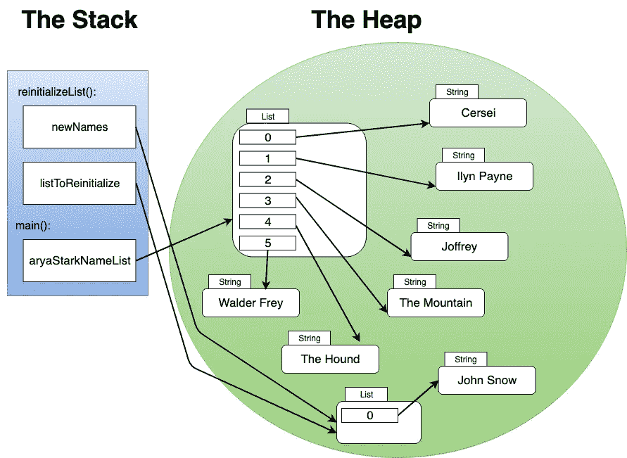

如您所见，`aryaStarkNameList`不受任何影响，因为它在`Heap`中保留了对巨大的`List`的引用。

因此，我们将在控制台中看到以下内容:

```
[Cersei, Ilyn Payne, Joffrey, The Mountain, The Hound, Walder Frey]
```

我希望，这是明确的。

现在，让我们以展示未来会发生什么来结束这节课。

当我们离开`reinitializeList()`方法时，`Stack`从其数据中释放:

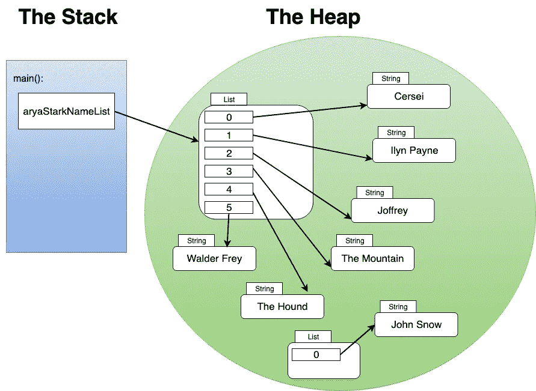

现在我们可以看到一个有趣的画面:在`Heap`(只有一个元素的`List`)中有一个物体，没有人从`Stack`中提到它。这是什么意思？嗯，这意味着，这个对象有资格被`Garbage Collector`收集。

什么是`Garbage Collector`？简单地说，它是一个从垃圾中清理 Java 内存的人，垃圾是应用程序不再需要的对象。`Not needed anymore`的意思是，根本没有对这个对象的引用。

说到我们的例子，我们可能期望，迟早，`Garbage Collector`会被调用，并从内存中移除`List`对象。之后，值为`John Snow`的`String`对象将是下一个被垃圾收集的候选对象。

但是我们不确定什么时候会调用`Garbage Collector`:现在，几秒/几分钟或者更晚。并且没有办法手动调用它。这取决于已经配置(或默认使用)的策略，但这超出了本文的范围。

无论如何，让我们想象一下，我们已经足够幸运，已经立即调用了`Garbage Collector`，所以现在一个元素的`List`已经不存在了，还有`John Snow` `String`对象:

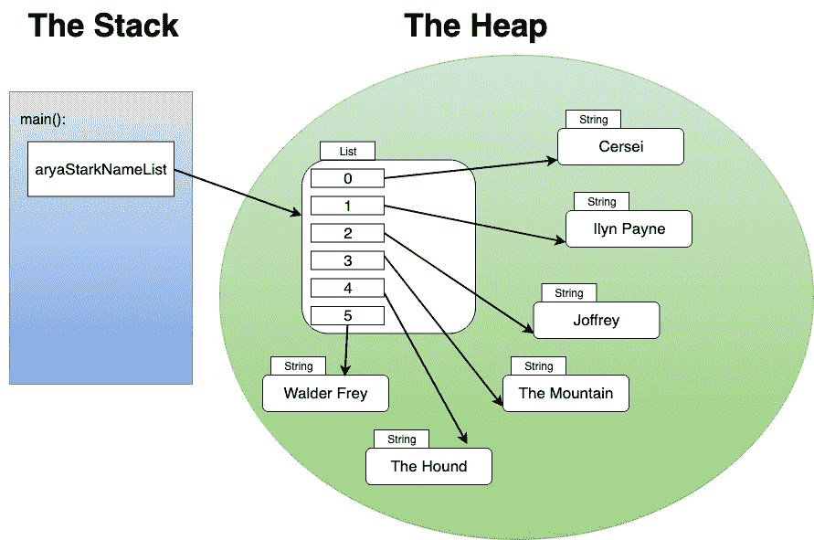

现在我们正在传递一个打印语句，我们已经完成了`main()`方法，所以`Stack`从它的数据中释放出来:

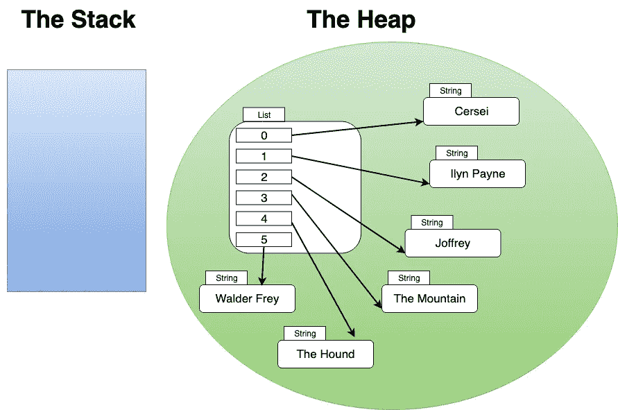

而且，您可能已经注意到，新对象(`List`)符合`Garbage Collector`的条件。

课程结束了，干得好！

现在，还有两件事，我要和你讨论。第一个是类在内存中的样子。

考虑到我们有课`Dwarf`:

和示例类:

让我们一行一行地来看看，Java 内存中发生了什么。

```
Dwarf dwarf = new Dwarf("Gimli", 40);
```

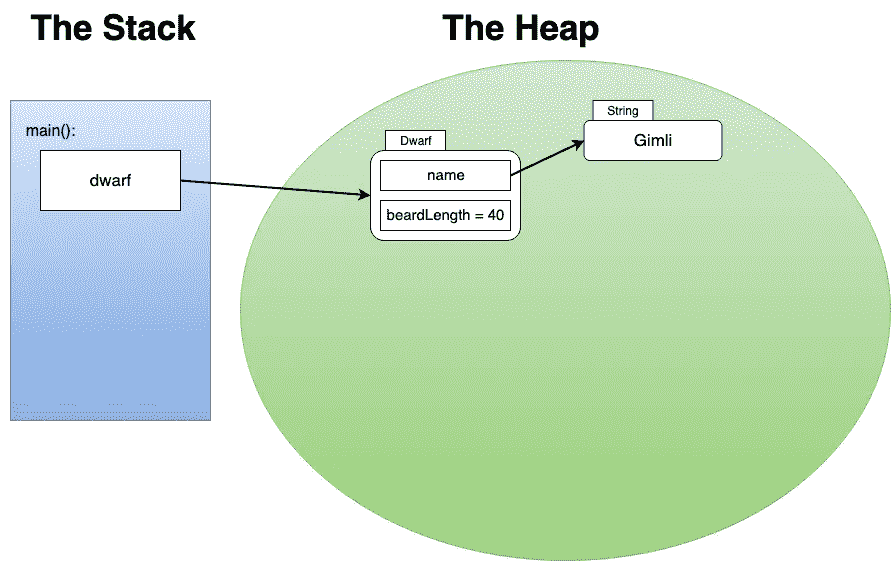

图像中有一个激动人心的时刻:变量`beardLength`存储在对象`Dwarf`中。怎么会这样嗯，没有别的办法了。是的，我告诉过你，原始类型存储在`Stack`中，但这会使`Heap`依赖于`Stack`，更有甚者，如果`Stack`不在了，`Heap`也会丢失数据。这就是为什么数据存储在`Heap`的对象中。

让我们继续:

```
dwarf.setName("Thorin");
dwarf.setBeardLength(20);
```

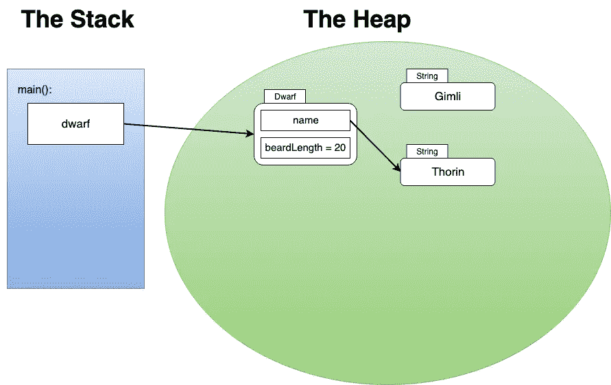

这一点应该是清楚的。而且，正如我们看到的，`String` `Gimli`现在有资格进入`Garbage Collector`。

```
dwarf = new Dwarf("Thrain", 50);
```


名为`Thorin`的`Dwarf`对象现在可以进行垃圾收集了。让我们想象一下，当我们继续下一行代码时，已经调用了`Garbage Collector`:

```
Dwarf thrain = dwarf;
```

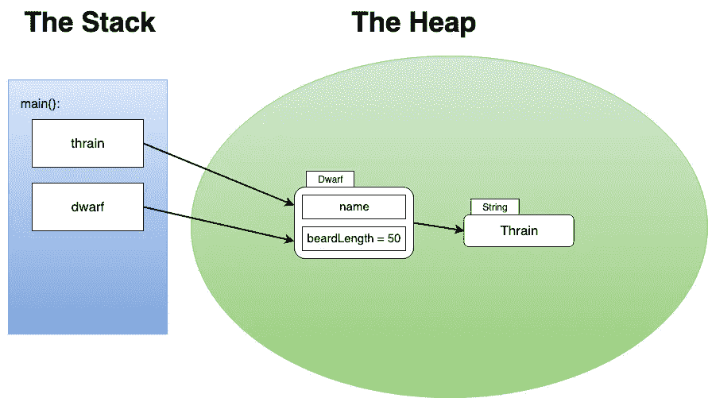

当我们将`dwarf`赋给`thrain`时，意味着我们共享了对`Heap`中`Dwarf`对象的值的引用。所以，从现在开始，`thrain`和`dwarf`都指代`Heap`中的同一个对象。

```
thrain.setName("Thrain II");
thrain.setBeardLength(70);
```

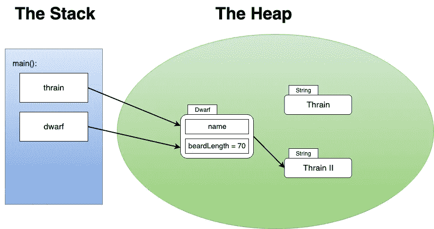

因为两个变量指向同一个对象，而对象被修改了，这意味着引用保持不变，所以我们又面临副作用了。

可以预见，我们将在控制台中看到以下输出:

```
Dwarf: Dwarf [name='Thrain II', beardLength=70]
Thrain: Dwarf [name='Thrain II', beardLength=70]
```

我希望，现在很清楚了。

还有一件事，我想和你讨论一下。

正如你可能已经理解的那样，`Heap`是内存的一个巨大部分，它可以包含超过几千兆字节的内存。它通过引用`Stack`中对象的值在应用程序间共享。每个应用程序只有一个`Heap`。但是有几个`Stack`:每个线程一个。

通常，一个复杂的企业 Java 应用程序包含许多线程，因此`Heap`在它们之间共享。重要的是要记住，作为工程师，我们应该注意多线程应用程序中的数据一致性，因为两个或更多线程同时修改同一个对象的风险很高，因此一些数据可能会在更新过程中丢失。这种情况被称为[数据竞争](https://docs.oracle.com/cd/E19205-01/820-0619/geojs/index.html)，但是我们不打算在这篇文章中深入探讨。如果你想让我单独写一篇关于 Java 中数据竞争的文章，请在评论区告诉我。

好了，现在你知道了我想在这篇文章中与你分享的所有东西——干得好，伙计们！

但是你难道没有忘记冲锋队克隆人军队的神秘吗？在我们的帖子开始时，他们已经在与叛军的战斗中失败了。您拥有发现问题并解决问题的所有知识和技能——只管去做！


[玛丽安娜 B.](https://unsplash.com/@mariana42?utm_source=medium&utm_medium=referral) 在 [Unsplash](https://unsplash.com?utm_source=medium&utm_medium=referral) 拍摄的照片

我给你一个提示:问题在`CloneBuilderService`类内部。

好了，我们一起来，再来看一看这个类:

让我们试着一行一行地通过它的`buildClones()`方法来捕捉问题:

```
List<StormTrooper> clones = new ArrayList<>();
```

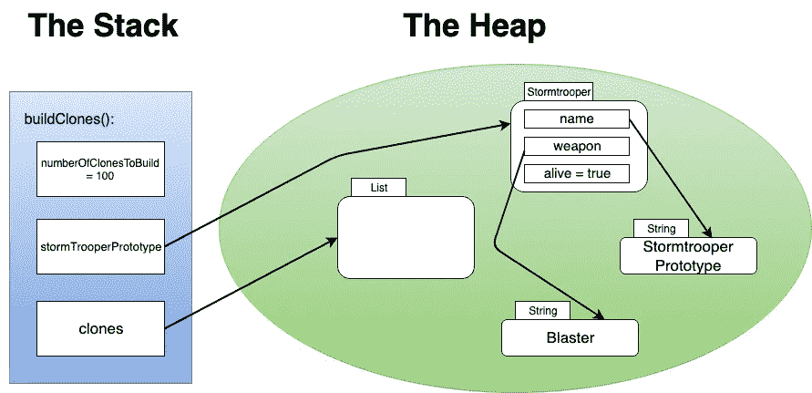

这里没什么好讨论的。但是接下来的几行(`for`循环及其内部)就有趣多了:

```
for (int i = 0; i < numberOfClonesToBuild; i++) {
        StormTrooper clone = stormTrooperPrototype;
        clones.add(clone);
}
```

我们在那里有`numberOfClonesToBuild`迭代(让我们想象一下，它是 100，因为我们在`BattleMain`类中操作这个数)。在每次迭代中，创建一个新变量`clone`，并且`stormTrooperPrototype`与`clone`变量共享对`StormTrooper`对象的引用。之后，将`clone`变量(因此，引用了`StormTrooper`)放入`List`。

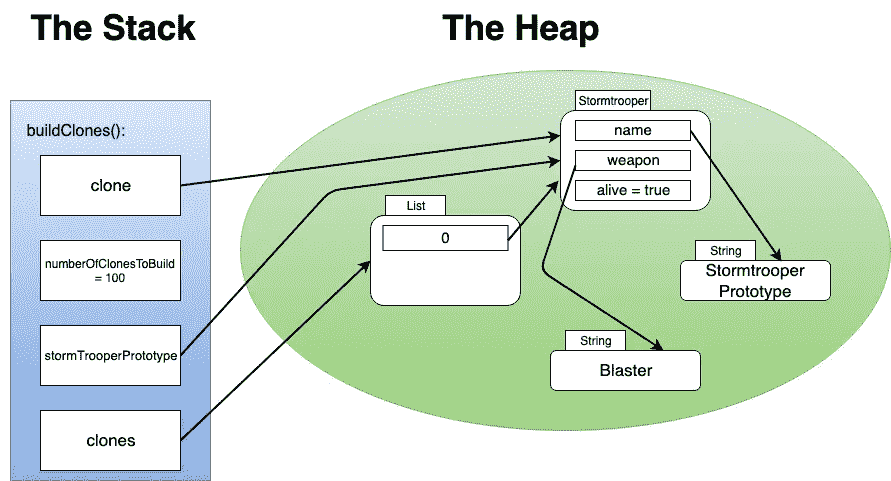

之后，`clone`变量从`Stack`中释放。

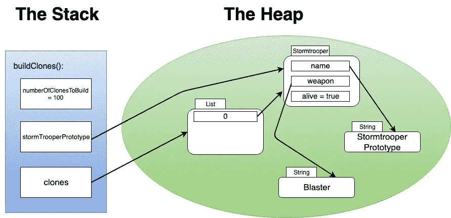

同一个故事出现 100 次，那么`for`循环完成后的最终画面将如下:

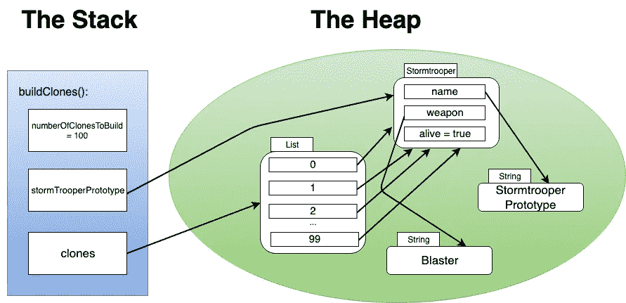

看着这张照片，很容易捕捉到，是什么原因让克隆人小队在叛军的第一枪后节节败退:

```
private static void proceedRebelsAttack(List<StormTrooper> stormTroopers) {
        StormTrooper stormTrooper = stormTroopers.stream()
                                     .filter(StormTrooper::isAlive)
                                     .findFirst()
                        .orElseThrow(IllegalArgumentException::new); System.out.printf("%s is killed \n", stormTrooper); stormTrooper.kill();
}
```

`stormTrooper.kill()`将`StormTrooper` `alive`字段的值更改为`false`。由于每个冲锋队都提到了`Heap`中的同一个物体，这意味着，他们都立即死亡。我要说，帝国软件工程师做得不好…

让我们修理它！

现在，每次都会在`Heap`中创建一个新对象，因此每个`List`变量将引用单独的独立对象。

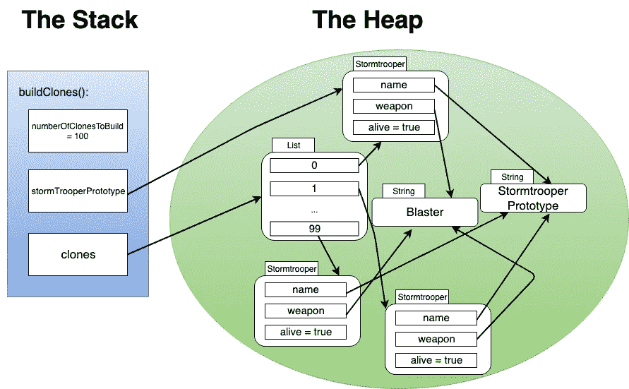

现在让我们运行应用程序:

```
The squad of clones is built. The size is 100Rebel [name='Gregar Typho', weapon='Gun'] is killed 
StormTrooper [name='Stormtrooper Prototype', weapon='Blaster'] is killedRebel [name='Han Solo', weapon='Gun'] is killed 
StormTrooper [name='Stormtrooper Prototype', weapon='Blaster'] is killedRebel [name='Princess Leia', weapon='Gun'] is killed 
StormTrooper [name='Stormtrooper Prototype', weapon='Blaster'] is killedRebel [name='Chewbacca', weapon='Arbalest'] is killed 
StormTrooper [name='Stormtrooper Prototype', weapon='Blaster'] is killedRebel [name='Luke Skywalker', weapon='Lightsaber'] is killed 
StormTrooper [name='Stormtrooper Prototype', weapon='Blaster'] is killedRebel [name='R2D2', weapon='Intelligence'] is killed 
StormTrooper [name='Stormtrooper Prototype', weapon='Blaster'] is killedStormtroopers win the battle!
```

应用程序是固定的，但是，我不高兴，因为 R2D2 走了——没有快乐的结局…

嗯，你今天做得非常好！我希望，从现在开始，你已经熟悉了`Java Memory Model`，并准备好去深入探讨这个话题！

让我们总结一下文章的内容:

1.  *Java 内存模型包含两个主要部分:堆栈和堆；*
2.  *堆栈负责存储原始数据类型(变量名和值)和对复杂对象值的引用；*
3.  *堆负责存储复杂的对象值，并通过栈中的引用在整个应用之间共享；*
4.  *每个应用程序有一个堆，但是也可以有几个栈:每个线程一个；*
5.  在 Java 中，当我们传递一个对象的值时，我们传递的是对它的引用。所以，当我们修改对象时，意味着我们修改了它在堆中的值，但是引用保持不变。这就是为什么物体的状态会被所谓的副作用改变；
6.  *如果你正在处理创建克隆人冲锋队的任务，不要省略测试阶段(当然，如果你不是叛军间谍)=)*

这是一段漫长的旅程，但我们一起走过了。我希望你学到了新的东西，并且在阅读过程中没有睡着。无论如何，谢谢，在评论区和以后的帖子里再见！

玩得开心！