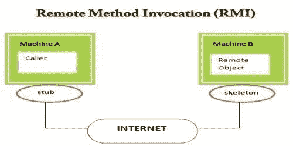
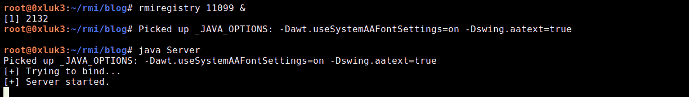
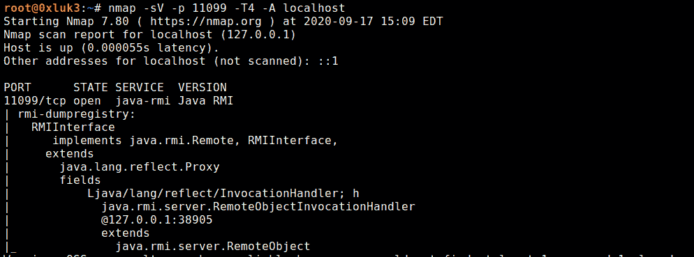
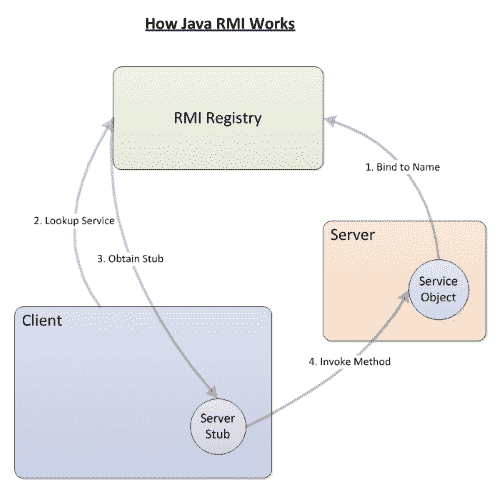
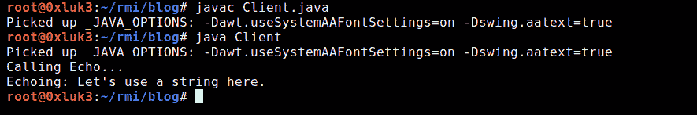
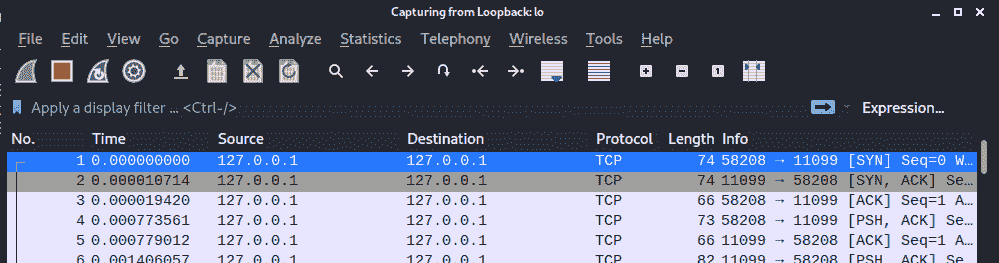
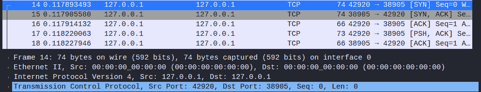
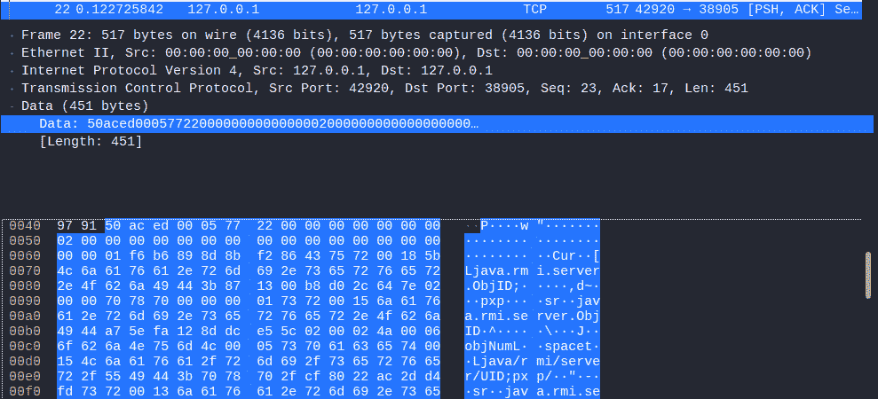
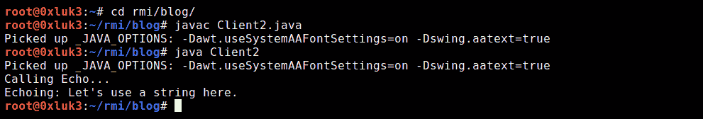

# pentesters 的 Java RMI:结构、侦察和通信(非 JMX 注册中心)。

> 原文：<https://itnext.io/java-rmi-for-pentesters-structure-recon-and-communication-non-jmx-registries-a10d5c996a79?source=collection_archive---------1----------------------->

本文的目的是向您解释，在基础设施的渗透测试中，您可能会遇到哪些 RMI 接口。由于我想谈论的整个话题有点长，我把它分成了两部分。在接下来的部分中，我将简单解释什么是 RMI 接口，如何创建一个用于测试的接口，以及如何手动构建一个 RMI 客户机来调用远程方法。攻击部分会在本帖第二部分描述，可以在这里找到[。](https://medium.com/@afinepl/java-rmi-for-pentesters-part-two-reconnaissance-attack-against-non-jmx-registries-187a6561314d)

另外，这些文章是关于本地 RMI 注册中心的。还有一些流行的 JMXRMI 注册中心，它们有些不同。我计划发布一篇关于 JMX 的独立文章，其中将涉及 JMXRMI 以及其他与 **J** ava **M** 管理 e **X** 张力互动的方式。简而言之，我在这里要描述的是:

*   什么是 RMI 接口
*   如何从源代码构建一个 RMI 接口(包括代码)
*   使用 Nmap 扫描可以获得关于 RMI 接口的哪些信息
*   如何构建一个 RMI 客户机(以及构建一个客户机需要知道什么)
*   在处理 RMI 时，典型的问题/堆栈跟踪是什么？原因可能是什么

# 什么是 Java RMI

Java RMI 服务器是一个暴露在网络上的虚拟实体，它允许其他远程方(客户端)在运行它的系统(技术上是在该系统上运行的 JVM)上执行方法。这在编程世界中并不罕见——类似的概念如[远程过程调用(RPC)](https://docs.microsoft.com/en-us/windows/win32/rpc/how-rpc-works) 被广泛使用。

因此，通过在系统上运行一个公开的 RMI 服务器，可以允许外部参与者与它进行交互，并可能在 RMI 服务器上执行方法。这些方法应该在服务器实现中定义。一旦它们被客户端调用，它们将在服务器上执行，返回值将返回给客户端。另一个有趣的部分是，除了使用 SSL 加密连接之外，原生 RMI(同样，我不是在谈论 JMXRMI)不支持太多的安全性。[1]

RMI 接口的架构如下所示:



[https://www . assignment point . com/WP-content/uploads/2020/07/Remote-Method-invocation . jpg](https://www.assignmentpoint.com/wp-content/uploads/2020/07/Remote-Method-Invocation.jpg)

“stub”和“skeleton”这两个名称乍一看可能会令人困惑，但这就是远程对象的“客户机”和“服务器”部分的简单叫法。

Stub 是一个实现远程接口的类，充当远程对象的客户端占位符。另一方面，Skeleton 是一个服务器端实体，它将调用分派给远程对象的实际实现。

RMI 注册表本身是一个 Java 实用程序，可以在 JDK 的二进制文件中以“RMI registry”的名称找到。启动带有一个数字参数的二进制文件，该参数是要监听的端口(默认为 1099)，这将允许[将](https://docs.oracle.com/javase/7/docs/api/java/rmi/registry/Registry.html#bind(java.lang.String,%20java.rmi.Remote))[远程对象](https://docs.oracle.com/javase/jndi/tutorial/objects/storing/remote.html#:~:text=The%20RMI%20(Java%20Remote%20Method,rmi.)绑定到上。稍后可以从运行 rmi registry 的机器外部的网络访问这些远程对象。

简而言之:我们首先启动 RMI 注册中心，然后创建一个 Java 对象(Java 类，它有一些要被远程方调用的方法),并给它一个名称(绑定),在这个名称下可以在注册中心内找到它。

为了允许远程方执行某些方法，RMI 注册表必须至少包含两个程序组件:

*   一个接口，它定义了哪些方法可以在远程对象上调用
*   绑定和导出远程对象的代码(将在该对象上调用远程方法)
*   远程方法的实现

# 构建 RMI 客户端和服务器

让我们用一个 RMI 服务器和客户机的简单例子。首先，服务器逻辑将有两个独立的类。你也可以在我的 GitHub 库[这里](https://github.com/0xluk3/simple-rmi)找到那篇文章的完整代码。

```
**//RMIInterface.java**import java.rmi.*;import java.rmi.registry.*;import java.net.*;interface RMIInterface extends Remote { public String echo(Object obj) throws RemoteException;}**//Server.java**import java.rmi.registry.Registry;import java.rmi.registry.LocateRegistry;import java.rmi.RemoteException;import java.rmi.server.UnicastRemoteObject;import java.rmi.Naming;public class Server extends UnicastRemoteObject implements RMIInterface {public String echo(Object input) throws RemoteException { return “Echoing: “ + input.toString();}protected Server() throws RemoteException { super();}public static void main(String[] args) { try { System.out.println(“[+] Trying to bind…”); //Below IP:PORT can be changed Naming.rebind(“rmi://127.0.0.1:11099/RMIInterface”, new Server()); System.out.println(“[+] Server started.”); } catch (Exception e) { e.printStackTrace(); }}}
```

这两个文件应该存储在同一个文件夹中。现在，编译它们并运行 rmiregistry。请注意，您应该从这些文件所在的目录运行 RMIRegistry(因此您当前的工作目录应该保持不变，然后运行 rmiregistry 二进制文件)



编译后运行上面的代码

# 使用 Nmap 侦察 RMI 接口

此时，我们可以使用 nmap 扫描本地主机接口，其中 rmi 注册表及其所有绑定都是可见的:

*nmap-sV-p 11099-T4-本地主机*



上面的清单是名为 [rmi-dumpregistry](https://nmap.org/nsedoc/scripts/rmi-dumpregistry.html) 的 nmap 脚本的结果。它告诉我们:

*   注册表在端口 11099 上运行
*   它使用(实现)RMIInterface，这是一个自定义类，我们不知道它在纯黑盒视角下的结构(但是我们在创建它时是如何知道它的)
*   invocationHandler 在端口 34087 上运行。简言之，Invocationhandler 是负责执行远程调用方法的端点。

下图显示了与 RMI 注册表交互的顺序:



[https://static 1 . makeuseofimages . com/WP-content/uploads/2017/10/how-RMI-works-500 x500 . png](https://static1.makeuseofimages.com/wp-content/uploads/2017/10/how-rmi-works-500x500.png)

# 创建 RMI 客户端

为了获得完整的图片，让我们实现客户端代码。Client.java 与 Server 和 RMIInterface 放在同一个目录中。

```
**//Client.java**import java.net.MalformedURLException;import java.rmi.Naming;import java.rmi.NotBoundException;import java.rmi.RemoteException;public class Client implements RMIInterface {public String echo(Object input) throws RemoteException { return “Echoing: “ + input.toString();}private static RMIInterface look_up;public static void main(String[] args)throws MalformedURLException, RemoteException, NotBoundException { look_up = (RMIInterface)      Naming.lookup(“rmi://127.0.0.1:11099/RMIInterface”); System.out.println(“Calling Echo… “); try { String response = look_up.echo(“Let’s use a string here. “); System.out.println(response);} catch (Exception e) {}}
}
```

请注意，Client.java 实现了服务器端使用的接口，在当前情况下，我们提供了与服务器端相同的函数 echo 实现。



编译后，您可以看到客户端可以被调用。如果您在运行客户端时查看 wireshark，您可以确认上面的图形流，因为观察到了到 RMI Registry 的第一个连接，之后是到 InvocationHandler 的第二个连接。

开始时，客户端只与注册端口 11099 通信



稍后，它被指示再次与将服务于方法执行的 InvocationHandler 对话:



您可以观察到从该端点返回的 echo 方法的结果。



还有，值得一提的是，我们可以看到数据是以序列化的形式交换的，这可以通过查看序列化的“神奇字节”0xaced0005 来说。这将在关于攻击 RMI 注册中心的文章的第二部分中进一步讨论(剧透:现代 Java 版本已经减轻了这种攻击:( )

所以基本上，为了在远程服务器上连接和执行方法，我们需要:

*   服务器正在使用的接口代码，该代码不公开可见，也不能从注册中心下载
*   nmap 检测到的绑定名称和注册端口
*   调用处理程序必须可以在网络级别上使用它在注册表转储中显示的 IP/主机名进行访问

**等一下！**

你喜欢这篇文章吗？想让**了解最新的**网络安全内容吗？

[免费订阅我们的****时事通讯** —点击这里**](https://newsletter.afine.academy/join)**！**

**[](https://newsletter.afine.academy/join) [## AFINE 网络通讯

点击这里加入！](https://newsletter.afine.academy/join) 

# 客户端故障排除

下面我们将讨论在这一点上可能遇到的两个常见障碍:**外来 InvocationHandler** 和**缺少服务器端接口**。

如上面的 wireshark 转储所示，在连接到 RMI 注册表的过程中，首先注册表将被命中，然后客户端将被重定向到相应的 InvocationHandler。如果 InvocationHandler 设置为外部主机，例如 localhost 或无法解析的主机名，请记住，仍然是您的计算机将尝试连接到 InvocationHandler 的地址。

*   如果它被设置为 localhost，您将得到一个连接错误，因为在连接到注册表之后，您的客户端将尝试连接到您的机器的本地主机**上的 InvocationHandler。您必须使用防火墙或 socat 等工具设置中继，并将流量从[localhost]:[调用处理程序端口]重定向到[RMI _ host]:[调用处理程序端口]**
*   如果它被设置为无法解析的主机名，请尝试将 rmi 服务器的 ip 地址和外部主机名一起添加到/etc/hosts 文件中，以便正确解析它，并且您将能够连接到它

执行远程方法的第二个障碍是接口的代码。如果没有服务器端接口，事情会更复杂。

# 目标接口未知怎么办？

在文章的第二部分，我将向您展示 RMIScout 工具，它允许自动化该过程，但是，到目前为止，让我们采用手动方法(我相信手动方法应该总是首先用于理解幕后发生的事情；只有这样，自动化方法才能有效地使用)

考虑下面的例子:我们将启动上面提供的 rmiserver，并将客户机类和接口类复制到不同的文件夹中。

在这种情况下，如果您能够猜出方法名和参数，您就能够调用它。考虑以下客户端代码:

```
**//Client2.java**import java.net.MalformedURLException;import java.rmi.Naming;import java.rmi.NotBoundException;import java.rmi.RemoteException;public class Client2 implements RMIInterface {**public String echo(Object something) throws RemoteException {** **String notUsed = something.toString();** **return “Sorry, I don’t know the original implementation”;****}**private static RMIInterface look_up;public static void main(String[] args)throws MalformedURLException, RemoteException, NotBoundException { look_up = (RMIInterface) Naming.lookup(“rmi://127.0.0.1:11099/RMIInterface”); System.out.println(“Calling Echo… “); try { String response = look_up.echo(“Let’s use a string here. “); System.out.println(response); } catch (Exception e) {}}}
```

如果您运行这样的客户端代码，代码将被运行，并且**服务器实现将被执行**。这意味着，要执行远程方法，您只需要知道接口名称以及方法名称、返回的数据类型和参数数据类型。为什么重要？简而言之，如果您能够获得至少一个存在于服务器端的函数的信息，**您可以构建一个与 nmap 转储的名称相同的虚拟接口，** **在那里放置适当的函数签名(返回的数据类型、名称和参数类型—只有这些)，并创建一个客户端，该客户端使用该函数的虚拟实现来实现该接口。**

唯一重要的是接口存在于客户端的类路径中，因此可能需要构建一个虚拟包，如*org . company . RMI package . RMI interface*，将其放在一个虚拟包中。jar 文件，最后放到类路径中。一旦您调用它，您将能够执行服务器端的方法并获得它的正确结果(当然，如果它返回任何结果值)。



这反过来表明，您只需要猜测方法签名(返回数据类型、方法名称和参数数据类型)就能够执行它们。如果足够幸运的话，您可能能够在 GitHub 上找到完整的 RMI 接口，这反过来也允许您检查某个方法做了什么。否则，将在本文第二部分讨论的 RMIScout 将是发现服务器端潜在方法的绝佳选择。如果您能够识别 RMI 方法，其中一些可能已经帮助您在目标系统上获得了立足点。

你可以在 GitHub [这里](https://github.com/0xluk3/simple-rmi)找到这里使用的程序的完整代码。

# RMI 注册表故障排除

当使用上面描述的 RMI 注册中心，或者使用任何其他连接到远程注册中心的工具(还有 ysoserial 或 rmiscout 等等)时，您可能会遇到一个错误，这个错误通常伴随着一个堆栈跟踪。虽然堆栈跟踪对出错的地方有很大的帮助，但完全可以理解，您可能不想深入故障诊断，而只是让工具工作并继续前进。以下列表显示了在处理 RMI 注册表时遇到的常见异常，并附有简短的解释和补救措施。请注意，每种情况都是不同的，所以它们不会在 100%的情况下都有效，但是如果你觉得卡住了，这些可以是你的第一步。

**客户端异常:**

*   【Java . security . accesscontrolexception:拒绝访问(Java . net . socket permission hostname.server.com)

JVM 没有权限打开远程套接字。这可能是您的 [java 安全策略(java.policy)](https://docs.oracle.com/en/java/javase/11/security/permissions-jdk1.html#GUID-1E8E213A-D7F2-49F1-A2F0-EFB3397A8C95) 的问题。

*   **异常:连接拒绝主机:10 . 10 . 4 . 1；嵌套异常是:
    java.net.ConnectException:连接被拒绝**

无法建立连接。这是因为注册表在网络级别上不可达。目标注册表可能已关闭，或者有什么东西正在阻止网络连接。

*   **Java . RMI . notboundexception:**

这意味着注册表存在，但您正在寻找的绑定不存在。例如，您想绑定到“MYRegistry ”,但是您打错了，写成了“MYRegistr ”,所以您得到了 NotBoundException

*   **异常:解组退货出错；嵌套异常是:
    Java . lang . classnotfoundexception:[class name]**

这意味着您的类路径中缺少[ClassName]。尝试从您的接口所在的目录运行您的 rmi 客户机(或工具)。如果您正在运行一个 jar 工具，可能需要解包它，将一个编译好的类添加到某个包中，然后重新打包 jar。如果你不确定如何操作，请点击下面的链接了解软件包的工作原理:[https://www.geeksforgeeks.org/packages-in-java/](https://www.geeksforgeeks.org/packages-in-java/)

**运行服务器时出现异常:**

*   **Java . RMI . server . export exception:端口已被使用:1099；嵌套异常是:**

当您尝试在同一个端口上运行两次 rmiregistry 时，可能会发生这种情况。

*   Java . RMI . access exception:Registry。不允许 Registry.rebind 产地 foreign.host.com 是非本地主机

RMI 只能绑定到本地主机——如果您收到这个错误，您可能试图绑定到位于远程机器上的注册表。

*   **Java . RMI . alreadyboundexception:my registry**

这仅仅意味着这种约束已经存在。更改名称或取消绑定上一个对象。

这就是了解 RMI 注册中心的基本知识所需要的全部内容。这很长，但是如果你想以一种聪明的方式使用自动攻击工具，并且在测试基础设施时更有效，这是值得一试的。在下一部分中，我将向您展示有趣的部分——枚举和攻击技术，它们可能因目标的 Java 安全级别和补丁策略而异。

**作者:**卢卡斯·米库拉——渗透测试仪&研发负责人& D @ AFINE。在 LinkedIn([https://www.linkedin.com/in/lukaszmikula/](https://www.linkedin.com/in/lukaszmikula/))或 Twitter([https://twitter.com/0xluk3](https://twitter.com/0xluk3))上关注我

**参考文献**:

[1][https://www . slide share . net/nickbloor 3/Nicky-bloor-bar mie-poking-javas-back-door-44con-2017](https://www.slideshare.net/NickBloor3/nicky-bloor-barmie-poking-javas-back-door-44con-2017)

此外，这篇文章的灵感来自于阅读下面的文章(我建议你也阅读它们！):

*   https://artemis.wszib.edu.pl/~tgubala/rmi/exceptions.html(这张是波兰文)
*   [https://mogwailabs . de/blog/2019/03/attaking-Java-RMI-services-after-jep-290/](https://mogwailabs.de/blog/2019/03/attacking-java-rmi-services-after-jep-290/)
*   [https://stack overflow . com/questions/17351336/I-am-running-a-RMI-application-and-no-security-manager-RMI-class-loader-disable](https://stackoverflow.com/questions/17351336/i-am-running-a-rmi-application-and-no-security-manager-rmi-class-loader-disable)
*   [https://www . knowledge hut . com/tutorials/Java-tutorial/Java-RMI](https://www.knowledgehut.com/tutorials/java-tutorial/java-rmi)
*   【https://labs.bishopfox.com/tech-blog/rmiscout **