# Java 脚本营

> 原文：<https://itnext.io/java-script-camp-6f173e54a356?source=collection_archive---------1----------------------->

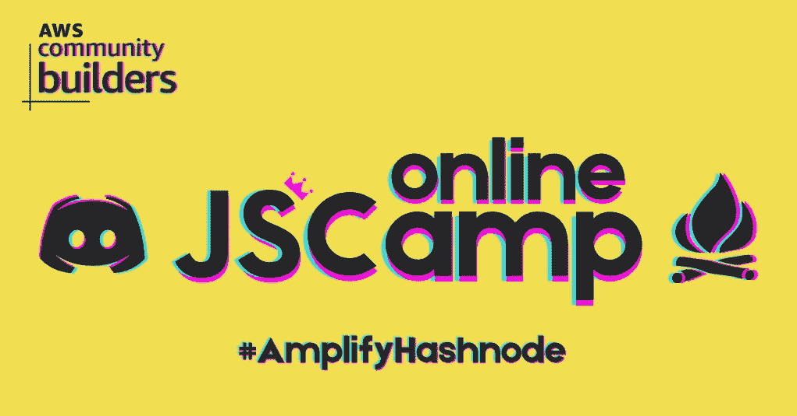

# 学习 JavaScript 编程语言的 it 营

*“我们预测* [*无服务器*](https://www.jscamp.app/en/docs/amplify-01) *将快速增长。我们还预测，内部混合云应用将随着时间的推移而缩减，尽管由于监管和数据治理的限制，一些部署可能会持续下去。*

*无服务器计算将成为云时代的标准计算模式，在很大程度上取代服务器端计算，从而结束客户端-服务器时代。”*

[*云编程简化:一个关于无服务器计算的伯克利观点*](https://www2.eecs.berkeley.edu/Pubs/TechRpts/2019/EECS-2019-3.pdf) *，2019 年 2 月 10 日*

根据这一预测，对无服务器技术的需求是显而易见的，因此对教授这些技术的资源的需求也是显而易见的。因此，我们组织了一所编程学校，在那里我们教授 AWS Amplify 的无服务器技术，并通过使用表情符号、 [JavaScript](https://www.jscamp.app/docs/javascript01) 、 [React Native](https://www.jscamp.app/docs/start000) 和 [Type Script](https://www.jscamp.app/docs/typescript00) 教授[英语来为它们做准备。](https://www.jscamp.app/docs/blogging-01/)

为此，我们创建了一个移动应用程序[苏美尔学校](http://onelink.to/njhc95)，一个网站 [JSCamp.app](https://www.jscamp.app/) 和 [YouTube 频道](https://www.youtube.com/channel/UCR8tIQm7pu8MlPewAlUnzQw)，在那里我们使用默认情况下在[亚马逊苏美尔](https://aws.amazon.com/ru/sumerian/)中可用的 3D 化身进行训练，通过它你可以轻松创建令人兴奋的 3D 界面。它们还与 [AWS](https://aws.amazon.com/) 服务集成，以提供对机器学习、聊天机器人、代码执行等的轻松访问。有了这个工具，我们可以用世界上流行的语言制作视频和教材，并在我们的网站和 YouTube 频道上发布。

JavaScript 阵营

# 计划的目的

准备 React Native/Type Script/AWS Amplify 堆栈中的移动开发课程和 [AWS 认证](https://aws.amazon.com/en/certification/)中的认证，在准备过程中，您将获得广泛的专业知识、资源和计划。我们将帮助您有效验证您的云和移动开发专业知识，这是当今每个企业都需要的。

# JavaScript 阵营— JS 阵营

我们从《青少年代码:JavaScript——杰里米·莫里茨》这本书中获得灵感，用流行语言创建了我们的[在线 JavaScript 课程](https://discord.gg/6GDAfXn)。

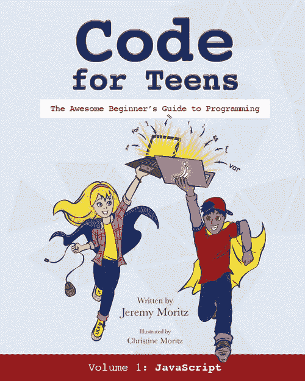

这本书的独特之处在于，它以其简单的表述方式适合儿童学习，其唯一的缺点是，书中阐述的主题数量不足以创建真正的项目。因此，我们给自己设定了一个任务，编写一本书`JavaScript for Kids`，为在 [React Native](https://reactnative.dev/) 库上学习移动开发课程做准备。

此时，[我们的移动应用](http://onelink.to/njhc95)实现了英语和 JavaScript 测试。为了实现这个案例，我们使用了 [AWS Amplify](https://aws.amazon.com/) 服务。你可以在这里阅读更多关于我们如何实现认证服务[的信息，以及我们如何在这里](https://www.jscamp.app/docs/auth1-01)连接应用同步服务[。](https://www.jscamp.app/docs/amplify-03)

# 应用程序同步

[AWS AppSync](https://www.jscamp.app/en/docs/amplify-03) 允许您创建一个通用的 API 来安全地访问、修改和合并来自多个来源的数据，从而简化了应用程序开发。AppSync 是一个托管服务，它使用 [GraphQL](https://graphql.org/) ，因此应用程序可以轻松地只检索它们需要的数据。

# GraphQL

它是一个 API 规范，是 API 的查询语言，也是使用数据进行查询的运行时。它与 REST 有一些相似之处，是 REST 的最佳替代品。 [GraphQL](https://graphql.org/) 是脸书在 2015 年推出的，尽管它从 2012 年开始在内部使用。

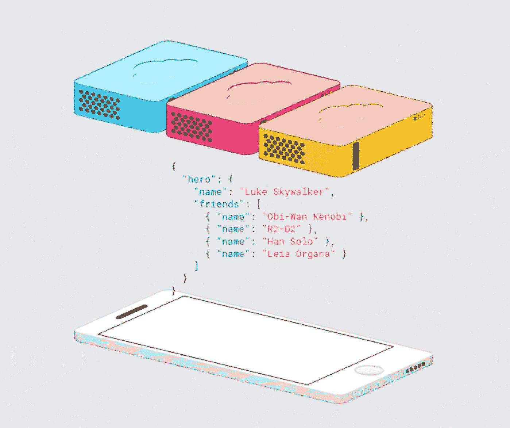

# 表情符号英语

由于英语是编程语言的基础，而在我所来自的俄罗斯，它不是我的母语，了解到这一点，我们准备了一个使用表情符号以有趣的方式学习英语的程序。表情符号已经如此深入我们的生活，以至于正在制作关于它们的电影。目前，该课程包含 700 个单词，分为 12 个主题:字母，数字，食物和饮料，动物，活动，衣服，旅行，物体，符号，时间，人，自然。该课程也适合那些想要很好地浏览整个表情调色板以创建情感社交媒体帖子的人。关于这个话题的视频播放列表可以在[这里](https://www.jscamp.app/docs/blogging-01/)找到。

# 反应自然

谁不知道 [React Native](https://reactnative.dev/) 是一个为 iOS 和 Android、AR / VR 创建接口和创建来自脸书的网站的库。你认为我们已经成功地解决了这个问题吗？在[不和谐](https://discord.gg/6GDAfXn)里亲自给我写这个。我们开设了一门包含 29 个主题的课程，甚至 10 岁以上的小学生现在也在学习这门课程。有了 React Native，这是一条通往移动开发的捷径。我们的课程是针对那些完全从零开始的人，最好从我们开始，因为你会节省时间，你不需要学习 HTML 和 CSS，就可以接触到网站。有了 React Native，我们可以在 JS 对象上排版 UI 接口，所以只要有一点 JavaScript 知识，您就可以和我们一起直接进入移动开发。本课程包含使用 React 本地库和 AWS Amplify 创建移动应用程序所需的基本知识。

# AWS 放大器

[AWS Amplify](https://aws.amazon.com/en/amplify/) —它是一套工具和服务，web 和移动开发者可以一起或单独使用，在 AWS 上构建可扩展的端到端应用。使用 Amplify，您可以在几分钟内配置应用程序后端并连接应用程序，只需几次点击即可部署静态 web 应用程序，并在 AWS 控制台之外轻松管理应用程序内容。Amplify 支持流行的 web 平台，如 JavaScript、React、Angular、Vue、Next.js，以及移动平台，如 Android、iOS、React Native、Ionic、Flutter(预览版)。利用 AWS Amplify 加快上市时间。

# 打字原稿

JavaScript 最初被创造出来是为了让网页活起来。由于其易用性，它获得了普及，并开始在几乎所有平台上使用。JavaScript 代码是建立在脚本之上的，脚本应该小而快。开发人员没有想到 JavaScript 会被用来编写包含大量代码的应用程序。在这方面，用 JavaScript 编写的大型应用程序存在问题。以下是其中的一些:

1.  由于语言的可解释性，您只能在执行代码后才能发现错误；
2.  使用面向对象编程实践的复杂性；
3.  动态打字。

为了解决这些问题，TypeScript 编程语言应运而生。

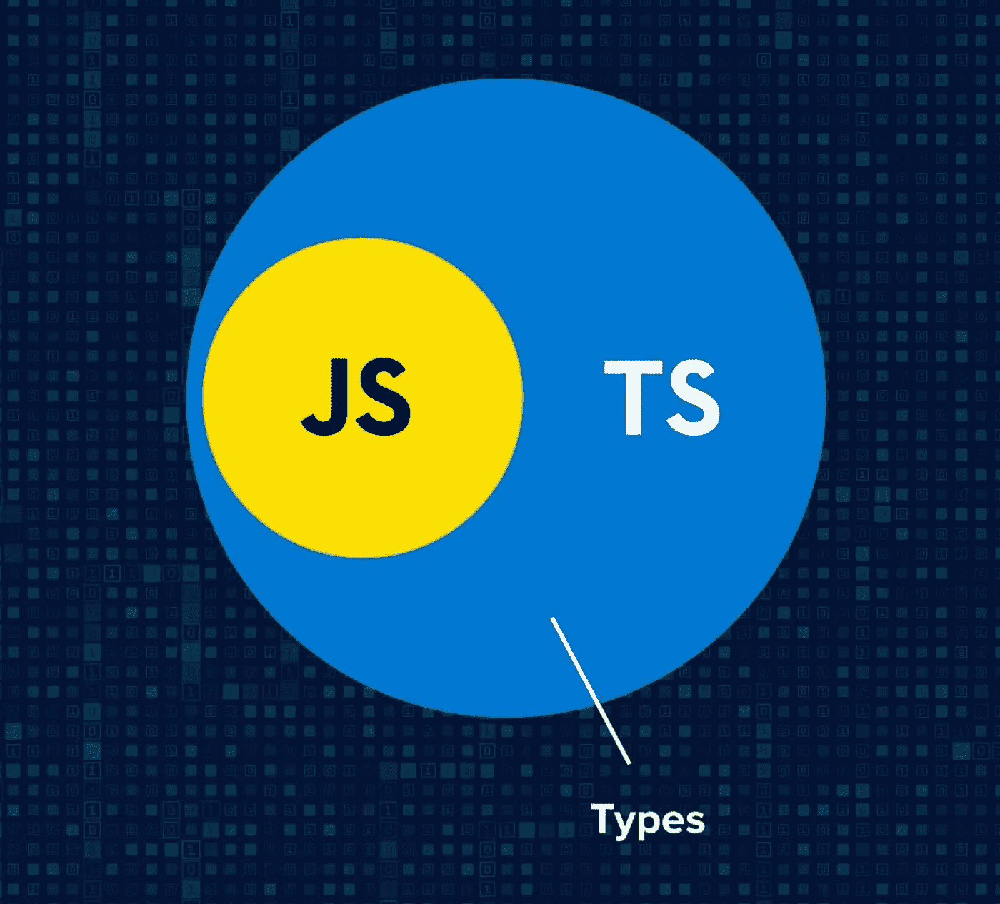

TypeScript 是微软在 2012 年推出的一种编程语言，作为扩展 JavaScript 的 web 应用程序开发工具进行营销。TypeScript 向后兼容 JavaScript 并编译成后者。事实上，一旦编译完成，TypeScript 程序就可以在任何现代浏览器中执行，或者与 Node.js 服务器框架共享。TypeScript 代码看起来几乎和 JS 代码一样，如果你有前端开发的经验，学习 TypeScript 是非常简单的。尤其是考虑到可以直接用 TS 脚本写 JS 代码。所以我们决定[在我们的 JS 训练营 it-camp 里教](https://www.jscamp.app/ru/docs/typescript00)他。

# 音乐专辑

JS 课程由文章、视频教程、播客和音乐曲目组成。我们创作了第一张 JavaScript 音乐专辑。现在可以在俄语版的[音云](https://soundcloud.com/serverlesskiy/sets/javascript)上找到。我邀请你用你自己的语言来表演。

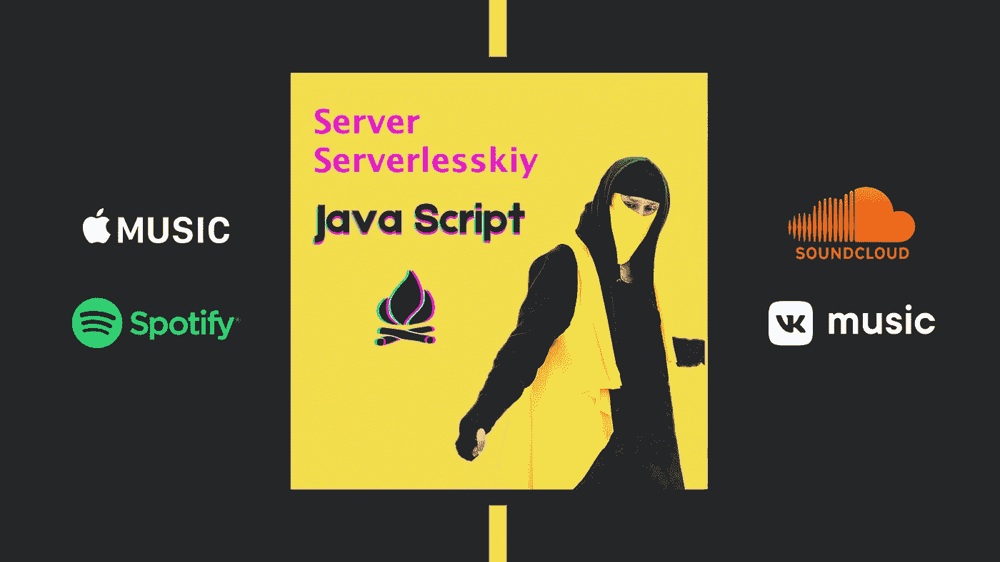

# 徽章

在我们应用程序的最后一次更新中，发布了一个用户忠诚度系统。现在每个通过英语、JavaScript、ReactNative、TypeScript、AWS Amplify 考试的人都会在我们的苏美尔学校应用程序中收到相应的徽章，可以在 iOS 和 Android [这里](http://onelink.to/njhc95)免费下载。诚然，考试仍然只有英语和 JavaScript 两种语言，但是今年所有的题目都有。

# 开放源码

我们的项目是可用的[开源](https://github.com/fullstackserverless/Sumerian)，所以你也可以参与它的开发。我们呼吁将[网站](https://github.com/gHashTag/jscamp)翻译成英语、俄语和中文之外的其他语言，这样每个人都可以对其做出贡献。

# YouTube 电影

我们还推出了有儿童参与的俄语视频系列[。如果你想让你的孩子用你的母语融入到我们的项目中，参与到我们的特许经营中来，那就给我们写信，地址是](https://youtu.be/H6RmU-Hi0EI) [Discord](https://discord.gg/6GDAfXn) 。

# JS 夏令营项目

我们从组装魔方开始线下课程，收集魔方的学生进入一年级。

💛第一堂课——JavaScript，菲奥娜·米勒老师。

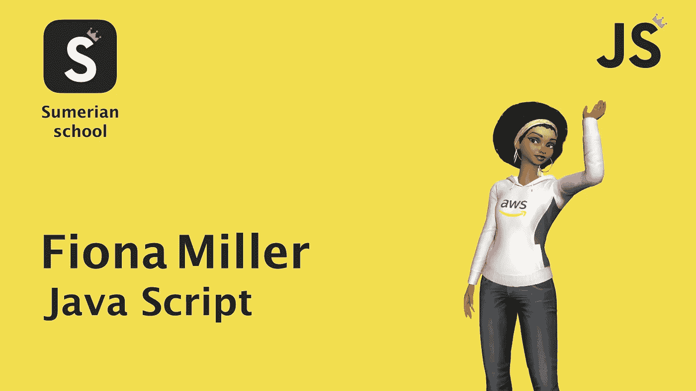

💚第二类——使用脸书的库，对移动应用 iOS、Android 以及增强和虚拟现实中的 AR / VR 系统中的原子组件系统进行原生、开发和布局。格蕾丝·威利老师。

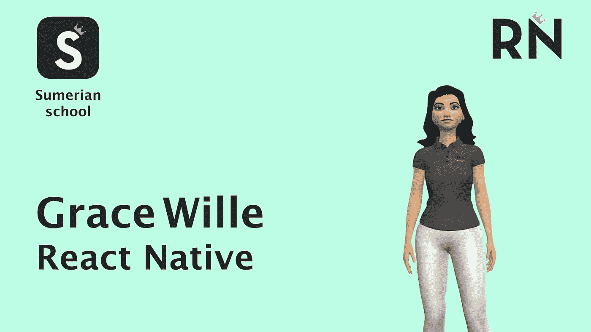

💙第三节课——打字稿，原子组件系统打字，老师 Maya Lakshmi。

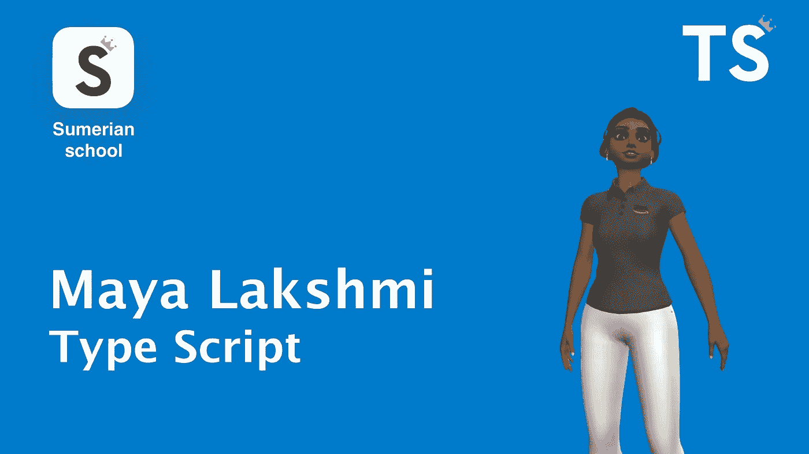

💜第四类— AWS Amplify，基于 AWS Amplify 函数的无服务器计算。Server Serverlesskiy 老师。

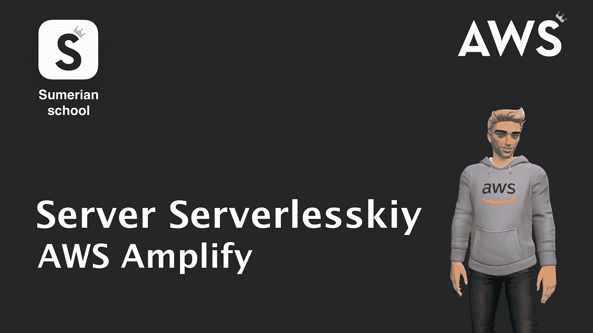

🤍可选视频博客课程——为我们的培训视频课程 aws 苏美尔技术的主持人——试用培训头像。普雷斯顿野生老师。

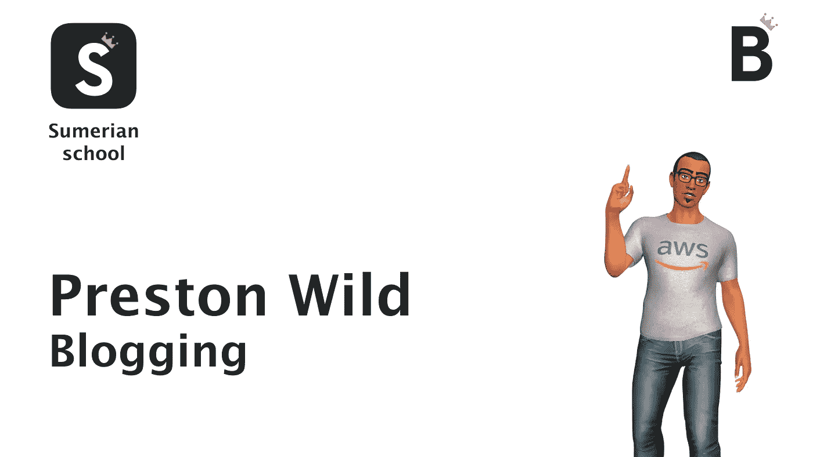

💟英语预科班。克里斯·布朗老师。

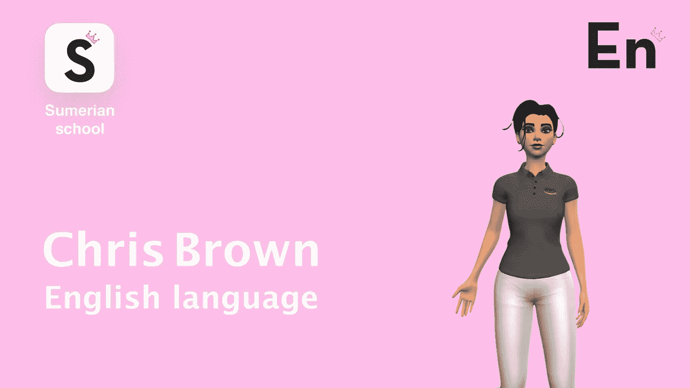

# 课程作者

Java Script 课程的作者——[Server Serverlesskiy](https://twitter.com/koshasuperstar)，是俄罗斯互联网第一个 [React Native](https://react-native-village.github.io/docs/start000) 培训课程的创建者，也是亚马逊第一个参与 [AWS 社区构建者](https://aws.amazon.com/ru/developer/community/community-builders/)计划的俄罗斯博客程序员。

# 学习过程

培训发生在应用[不和谐](https://discord.gg/6GDAfXn)中。

# 支付

培训是免费的，但是你可以通过 [Patreon](https://www.patreon.com/bePatron?u=31769291) 来支持我们的创业。