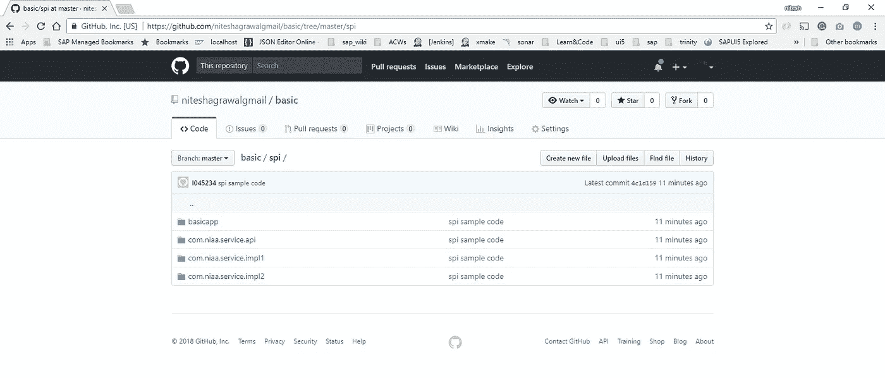
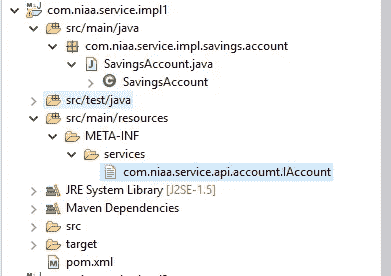
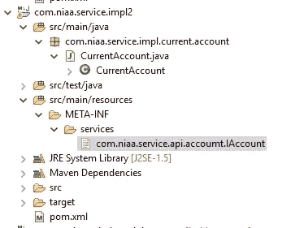
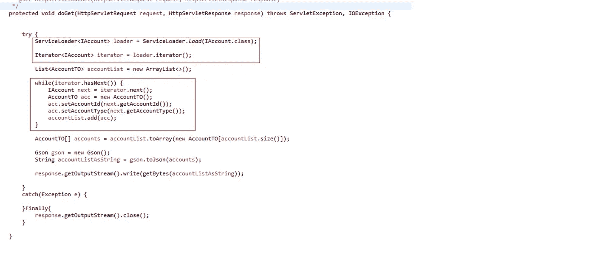

# Java 服务提供者接口(SPI)—通过代码理解它

> 原文：<https://itnext.io/java-service-provider-interface-understanding-it-via-code-30e1dd45a091?source=collection_archive---------2----------------------->


想过 JPA 实现(EclipseLink 或 Hibernate)是如何被 Java 持久性 API 获取的吗？或者 java.sql.DriverManager 如何加载 java.sql.Driver 的可用实现，或者消息传递框架如何获取 JMS 实现。

它们都遵循 JAVA SPI(服务提供者接口)机制。

根据*有效 Java，第二版*:

服务提供者框架是一个系统，在这个系统中，多个服务提供者实现一个服务，系统使实现对其客户端可用，将它们与实现解耦。

服务提供商框架有 3 个基本组成部分:

1.  服务接口，由提供者实现。
2.  一个提供者注册 API，系统用它来注册实现，让客户可以访问它们。
3.  和服务访问 API，客户端选择该 API 来获得服务的实例。

在本文中，我们将浏览一个示例代码，通过它我们将尝试理解 Java 服务提供者框架。

> 设置:

所有的代码都可以在@【https://github.com/niteshagrawalgmail/basic.git】的 spi 文件夹中找到。

【https://github.com/niteshagrawalgmail/basic/tree/master/spi 



1.  一个 maven web 项目[ *basicapp* ]，它将作为服务接口的消费者/客户端。该项目将依赖于服务接口及其实现，并将被组装成一个. war，部署在 Tomcat 服务器上。
2.  一个有服务接口的 maven 项目。[com.niaa.service.api]
3.  两个 maven 项目代表服务接口的两个提供者实现。[com.niaa.service.impl1]和[com.niaa.service.impl2]

## 服务接口

项目 *com.niaa.service.api* 包含一个接口 IAccount。

```
package com.niaa.service.api.accoumt;public interface IAccount { public String getAccountType(); public String getAccountId();}
```

## 服务提供商实施

项目 *com.niaa.service.impl1* 包含 IAccount 的实现。

```
package com.niaa.service.impl.savings.account;import com.niaa.service.api.accoumt.IAccount;public class SavingsAccount implements IAccount {public String getAccountType() { return "SavingsAccount";}public String getAccountId() { return "1";}}
```

SavingsAccount 类实现 IAccount 并返回“SavingsAccount”作为帐户类型。

> 为了连接到服务提供者框架，我们需要在 META-INF/services/文件夹中创建一个名为:**com . niaa . Service . API . account . iaccount**的**文件**
> 
> 在文件(文件的内容)中，我们需要提供提供者实现的完全限定名。

```
com.niaa.service.impl.savings.account.SavingsAccount
```



提供商实施项目的文件夹结构

类似地，项目 *com.niaa.service.impl2* 包含 IAccount 的另一个实现。

```
package com.niaa.service.impl.current.account;import com.niaa.service.api.accoumt.IAccount;public class CurrentAccount implements IAccount {public String getAccountType() { return "CurrentAccount";}public String getAccountId() { return "2";}}
```

CurrentAccount 类实现 IAccount 并返回“CurrentAccount”作为帐户类型。

> 为了连接到服务提供者框架，我们需要在 META-INF/services/文件夹中创建一个名为:**com . niaa . Service . API . accoumt . iaccount**的**文件**
> 
> 在文件(文件的内容)中，我们需要提供提供者实现的完全限定名。

```
com.niaa.service.impl.current.account.CurrentAccount
```



第二个提供商实施项目的文件夹结构

现在我们有了 IAccount 的两个实现，SavingsAccount 和 CurrentAccount。两者都提供所需的配置文件**com . niaa . service . API . acco UMT . iaccount**，并在各自的文件中包含所需的提供者实现类名。

接下来，我们将看到服务访问 API 如何加载这些实现实例。

现在，在我们的消费者项目[basicapp]中，我们有一个名为 E2eServlet 的 HttpServlet。这个项目集合了所有其他项目——服务接口+它的提供者实现。

basicapp 的 pom.xml:

basicapp 的 pom.xml

E2eServlet 的 doGet(HttpServletRequest 请求，HttpServletResponse 响应)方法:



这里我们使用的是服务提供者框架的 java.util.ServiceLoader API。

我们已经创建了名为 AccountTO 的传输对象，用于将聚合的帐户序列化为 JSON to response。

当我们启动 API 时:

[http://localhost:8081/basic app/API](http://localhost:8081/basicapp/api)

```
[
 {"accountId":"1",
  "accountType":"SavingsAccount"
 },
 {"accountId":"2",
  "accountType":"CurrentAccount"
 }
]
```

## 总结:

服务提供者框架提供了一种简单的方法来分离和加载服务接口的多个实现。

唯一重要的事情是确保必要的配置文件在文件夹[META-INF/services]中是可用的，正如框架所期望的。

**A** 还要注意配置文件的命名惯例。

> 感谢阅读:)