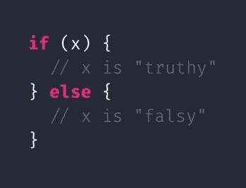
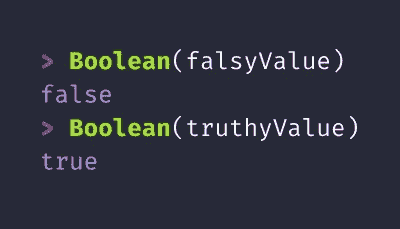
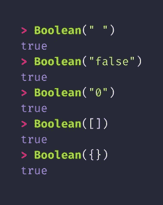
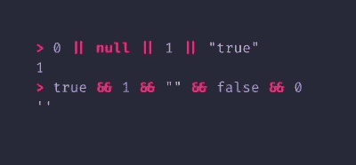
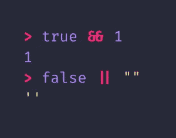
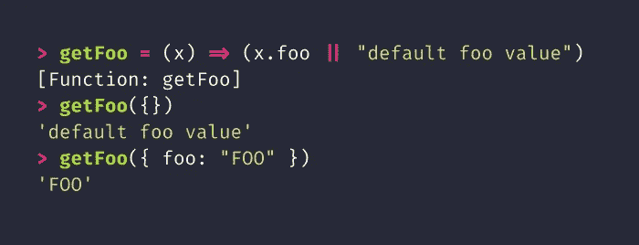
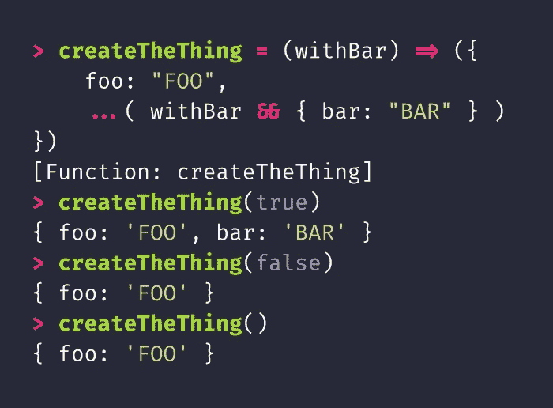
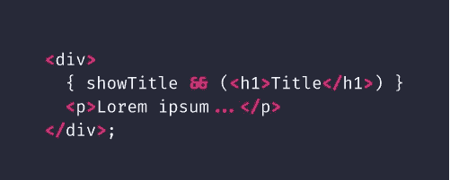

# JavaScript 101:真实

> 原文：<https://itnext.io/javascript-101-truthiness-7cfe8b89d1be?source=collection_archive---------3----------------------->

当处理条件语句(例如，`if`语句)时，我们经常从布尔的角度来考虑:一个不是`true`就是`false`的值。然而，JavaScript 条件并没有严格到需要类型为`boolean`的实际值。相反，JavaScript 条件基于值的*真值*进行操作。

JavaScript 中的每一个值都有一个固有的真值:不是“真”就是“假”。JavaScript 中的条件关心的是值的真实性:这包括`if`语句，但也包括像`for`和`while`这样的结构上的退出条件。通过扩展，“谓词”函数，就像那些传递给数组的`[filter](https://developer.mozilla.org/en-US/docs/Web/JavaScript/Reference/Global_Objects/Array/filter)`和`[find](https://developer.mozilla.org/en-US/docs/Web/JavaScript/Reference/Global_Objects/Array/find)`方法的函数一样，也是基于真值来操作的。在所有这些情况下，如果提供的值为“真”，则满足条件，如果为“假”，则不满足条件。

真值也告诉你当你把一个值传递给`Boolean`函数时，你将得到`boolean`的哪个值:真值给你`true`，假值给你`false`。您可以将`Boolean`函数视为一种基于其真实性将*值转换为`boolean`值的方法。*

毫不奇怪，`boolean`类型的值具有与其布尔值相对应的真值:`true`是真值，`false`是假值。除了`false`，在 JavaScript 中只定义了[另外五个 falsy 值:数字 0、空字符串、`null`、`undefined`和`NaN`。JavaScript 中的所有其他值都是真的。](https://developer.mozilla.org/en-US/docs/Glossary/Falsy)

JavaScript 中定义的仅有的六个 falsy 值。

人们常常惊讶地发现 JavaScript 中的一些值实际上是真实的。其中有*任何非零长度的字符串*，包括全部由空格组成的字符串，以及 falsy 值的字符串表示。其他令人惊讶的真值是空数组和空对象。

有时让开发者惊讶的真实值。

使用真值的另一个地方是应用布尔运算符的时候。这包括布尔否定运算符(即`!`，又名“砰”运算符)、布尔逻辑运算符(`&&`和`||`)和三元运算符(`? … :`)。

布尔逻辑操作符特别有趣，它产生了一种非常常见的惯用 JavaScript 模式。`&&`和`||`操作符被称为*短路*操作符，因为它们从左到右计算操作数，并且*在保证表达式值的第一个值处停止*。

例如，如果你或一个真值，结果为真，那么短路或运算符(`||`)将从左到右进行，直到找到真值，然后它*停止*(“短路”表达式的其余部分)并确定整个表达式为真。如果它没有找到真值操作数，则该表达式被确定为假值。

相反，AND 运算符(`&&`)将从左到右查找一个 falsy 值。一旦找到一个，它就短路其余的表达式，并确定整个表达式为假。只有当每个操作数都为真时，表达式才被确定为真。

||和&&运算符的短路行为

JavaScript 短路操作符的特别之处在于，它们不一定产生`boolean`值。相反，它们产生决定表达式真实性的任何值。这显示在左边的例子中:对于`||`表达式，最左边的真值操作数是数值`1`，因此它成为整个表达式的值。对于`&&`表达式，最左边的 falsy 操作数是空字符串`""`，因此它成为表达式的值。

如果表达式没有短路(即只有假值的`||`表达式或只有真值的`&&`表达式)，则最后一个(最右边的)操作数用作表达式的值。

JavaScript 的这一特性通常被用作某种条件的速记语法。例如，`||`操作符通常用于为缺失属性、可选参数和其他可能错误的值设置默认值，如下所示:

使用||运算符作为默认值

类似地使用`&&`操作符不太常见，但经常用于控制数组、对象和其他结构中可选项目的包含。例如，下面的例子使用`withBar`值作为内嵌条件来控制返回值是否定义了`bar`属性。

使用&&运算符控制对象属性的包含

这样做是因为`false`(实际上是所有的 falsy 值)没有可供对象扩展操作符(`…`)复制的属性。出于类似的原因，这与数组展开操作符一起工作。

另一个常见的使用`&&`操作符的地方是在 JSX，有条件地包含一个子元素:

在这个例子中，如果`showTitle`是 falsy，第二行上的`&&`表达式将评估为`showTitle`的值，并且 JSX 处理器将所有的 falsy 值视为非渲染的。如果`showTitle`为 true，则表达式计算为`<h1>...</h1>`元素。

真值是每个 JavaScript 值所固有的，并且在需要对值进行布尔求值的任何时候都会被运行时隐式使用。依靠真理性可以得到更简洁、更地道的 JavaScript 代码，尤其是在与短路操作符结合使用时。和往常一样，简洁和惯用的代码可能不太清楚，尤其是对不熟悉这种语言的人来说，所以应该谨慎使用。