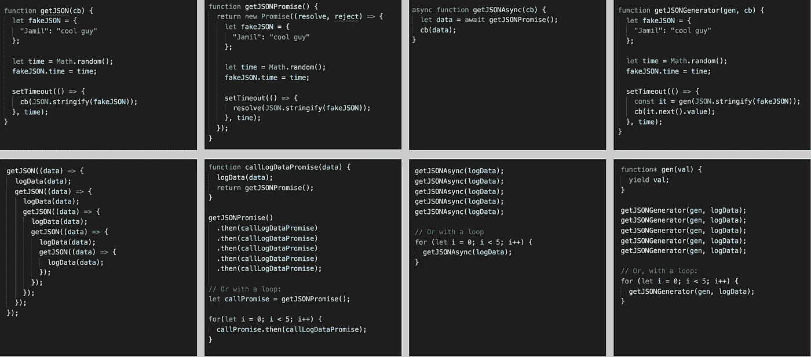
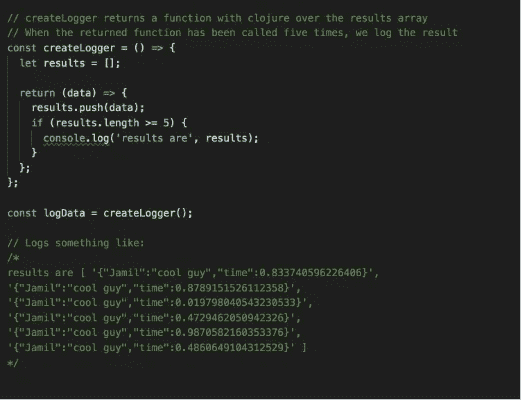

# Javascript 异步方法比较:回调、承诺、异步/等待和生成器

> 原文：<https://itnext.io/javascript-asynchronous-method-comparison-callbacks-promises-async-await-generators-e689d579aba7?source=collection_archive---------9----------------------->

对于那些只想快速比较的人，这里有 TL；博士:

[*点击这里在 LinkedIn* 上分享这篇文章](https://www.linkedin.com/cws/share?url=https%3A%2F%2Fitnext.io%2Fjavascript-asynchronous-method-comparison-callbacks-promises-async-await-generators-e689d579aba7)

函数的定义以及如何使用每种方法的示例

用作回调的 logData 数据函数及其输出

解释:

我写这篇文章的目的是让读者对 Javascript 中的异步方法有一些简单的了解。每当我们使用异步函数时，这些方法都有巨大的潜在应用，异步函数是指不一定按照代码在屏幕上出现的顺序来执行代码的函数。异步方法的几种用法包括向外部 API 发出 HTTP 请求，从服务器检索数据，或者允许使用 setTimeout 延迟操作。我用函数 getJSON 模拟检索 JSON。

让我们来看看:

为了演示我们的 ***getJSON*** 函数的用法，让我们创建一个日志记录函数来记录它的输出:

如果我们想调用这个函数五次，我们将开始看到圣诞树，或者“回调地狱”出现:

对于许多调用来说，这显然不太理想，因为这些嵌套调用越来越深，而且没有简单的方法来适应 for 循环的使用。这让我们有了承诺:

我们上面的 getJSONPromise 函数类似于 getJSON，但是我们没有调用传入的回调，而是使用 resolve 参数，该参数将在将来的某个时候返回 fakeJSON 数据。同样，我们可以使用我们的 ***LogData*** 函数，但是我们也需要让它返回一个承诺。我们的 async 代码的 promise 版本比 callback 版本短，它在页面中是线性的，而不是不断扩展的圣诞树，并且它可以很容易地适用于 ***for 循环*** :

Async/Await 与承诺并没有什么不同。它的语法类似于同步函数，在同步函数中，将调用的输出设置为等于一个变量。

要测试这个函数，只需调用。没有回调地狱，也没有长长的承诺链。因为每个调用都在等待下一个调用，所以我们也可以在这里使用一个 ***for 循环*** :

最后，我们有发电机。并非巧合的是，这段代码看起来非常类似于 promises 和 async/await。在幕后，async/await 使用生成器。当 ***发生时，setTimeout 内部的异步行为发生。next()*** 被调用，返回 ***yield*** 定义的值。

为了测试它，我们必须创建一个生成器函数来确定当我们 ***产生*** 时的行为，并调用我们的函数。

我希望您喜欢这篇描述 Javascript 异步方法的文章。将来，我想通过探索每种方法的错误处理来扩展这一点，并额外探索 RxJS 可观察性。感谢阅读！