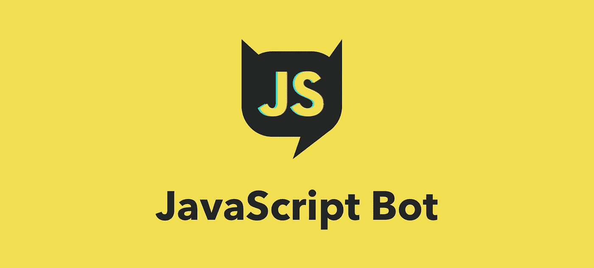
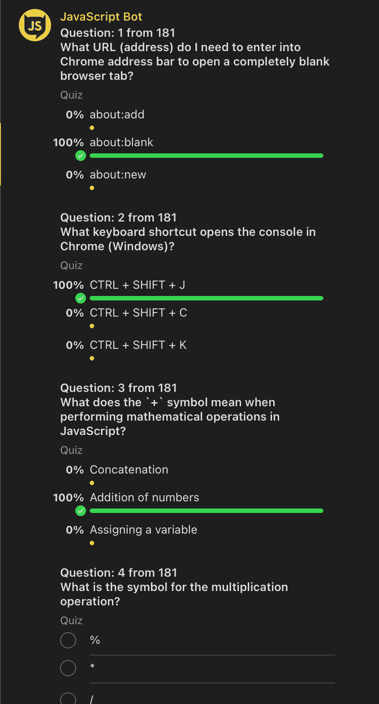
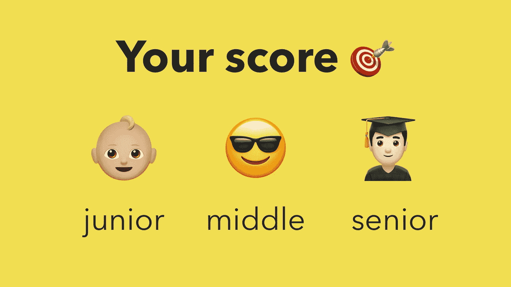
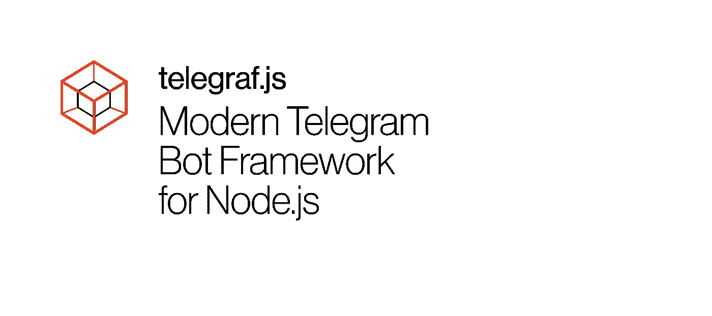
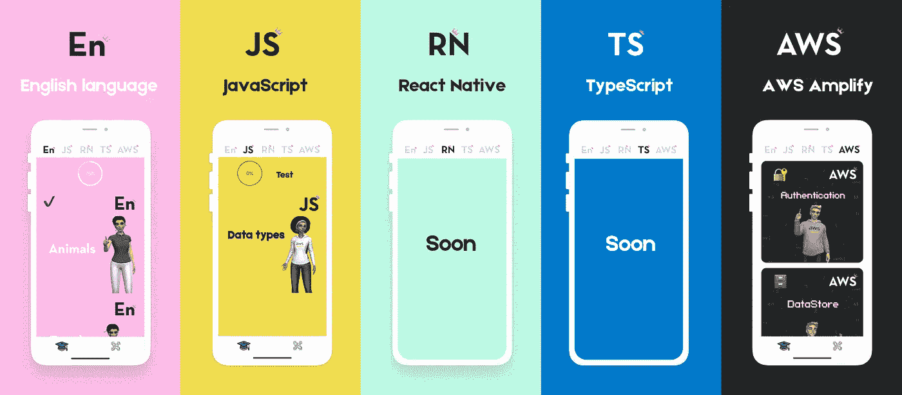

# JavaScript 机器人

> 原文：<https://itnext.io/javascript-bot-5d9d1311d742?source=collection_archive---------1----------------------->

有了这个[电报机器人](https://t.me/javascriptcamp_bot)，可以测试你的 JavaScript 基础知识。

我们使用从[我们的 JavaScript 基础课程](https://www.jscamp.app/docs/javascript01/)的 29 个主题中抽取的问题。你可以在[之前的出版物](/java-script-camp-6f173e54a356)中了解更多关于我们的信息。回答完所有问题后，我们将对你的知识水平进行评估。

# 电报网

我们的 bot 是在框架 [Telegraph.js](https://telegraf.js.org) 上实现的

# 密码

# 国际化(i18n)

[现在机器人](https://github.com/gHashTag/javascriptcamp_bot/tree/heroku/locales)用英语和俄语交流，但是你可以用你的母语发送拉请求。

# 下一步是什么？

接下来，我们计划在 TypeScript、React Native、AWS Amplify 上实现测试，所以订阅我们的 [Twitter](https://twitter.com/jscamp_bot) 来关注新闻。如果你发现错误，那么写信给我们[不和谐](https://discord.gg/6GDAfXn)

你可以通过 [Patreon](https://www.patreon.com/javascriptcamp) 免费支持我们的创业。

