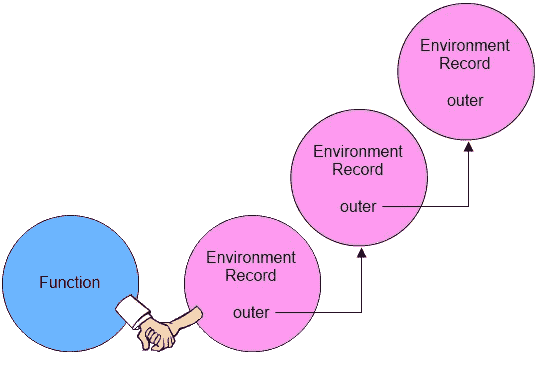

# 保护隐私的 JavaScript 闭包

> 原文：<https://itnext.io/javascript-closure-for-privacy-8a40c274192e?source=collection_archive---------2----------------------->



每当我搜索 JavaScript 闭包的例子时，我总是会遇到这样的情况:

```
const multiplier = (factor) => {
  return ((value) => {
    return factor * value;
  });
};const doubler = multiplier(2);console.log(doubler(9)); // 18
```

这做了一个教科书般的工作，显示 JavaScript 闭包的基础结构，显示`multiplier`返回一个冻结的函数，其中函数保留其外部作用域的变量——在本例中是变量`factor`。

尽管每次我看到上面这样的例子，我都忍不住想知道为什么人们不这样做:

```
const product = (num1, num2) => {
  return num1 * num2;
}console.log(producut(2, 9)); // 18
```

直到我开始研究闭包和隐私，我才意识到闭包在 JavaScript 中是多么有用和重要。

# 示例:员工注册

假设我们负责跟踪一家全新创业公司的所有员工。利用一些面向对象的设计，我们把这些代码放在一起。

```
let employeeId = 0;class Employee {
  constructor(name, role) {
    this.name = name;
    this.role = role;
    this.id = ++employeeId;
  }
}const kevin = new Employee('Kevin', 'Developer');
const george = new Employee('George', 'HR');console.log(kevin); 
// Employee { name: 'Kevin', role: 'Developer', id: 1 }console.log(george); 
// Employee { name: 'George', role: 'HR', id: 2 }console.log(employeeId); //2
```

这工作得不错，但是我们的`employeeId`暴露在荒野中，很容易被覆盖！

例如，我们可以将`employeeId`分配给完全随机的东西，我们下一个员工的 id 看起来会很傻。

```
employeeId = 'gibberish';
const jerry = new Employee('Jerry', 'Sales');
console.log(jerry);
// Employee { name: 'Jerry', role: 'Sales', id: NaN }
```

## 输入结束

为了解决这个问题，我们可以利用闭包，像这样将我们的`employeeId`变量夹在中间:

```
function createEmployee() {
  let employeeId = 0;
  return class {
    constructor(name, role) {
      this.name = name;
      this.role = role;
      this.id = ++employeeId;
    }
  }
}const Employee = createEmployee();
```

此时，我们的`employeeId`变量从`createEmployee()`的外部*关闭*，但是在`createEmployee()`返回的函数内部可以访问。

```
const kevin = new Employee('Kevin', 'Developer');
const george = new Employee('George', 'HR');console.log(kevin); 
// Employee { name: 'Kevin', role: 'Developer', id: 1 }console.log(george); 
// Employee { name: 'George', role: 'HR', id: 2 }console.log(employeeId); 
// ReferenceError: employeeId is not defined
```

现在，即使我们在`createEmployee()`函数之外分配我们的`employeeId`值，这也不会破坏我们编写的雇员创建函数。

```
employeeId = 'gibberish'; 
// this employeeId !== employeeId inside createEmployee()const jerry = new Employee('Jerry', 'Sales');console.log(jerry);
// { name: 'Jerry', role: 'Sales', id: 3 }
```

# 结束语

对我来说，使用闭包从外部关闭变量访问确实帮助我看到了闭包的实际用途。希望您发现这个创建员工 id 的演练是一个利用 JavaScript 闭包的真实例子。

*感谢阅读！如果你喜欢这篇博文，请随意留下一些掌声并关注我！*